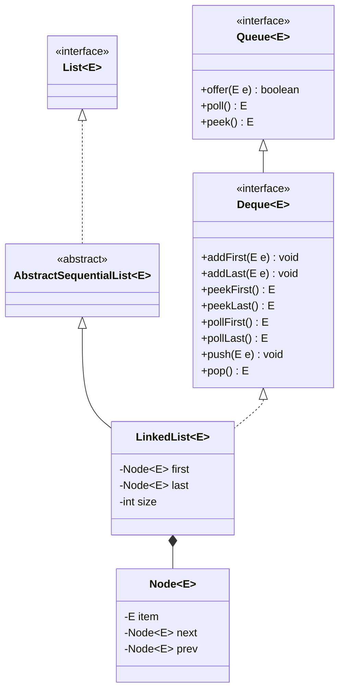
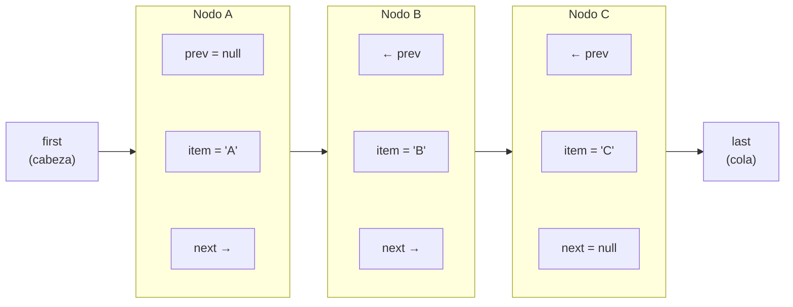
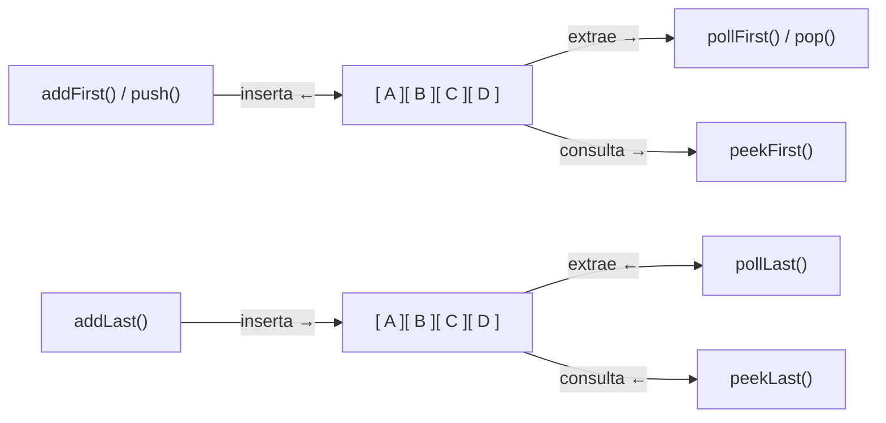
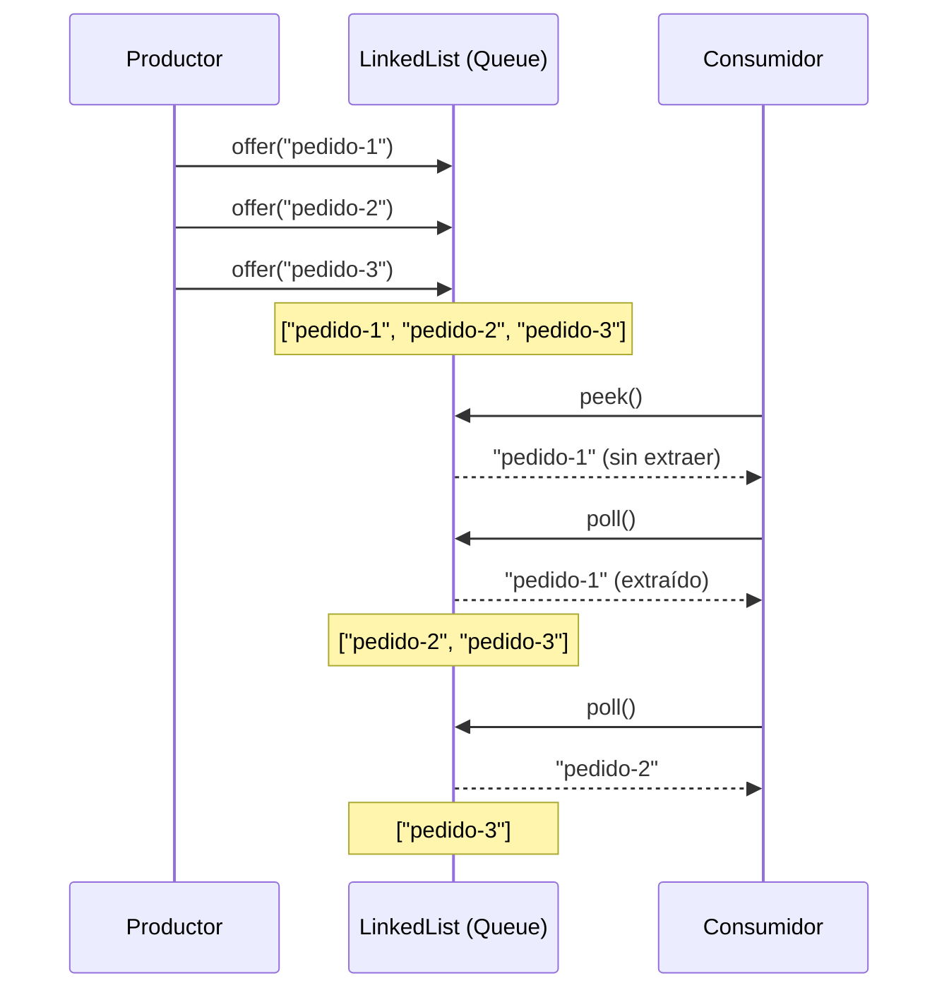
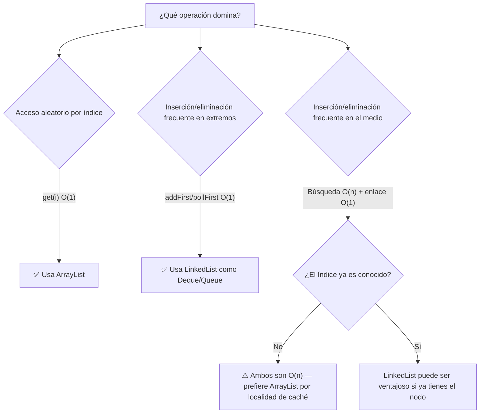

# 02 — LinkedList: Estructura, Deque y Queue

> **Referencia de ejercicios**: Ejercicio07 · Ejercicio08 · Ejercicio09

---

## 1. Qué es LinkedList y qué interfaces implementa

`LinkedList<E>` es una lista **doblemente enlazada** (doubly-linked list). Cada elemento
vive en un nodo que conoce al nodo anterior y al siguiente. A diferencia de ArrayList,
**no hay un array interno**: los nodos se distribuyen por el heap.

### Jerarquía de interfaces



> `LinkedList` implementa a la vez `List` **y** `Deque`. Esto la hace única: puede funcionar
> como lista indexada, como cola FIFO y como pila LIFO.

---

## 2. Estructura interna: nodos doblemente enlazados



**Coste de operaciones:**

| Operación | Coste | Razón |
|---|---|---|
| `addFirst()` / `addLast()` | O(1) | Solo actualiza `first` o `last` |
| `removeFirst()` / `removeLast()` | O(1) | Misma razón |
| `get(i)` | O(n) | Traversal desde el extremo más cercano |
| `add(i, e)` en medio | O(n) | Búsqueda del nodo + O(1) enlace |
| `contains(o)` | O(n) | Búsqueda lineal |

---

## 3. LinkedList como Deque (pila doble)

`Deque` (Double Ended Queue) permite operar en **ambos extremos** de la colección.



### Mapa de métodos equivalentes

| Acción | Método Deque | Equivalente List |
|---|---|---|
| Insertar al frente | `addFirst(e)` / `push(e)` | `add(0, e)` |
| Insertar al final | `addLast(e)` | `add(e)` |
| Consultar frente (sin extraer) | `peekFirst()` | `get(0)` |
| Consultar final (sin extraer) | `peekLast()` | `get(size-1)` |
| Extraer frente | `pollFirst()` / `pop()` | `remove(0)` |
| Extraer final | `pollLast()` | `remove(size-1)` |

> `peek*` devuelve `null` si la lista está vacía.  
> `get*` lanza `NoSuchElementException` si está vacía.

---

## 4. LinkedList como Queue (cola FIFO)

En una cola FIFO los elementos entran por un extremo y salen por el otro.



### Diferencia entre offer/poll y add/remove

| Método | Si falla (cola llena/vacía) |
|---|---|
| `add(e)` | Lanza `IllegalStateException` |
| `offer(e)` | Retorna `false` |
| `remove()` | Lanza `NoSuchElementException` |
| `poll()` | Retorna `null` |
| `element()` | Lanza `NoSuchElementException` |
| `peek()` | Retorna `null` |

> Para `LinkedList` (cola no acotada), `add` y `offer` son equivalentes.
> En colas acotadas (ej: `ArrayBlockingQueue`) la diferencia es crítica.

---

## 5. LinkedList vs ArrayList — ¿cuándo usar cada uno?



### Tabla de decisión rápida

| Escenario | Ganador |
|---|---|
| Leer elemento en posición `i` | `ArrayList` |
| Añadir/eliminar al final | Empate (ambos O(1) amortizado) |
| Añadir/eliminar al principio | `LinkedList` |
| Simular una cola FIFO | `LinkedList` (o `ArrayDeque`) |
| Simular una pila LIFO | `LinkedList` (o `ArrayDeque`) |
| Mucho acceso aleatorio + pocos inserts | `ArrayList` |
| Muchos inserts/deletes + poco acceso | `LinkedList` |

---

## 6. Iteración en LinkedList

**Preferir siempre** `for-each`, `iterator()` o `listIterator()` sobre `get(i)` en un bucle.

```
// MAL — O(n²) para LinkedList
for (int i = 0; i < lista.size(); i++) {
    System.out.println(lista.get(i));  // cada get() hace traversal
}

// BIEN — O(n)
for (String s : lista) {
    System.out.println(s);  // el iterator avanza nodo a nodo
}
```

---

## Puntos clave para los ejercicios

- `LinkedList` implementa `List` **y** `Deque`: úsala con el tipo de referencia correcto.
- `addFirst`/`pollFirst` = stack LIFO; `addLast`/`pollFirst` = queue FIFO.
- `peek*` es seguro (retorna null); `get*`/`element()` lanza excepción.
- **Nunca** accedas por índice (`get(i)`) dentro de un bucle en LinkedList.
- El acceso por índice en ArrayList es O(1); en LinkedList es O(n).
