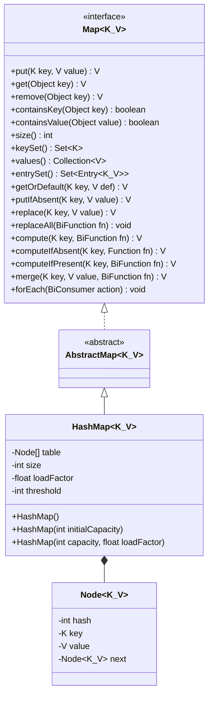
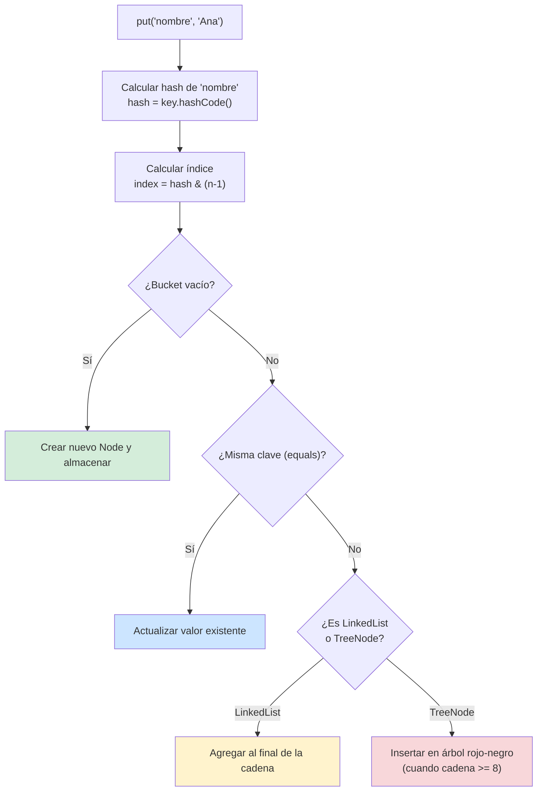
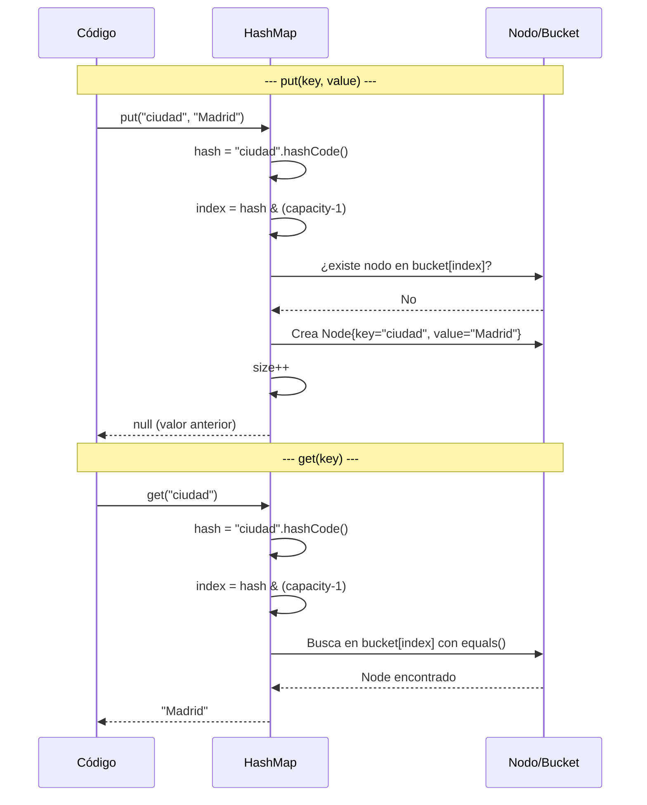
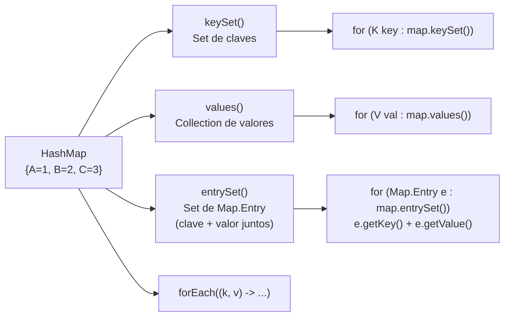
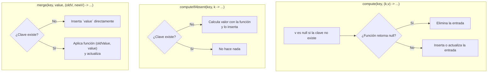
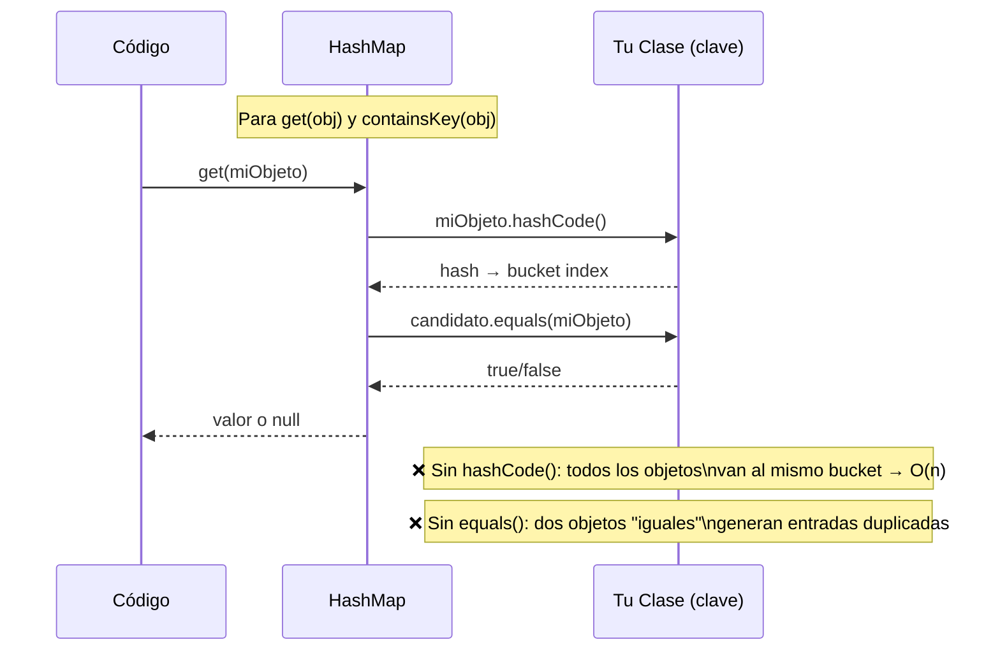
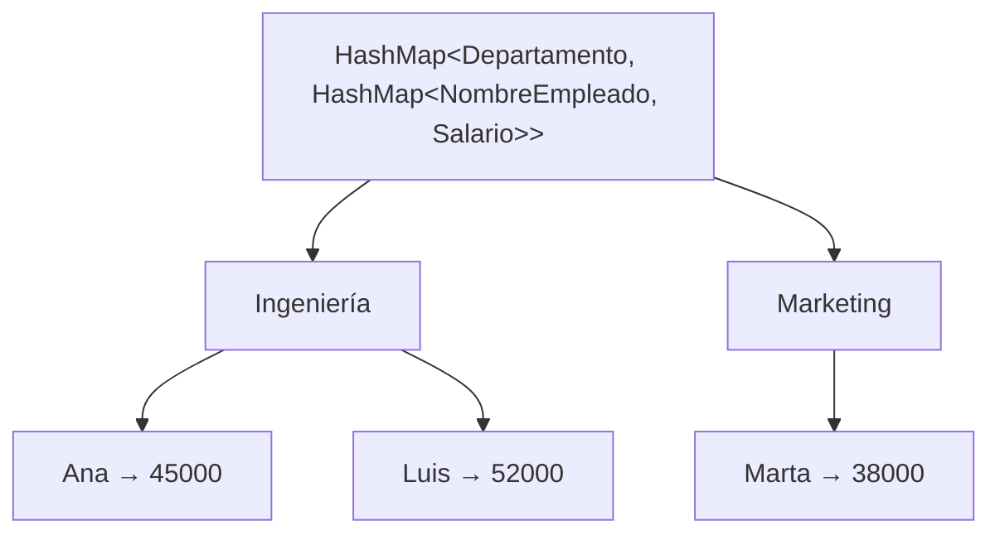

# 03 — HashMap: Core y Operaciones Avanzadas

> **Referencia de ejercicios**: Ejercicio10 · Ejercicio11 · Ejercicio12 · Ejercicio13 · Ejercicio14 · Ejercicio15 · Ejercicio16

---

## 1. Qué es HashMap y cómo funciona internamente

`HashMap<K, V>` almacena pares clave-valor. La clave es **única** y se usa para calcular
un índice de bucket mediante su `hashCode()`. Con ese índice se localiza el par en O(1) promedio.

### Jerarquía de interfaces



---

## 2. Mecanismo interno: hash → bucket → entry



**Parámetros clave:**

| Parámetro | Valor por defecto | Significado |
|---|---|---|
| `initialCapacity` | 16 | Número inicial de buckets |
| `loadFactor` | 0.75 | Umbral de rehashing (size > capacity × 0.75) |
| `threshold` | capacity × loadFactor | Cuando se supera, se duplican los buckets |

---

## 3. Ciclo de vida de put() y get()



---

## 4. Operaciones CRUD fundamentales

| Método | Retorna | Notas |
|---|---|---|
| `put(k, v)` | `V` anterior (o null) | Sobreescribe si la clave ya existe |
| `get(k)` | `V` o null | null si no existe |
| `remove(k)` | `V` eliminado (o null) | No lanza excepción si no existe |
| `containsKey(k)` | `boolean` | O(1) |
| `containsValue(v)` | `boolean` | O(n) — recorre todos los buckets |
| `size()` | `int` | Número de pares |
| `isEmpty()` | `boolean` | size() == 0 |
| `clear()` | `void` | Vacía el mapa |

---

## 5. Iteración sobre HashMap



> **Preferir `entrySet()`** cuando necesitas clave y valor a la vez: una sola iteración
> frente a dos iteraciones si usas `keySet()` + `get(key)`.

---

## 6. Métodos condicionales — la nueva API de Map

### getOrDefault, putIfAbsent, replace

```
getOrDefault(clave, "N/A")     → valor si existe, "N/A" si no
putIfAbsent(clave, valor)      → inserta SOLO si la clave no existe; retorna null si inserción, valor anterior si ya existía
replace(clave, nuevoValor)     → actualiza SOLO si la clave existe; retorna valor anterior o null
replaceAll((k, v) -> v * 2)   → actualiza TODOS los valores con la función dada
```

### compute y merge



**Ejemplo de conteo con merge:**
```
// Contar frecuencias de palabras
mapa.merge(palabra, 1, Integer::sum);
// Si la clave no existe → inserta 1
// Si existe → suma el valor actual + 1
```

---

## 7. HashMap con objetos propios como clave

Si usas tu propia clase como **clave**, debes sobrescribir `equals()` **y** `hashCode()`.



---

## 8. Agrupación manual con HashMap (equivalente a groupingBy)

```
// Agrupar lista de objetos por categoría
HashMap<String, ArrayList<Producto>> grupos = new HashMap<>();
for (Producto p : productos) {
    grupos.computeIfAbsent(p.getCategoria(), k -> new ArrayList<>()).add(p);
}
```

Este patrón es la base de `Collectors.groupingBy()` y cubre el 80% de los casos de uso
de HashMap anidados.

---

## 9. HashMap anidado: Map<K, Map<K, V>>



```
// Acceso:
double salario = mapa.get("Ingeniería").get("Ana");

// Inserción segura:
mapa.computeIfAbsent("RRHH", k -> new HashMap<>()).put("Pedro", 42000.0);
```

---

## Puntos clave para los ejercicios

- `HashMap` NO garantiza orden de iteración (usa `LinkedHashMap` si lo necesitas).
- `get()` retorna `null` tanto si la clave no existe como si el valor guardado es `null` — usa `containsKey()` para distinguir.
- Para contar/acumular: `merge(key, 1, Integer::sum)` es la forma más limpia.
- Para inicializar colecciones anidadas: `computeIfAbsent(key, k -> new ArrayList<>())`.
- Si el objeto es la clave: `equals()` + `hashCode()` son obligatorios.
