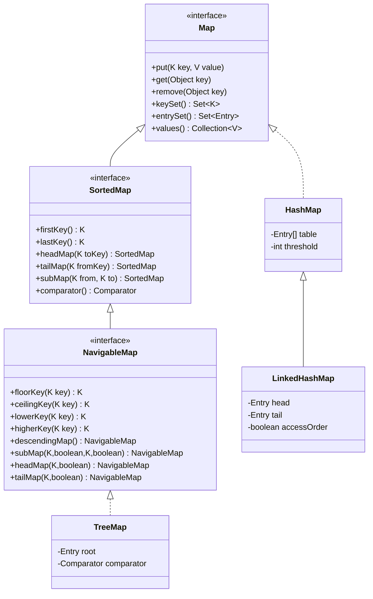
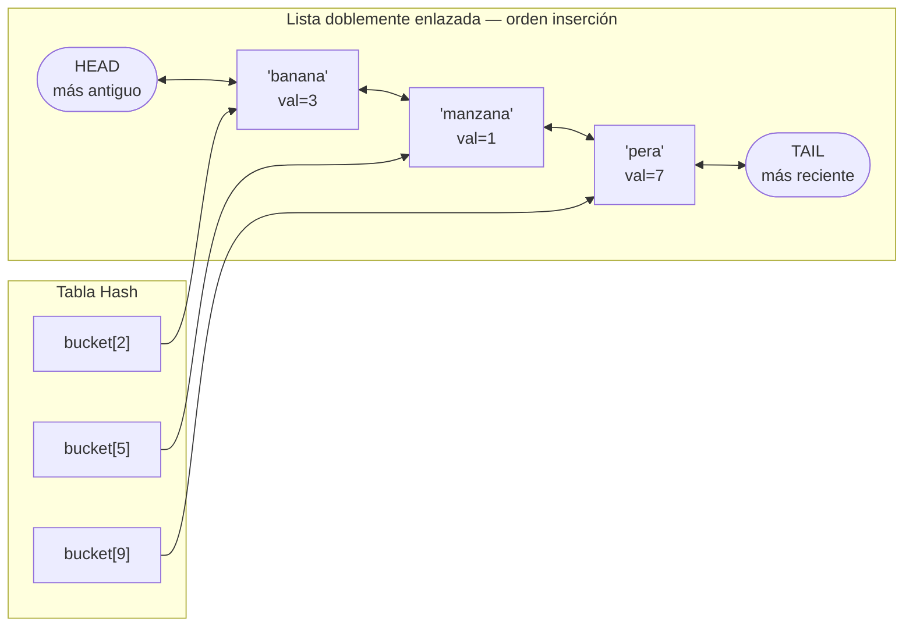
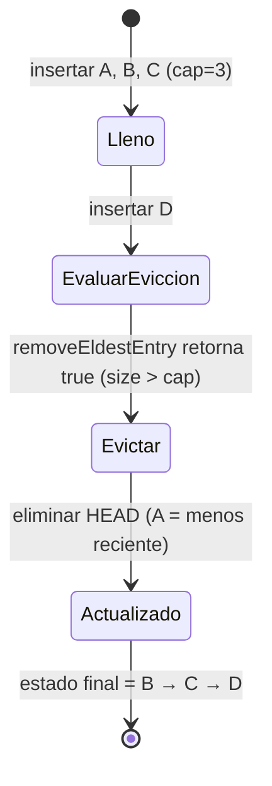
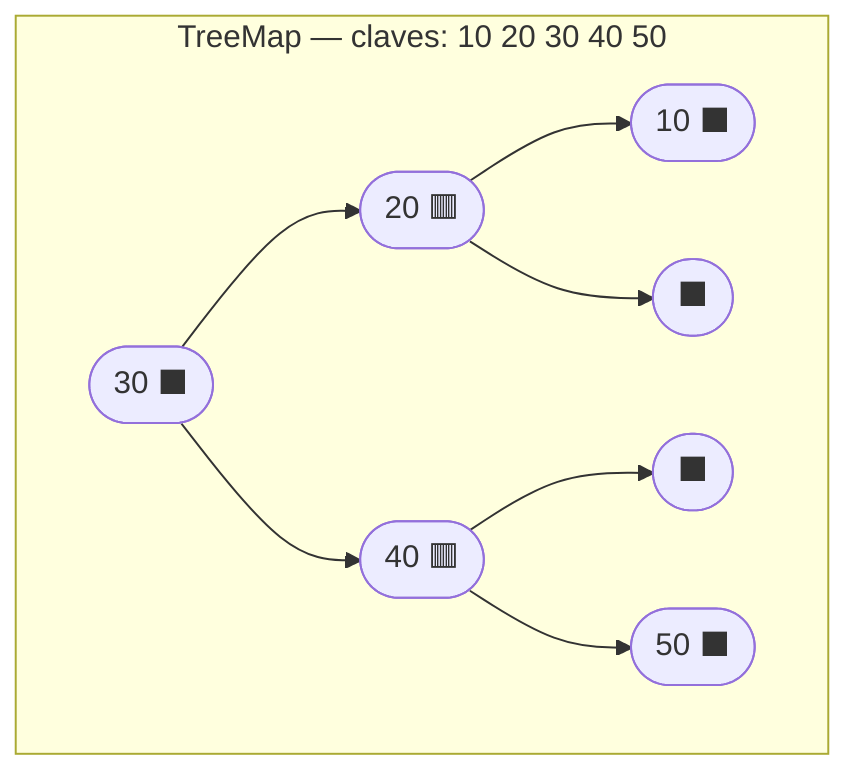
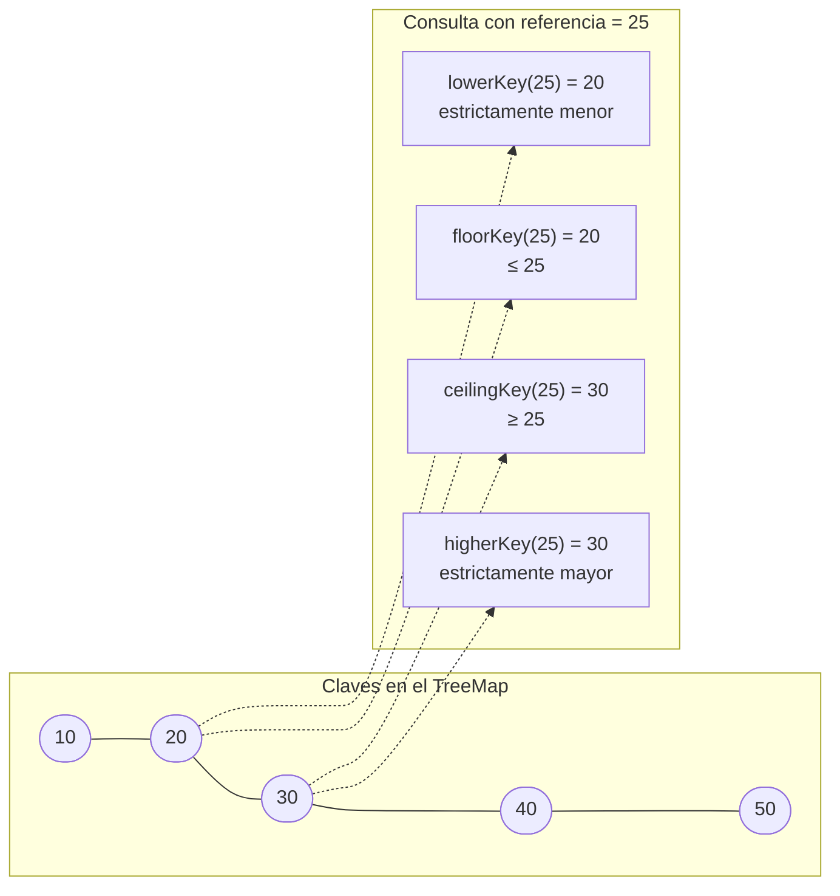
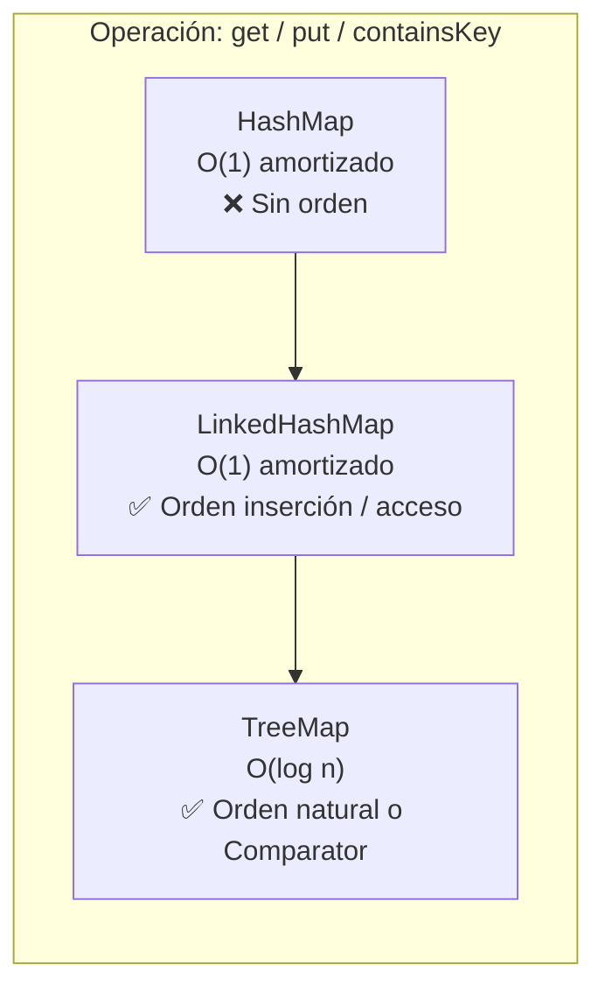

# 04 — LinkedHashMap & TreeMap: Mapas con Orden

> Referencia: [Ejercicios 17–20] — `nivel06_linkedhashmap_treemap/`

---

## 1. El árbol de herencia de Map

`HashMap`, `LinkedHashMap` y `TreeMap` son tres implementaciones de `Map<K,V>` con garantías de orden distintas.



| Implementación | Orden garantizado | Coste get/put | Cuándo usarlo |
|---|---|---|---|
| `HashMap` | Ninguno | O(1) amortizado | Velocidad pura, sin importar orden |
| `LinkedHashMap` | Inserción o acceso | O(1) amortizado | Caches, historial, JSON reproducible |
| `TreeMap` | Natural o Comparator | O(log n) | Rangos de claves, output ordenado |

---

## 2. LinkedHashMap

### 2.1 Estructura interna

Extiende `HashMap` añadiendo una **lista doblemente enlazada** que une todos los nodos en orden de inserción (o de acceso). Cada nodo del bucket tiene dos punteros extra: `before` y `after`.



### 2.2 Modo inserción (por defecto)

```java
LinkedHashMap<String, Integer> mapa = new LinkedHashMap<>();
mapa.put("banana", 3);   // → se añade al TAIL
mapa.put("manzana", 1);  // → se añade al TAIL
mapa.put("pera", 7);     // → se añade al TAIL

// La iteración de keySet() siempre devuelve: banana → manzana → pera
for (String clave : mapa.keySet()) {
    System.out.println(clave);
}
```

### 2.3 Modo acceso (`accessOrder = true`)

Activa el constructor de 3 parámetros. En cada operación `get()` o `put()` sobre una clave existente, el nodo se **mueve al TAIL** de la lista enlazada.

```java
// Constructor: LinkedHashMap(initialCapacity, loadFactor, accessOrder)
LinkedHashMap<String, Integer> lru = new LinkedHashMap<>(16, 0.75f, true);
lru.put("A", 1);   // HEAD → A ← TAIL
lru.put("B", 2);   // HEAD → A → B ← TAIL
lru.put("C", 3);   // HEAD → A → B → C ← TAIL

lru.get("A");      // A se mueve al TAIL
//                    HEAD → B → C → A ← TAIL
```

### 2.4 Patrón LRU Cache con `removeEldestEntry`

El método `removeEldestEntry` se invoca automáticamente después de cada `put`. Si retorna `true`, LinkedHashMap elimina la HEAD (la entrada menos recientemente usada).



La plantilla para implementar una caché LRU:

```java
int capacidad = 3;
LinkedHashMap<String, String> cache = new LinkedHashMap<>(capacidad, 0.75f, true) {
    @Override
    protected boolean removeEldestEntry(Map.Entry<String, String> eldest) {
        return size() > capacidad;
    }
};
```

---

## 3. TreeMap

### 3.1 Estructura interna — Árbol Rojo-Negro

Cada nodo almacena una clave, un valor, su color (rojo o negro) y punteros a padre, hijo izquierdo e hijo derecho. Las rotaciones del árbol mantienen el equilibrio y garantizan O(log n).



> La clave mínima está siempre en el nodo más a la izquierda; la máxima, en el más a la derecha.

### 3.2 SortedMap: operaciones básicas de orden

```java
TreeMap<String, Integer> t = new TreeMap<>();
t.put("pera", 2); t.put("banana", 5); t.put("mango", 3); t.put("uva", 8);
// Orden interno: banana → mango → pera → uva

t.firstKey();              // "banana"
t.lastKey();               // "uva"
t.headMap("pera");         // {banana=5, mango=3}  — exclusivo por defecto
t.tailMap("mango");        // {mango=3, pera=2, uva=8} — inclusivo por defecto
t.subMap("banana", "pera");// {banana=5, mango=3}  — [banana, pera) semiabierto
```

### 3.3 NavigableMap: navegación precisa



| Método | Condición | Referencia=25 | Referencia=30 (existe) |
|---|---|---|---|
| `lowerKey(k)` | estrictamente < k | `20` | `20` |
| `floorKey(k)` | ≤ k | `20` | `30` |
| `ceilingKey(k)` | ≥ k | `30` | `30` |
| `higherKey(k)` | estrictamente > k | `30` | `40` |

Todos retornan `null` si no existe ninguna clave que cumpla la condición.

### 3.4 Submapas con inclusión/exclusión explícita

```java
// NavigableMap.subMap — versión de 4 parámetros (sobrecarga de NavigableMap)
mapa.subMap(20, true,  40, true);   // [20..40] → 20, 30, 40
mapa.subMap(20, false, 40, false);  // (20..40) → 30

// headMap y tailMap con flag booleano
mapa.headMap(30, true);   // ≤ 30 → 10, 20, 30
mapa.headMap(30, false);  // < 30 → 10, 20

mapa.tailMap(30, true);   // ≥ 30 → 30, 40, 50
mapa.tailMap(30, false);  // > 30 → 40, 50
```

> **Importante:** `headMap`, `tailMap` y `subMap` retornan **vistas** del mapa original (no copias). Para obtener una copia independiente: `new TreeMap<>(mapa.subMap(...))`.

### 3.5 Ordenación personalizada con Comparator

```java
// Orden inverso al natural
TreeMap<String, Integer> invertido = new TreeMap<>(Comparator.reverseOrder());

// Orden por longitud de String, con desempate alfabético
TreeMap<String, Integer> porLongitud = new TreeMap<>(
    Comparator.comparingInt(String::length).thenComparing(Comparator.naturalOrder())
);
```

---

## 4. Comparativa de rendimiento



---

## 5. Reglas de selección rápida

- **Velocidad máxima**, orden irrelevante → `HashMap`
- **Iterar siempre en el mismo orden** que se insertó → `LinkedHashMap`
- **Cache LRU** sin dependencias externas → `LinkedHashMap(accessOrder=true)` + `removeEldestEntry`
- **Claves ordenadas** o consultas por rango → `TreeMap`
- **Mínimo/máximo** de claves barato → `TreeMap.firstKey()` / `lastKey()`
- **Navegación por vecindad** (¿qué hay justo por encima/debajo de X?) → `TreeMap` + `NavigableMap`
