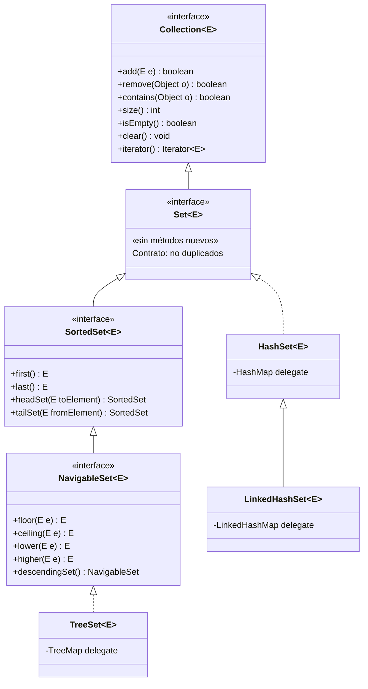
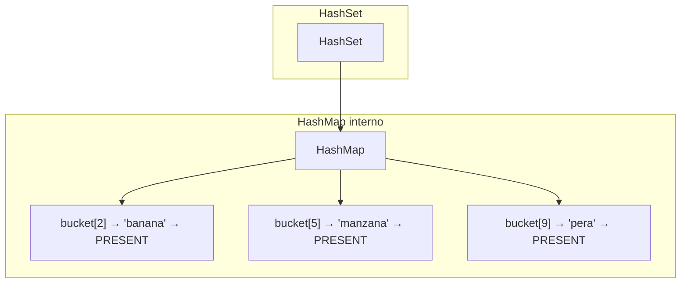
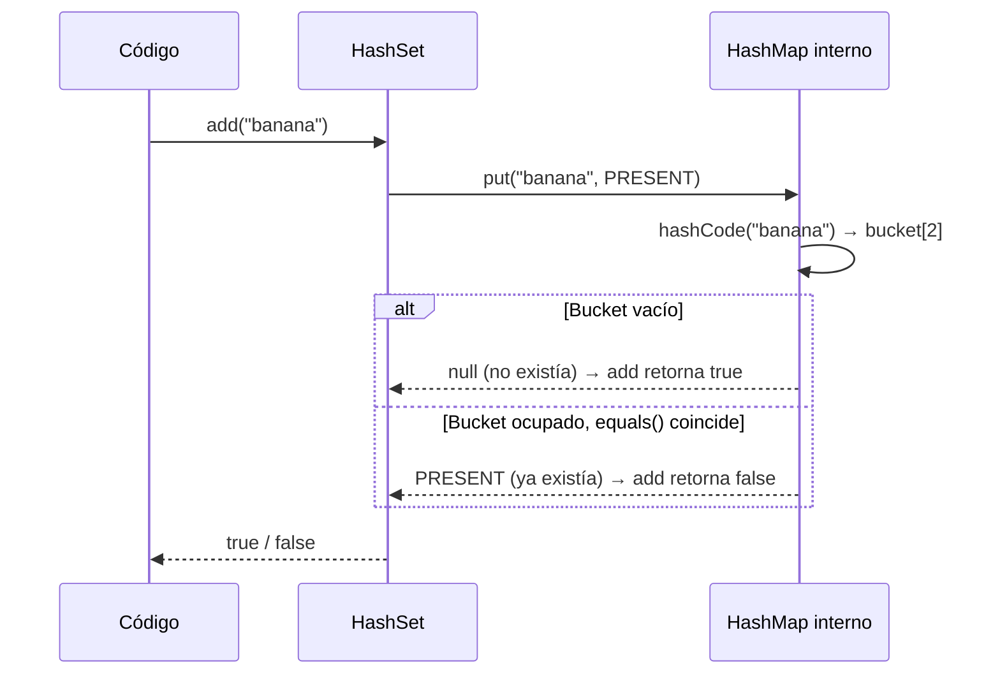
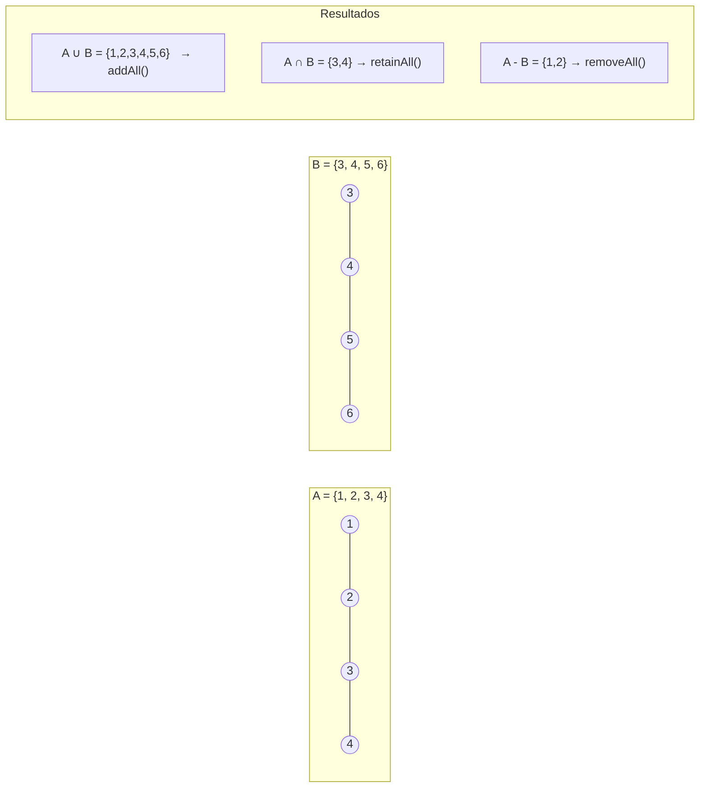
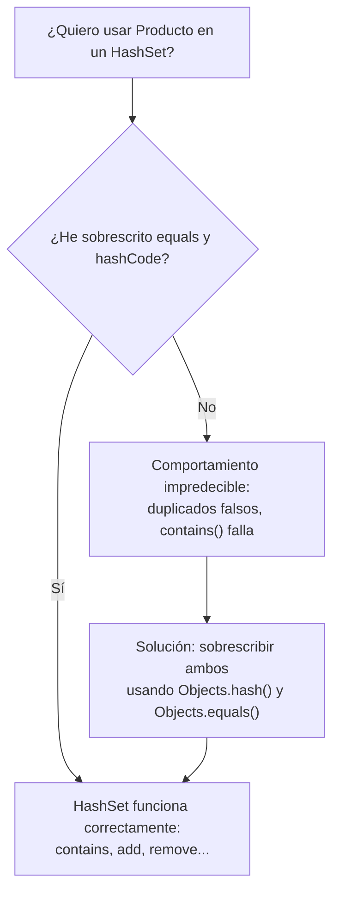

# 05 — HashSet y Conjuntos

> Referencia: [Ejercicios 21–25] — `nivel07_hashset/`

---

## 1. ¿Qué es un Set?

Un `Set<E>` es una colección que **no permite elementos duplicados**. La interfaz `Set` extiende `Collection` pero no añade nuevos métodos; su contrato radica en la unicidad.

### Jerarquía de interfaces



| Implementación | Orden | Coste add/contains/remove | Cuándo usarlo |
|---|---|---|---|
| `HashSet` | Ninguno | O(1) amortizado | Unicidad rápida, orden irrelevante |
| `LinkedHashSet` | Inserción | O(1) amortizado | Unicidad + iteración predecible |
| `TreeSet` | Natural o Comparator | O(log n) | Elementos ordenados, consultas por rango |

---

## 2. Estructura interna de HashSet

`HashSet` **delega internamente en un `HashMap`**. Cada elemento del set se almacena como **clave** del HashMap, con un valor dummy constante (`PRESENT`).



> Por eso `HashSet` tiene las mismas características de rendimiento que `HashMap` y los mismos requisitos sobre `equals()` y `hashCode()`.

---

## 3. Flujo de add(): ¿es duplicado?



**Regla fundamental:** `add()` retorna `true` si el elemento fue añadido (no existía) y `false` si ya estaba.

---

## 4. Operaciones de conjunto (Álgebra de conjuntos)

Java mapea las operaciones matemáticas de conjuntos a métodos de `Collection`:



| Operación matemática | Método Java | Modifica el set? |
|---|---|---|
| **Unión** A ∪ B | `a.addAll(b)` | Sí (sobre `a`) |
| **Intersección** A ∩ B | `a.retainAll(b)` | Sí (sobre `a`) |
| **Diferencia** A − B | `a.removeAll(b)` | Sí (sobre `a`) |
| **Subconjunto** A ⊆ B | `b.containsAll(a)` | No |
| **Disjuntos** A ∩ B = ∅ | `Collections.disjoint(a, b)` | No |

> **Cuidado:** `addAll`, `retainAll` y `removeAll` **modifican** el set sobre el que se invocan. Para evitar modificar el original, trabaja sobre una copia: `new HashSet<>(a)`.

---

## 5. equals() y hashCode() — Imprescindibles

Para usar objetos propios en un `HashSet`, **debes** sobrescribir `equals()` y `hashCode()`:



**Contrato obligatorio:**
- Si `a.equals(b)` → `a.hashCode() == b.hashCode()` (**siempre**)
- Si `a.hashCode() != b.hashCode()` → `!a.equals(b)` (**siempre**)
- Si `a.hashCode() == b.hashCode()` → `a.equals(b)` puede ser true o false (colisión)

---

## 6. Conversiones entre List y Set

```java
// List → Set  (eliminar duplicados)
ArrayList<String> lista = new ArrayList<>(List.of("A", "B", "A", "C", "B"));
HashSet<String> set = new HashSet<>(lista);   // → {"A", "B", "C"}

// Set → List  (volver a tener acceso por índice)
ArrayList<String> sinDuplicados = new ArrayList<>(set);
```

> Al convertir List → Set se pierde el orden (con HashSet) y los duplicados. Para conservar el orden de primera aparición, usa `LinkedHashSet`.

---

## 7. Patrones útiles

### Eliminar duplicados preservando orden
```java
ArrayList<String> original = new ArrayList<>(List.of("C", "A", "B", "A", "C"));
LinkedHashSet<String> sinDups = new LinkedHashSet<>(original);
ArrayList<String> resultado = new ArrayList<>(sinDups);
// resultado = ["C", "A", "B"]
```

### Verificar unicidad completa
```java
boolean todosUnicos = lista.size() == new HashSet<>(lista).size();
```

### Encontrar duplicados
```java
HashSet<String> vistos = new HashSet<>();
ArrayList<String> duplicados = new ArrayList<>();
for (String s : lista) {
    if (!vistos.add(s)) {
        duplicados.add(s);
    }
}
```

---

## Puntos clave para los ejercicios

- `HashSet` no permite duplicados; `add()` retorna `false` si el elemento ya estaba.
- Las operaciones de conjunto (`addAll`, `retainAll`, `removeAll`) **modifican** el set receptor.
- `equals()` + `hashCode()` son **obligatorios** para usar objetos propios en un HashSet.
- Para unicidad con orden de inserción → `LinkedHashSet`.
- Para unicidad con orden natural → `TreeSet`.
