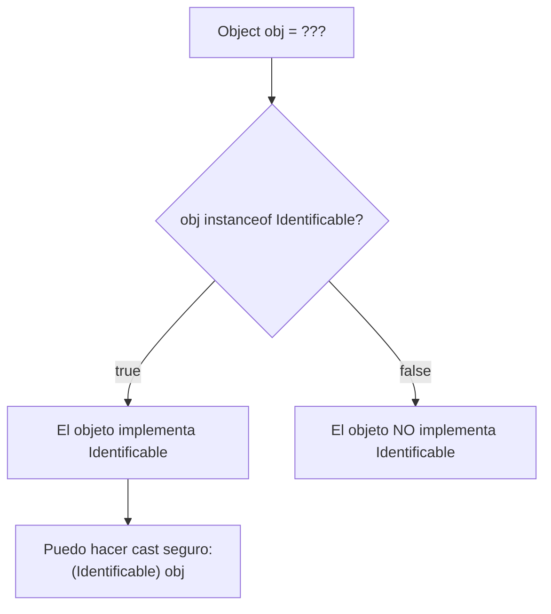
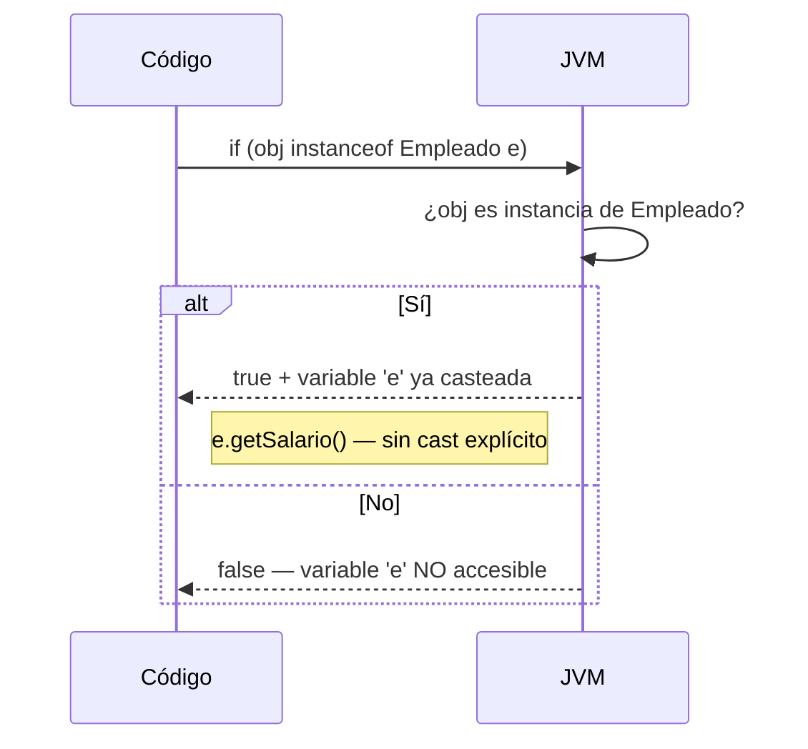
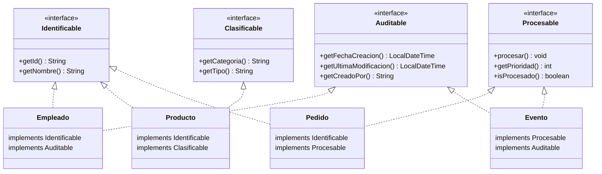
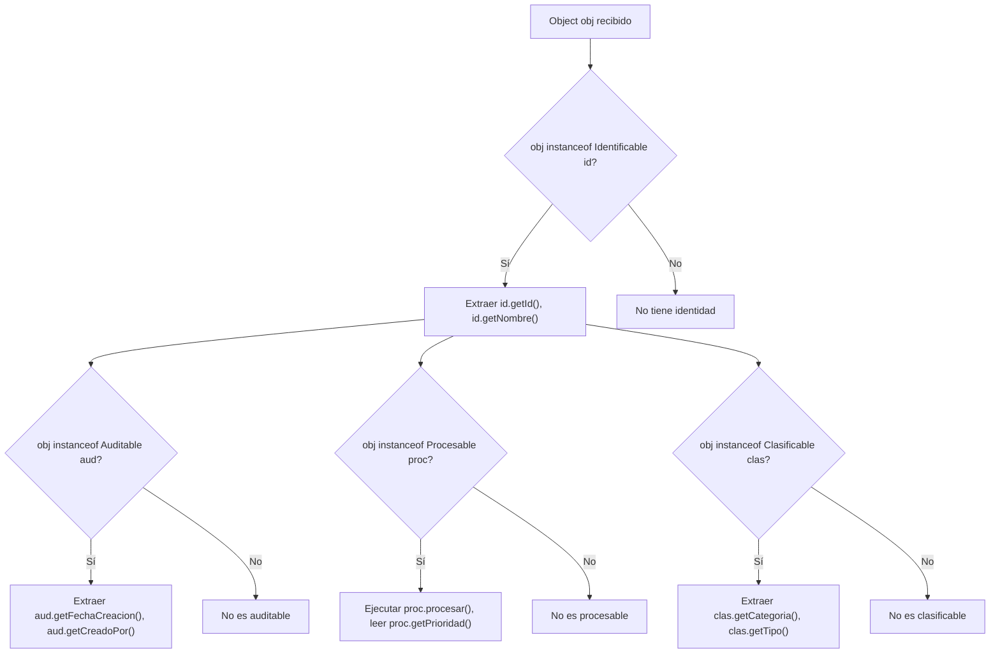
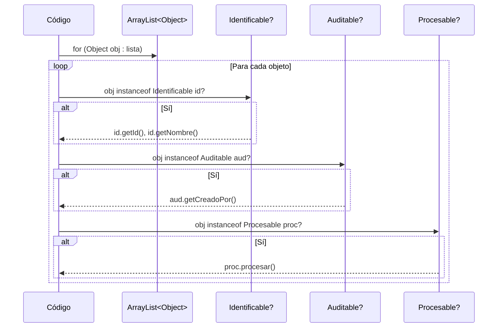
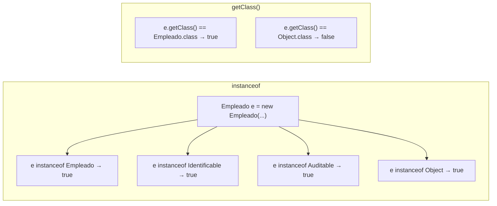
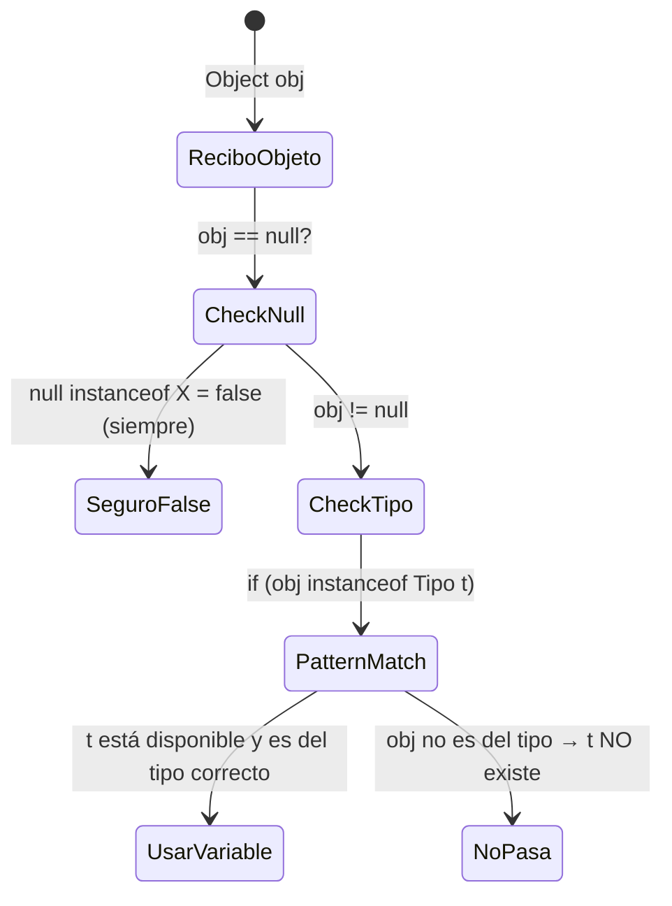

# 06 — instanceof con Interfaces y Polimorfismo

> Referencia: [Ejercicios 26–36] — `nivel08_instanceof_basico/`, `nivel09_instanceof_avanzado/`, `nivel10_instanceof_collections/`

---

## 1. ¿Qué es instanceof?

El operador `instanceof` comprueba en **tiempo de ejecución** si un objeto es instancia de una clase, subclase o implementa una interfaz determinada. Retorna `boolean`.



---

## 2. Pattern Matching con instanceof (Java 16+)

Desde Java 16 existe el **pattern matching para instanceof**, que combina la comprobación y el cast en una sola expresión:



### Comparación: antes vs después

```java
// ANTES (Java < 16) — cast manual
if (obj instanceof Empleado) {
    Empleado e = (Empleado) obj;
    System.out.println(e.getSalario());
}

// DESPUÉS (Java 16+) — pattern matching
if (obj instanceof Empleado e) {
    System.out.println(e.getSalario());
}
```

---

## 3. instanceof con interfaces

El verdadero poder de `instanceof` brilla con las **interfaces**. Un objeto puede implementar múltiples interfaces, y `instanceof` permite descubrir qué contratos cumple:



### Tabla de implementación

| Clase | Identificable | Auditable | Clasificable | Procesable |
|---|---|---|---|---|
| `Empleado` | ✅ | ✅ | ❌ | ❌ |
| `Producto` | ✅ | ❌ | ✅ | ❌ |
| `Pedido` | ✅ | ❌ | ❌ | ✅ |
| `Evento` | ❌ | ✅ | ❌ | ✅ |

---

## 4. Flujo de decisión con instanceof



> Un mismo objeto puede cumplir **múltiples** checks de instanceof simultáneamente. Por ejemplo, un `Empleado` pasa tanto `instanceof Identificable` como `instanceof Auditable`.

---

## 5. instanceof en colecciones heterogéneas

El caso de uso más potente: una colección `ArrayList<Object>` que contiene objetos de distintas clases, y necesitas procesarlos de forma polimórfica:



### Patrón de filtrado por interfaz

```java
// Filtrar todos los Identificables de una lista heterogénea
ArrayList<Identificable> filtrados = new ArrayList<>();
for (Object obj : listaMixta) {
    if (obj instanceof Identificable id) {
        filtrados.add(id);
    }
}
```

---

## 6. instanceof vs getClass()



| | `instanceof` | `getClass()` |
|---|---|---|
| Comprueba | Clase + superclases + interfaces | Solo la clase exacta |
| Herencia | ✅ Sube por la jerarquía | ❌ Solo la clase concreta |
| Interfaces | ✅ | ❌ |
| null | `null instanceof X` → `false` | `null.getClass()` → NullPointerException |

---

## 7. Reglas de seguridad con instanceof



- `null instanceof <cualquierTipo>` siempre retorna `false` — nunca lanza excepción.
- El pattern matching solo crea la variable si el check pasa.
- No se necesita cast explícito tras un pattern matching exitoso.

---

## Puntos clave para los ejercicios

- `instanceof` funciona con clases, subclases e interfaces.
- Java 16+ permite **pattern matching**: `if (obj instanceof Tipo t)`.
- Un objeto puede pasar múltiples `instanceof` si implementa múltiples interfaces.
- `null instanceof X` es siempre `false` (safe).
- En colecciones heterogéneas (`ArrayList<Object>`), `instanceof` es la herramienta de dispatch polimórfico.
- Prefiere `instanceof` sobre `getClass()` cuando quieres soportar herencia e interfaces.
