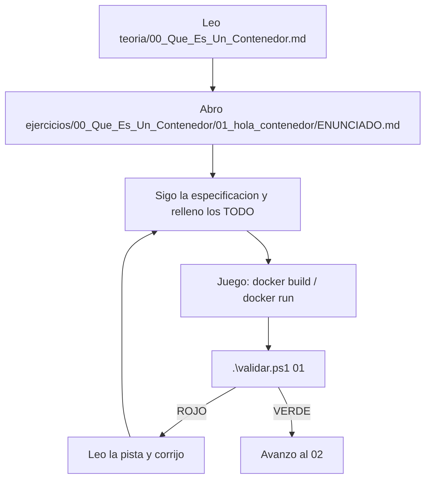

# Cómo Empezar — Test-Driven Learning con Docker

Si es tu primera vez con contenedores, esta es tu guía de 5 minutos para dejarlo todo operativo y entender el juego.

Este proyecto sigue una arquitectura **"Test-Driven Learning"**: tu objetivo es rellenar piezas vacías (`# TODO:`) en los Dockerfiles / ficheros Compose / manifiestos para que los tests pasen a **verde**.

---

## PASO 1 — Comprueba que Docker respira

Abre una terminal (PowerShell) en esta carpeta y ejecuta:
```powershell
docker run --rm hello-world
```
Si ves *"Hello from Docker!"*, vamos al lío. Si no, arranca **Docker Desktop** y espera a la ballena.

---

## PASO 2 — Entiende el runner

Todo se valida con un único comando. Pruébalo con el ejercicio 01:
```powershell
.\validar.ps1 01
```
La primera vez tardará un poco (descarga las imágenes de las herramientas de testing). Como aún no has hecho nada, **debería salir en ROJO** indicándote qué espera. **¡Eso es buena señal: el entorno de validación funciona!**

> En WSL/Linux/macOS usa `./validar.sh 01` (haz `chmod +x validar.sh` la primera vez).

---

## PASO 3 — Resuelve tu primer ejercicio



1. Lee `teoria/00_Que_Es_Un_Contenedor.md`.
2. Abre `ejercicios/00_Que_Es_Un_Contenedor/01_hola_contenedor/ENUNCIADO.md` y sigue la especificación.
3. Rellena los `# TODO:`.
4. Usa la "Zona de Ejecución Master" del enunciado para ver tu trabajo.
5. Valida con `.\validar.ps1 01`.
6. Verde → al siguiente. Rojo → lee la consola, te da pistas.

---

## Reglas del juego

- **No edites la carpeta `tests/`**: es tu examen. Si la modificas, te engañas a ti mismo.
- **El código de las apps (carpetas `app/`) ya está resuelto**: tú NO programas la app, tú programas el *contenedor*. El foco es Docker.
- **Lee la teoría antes de cada bloque.** Tiene diagramas Mermaid que te ahorran horas.
- **Si un test falla, lee su salida completa.** `container-structure-test` y `hadolint` te dicen exactamente qué esperaban.

¡Tienes 40 ejercicios por delante, de "¿qué es una imagen?" a desplegar un stack corporativo en Kubernetes! 🚀
