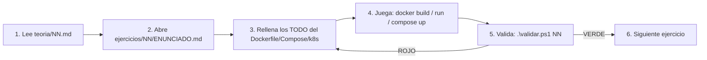

# 🐳 Docker Masterclass — Guía de Arranque desde Terminal (Noob → Pro)

¡Bienvenido al campo de entrenamiento más bestial de Docker! Este proyecto es un **bootcamp de validación automática**: tú escribes Dockerfiles, ficheros Compose y manifiestos de Kubernetes "esqueleto" (con `# TODO:`), y tu trabajo solo cuenta como superado cuando pasa a **VERDE** en una suite de tests reales.

> **Filosofía**: aprendes Docker **usando Docker**. Las herramientas de validación corren como imágenes Docker, así que tu **único requisito real es Docker Desktop**.

---

## 0. Requisitos previos

| Requisito | Por qué | Cómo verificar |
|---|---|---|
| **Docker Desktop + WSL2** | El motor. Imprescindible. | `docker version` y `docker run hello-world` |
| **PowerShell** (ya viene en Windows) | Ejecutar el runner `validar.ps1` | `$PSVersionTable.PSVersion` |
| **`kind` + `kubectl`** | SOLO para el Bloque 5 (Kubernetes, ej. 38-40) | `kind version` / `kubectl version --client` |
| **`lazydocker`** (opcional) | TUI para inspeccionar visualmente | `lazydocker` |

### Verifica que Docker está vivo
```powershell
docker version
docker run --rm hello-world
```
Si `hello-world` imprime *"Hello from Docker!"*, estás listo. Si falla, abre **Docker Desktop** y espera a que el icono de la ballena esté estable.

### Instalar `lazydocker` (opcional, TUI de inspección)
```powershell
# Con Scoop
scoop install lazydocker
# o con Chocolatey
choco install lazydocker
```
Lánzalo escribiendo `lazydocker`. Atajos: `Shift+?` ayuda, `s` parar contenedor, `r` reiniciar, `d` borrar, `x` menú. **lazydocker es solo apoyo visual; el objetivo es que domines los comandos.**

### Instalar `kind` + `kubectl` (solo Bloque 5)
```powershell
# Con Scoop
scoop install kind kubectl
# o con Chocolatey
choco install kind kubernetes-cli
```
`kind` ("Kubernetes IN Docker") levanta un clúster de Kubernetes completo dentro de contenedores Docker. No necesitas nada en la nube.

---

## 1. Cómo se valida un ejercicio (EL COMANDO QUE MÁS USARÁS)

El proyecto trae un **runner universal**. Le pasas el número de ejercicio y él se encarga de: construir tu imagen, pasar el linter, y ejecutar los tests. Imprime un veredicto final claro.

### En Windows (PowerShell):
```powershell
.\validar.ps1 01      # valida el ejercicio 01
.\validar.ps1 15      # valida el ejercicio 15
```

### En WSL / Linux / macOS (Bash):
```bash
chmod +x validar.sh   # solo la primera vez
./validar.sh 01
```

El runner imprimirá al final:
- `✅ EJERCICIO NN SUPERADO` → ¡a por el siguiente!
- `❌ EJERCICIO NN NO SUPERADO` → lee la salida roja, te dice exactamente qué falla. Corrige tu Dockerfile y vuelve a lanzar.

---

## 2. Las herramientas de validación (qué hace cada una)

No tienes que instalarlas: el runner las descarga como imágenes Docker la primera vez.

### 🔬 `container-structure-test` (el "JUnit" de Docker)
Valida la **estructura de tu imagen** con un fichero `.yaml` por ejercicio (en `tests/`). Comprueba: comandos y su salida, existencia de ficheros, contenido de ficheros, y metadata (CMD, ENTRYPOINT, ENV, puertos, usuario, labels...).
```powershell
docker run --rm `
  -v //var/run/docker.sock:/var/run/docker.sock `
  -v "${PWD}:/work" -w /work `
  gcr.io/gcp-runtimes/container-structure-test:latest `
  test --image masterclass/ej02:latest --config tests/02_primer_dockerfile.yaml
```
> El `//var/run/docker.sock` con doble barra evita que Git-Bash reescriba la ruta en Windows. El montaje del socket deja que la herramienta hable con tu Docker.

### 🧹 `hadolint` (linter de Dockerfiles)
Revisa que tu Dockerfile siga buenas prácticas (reglas `DLxxxx`) y analiza el Bash interno. A partir del Bloque 1 es **puerta de calidad**: si hadolint se queja, el ejercicio no cuenta.
```powershell
Get-Content ejercicios/09_run_limpio/Dockerfile | docker run --rm -i hadolint/hadolint
```

### ⚙️ Scripts runtime (`tests/NN_*.ps1` / `.sh`)
Para redes, volúmenes, Compose y Kubernetes (donde una imagen estática no basta), los tests son scripts que levantan el stack, prueban endpoints reales con `curl`, comprueban persistencia o réplicas, y limpian.

---

## 3. El flujo de trabajo (workflow) de CADA ejercicio



1. **Lee la teoría** del bloque en `teoria/`.
2. **Abre el `ENUNCIADO.md`** del ejercicio. Tiene la especificación y los criterios de aceptación.
3. **Rellena los `# TODO:`** del artefacto (Dockerfile / compose / manifiesto).
4. **Juega** con la "Zona de Ejecución Master" del enunciado para ver tu obra funcionando.
5. **Valida** con el runner.
6. **Verde → avanzas.** Rojo → lees la pista y corriges.

---

## 4. Estructura del proyecto

```
10_DockerMasterclass/
├── README_GUIA_TERMINAL.md   <- estás aquí
├── COMO_EMPEZAR.md           <- onboarding paso a paso
├── validar.ps1 / validar.sh  <- el runner universal
├── teoria/                   <- 17 temas con diagramas Mermaid
├── ejercicios/               <- 40 retos (esqueletos con TODO + apps resueltas)
└── tests/                    <- la validación (NO la toques, es tu examen)
```

---

## 5. Sílabo (de noob a pro)

| Bloque | Tema | Ejercicios |
|---|---|---|
| **0** | Cimientos: ¿qué es un contenedor? | 01–06 |
| **1** | Imágenes serias (+ hadolint) | 07–14 |
| **2** | Multi-stage y optimización | 15–21 |
| **3** | Redes y datos | 22–27 |
| **4** | Docker Compose | 28–34 |
| **5** | Registries + intro Kubernetes | 35–39 |
| **BOSS** | El Despliegue Corporativo Total | 40 |

¡Mucha suerte, ingeniero! 🐳
