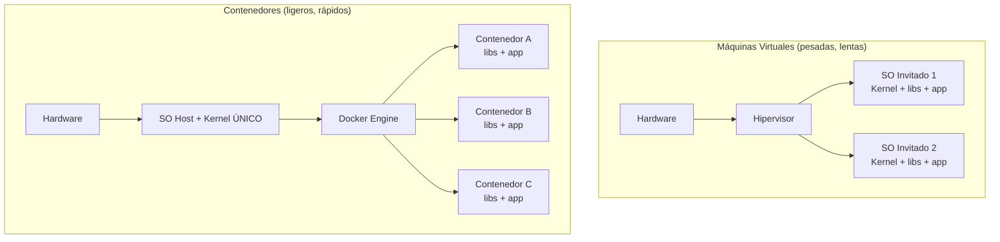
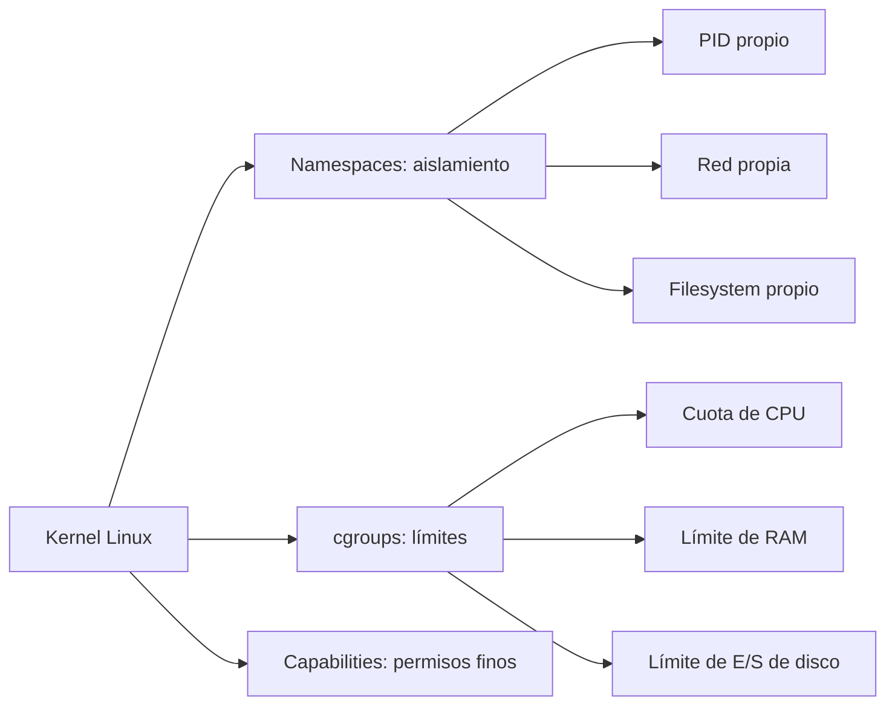
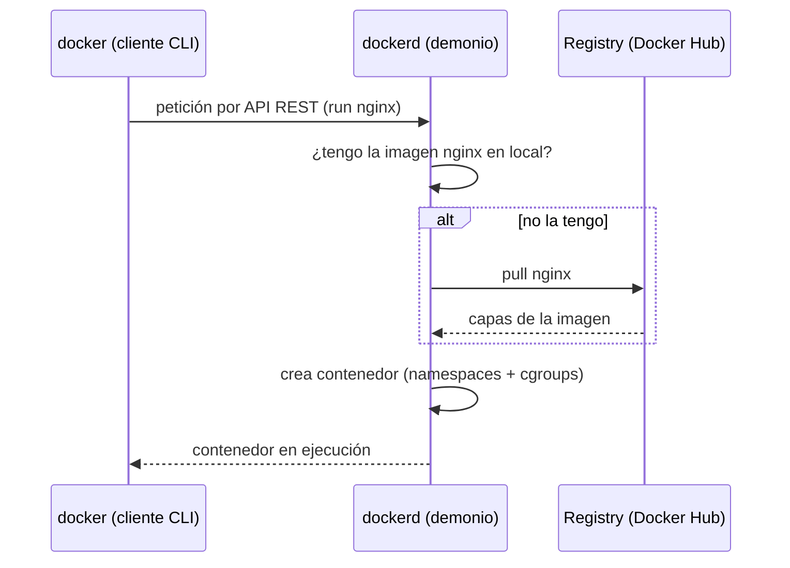

# Nivel 00: ¿Qué es un contenedor? (y por qué no es una máquina virtual)

Bienvenido al principio de todo. Antes de escribir una sola línea de Dockerfile, necesitas un modelo mental **correcto y profundo**, porque el 90% de la confusión con Docker viene de no entender **qué** es realmente un contenedor y **qué partes del sistema** intervienen.

---

## 1. El problema que Docker resuelve

> *"En mi máquina funciona."*

Esa frase ha hecho perder millones de horas. Tu aplicación necesita una versión concreta de Python, ciertas librerías del sistema (`glibc`, `openssl`), variables de entorno, un usuario, unos permisos... y en el servidor de producción nada de eso coincide. Docker **empaqueta tu aplicación junto con TODO su entorno** (binarios, librerías, ficheros de configuración) en una unidad portable que corre **idéntica** en tu portátil, en el de tu compañero y en producción.

Los tres problemas históricos que ataca:

| Problema | Sin Docker | Con Docker |
|---|---|---|
| **Dependencias** | "instala esto y aquello a mano" (frágil) | viajan dentro de la imagen |
| **Aislamiento** | dos apps pelean por la misma versión de librería | cada una en su contenedor |
| **Portabilidad** | "funciona en Ubuntu pero no en CentOS" | el mismo artefacto en cualquier host con Docker |
| **Densidad** | 1 VM por app (desperdicio de RAM/CPU) | decenas de contenedores por máquina |

---

## 2. Contenedor vs Máquina Virtual (la diferencia FÍSICA)

Una **máquina virtual** virtualiza el *hardware*: un **hipervisor** (VirtualBox, VMware, Hyper-V) emula CPU, disco y red, y cada VM arranca un **sistema operativo completo con su propio kernel**. Pesa gigabytes y tarda minutos en arrancar.

Un **contenedor** virtualiza el *sistema operativo*: todos los contenedores **comparten el kernel del host** y solo empaquetan los procesos y ficheros de la app. Pesa megabytes y arranca en milisegundos.



| Propiedad | Máquina Virtual | Contenedor |
|---|---|---|
| Qué virtualiza | Hardware completo | El SO (procesos) |
| Kernel | Uno propio por VM | Compartido con el host |
| Arranque | Segundos a minutos | Milisegundos |
| Tamaño | GB | MB |
| Aislamiento | Muy fuerte (hardware) | Fuerte (kernel namespaces) |
| Densidad por host | Decenas | Cientos/miles |
| Overhead | Alto (cada VM corre un SO) | Casi nulo |

**Limitación clave**: como el contenedor comparte el kernel del host, **un contenedor Linux necesita un kernel Linux**. En Windows/macOS, Docker Desktop arranca una pequeña VM Linux (vía **WSL2** en Windows) que aporta ese kernel. Por eso en Windows no puedes correr "contenedores Linux nativos" sin esa capa.

---

## 3. La anatomía interna: cómo aísla Docker sin un SO completo

El kernel de Linux ofrece varias primitivas que Docker combina. No es magia: son funciones del propio kernel.

### 3.1 Namespaces (aislamiento: "qué ve" el contenedor)
Dan a cada contenedor su propia "vista" del sistema. El contenedor cree que está solo en el mundo.

| Namespace | Aísla | Efecto práctico |
|---|---|---|
| **PID** | Procesos | Tu app es el PID 1; no ve procesos del host |
| **NET** | Red | Interfaces, IPs y puertos propios |
| **MNT** | Puntos de montaje | Su propio árbol de ficheros (`/`) |
| **UTS** | Hostname | `hostname` propio |
| **IPC** | Memoria compartida | Cola de mensajes/semaforos aislados |
| **USER** | UID/GID | Un root dentro puede ser un usuario normal fuera |

### 3.2 cgroups (límites: "cuánto puede usar")
Los *control groups* limitan y miden el consumo de recursos.



Ejemplos reales de límites (los usarás más adelante):
```bash
docker run --memory=256m --cpus=0.5 mi-app   # máx 256 MB y medio núcleo
docker run --pids-limit=100 mi-app           # máx 100 procesos
```

### 3.3 Capabilities y seguridad
El kernel divide los poderes de root en "capabilities" finas (montar discos, cambiar la hora, abrir puertos <1024...). Docker **elimina la mayoría por defecto**, así un root dentro del contenedor es mucho menos peligroso que un root real.

---

## 4. La arquitectura de Docker (cliente, demonio, registry)

Docker no es un solo programa. Cuando escribes `docker run`, ocurre esto:



| Componente | Qué es |
|---|---|
| **Docker CLI** (`docker`) | El cliente que usas en la terminal. Solo envía órdenes. |
| **Docker daemon** (`dockerd`) | El servicio que hace el trabajo real (construir, correr, gestionar). |
| **containerd / runc** | Componentes de bajo nivel que crean el contenedor a nivel de kernel. |
| **Registry** | Almacén remoto de imágenes (Docker Hub por defecto). |

> **Implicación**: el CLI y el demonio pueden estar en máquinas distintas (Docker remoto). Por eso las herramientas de validación de esta masterclass montan el *socket* del demonio (`/var/run/docker.sock`): es el canal por el que el cliente habla con `dockerd`.

---

## 5. Los conceptos que repetirás siempre

| Concepto | Qué es | Analogía POO |
|---|---|---|
| **Dockerfile** | La receta de texto para fabricar una imagen | El código fuente de la clase |
| **Imagen** | Plantilla inmutable de solo lectura (app + entorno) | La clase compilada |
| **Contenedor** | Instancia en ejecución de una imagen | El objeto instanciado |
| **Registry** | Almacén de imágenes | El repositorio Maven/npm |
| **Volumen** | Almacenamiento persistente fuera del contenedor | Una BBDD/fichero externo |
| **Red** | Canal de comunicación entre contenedores | La LAN virtual |

---

## 6. Limitaciones y malentendidos típicos (léelos ahora, te ahorrarán horas)

- **Un contenedor NO es una VM ligera**: no metas dentro un `systemd`, SSH y 5 servicios. La filosofía es **un proceso principal por contenedor**.
- **No persiste datos por defecto**: lo que escribe en su filesystem **se pierde al borrarlo** (lo arreglarás con volúmenes, Nivel 05).
- **No es una caja de seguridad perfecta**: comparte kernel; un kernel vulnerable afecta a todos. Para multi-tenant hostil se combina con otras capas.
- **Contenedor Linux ≠ contenedor Windows**: una imagen Linux no corre en kernel Windows y viceversa.
- **El contenedor vive mientras viva su PID 1**: si ese proceso termina, el contenedor se para (lo verás en el Nivel 01).

En el siguiente tema desmenuzamos la diferencia imagen ↔ contenedor y el ciclo de vida, que es la base de toda la masterclass.
