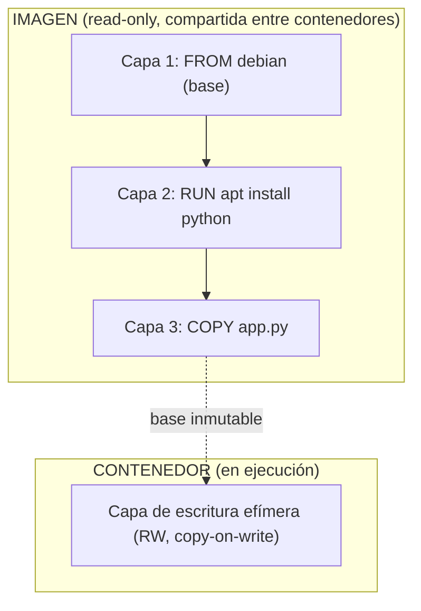
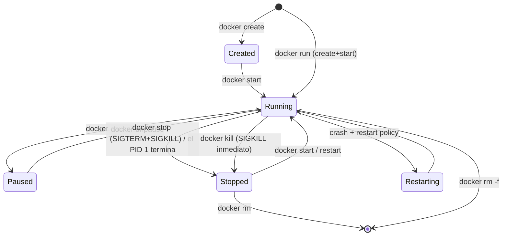
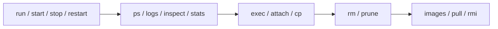

# Nivel 01: Imágenes vs Contenedores y el ciclo de vida

Este es **el** concepto que separa a quien entiende Docker de quien lo sufre. Aquí no solo veremos la diferencia, sino **las capas, el sistema de ficheros union, el ciclo de vida completo y todos los comandos** con sus flags más usados.

---

## 1. La imagen es de SOLO LECTURA y está hecha de CAPAS

Una **imagen** es una pila de **capas** (layers) inmutables apiladas. Cada capa es un conjunto de cambios (un *diff*) sobre la anterior: ficheros añadidos, modificados o borrados. Docker las combina con un **sistema de ficheros union** (overlayfs) que las presenta como un único árbol de directorios.

Cuando arrancas un contenedor, Docker añade encima una **capa de escritura efímera** (la *container layer*, copy-on-write). Todo lo que el contenedor escribe vive ahí y **desaparece al borrarlo**.



### Propiedades de las capas
- **Inmutables**: una vez creada, una capa nunca cambia. Cambiar algo crea una capa nueva.
- **Compartidas y cacheadas**: si dos imágenes parten de `python:3.12`, esa capa se almacena **una sola vez** en disco.
- **Identificadas por hash** (sha256 del contenido): así Docker sabe si ya la tiene.
- **Copy-on-write (CoW)**: cuando el contenedor modifica un fichero de una capa de solo lectura, Docker **copia** ese fichero a la capa de escritura y modifica la copia. La capa original no se toca.

Por eso de **una sola imagen** puedes lanzar **100 contenedores**: todos comparten las capas de solo lectura y cada uno tiene su finísima capa de escritura. Eficiencia brutal en disco y en RAM.

```bash
docker history python:3.12   # ver las capas de una imagen y cuánto pesa cada una
docker image inspect nginx   # metadata completa (capas, env, cmd, etc.)
```

---

## 2. El ciclo de vida de un contenedor (todos los estados)

Un contenedor no es eterno: nace, vive y muere. Conocer sus estados evita el 80% de los "¿por qué se ha parado?".



| Estado | Significado |
|---|---|
| **created** | Existe pero nunca ha arrancado |
| **running** | Su proceso PID 1 está vivo |
| **paused** | Procesos congelados (SIGSTOP), siguen en RAM |
| **restarting** | Murió y la política de reinicio lo está reviviendo |
| **exited** | El proceso terminó (con un *exit code* que puedes leer) |
| **dead** | Estado de error, no se pudo eliminar limpiamente |

**Regla de oro**: un contenedor vive mientras viva su **proceso principal (PID 1)**. Cuando ese proceso termina, el contenedor pasa a `exited`. No hay "demonio" que lo mantenga vivo artificialmente. Por eso `docker run ubuntu` se para al instante: el PID 1 (bash) no tiene nada que hacer y termina.

```bash
docker ps -a --format "table {{.Names}}\t{{.Status}}\t{{.Image}}"
docker inspect -f '{{.State.ExitCode}}' mi-contenedor   # por qué murió
```

---

## 3. `docker run`: el comando rey y sus flags

`docker run` = `docker create` + `docker start`. Crea un contenedor **nuevo** desde una imagen y lo arranca. Estos son los flags que usarás a diario:

| Flag | Qué hace | Ejemplo |
|---|---|---|
| `-d`, `--detach` | Segundo plano | `docker run -d nginx` |
| `--name` | Nombre legible (si no, Docker inventa uno) | `--name web` |
| `--rm` | Se autodestruye al terminar | `docker run --rm alpine echo hola` |
| `-p host:cont` | Publica un puerto | `-p 8080:80` |
| `-e VAR=val` | Variable de entorno | `-e APP_ENV=prod` |
| `--env-file` | Carga variables de un fichero | `--env-file .env` |
| `-v vol:/ruta` | Monta un volumen | `-v datos:/var/lib/mysql` |
| `--network` | Conecta a una red | `--network app-net` |
| `-it` | Interactivo + TTY (entrar a una shell) | `docker run -it ubuntu bash` |
| `--restart` | Política de reinicio | `--restart unless-stopped` |
| `--memory`, `--cpus` | Límites de recursos | `--memory 256m` |
| `-w` | Directorio de trabajo | `-w /app` |
| `-u` | Usuario | `-u 1000` |

```bash
docker run -d --name web -p 8080:80 --restart unless-stopped nginx:alpine
```

---

## 4. Inventario de comandos por categoría



### Gestión de contenedores
```bash
docker ps                 # contenedores en ejecución
docker ps -a              # todos (incluidos parados)
docker logs -f --tail 50 web   # ver salida (follow, últimas 50 líneas)
docker exec -it web sh    # abrir shell DENTRO de un contenedor vivo
docker inspect web        # JSON con TODA la config y estado
docker stats              # consumo de CPU/RAM en vivo
docker cp web:/etc/nginx/nginx.conf .   # copiar fichero contenedor<->host
docker stop web           # parada elegante (SIGTERM, luego SIGKILL a los 10s)
docker kill web           # parada brutal (SIGKILL ya)
docker rm web             # borrar (debe estar parado, o usa -f)
docker rm -f $(docker ps -aq)   # borrar TODOS (cuidado)
```

### Gestión de imágenes
```bash
docker images             # imágenes locales
docker pull redis:7       # descargar sin ejecutar
docker rmi nginx:alpine   # borrar una imagen
docker image prune        # borrar imágenes "colgantes" (dangling)
docker system prune -a    # limpieza total (cuidado: borra lo no usado)
```

> **`run` no es `start`**: `run` crea un contenedor **nuevo** desde una imagen. `start` revive uno ya creado que estaba parado. Confundirlos hace que acumules decenas de contenedores zombis con `docker ps -a`.

---

## 5. Limitaciones y trampas frecuentes

- **`docker run` siempre crea uno nuevo**: si repites `docker run --name web ...` y ya existe `web`, falla. Borra primero o usa `start`.
- **La capa de escritura NO es para datos importantes**: úsala solo para temporales. Datos serios → volúmenes (Nivel 05).
- **`docker stop` da 10 segundos**: envía SIGTERM y, si el proceso no muere, SIGKILL. Si tu app no maneja SIGTERM, pierdes ese cierre limpio (ver forma exec en Nivel 03).
- **Borrar el contenedor NO borra su imagen ni sus volúmenes**: son ciclos de vida independientes.
- **Demasiadas capas penalizan**: cada `RUN` extra es una capa. Imágenes con cientos de capas son lentas de mover (lo optimizarás en el Bloque 1 y 2).

En el siguiente tema diseccionamos el Dockerfile: la receta para fabricar tus propias imágenes, instrucción por instrucción.
