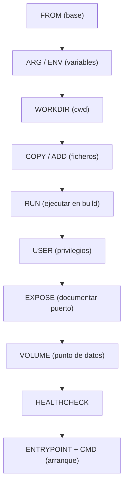
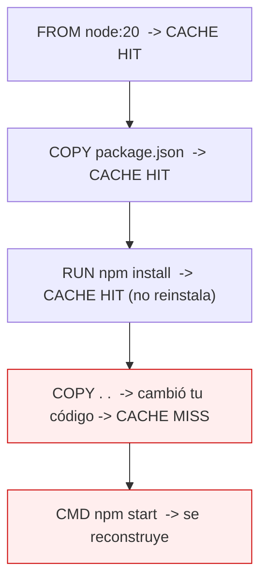
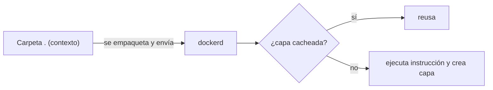

# Nivel 02: Anatomía del Dockerfile y la caché de capas

Un **Dockerfile** es la receta declarativa para fabricar una imagen. Aquí cubrimos **todas las instrucciones**, sus formas, opciones, ejemplos y limitaciones, además del mecanismo de caché que decide tu velocidad de build.

---

## 1. El catálogo COMPLETO de instrucciones



| Instrucción | Cuándo actúa | ¿Capa? | Para qué | Ejemplo |
|---|---|---|---|---|
| `FROM` | build | sí | Imagen base de la que partes | `FROM python:3.12-slim` |
| `ARG` | solo build | no persiste | Variable de build (parámetro) | `ARG VERSION=1.0` |
| `ENV` | build+run | sí (metadata) | Variable persistente | `ENV TZ=Europe/Madrid` |
| `WORKDIR` | build | sí (metadata) | Fija/crea el directorio de trabajo | `WORKDIR /app` |
| `COPY` | build | sí | Copia ficheros del contexto a la imagen | `COPY src/ /app/` |
| `ADD` | build | sí | Como COPY + descomprime tar + URLs | `ADD app.tar.gz /app/` |
| `RUN` | build | sí | Ejecuta un comando AL CONSTRUIR | `RUN pip install -r req.txt` |
| `USER` | build+run | sí (metadata) | Cambia el usuario de ejecución | `USER appuser` |
| `EXPOSE` | documental | sí (metadata) | Declara el puerto que usa la app | `EXPOSE 8080` |
| `VOLUME` | run | sí (metadata) | Declara un punto de montaje de datos | `VOLUME /data` |
| `HEALTHCHECK` | run | sí (metadata) | Comando para medir salud | `HEALTHCHECK CMD curl -f ...` |
| `LABEL` | build | sí (metadata) | Metadatos (autor, versión...) | `LABEL version="1.0"` |
| `ENTRYPOINT` | run | sí (metadata) | Ejecutable fijo al arrancar | `ENTRYPOINT ["nginx"]` |
| `CMD` | run | sí (metadata) | Comando/args por defecto | `CMD ["-g","daemon off;"]` |
| `SHELL` | build | sí (metadata) | Cambia la shell de la forma "shell" | `SHELL ["pwsh","-c"]` |
| `STOPSIGNAL` | run | sí (metadata) | Señal para parar | `STOPSIGNAL SIGQUIT` |
| `ONBUILD` | build (hijo) | sí | Instrucción que se ejecuta al heredar | `ONBUILD COPY . /app` |

---

## 2. Detalles finos que importan

### COPY vs ADD (usa COPY casi siempre)
```dockerfile
COPY app.py /app/                 # simple, predecible: SIEMPRE preferible
COPY --chown=appuser:appuser . /app   # copia y fija propietario
COPY --from=builder /out/app /app     # copia desde otra etapa (multi-stage)
ADD https://ejemplo.com/f.tar.gz /tmp/   # ADD puede bajar URLs y descomprimir tar
```
> **Limitación / buena práctica**: `ADD` hace "magia" (descomprime, baja URLs) que sorprende y rompe la caché. Usa `COPY` salvo que necesites específicamente descomprimir un tar local.

### FROM y las bases
```dockerfile
FROM node:20-alpine            # tag de versión + variante ligera
FROM node:20-alpine AS builder # nombrar la etapa (multi-stage, Nivel 06)
FROM scratch                   # imagen VACÍA (0 bytes), para binarios estáticos
```

### Formas exec vs shell (clave en RUN/CMD/ENTRYPOINT)
```dockerfile
RUN ["executable","param1"]    # forma EXEC: no pasa por shell, no expande $VAR
RUN apt-get update && apt-get install -y curl   # forma SHELL: /bin/sh -c, expande variables
```

---

## 3. La caché de capas: tu mejor amiga (si la respetas)

Al construir, Docker cachea cada capa. Si una instrucción **y su contexto** no cambian, reutiliza la capa cacheada (instantáneo). Pero **en cuanto una capa cambia, TODAS las de debajo se invalidan** y se reconstruyen.



### Qué invalida la caché de una capa
- Cambiar el **texto** de la instrucción en el Dockerfile.
- En `COPY`/`ADD`: que cambie **el contenido** de los ficheros copiados (checksum).
- Que se haya invalidado **cualquier capa anterior** (efecto dominó hacia abajo).

### La lección de oro del orden
Pon lo que **cambia poco** arriba y lo que **cambia mucho** abajo:

```dockerfile
# MAL: cualquier cambio de código reinstala dependencias (lento, minutos)
COPY . .
RUN npm install

# BIEN: las dependencias solo se reinstalan si cambia package.json
COPY package.json package-lock.json ./
RUN npm install        # esta capa se cachea entre builds
COPY . .               # solo esto se rehace al cambiar el código
```

```bash
docker build --no-cache -t app .   # forzar reconstrucción total (ignora caché)
docker build --progress=plain .    # ver el detalle de cada paso
```

---

## 4. El contexto de build

Cuando haces `docker build .`, ese `.` es el **contexto**: Docker empaqueta esa carpeta entera y se la envía al demonio. Por eso `COPY . .` copia desde el contexto, no desde tu disco entero.



```bash
docker build -t mi-app:1.0 .                 # contexto = carpeta actual
docker build -f docker/Dockerfile.prod .     # Dockerfile en otra ruta
docker build -t mi-app .  https://github.com/...   # contexto remoto (git)
```

> **Limitación / trampa**: si tu carpeta tiene `node_modules`, `.git` o ficheros gigantes, **todo eso viaja al demonio** aunque no lo copies, ralentizando el build. Se soluciona con `.dockerignore` (Nivel 04).

---

## 5. Limitaciones y errores típicos

- **Cada `RUN` es una capa**: tres `RUN apt-get install` crean tres capas y dejan caché dentro. Encadénalos (Nivel 04).
- **Borrar en una capa posterior NO reduce tamaño**: el fichero sigue en la capa donde se creó. Hay que crearlo y borrarlo **en el mismo `RUN`**.
- **`WORKDIR` crea la carpeta si no existe** y es relativo al anterior `WORKDIR`. Usa rutas absolutas para no perderte.
- **`EXPOSE` no abre puertos**: solo documenta. Publicar es cosa de `-p` al hacer `run` (Nivel 09).
- **`ENV` persiste en la imagen**: nunca metas secretos en `ENV` (quedan visibles con `docker history`).
- **Solo el último `CMD` y el último `ENTRYPOINT` cuentan**: si pones varios, los anteriores se ignoran.

> **Idea central del bloque**: imagen = capas; las capas se cachean; el orden de las instrucciones decide tu velocidad. Interiorízalo y ya piensas como ingeniero de contenedores.
