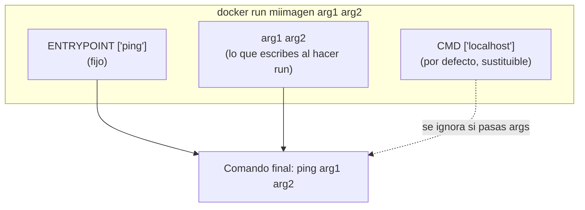
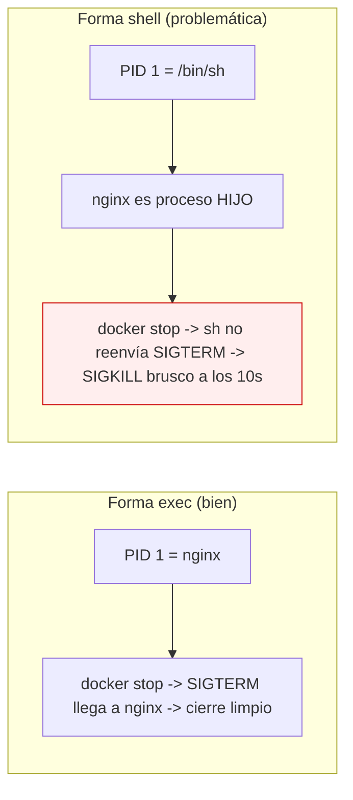
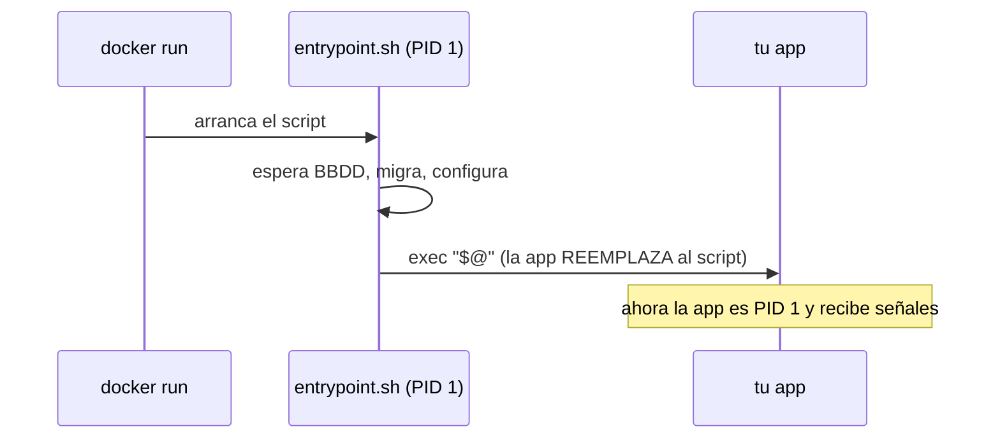

# Nivel 03: ENTRYPOINT vs CMD (el dúo más malentendido)

Ambos definen **qué se ejecuta cuando arranca el contenedor**, pero no son lo mismo. Confundirlos provoca contenedores que no arrancan, que ignoran tus argumentos, o que no se paran limpiamente. Aquí lo desmontamos por completo: formas, combinaciones, señales y patrones profesionales.

---

## 1. La diferencia esencial

- **`ENTRYPOINT`**: el **ejecutable fijo**. Lo que el contenedor "es". No se sobrescribe con argumentos normales (necesitas `--entrypoint`).
- **`CMD`**: los **argumentos por defecto** (o el comando por defecto si no hay ENTRYPOINT). Se sobrescribe fácilmente poniendo argumentos tras la imagen en `docker run`.



---

## 2. Las dos formas: EXEC vs SHELL (crítico para las señales)

```dockerfile
# Forma EXEC (RECOMENDADA): array JSON. NO pasa por shell.
CMD ["nginx", "-g", "daemon off;"]
ENTRYPOINT ["python", "app.py"]

# Forma SHELL: se ejecuta dentro de /bin/sh -c "...". Expande $VARIABLES.
CMD nginx -g "daemon off;"
ENTRYPOINT python app.py
```



| Aspecto | Forma EXEC `["cmd","arg"]` | Forma SHELL `cmd arg` |
|---|---|---|
| ¿Pasa por `/bin/sh -c`? | No | Sí |
| ¿Expande `$VARIABLE`? | No | Sí |
| ¿Quién es PID 1? | Tu proceso | La shell (tu proceso es hijo) |
| ¿Recibe SIGTERM? | Sí (cierre limpio) | Normalmente no (kill brusco) |
| Recomendación | **Por defecto** | Solo si necesitas expandir variables |

> **Regla**: usa la **forma exec** salvo que necesites expandir variables de shell. Así tu PID 1 recibe las señales y `docker stop` cierra limpio.

---

## 3. Tabla COMPLETA de combinaciones

| Dockerfile | `docker run img` ejecuta | `docker run img foo` ejecuta |
|---|---|---|
| `CMD ["ping","localhost"]` | `ping localhost` | `foo` (sustituye TODO el CMD) |
| `ENTRYPOINT ["ping"]` | `ping` | `ping foo` (args se anexan) |
| `ENTRYPOINT ["ping"]` + `CMD ["localhost"]` | `ping localhost` | `ping foo` (CMD se sustituye, ENTRYPOINT no) |
| solo `CMD ping localhost` (shell) | `/bin/sh -c "ping localhost"` | `foo` |
| nada de los dos | usa el CMD/ENTRYPOINT de la imagen base | `foo` |

**Patrón profesional**: `ENTRYPOINT` define la herramienta, `CMD` da el argumento por defecto editable. Tu imagen se comporta como un ejecutable real:
```dockerfile
ENTRYPOINT ["python", "manage.py"]
CMD ["runserver", "0.0.0.0:8000"]
# docker run app                 -> python manage.py runserver 0.0.0.0:8000
# docker run app migrate         -> python manage.py migrate
```

---

## 4. Sobrescribir desde la línea de comandos

```bash
docker run img otracosa                 # sustituye el CMD
docker run --entrypoint /bin/sh img     # sustituye el ENTRYPOINT (entrar a depurar)
docker run -it --entrypoint bash img    # abrir shell aunque la imagen tenga otro entrypoint
```

---

## 5. El patrón "entrypoint script" (muy usado en producción)

Un script de entrypoint permite inicializar antes de arrancar la app (esperar a la BBDD, migrar, sustituir variables...). Termina con `exec "$@"` para que tu app **sustituya** al script y herede el PID 1.



```dockerfile
COPY entrypoint.sh /entrypoint.sh
RUN chmod +x /entrypoint.sh
ENTRYPOINT ["/entrypoint.sh"]
CMD ["python", "app.py"]
```
```bash
#!/bin/sh
set -e
echo "Esperando a la base de datos..."
# ... lógica de espera ...
exec "$@"      # <- clave: reemplaza el proceso, app pasa a ser PID 1
```

---

## 6. STOPSIGNAL y parada controlada

Por defecto `docker stop` envía **SIGTERM** y, a los 10s, **SIGKILL**. Puedes cambiar la señal o el plazo:
```dockerfile
STOPSIGNAL SIGQUIT          # nginx, por ejemplo, prefiere SIGQUIT para cierre elegante
```
```bash
docker stop -t 30 web       # dale 30s antes del SIGKILL
```

---

## 7. Limitaciones y errores típicos
- **Olvidar la forma exec** → tu app no recibe SIGTERM → cierres bruscos y datos a medio escribir.
- **Poner `ENTRYPOINT` en forma shell** → no recibe argumentos del `run` correctamente.
- **Varios `CMD`/`ENTRYPOINT`** → solo cuenta el último.
- **`CMD` con comillas mal formadas** → en forma exec es JSON estricto: usa comillas dobles, no simples.
- **No poner `exec "$@"` en el entrypoint script** → el script queda como PID 1 y tu app no recibe señales.

En los próximos temas verás cómo endurecer la imagen (usuario no-root, labels, healthcheck) y gestionar datos con volúmenes.
