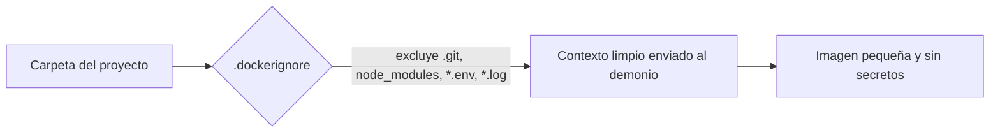
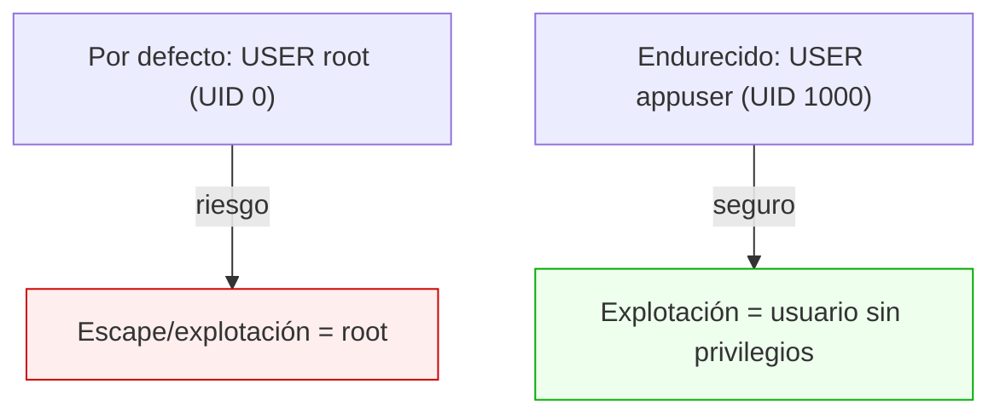
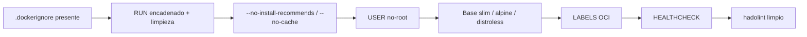

# Nivel 04: Buenas prácticas y seguridad de imágenes

Una imagen que "funciona" no es una imagen "buena". Aquí aprendes a construir imágenes limpias, pequeñas y seguras: lo que separa a un junior de un ingeniero. Cubrimos `.dockerignore`, RUN limpio, usuario no-root, capabilities, LABELS OCI y el linter `hadolint` con sus reglas más importantes.

---

## 1. El `.dockerignore`

Igual que `.gitignore`, excluye ficheros del **contexto de build**. Sin él, copias `node_modules`, `.git`, logs y secretos: builds lentos, imágenes gordas y **fugas de datos**.



Ejemplo de `.dockerignore`:
```
.git
.gitignore
node_modules
dist
*.log
*.env
.env*
Dockerfile
docker-compose*.yml
README.md
**/__pycache__
```

| Beneficio | Por qué |
|---|---|
| Builds más rápidos | menos datos viajan al demonio |
| Imágenes más pequeñas | no copias basura con `COPY . .` |
| Más seguridad | no metes `.env`, claves, `.git` con tu historial |
| Mejor caché | cambios irrelevantes no invalidan capas |

---

## 2. RUN limpio: una sola capa, sin caché de paquetes

Cada `RUN` crea una capa. Y borrar algo en una capa **posterior** no reduce el tamaño (la capa anterior ya lo contiene). Por eso se encadena instalar + limpiar en un **único** `RUN`.

```dockerfile
# MAL: 3 capas; la caché de apt queda dentro para siempre (+40 MB inútiles)
RUN apt-get update
RUN apt-get install -y curl git
# (la caché /var/lib/apt/lists sigue pesando en su capa)

# BIEN: una capa, instala y limpia en el mismo paso
RUN apt-get update && \
    apt-get install -y --no-install-recommends curl git && \
    rm -rf /var/lib/apt/lists/*
```

Equivalentes en otras bases:
```dockerfile
# Alpine
RUN apk add --no-cache curl git
# Python
RUN pip install --no-cache-dir -r requirements.txt
# Node
RUN npm ci --omit=dev && npm cache clean --force
```

`hadolint` te exigirá esto. Reglas clave:
| Regla | Qué exige |
|---|---|
| **DL3008** | Fija versiones de paquetes apt (`curl=7.*`) o al menos usa `--no-install-recommends` |
| **DL3009** | Borra `/var/lib/apt/lists` tras instalar |
| **DL3015** | Usa `--no-install-recommends` |
| **DL3018** | En Alpine, usa `--no-cache` con `apk add` |
| **DL3042** | Usa `--no-cache-dir` con pip |
| **DL3059** | No encadenes múltiples `RUN` consecutivos innecesarios |
| **DL4006** | Usa `SHELL` con `-o pipefail` para pipes seguros |

---

## 3. Usuario no-root: el principio de mínimo privilegio

Por defecto, un contenedor corre como **root (UID 0)**. Si un atacante explota tu app, es root dentro del contenedor (y con suerte, gracias a las capabilities reducidas, no fuera). La buena práctica: crear un usuario sin privilegios y cambiar a él con `USER`.



```dockerfile
# Debian/Ubuntu
RUN useradd --create-home --uid 1000 appuser
# Alpine
RUN adduser -D -u 1000 appuser
# fija propietario al copiar y cambia de usuario
COPY --chown=appuser:appuser . /app
USER appuser
```

| Detalle | Nota |
|---|---|
| `USER` aplica a las instrucciones **siguientes** y al runtime | pon root para instalar, luego cambia a appuser |
| Si la app escucha en puertos <1024 | necesita root o `setcap` (usa puertos altos: 8080) |
| Los volúmenes montados deben tener permisos correctos | usa `--chown` o ajusta UID |
| `hadolint` **DL3002** | avisa si terminas el Dockerfile como root |

---

## 4. Capabilities y opciones de seguridad en runtime

Aunque corras como root dentro, Docker recorta los poderes. Puedes endurecer aún más:
```bash
docker run --read-only mi-app                 # filesystem de solo lectura
docker run --cap-drop ALL --cap-add NET_BIND_SERVICE mi-app  # solo el poder justo
docker run --security-opt no-new-privileges mi-app   # impide escalar privilegios
docker run --user 1000:1000 mi-app            # forzar UID/GID
```

---

## 5. LABELS y metadata OCI

Las `LABEL` documentan la imagen según el estándar **OCI** (Open Container Initiative). Permiten trazabilidad en registries y CI/CD.

```dockerfile
LABEL org.opencontainers.image.title="mi-api" \
      org.opencontainers.image.version="1.0.0" \
      org.opencontainers.image.authors="tu@correo.com" \
      org.opencontainers.image.source="https://github.com/yo/mi-api" \
      org.opencontainers.image.licenses="MIT"
```

| Label OCI estándar | Significado |
|---|---|
| `image.title` | Nombre legible |
| `image.version` | Versión semántica |
| `image.source` | URL del repositorio de código |
| `image.authors` | Autor/responsable |
| `image.description` | Descripción corta |
| `image.licenses` | Licencia (SPDX) |

```bash
docker inspect -f '{{json .Config.Labels}}' mi-api   # leer los labels
```

---

## 6. Checklist mental de imagen "pro"



---

## 7. Limitaciones y errores típicos
- **Creer que `rm -rf` en un `RUN` posterior adelgaza la imagen**: no, la capa anterior conserva los ficheros. Borra en el mismo `RUN`.
- **Olvidar el `.dockerignore`** y filtrar `.env`/`.git` a la imagen.
- **Quedarte como root** por comodidad → riesgo de seguridad y aviso de hadolint.
- **Apps que necesitan el puerto 80** corriendo como no-root → usa 8080 y mapea con `-p 80:8080`.
- **Fijar versiones de paquetes** rompe builds cuando el repo las retira; equilibra reproducibilidad y mantenimiento.

El siguiente tema cubre HEALTHCHECK y, sobre todo, los **volúmenes**: cómo no perder tus datos cuando el contenedor muere.
