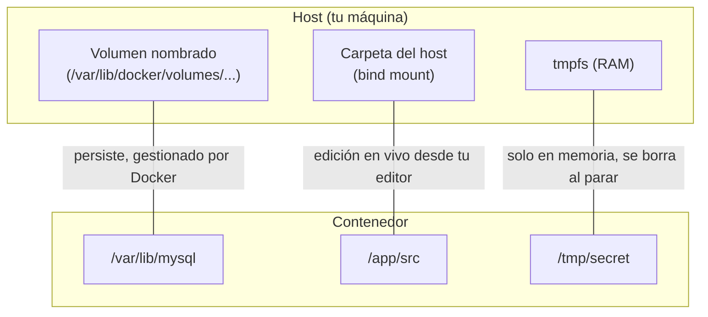
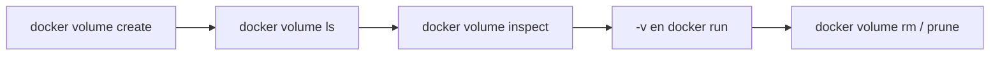
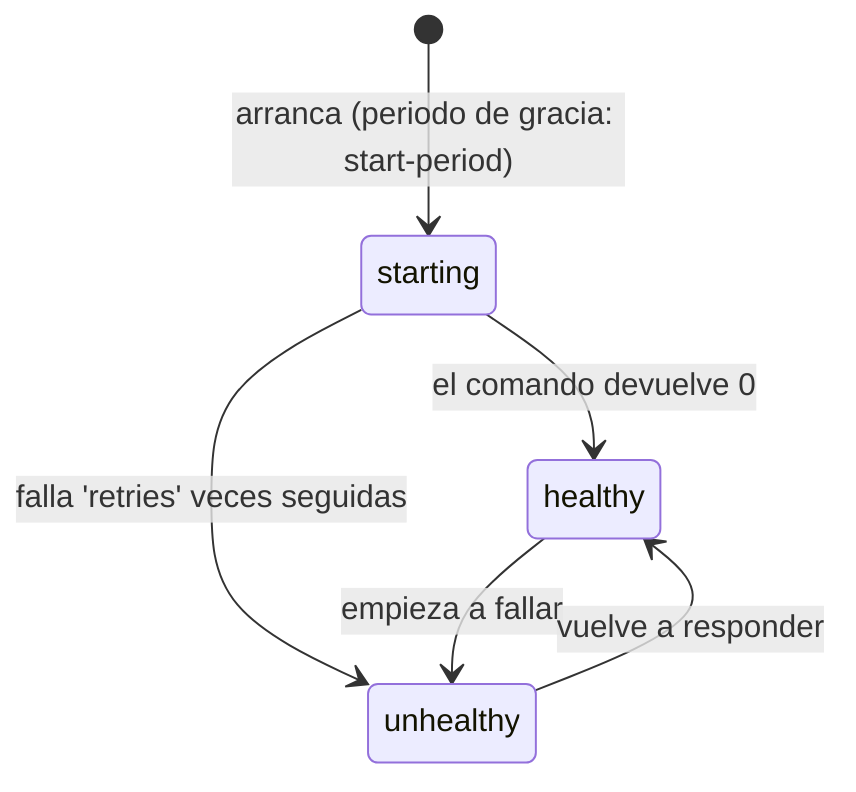

# Nivel 05: Volúmenes y HEALTHCHECK

## 1. El problema: los datos mueren con el contenedor

Recuerda (Nivel 01): la capa de escritura de un contenedor es **efímera**. Si tu base de datos guarda los datos ahí y borras el contenedor, **adiós datos**. Los **volúmenes** persisten datos fuera del ciclo de vida del contenedor.

---

## 2. Las tres formas de manejar datos (con propiedades)



| Tipo | Sintaxis | Gestiona | Caso de uso | Limitación |
|---|---|---|---|---|
| **Volumen nombrado** | `-v datos:/ruta` | Docker | Datos de producción (BBDD) | No ves los ficheros fácilmente en tu disco |
| **Bind mount** | `-v ${PWD}/x:/ruta` | Tú (ruta del host) | Desarrollo (hot reload) | Depende de la ruta y permisos del host |
| **Volumen anónimo** | `-v /ruta` | Docker (nombre aleatorio) | Caché temporal | Difícil de reusar; se acumulan |
| **tmpfs** | `--tmpfs /ruta` | Kernel (RAM) | Secretos/temporales | Se pierde al parar; ocupa RAM |

### Sintaxis larga `--mount` (más explícita, recomendada en producción)
```bash
docker run --mount type=volume,source=pgdata,target=/var/lib/postgresql/data postgres
docker run --mount type=bind,source="${PWD}/src",target=/app/src,readonly node
docker run --mount type=tmpfs,target=/tmp,tmpfs-size=64m alpine
```

---

## 3. Comandos de gestión de volúmenes

```bash
docker volume create datos_db          # crear
docker volume ls                       # listar
docker volume inspect datos_db         # ver ruta real y metadata
docker volume rm datos_db              # borrar (debe estar sin usar)
docker volume prune                    # borrar todos los no usados (cuidado)
docker run -v datos_db:/var/lib/postgresql/data postgres   # usar
```



---

## 4. Bind mounts para desarrollo (hot reload)
Montas tu código del host dentro del contenedor; editas en tu editor y se refleja al instante sin reconstruir.
```bash
docker run -v "${PWD}:/app" -w /app -p 3000:3000 node:20 npm run dev
```
> **Trampa de Windows**: usa `${PWD}` en PowerShell. En rutas con espacios, entre comillas. El rendimiento de bind mounts en Windows es mejor si el proyecto vive **dentro de WSL2** (`\\wsl$\...`), no en `C:\`.

---

## 5. HEALTHCHECK: ¿está la app realmente lista?

Un contenedor "running" no significa que la app dentro funcione (puede estar arrancando o colgada). `HEALTHCHECK` define un comando que Docker ejecuta periódicamente para marcar el contenedor como `healthy` o `unhealthy`.



```dockerfile
HEALTHCHECK --interval=10s --timeout=3s --start-period=30s --retries=3 \
    CMD curl -f http://localhost:8080/health || exit 1
```

| Opción | Significado | Por defecto |
|---|---|---|
| `--interval` | Cada cuánto se comprueba | 30s |
| `--timeout` | Cuánto espera la respuesta antes de fallar | 30s |
| `--start-period` | Periodo de gracia inicial (fallos no cuentan) | 0s |
| `--retries` | Fallos seguidos para marcar unhealthy | 3 |
| `CMD ... \|\| exit 1` | El comando; **debe devolver 0 (sano) o 1 (enfermo)** | — |

```bash
docker ps                                  # la columna STATUS muestra (healthy)/(unhealthy)
docker inspect -f '{{.State.Health.Status}}' web   # leer el estado de salud
docker run --health-cmd='curl -f localhost/health' --health-interval=5s mi-app  # sin Dockerfile
HEALTHCHECK NONE                           # en el Dockerfile: desactiva el healthcheck heredado
```

Esto es **crucial** para Compose y Kubernetes: permiten esperar a `service_healthy` antes de arrancar dependientes, o reiniciar contenedores que dejan de responder.

---

## 6. Limitaciones y errores típicos
- **Escribir datos en el filesystem del contenedor en vez de en un volumen** → pérdida al borrar.
- **`docker volume prune` / `down -v`** borran datos: son destructivos, úsalos a conciencia.
- **El healthcheck necesita que la herramienta exista en la imagen**: si usas `curl` pero la base no lo trae (alpine/distroless), instálalo o usa `wget`/un binario propio.
- **Un healthcheck pesado** (cada 1s, comando lento) consume recursos; ajusta `interval`/`timeout`.
- **Permisos de volúmenes**: un volumen nuevo montado donde corre un usuario no-root puede dar "permission denied"; ajusta `--chown`/UID.

> **Regla**: datos que importan → volumen nombrado. Salud que importa → HEALTHCHECK. Con esto cierras el bloque de imágenes serias y entras en el mundo de la optimización con multi-stage.
