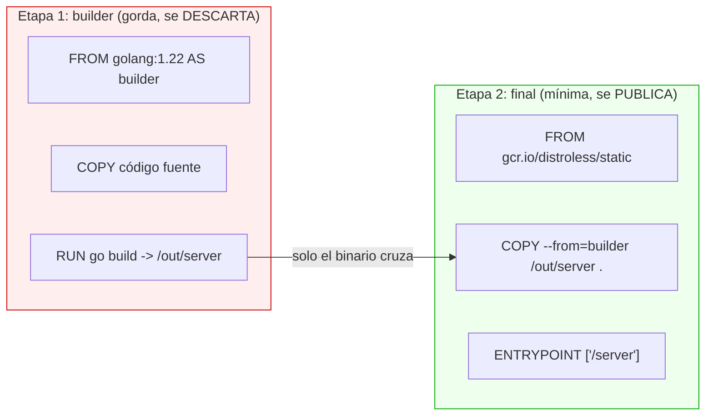
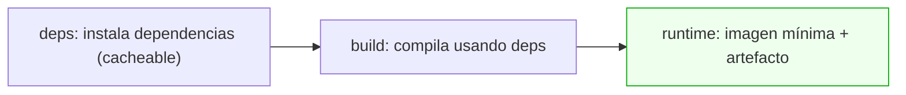
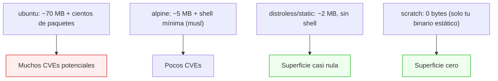

# Nivel 06: Multi-stage builds (compilar sin engordar)

## 1. El problema: el toolchain pesa más que la app

Para compilar Go necesitas el compilador (~300 MB). Para construir un frontend necesitas Node + node_modules (~500 MB). Pero el **resultado** es un binario de 10 MB o unos ficheros estáticos. Si entregas la imagen con todo el toolchain dentro:
- Envías cientos de MB de basura a producción (lento de mover y desplegar).
- Multiplicas la **superficie de ataque** (compilador, git, headers... todo explotable).
- Aumentas los CVEs heredados.

---

## 2. La solución: varias etapas, una imagen final mínima

Un Dockerfile puede tener **varios `FROM`**. Cada uno abre una **etapa** (stage). Compilas en una etapa "builder" gorda y **copias solo el artefacto final** a una etapa final limpia con `COPY --from=`. Las etapas intermedias **no viajan** a la imagen final.



```dockerfile
# ---- Etapa de compilación ----
FROM golang:1.22 AS builder
WORKDIR /src
COPY go.mod go.sum ./
RUN go mod download            # cacheable: solo cambia si cambian las deps
COPY . .
RUN CGO_ENABLED=0 GOOS=linux go build -ldflags="-s -w" -o /out/server .

# ---- Etapa final ----
FROM gcr.io/distroless/static-debian12
COPY --from=builder /out/server /server
USER 65532:65532               # distroless trae el usuario nonroot
ENTRYPOINT ["/server"]
```
Resultado: de **~300 MB** a **~10 MB**. La etapa `builder` ni siquiera se publica.

---

## 3. Las herramientas del multi-stage

| Técnica | Sintaxis | Para qué |
|---|---|---|
| Nombrar etapa | `FROM x AS builder` | Referenciarla luego |
| Copiar entre etapas | `COPY --from=builder /ruta /destino` | Traer solo el artefacto |
| Copiar de una imagen externa | `COPY --from=nginx:latest /etc/nginx/nginx.conf .` | Robar un fichero de otra imagen |
| Construir hasta una etapa | `docker build --target builder .` | Depurar la fase de build |
| Etapa de dependencias | `FROM ... AS deps` | Cachear `npm ci`/`go mod` aparte |

### `--target`: parar en una etapa concreta
```bash
docker build --target builder -t mi-app:debug .   # construye solo hasta 'builder'
```
Útil para depurar la compilación o para tener una imagen "dev" con herramientas y otra "prod" mínima desde el **mismo** Dockerfile.

---

## 4. Patrón con tres etapas (deps → build → runtime)


```dockerfile
FROM node:20-slim AS deps
WORKDIR /app
COPY package*.json ./
RUN npm ci

FROM node:20-slim AS build
WORKDIR /app
COPY --from=deps /app/node_modules ./node_modules
COPY . .
RUN npm run build

FROM nginx:alpine AS runtime
COPY --from=build /app/dist /usr/share/nginx/html
```

---

## 5. Distroless: ni siquiera una shell

Las imágenes **distroless** de Google contienen solo tu app y sus dependencias de runtime: **ni shell, ni gestor de paquetes, ni utilidades**. Menos superficie = menos vulnerabilidades. El precio: no puedes `docker exec ... sh` (no hay shell) — que es exactamente lo que un atacante tampoco puede.



| Imagen final | Tamaño aprox. | Shell | Cuándo |
|---|---|---|---|
| `debian:slim` | ~30 MB | sí | Necesitas glibc + utilidades mínimas |
| `alpine` | ~5 MB | sí (ash) | Quieres ligereza con shell (ojo: usa musl, no glibc) |
| `distroless/static` | ~2 MB | no | Binarios estáticos (Go), máxima seguridad |
| `scratch` | 0 MB | no | Binario 100% estático y autosuficiente |

> **Limitación de Alpine**: usa **musl libc** en vez de glibc. Algunas dependencias compiladas (numpy, drivers) pueden fallar o ir más lentas. Si tu app pelea con Alpine, usa `slim`.

---

## 6. Limitaciones y errores típicos
- **Copiar de la etapa equivocada** o rutas mal escritas en `--from`.
- **Binarios dinámicos en `scratch`/`distroless/static`**: si tu binario depende de glibc, no arrancará en `scratch`. Compila estático (`CGO_ENABLED=0` en Go) o usa `distroless/base`.
- **Olvidar `WORKDIR`/permisos** en la etapa final.
- **No aprovechar la caché de dependencias**: copia primero los manifiestos (`go.mod`, `package.json`) y descarga deps antes de copiar el código.
- **Depurar distroless**: como no hay shell, usa la variante `:debug` de distroless o `docker build --target build` para inspeccionar.

> **Regla**: si tu lenguaje compila o tiene paso de build (Go, Rust, Java, C, frontend), **multi-stage no es opcional**. En el siguiente tema exprimimos aún más con BuildKit y cache mounts.
