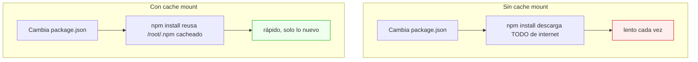
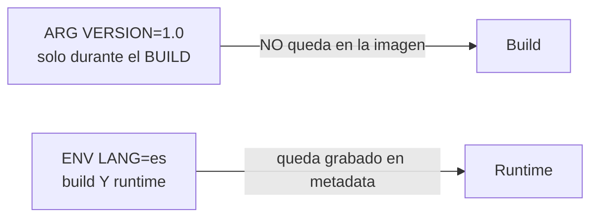

# Nivel 07: BuildKit, cache mounts, secrets y build args

## 1. BuildKit: el motor de build moderno

Desde hace años Docker construye con **BuildKit** por defecto. Aporta:
- **Builds en paralelo** de etapas independientes (el grafo de dependencias se resuelve solo).
- **Caché más inteligente** y exportable/importable entre máquinas y CI.
- **Cache mounts** (`--mount=type=cache`): caché de dependencias fuera de las capas.
- **Secrets de build seguros** (`--mount=type=secret`): credenciales que no quedan en la imagen.
- **Bind mounts de build** (`--mount=type=bind`): acceso a ficheros sin copiarlos.

Lo activas con la cabecera de sintaxis (recomendado) y, si hiciera falta, la variable de entorno:
```dockerfile
# syntax=docker/dockerfile:1
FROM node:20-slim
```
```bash
DOCKER_BUILDKIT=1 docker build .     # forzar BuildKit (ya es el default en Docker Desktop)
docker buildx build .                # el frontend extendido (multi-arch, cache export...)
```

---

## 2. Cache mounts: no descargues dependencias 100 veces

Normalmente, si cambia `package.json`, se reinstala TODO desde internet. Un **cache mount** conserva el directorio de caché del gestor **entre builds**, **fuera** de las capas de la imagen final (no la engorda).



```dockerfile
# syntax=docker/dockerfile:1
FROM node:20-slim
WORKDIR /app
COPY package*.json ./
RUN --mount=type=cache,target=/root/.npm npm ci
COPY . .
```
Cachés típicas por ecosistema:
| Herramienta | `target` a cachear |
|---|---|
| npm | `/root/.npm` |
| pip | `/root/.cache/pip` |
| apt | `/var/cache/apt`,`/var/lib/apt` (con `sharing=locked`) |
| Go modules | `/go/pkg/mod` |
| Maven | `/root/.m2` |
| Cargo | `/usr/local/cargo/registry` |

La caché **no acaba dentro de la imagen** (no la engorda) y **sobrevive entre builds** (te ahorra tiempo). Lo mejor de los dos mundos.

---

## 3. Secrets de build (no filtres credenciales)

¿Necesitas un token para descargar un paquete privado durante el build? **No** lo pongas en `ARG` ni `ENV` (quedan en `docker history`). Usa `--mount=type=secret`:

```dockerfile
# syntax=docker/dockerfile:1
RUN --mount=type=secret,id=npmtoken \
    NPM_TOKEN=$(cat /run/secrets/npmtoken) npm ci
```
```bash
docker build --secret id=npmtoken,src=./npm_token.txt -t app .
```
El secreto se monta solo durante ese `RUN` y **no deja rastro** en ninguna capa.

---

## 4. ARG vs ENV (a fondo)



| Aspecto | `ARG` | `ENV` |
|---|---|---|
| Disponible en build | Sí | Sí |
| Disponible en runtime | **No** | Sí |
| Se pasa con | `--build-arg` | `-e` / `--env-file` / Dockerfile |
| Persiste en la imagen | No | Sí (visible en `docker history`/`inspect`) |
| Uso típico | versión base, flags de compilación | configuración de la app, locale, paths |

```dockerfile
ARG NODE_VERSION=20
FROM node:${NODE_VERSION}-slim     # ARG antes de FROM: parametriza la base
ARG APP_ENV=production
ENV APP_ENV=${APP_ENV}             # "promociona" un ARG a ENV para runtime
```
```bash
docker build --build-arg NODE_VERSION=22 --build-arg APP_ENV=staging -t mi-app .
```
> **Detalle**: un `ARG` declarado **antes** del primer `FROM` solo sirve para el `FROM`. Para usarlo dentro de una etapa, vuelve a declararlo dentro.

> **Seguridad**: nunca pases secretos con `ARG` (quedan en el historial). Para eso está `--mount=type=secret`.

---

## 5. Caché entre máquinas (CI/CD)
BuildKit puede exportar e importar la caché a un registry, para que tu pipeline de CI no parta de cero cada vez:
```bash
docker buildx build \
  --cache-to=type=registry,ref=miregistry/app:cache \
  --cache-from=type=registry,ref=miregistry/app:cache \
  -t miregistry/app:1.0 --push .
```

---

## 6. Limitaciones y errores típicos
- **Olvidar `# syntax=docker/dockerfile:1`**: sin ella, las funciones `--mount` pueden no estar disponibles según versión.
- **Cache mount mal apuntado**: si cacheas la carpeta equivocada no acelera nada.
- **Meter secretos en `ARG`/`ENV`**: fuga visible con `docker history --no-trunc`.
- **Esperar que el cache mount adelgace la imagen**: no cambia el tamaño final, solo el **tiempo de build**.
- **Confiar en la caché en CI sin exportarla**: cada runner es efímero; usa `--cache-to/--cache-from`.

El siguiente tema cierra el bloque de optimización: escaneo de vulnerabilidades y versionado de imágenes.
