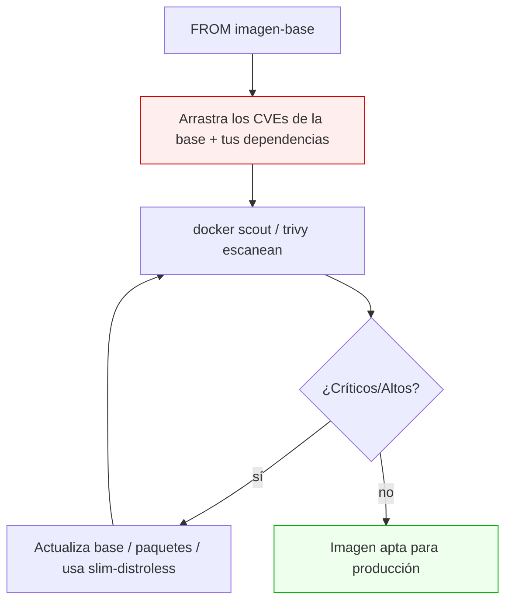
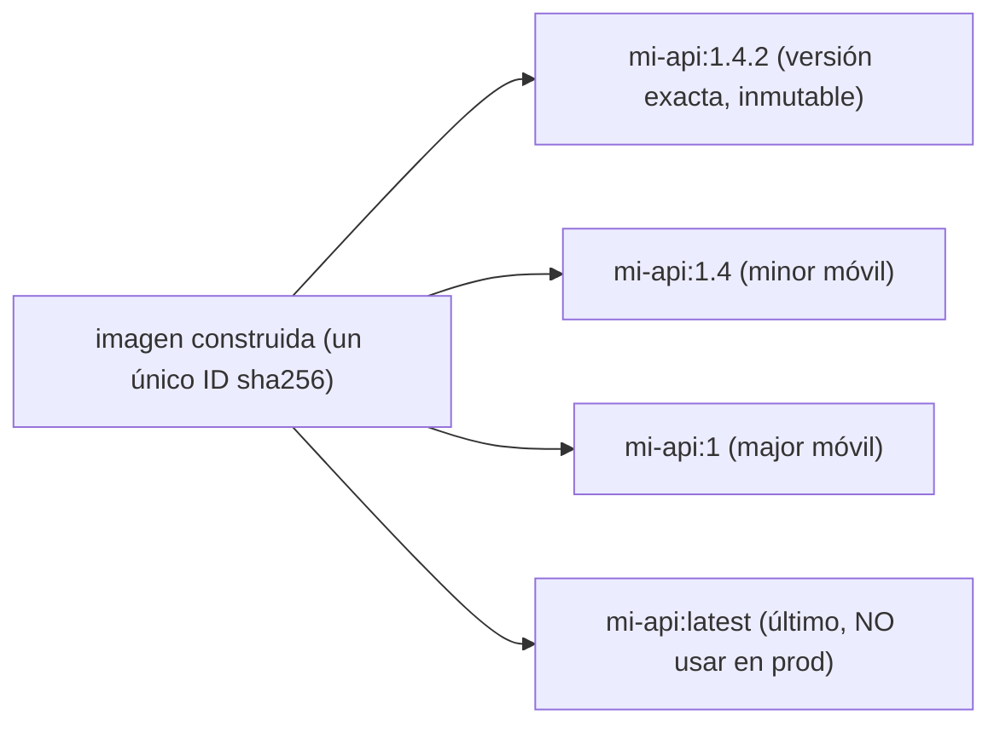

# Nivel 08: Escaneo de vulnerabilidades y versionado de imágenes

## 1. Tu imagen hereda los CVEs de su base

Cuando haces `FROM ubuntu:20.04`, heredas **todos** los paquetes de esa base y sus vulnerabilidades conocidas (**CVE** = Common Vulnerabilities and Exposures). Una imagen base obsoleta arrastra decenas de fallos críticos sin que toques una línea de tu código.



### Severidades (CVSS)
| Severidad | Acción típica |
|---|---|
| **Critical** | Bloquea el despliegue; parchea ya |
| **High** | Corrige antes de producción |
| **Medium** | Planifica corrección |
| **Low / Negligible** | Acepta o corrige en mantenimiento |

---

## 2. Herramientas de escaneo

| Herramienta | Comando | Notas |
|---|---|---|
| **docker scout** | `docker scout cves mi-img:tag` | Integrado en Docker Desktop |
| **docker scout (vista rápida)** | `docker scout quickview mi-img` | Resumen por severidad |
| **docker scout (comparar)** | `docker scout compare --to mi-img:1.0 mi-img:1.1` | Diferencia de CVEs entre versiones |
| **docker scout recommendations** | `docker scout recommendations mi-img` | Sugiere base más segura |
| **trivy** (Aqua) | `docker run aquasec/trivy image mi-img` | Estándar de industria, muy completo |
| **grype** (Anchore) | `grype mi-img` | Alternativa popular |

```bash
docker scout quickview mi-imagen:latest
docker scout cves --only-severity critical,high mi-imagen:latest
docker run --rm aquasec/trivy image --severity HIGH,CRITICAL mi-imagen:latest
```

### Cómo reducir CVEs (estrategias concretas)
- Usa bases **slim**, **alpine** o **distroless** (menos paquetes = menos CVEs).
- **Actualiza** la versión de la base regularmente y reconstruye para recoger parches.
- No instales paquetes innecesarios (`--no-install-recommends`).
- Fija y actualiza tus dependencias de aplicación (no solo las del sistema).
- En multi-stage, deja fuera el toolchain (Nivel 06): menos software = menos CVEs.

---

## 3. SBOM: el inventario de tu imagen
Un **SBOM** (Software Bill of Materials) lista todo el software dentro de la imagen. Sirve para auditoría y cumplimiento.
```bash
docker scout sbom mi-imagen:latest          # generar el inventario
docker buildx build --sbom=true -t app .     # adjuntar SBOM a la imagen al construir
```

---

## 4. Versionado y etiquetado (tagging)

Nunca confíes en `latest` en producción: es un puntero móvil y no sabes qué contiene. Usa **versionado semántico** (`MAJOR.MINOR.PATCH`) y etiqueta explícitamente.



```bash
docker build -t mi-api:1.4.2 .
docker tag mi-api:1.4.2 mi-api:1.4      # alias, NO copia
docker tag mi-api:1.4.2 mi-api:latest
docker images mi-api                    # verás varios tags con el MISMO IMAGE ID
docker inspect -f '{{.Id}}' mi-api:1.4.2   # el digest real
```

| Tipo de tag | Inmutable | Uso |
|---|---|---|
| `1.4.2` (versión exacta) | Sí (por convención) | Producción, reproducibilidad |
| `1.4`, `1` (móviles) | No | "dame la última 1.4.x" |
| `latest` | No | Pruebas locales; NUNCA contrato de prod |
| `@sha256:...` (digest) | Sí (garantizado) | Máxima reproducibilidad/seguridad |

> **Digest > tag**: `mi-api@sha256:abc...` apunta a un contenido **exacto e inmutable**. Los tags pueden reapuntarse; el digest no. En producción seria se despliega por digest.

---

## 5. Limitaciones y errores típicos
- **Escanear una sola vez**: los CVEs se descubren a diario; escanea de forma recurrente (idealmente en CI).
- **Confiar en `latest`**: builds no reproducibles y sorpresas en producción.
- **`docker tag` no copia**: crea un alias al mismo ID; borrar un tag no borra la imagen si otro tag la referencia.
- **Falsos positivos**: no todos los CVEs son explotables en tu contexto; prioriza por severidad y exposición real.
- **Olvidar las dependencias de la app**: el escáner mira el SO **y** tus librerías (npm/pip); ambas suman CVEs.

> **Regla**: escanea antes de publicar, fija versiones explícitas, y trata `latest` como "lo último" pero nunca como contrato. Con esto cierras la optimización y entras en redes y datos.
