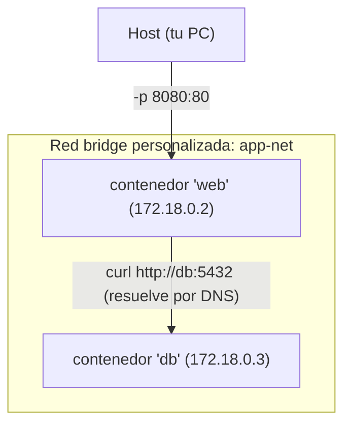
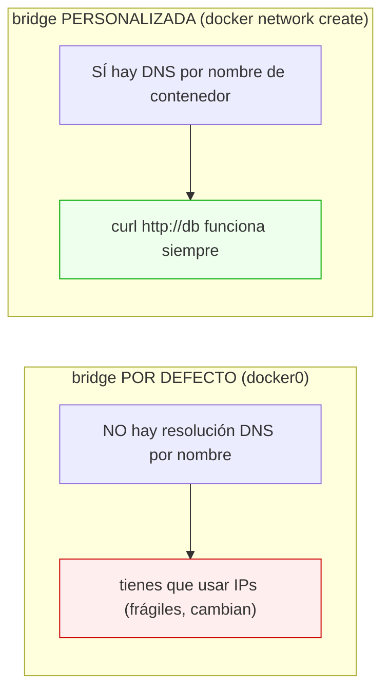
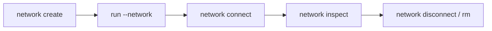

# Nivel 09: Redes en Docker

## 1. Los contenedores hablan entre sí por redes

Cada contenedor tiene su propia interfaz de red (namespace NET). Para que dos contenedores se comuniquen, deben compartir una **red Docker**. La magia clave: en una red **personalizada**, Docker provee **DNS interno**, así un contenedor encuentra a otro **por su nombre**, no por IP.



---

## 2. Los drivers de red (tipos)

| Driver | Alcance | Para qué | Limitación |
|---|---|---|---|
| **bridge** (por defecto) | Una máquina | Lo normal: red privada local | Sin DNS por nombre en la red *default* |
| **host** | Una máquina | El contenedor usa la red del host directamente | Sin aislamiento de puertos; solo Linux real |
| **none** | — | Sin red (aislamiento total) | El contenedor no tiene conectividad |
| **overlay** | Varios hosts | Clúster (Swarm) | Requiere orquestador |
| **macvlan** | Una máquina | Dar al contenedor una IP propia en la LAN física | Configuración avanzada |

```bash
docker run --network host nginx       # comparte la pila de red del host (Linux)
docker run --network none alpine      # sin red
```

---

## 3. La diferencia que confunde a TODOS: red por defecto vs personalizada



> **Regla de oro**: SIEMPRE crea una red personalizada para tus apps. Solo así obtienes resolución por nombre (y aislamiento del resto de contenedores).

```bash
docker network create app-net
docker run -d --name db --network app-net postgres:16
docker run -d --name web --network app-net -p 8080:80 mi-web
docker exec web ping -c1 db      # resuelve 'db' por DNS interno
```

---

## 4. Comandos de gestión de redes

```bash
docker network ls                       # listar redes
docker network create app-net           # crear (driver bridge por defecto)
docker network create --subnet 10.5.0.0/16 app-net   # con subred propia
docker network inspect app-net          # ver contenedores conectados e IPs
docker network connect app-net web      # conectar un contenedor ya creado
docker network disconnect app-net web   # desconectar
docker network rm app-net               # borrar (sin contenedores conectados)
docker network prune                    # borrar redes no usadas
```



Un contenedor puede estar en **varias redes** a la vez (p. ej. una red "frontend" y otra "backend") para segmentar el tráfico.

---

## 5. Publicar puertos: `-p host:contenedor`

`EXPOSE` en el Dockerfile solo **documenta**. Para que el puerto sea accesible desde tu navegador hay que **publicarlo** al arrancar.


| Sintaxis | Efecto |
|---|---|
| `-p 8080:80` | Puerto 8080 del host → 80 del contenedor |
| `-p 127.0.0.1:8080:80` | Solo accesible desde localhost (más seguro) |
| `-p 80` | Publica el 80 del contenedor a un puerto **aleatorio** del host |
| `-P` (mayúscula) | Publica TODOS los `EXPOSE` a puertos aleatorios |
| `--expose 9000` | Expone sin publicar (visible solo entre contenedores) |

```bash
docker run -p 8080:80 nginx          # localhost:8080 -> nginx:80
docker port web                      # ver el mapeo real de un contenedor
```

> **Comunicación interna vs externa**: entre contenedores de la misma red usan el **puerto del contenedor** directamente (`db:5432`), NO el publicado. El `-p` es solo para acceder **desde fuera** (tu host/navegador).

---

## 6. Limitaciones y errores típicos
- **Usar la red por defecto y esperar DNS por nombre**: no funciona; crea una red personalizada.
- **Confundir puerto del host y del contenedor**: dentro de la red se usa el del contenedor; `-p` es para el host.
- **Colisión de puertos en el host**: dos contenedores no pueden publicar el mismo puerto del host (`8080`). Cambia uno.
- **`--network host` en Windows/macOS**: se comporta distinto que en Linux (Docker Desktop corre en una VM); no esperes el mismo resultado.
- **Exponer la BBDD al host innecesariamente**: no publiques `5432` si solo la usa la app; mantenla interna por seguridad.

En el siguiente tema: persistencia de datos en redes reales (app + base de datos) y políticas de reinicio.
