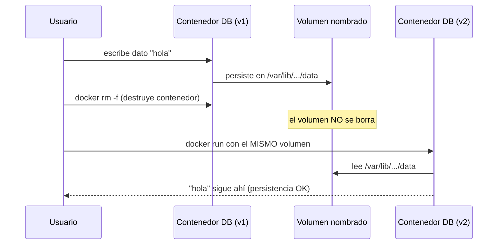
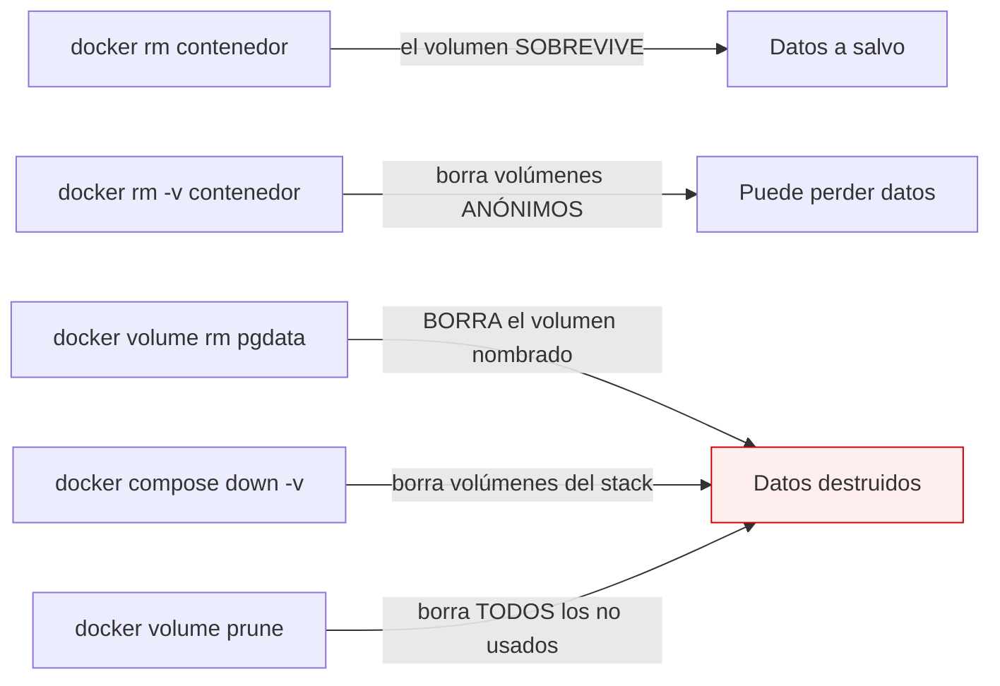

# Nivel 10: Persistencia de datos en escenarios reales

Ya conoces los volúmenes (Nivel 05). Ahora los aplicas a un escenario de verdad: una app que escribe en una base de datos que **debe sobrevivir** a recreaciones del contenedor. Cubrimos rutas de cada motor, el test de persistencia, backups y migraciones de datos.

---

## 1. El test de fuego de la persistencia



Si tras borrar y recrear el contenedor montando el **mismo volumen** el dato sigue, lo estás haciendo bien. Si desaparece, escribiste en la capa efímera.

---

## 2. Dónde monta cada base de datos sus datos

| Motor | Ruta a persistir | Variable de init típica |
|---|---|---|
| PostgreSQL | `/var/lib/postgresql/data` | `POSTGRES_PASSWORD`, `POSTGRES_DB` |
| MySQL / MariaDB | `/var/lib/mysql` | `MYSQL_ROOT_PASSWORD`, `MYSQL_DATABASE` |
| MongoDB | `/data/db` | `MONGO_INITDB_ROOT_USERNAME/PASSWORD` |
| Redis | `/data` | (config con `--appendonly yes`) |
| Elasticsearch | `/usr/share/elasticsearch/data` | — |
| SQLite | el fichero `.db` donde lo pongas | — |

```bash
docker volume create pgdata
docker run -d --name db \
    -v pgdata:/var/lib/postgresql/data \
    -e POSTGRES_PASSWORD=secret -e POSTGRES_DB=app \
    -p 5432:5432 postgres:16
```

> **Scripts de inicialización**: muchas imágenes de BBDD ejecutan automáticamente los `.sql`/`.sh` que montes en `/docker-entrypoint-initdb.d/` **la primera vez** (cuando el volumen está vacío). Útil para sembrar esquema/datos.

---

## 3. Cuidado con borrar volúmenes (operaciones destructivas)



> **Regla**: para datos que importan, usa **volúmenes nombrados** y borra contenedores con `docker rm` (sin `-v`). El `-v`, `down -v` y `prune` son destructivos: úsalos solo cuando quieras empezar de cero.

---

## 4. Backup y restauración (patrón del contenedor auxiliar)

Como un volumen no es una carpeta visible en tu disco, se respalda lanzando un contenedor temporal que lo monte y lo vuelque a un `.tar`:

```bash
# BACKUP: volcar el volumen a un tar en tu carpeta actual
docker run --rm -v pgdata:/data -v "${PWD}:/backup" alpine \
    tar czf /backup/pgdata.tar.gz -C /data .

# RESTORE: volcar el tar de vuelta a un volumen
docker run --rm -v pgdata:/data -v "${PWD}:/backup" alpine \
    sh -c "cd /data && tar xzf /backup/pgdata.tar.gz"
```

Para BBDD también puedes usar su herramienta nativa:
```bash
docker exec db pg_dump -U postgres app > backup.sql        # dump lógico
docker exec -i db psql -U postgres app < backup.sql        # restaurar
```

---

## 5. Inspeccionar y mover datos
```bash
docker volume inspect pgdata           # ver "Mountpoint" (ruta real en el host/VM)
docker run --rm -v pgdata:/data alpine ls -la /data   # husmear el contenido
docker run --rm -v origen:/from -v destino:/to alpine cp -a /from/. /to/  # clonar volumen
```

---

## 6. Limitaciones y errores típicos
- **Escribir datos en el filesystem del contenedor** en vez de en un volumen → pérdida al borrar.
- **Cambiar la versión mayor de la BBDD** (p. ej. postgres:15 → 16) con el mismo volumen puede requerir migración; el formato de datos puede ser incompatible.
- **Permisos**: un volumen nuevo puede pertenecer a root; si la BBDD corre como otro UID, ajusta permisos o deja que la imagen lo gestione.
- **Bind mounts en Windows** para BBDD: mejor un **volumen nombrado** (rendimiento y permisos), no una carpeta de `C:\`.
- **Backups en caliente**: `tar` de un volumen con la BBDD escribiendo puede dar copias inconsistentes; usa el dump nativo o para el contenedor.

En el siguiente tema: logs y políticas de reinicio (que el contenedor reviva solo si muere).
