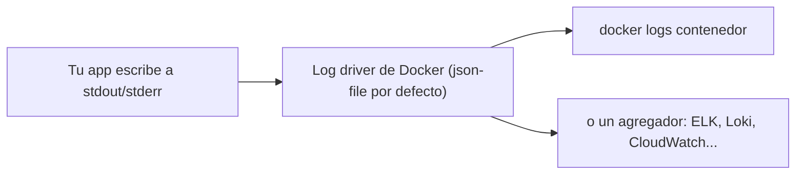
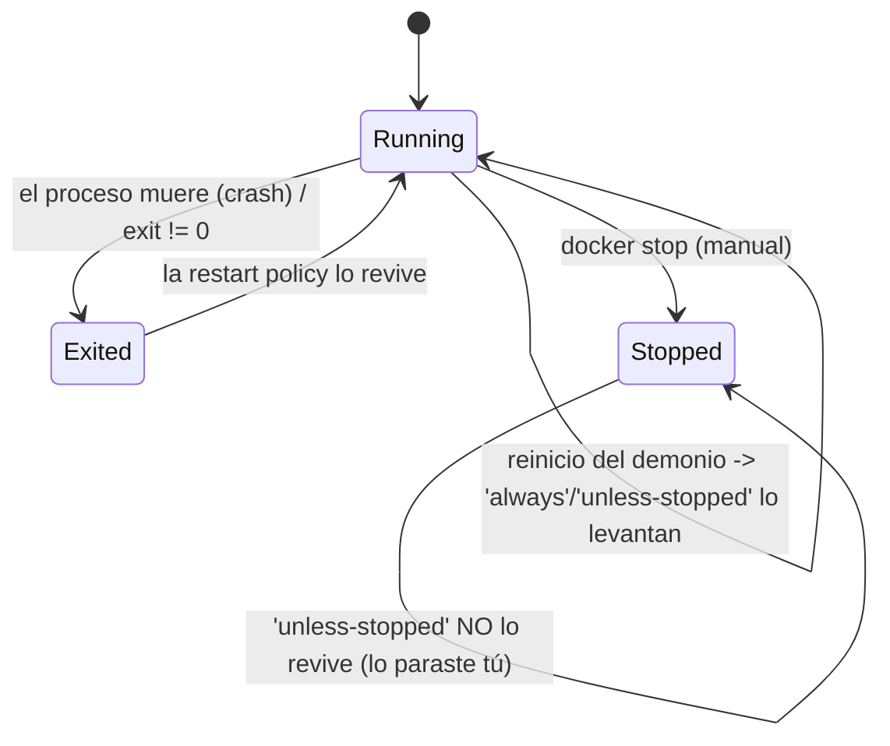
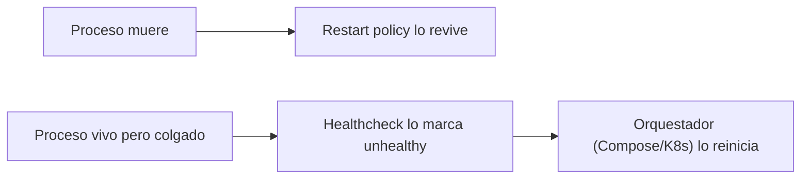

# Nivel 11: Logs y políticas de reinicio

## 1. Los logs: la ventana al alma del contenedor

Tu app **no debe escribir a ficheros de log dentro del contenedor** (se pierden al borrarlo y engordan la capa). La convención de contenedores (the twelve-factor app) es: **escribe a `stdout`/`stderr`** y deja que Docker capture esa salida.



### Comandos de logs y sus flags
```bash
docker logs mi-contenedor              # toda la salida
docker logs -f mi-contenedor           # en vivo (follow)
docker logs --tail 50 mi-contenedor    # últimas 50 líneas
docker logs --since 10m mi-contenedor  # últimos 10 minutos
docker logs --until 2024-01-01T00:00:00 mi-contenedor
docker logs -t mi-contenedor           # con timestamps
```

### Log drivers (dónde van los logs)
| Driver | Uso | Nota |
|---|---|---|
| `json-file` (por defecto) | Guarda en JSON local | `docker logs` funciona; rota con opciones |
| `local` | Más eficiente que json-file | Recomendado para local moderno |
| `none` | Desactiva logs | Apps muy ruidosas; `docker logs` deja de funcionar |
| `syslog` / `journald` | Reenvío al sistema | Integración con el SO |
| `awslogs` / `gcplogs` / `fluentd` | Reenvío a la nube/colectores | Producción a escala |

```bash
# Rotación de logs (evita que llenen el disco)
docker run --log-opt max-size=10m --log-opt max-file=3 mi-app
# Cambiar de driver
docker run --log-driver local mi-app
```
> **Trampa**: con `--log-driver none` o drivers remotos, `docker logs` puede no mostrar nada localmente. La rotación (`max-size`/`max-file`) es **obligatoria** en servidores de larga vida o el disco se llena.

---

## 2. Políticas de reinicio: que reviva solo

Si el proceso de tu contenedor muere (crash) o reinicias la máquina, ¿debe revivir? Lo decide `--restart`.



| Política | Reinicia si crashea | Reinicia al arrancar Docker | Respeta parada manual |
|---|---|---|---|
| `no` (por defecto) | No | No | — |
| `on-failure[:N]` | Solo si exit ≠ 0, máx N veces | No | — |
| `always` | Sí | Sí | No (lo revive igual) |
| `unless-stopped` | Sí | Sí | **Sí** (si lo paraste tú, no revive) |

```bash
docker run -d --restart unless-stopped --name api mi-api
# Pruébalo: mátalo "a lo bestia" y observa cómo revive
docker kill api ; sleep 2 ; docker ps    # vuelve a estar Up
docker update --restart=on-failure:5 api # cambiar la política en caliente
```

> **Backoff**: Docker espera cada vez un poco más entre reintentos (100ms, 200ms, 400ms...) para no entrar en bucle de crash. Verás el estado `Restarting`.

---

## 3. Diferencia clave: restart policy vs healthcheck
- **Restart policy**: reacciona a que el **proceso muera** (PID 1 termina).
- **Healthcheck**: detecta que la app está **viva pero enferma** (colgada, no responde). Por sí solo **no reinicia** en Docker plano (sí en Compose/Swarm/K8s). Combínalos para robustez.



---

## 4. Limitaciones y errores típicos
- **No rotar logs** en servidores → el disco se llena y todo cae.
- **Esperar que el healthcheck reinicie en `docker run` puro**: no lo hace; solo cambia el estado. El reinicio por salud lo hacen los orquestadores.
- **`always` en algo que debería poder pararse**: usa `unless-stopped` para respetar tus paradas manuales.
- **Bucle de crash**: si tu app falla al instante, verás `Restarting` eterno; revisa `docker logs` para la causa raíz, no subas los reintentos a ciegas.
- **Logs a fichero dentro del contenedor**: rompe la observabilidad estándar; escribe a stdout/stderr.

Con esto cierras el bloque de redes y datos. A continuación: orquestar todo esto con **Docker Compose** en lugar de comandos sueltos.
