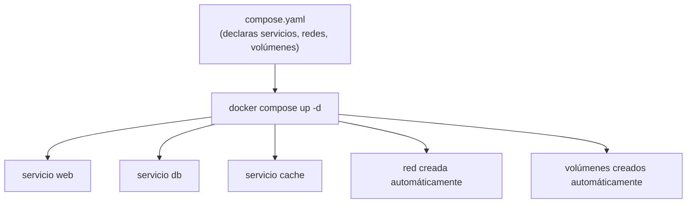
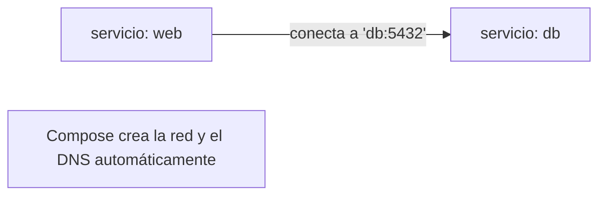

# Nivel 12: Docker Compose — fundamentos

## 1. El problema: demasiados `docker run`

Una app real tiene varios contenedores: API + base de datos + caché + proxy. Levantarlos a mano con `docker run`, creando redes y volúmenes, pasando 15 flags cada uno... es un infierno y no es reproducible. **Docker Compose** declara todo el stack en un único fichero YAML y lo levanta con un comando.



> **Nombre del fichero**: el moderno es `compose.yaml` (o `compose.yml`); el clásico `docker-compose.yml` sigue funcionando. El comando moderno es `docker compose` (con espacio, plugin v2), no el viejo `docker-compose` (con guion).

---

## 2. Anatomía COMPLETA de un compose.yaml

```yaml
services:
  web:
    build:
      context: ./web            # carpeta del Dockerfile
      dockerfile: Dockerfile    # opcional, nombre del Dockerfile
      args:                     # build args
        APP_ENV: production
    image: mi-web:1.0           # nombre de la imagen resultante
    ports:
      - "8080:80"               # publica puerto host:contenedor
    environment:
      - APP_ENV=production       # variables de entorno
    env_file:
      - .env                    # o cárgalas de un fichero
    volumes:
      - ./web/src:/app/src      # bind mount (desarrollo)
    depends_on:
      - db                      # orden de arranque
    networks:
      - app-net
    restart: unless-stopped     # política de reinicio
    healthcheck:
      test: ["CMD", "curl", "-f", "http://localhost/health"]
      interval: 10s
      retries: 3
    deploy:
      resources:
        limits:
          cpus: "0.5"
          memory: 256M

  db:
    image: postgres:16          # usa imagen del registry (sin build)
    environment:
      POSTGRES_PASSWORD: secret
    volumes:
      - pgdata:/var/lib/postgresql/data
    networks:
      - app-net

volumes:
  pgdata:                       # volumen nombrado gestionado por Compose

networks:
  app-net:                      # red propia con DNS por nombre
    driver: bridge
```

| Clave | Para qué |
|---|---|
| `services` | Cada contenedor del stack |
| `build` / `image` | Construir desde Dockerfile o usar imagen existente |
| `ports` | Publicar puertos al host |
| `environment` / `env_file` | Variables de entorno |
| `volumes` | Persistencia / bind mounts |
| `depends_on` | Orden (y con `condition`, salud — Nivel 13) |
| `networks` | Conectar a redes |
| `restart` | Política de reinicio |
| `healthcheck` | Salud del servicio |
| `deploy.resources` | Límites de CPU/RAM |

---

## 3. DNS automático entre servicios

En Compose, **el nombre del servicio ES el hostname**. `web` alcanza la BBDD en `db:5432`. No necesitas IPs ni crear la red a mano: Compose crea una red por proyecto y registra cada servicio en su DNS.



---

## 4. Los comandos esenciales (con flags)

| Comando | Qué hace |
|---|---|
| `docker compose up -d` | Levanta todo en segundo plano |
| `docker compose up -d --build` | Reconstruye imágenes y levanta |
| `docker compose ps` | Estado de los servicios |
| `docker compose logs -f [servicio]` | Logs (de todos o de uno) |
| `docker compose exec web sh` | Shell dentro de un servicio |
| `docker compose run --rm web cmd` | Ejecuta un comando puntual |
| `docker compose stop` / `start` | Para / arranca sin borrar |
| `docker compose down` | Para y **borra** contenedores y red |
| `docker compose down -v` | + borra volúmenes (¡destructivo!) |
| `docker compose build` | Reconstruye imágenes con `build:` |
| `docker compose up -d --scale web=3` | 3 réplicas de `web` |
| `docker compose config` | Valida y muestra la config final resuelta |
| `docker compose pull` | Descarga imágenes de los servicios |


---

## 5. Limitaciones y errores típicos
- **Confundir `docker-compose` (v1, guion) con `docker compose` (v2, espacio)**: usa el v2.
- **`down -v` borra tus volúmenes**: cuidado, pierdes datos.
- **`depends_on` sin `condition`** solo ordena el arranque, **no espera a que el servicio esté listo** (Nivel 13).
- **Fijar `ports` y luego `--scale`**: colisión de puerto en el host; no puedes escalar un servicio con puerto fijo.
- **Compose es para un solo host**: no es un orquestador de clúster (para eso, Kubernetes — Nivel 15).
- **Editar el YAML y olvidar `--build`**: si cambiaste el Dockerfile, Compose puede reusar la imagen vieja; usa `up -d --build`.

En el siguiente tema: Compose avanzado (healthchecks con `depends_on condition`, `.env`, perfiles, escalado, override files).
