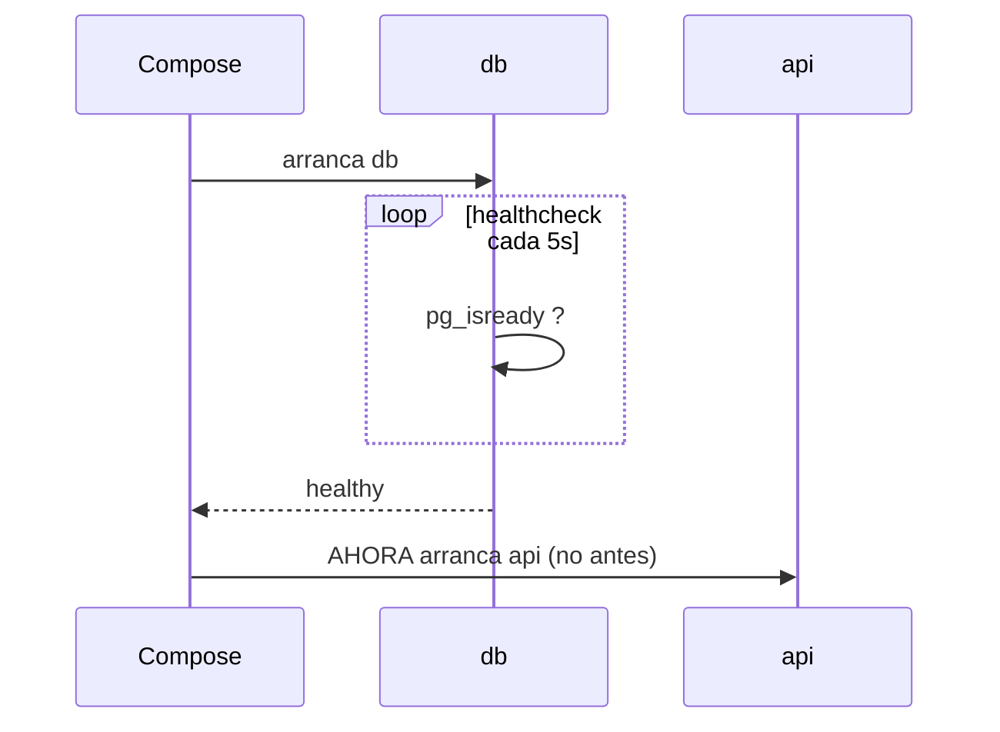
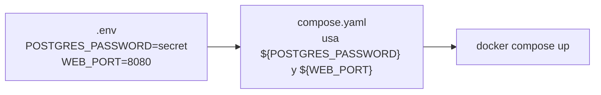
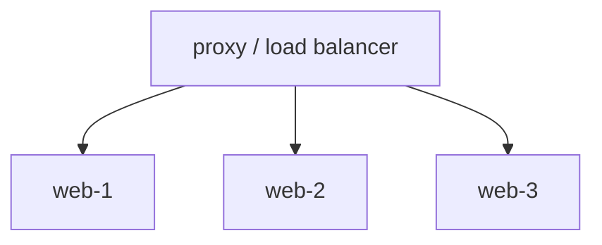
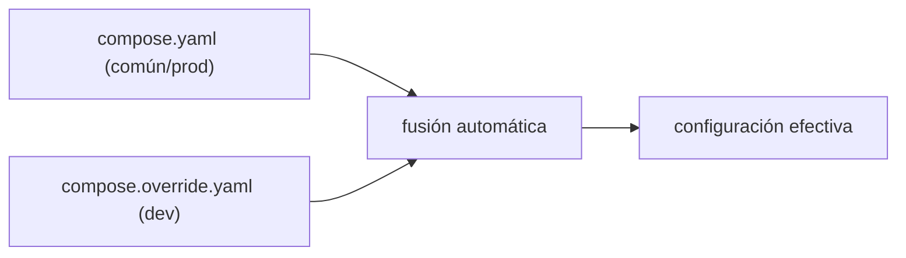

# Nivel 13: Docker Compose avanzado

## 1. `depends_on` con condición de salud

`depends_on` simple solo garantiza el **orden de arranque**, no que el servicio esté **listo**. Una base de datos puede estar "arrancada" pero aún no aceptar conexiones, y tu API se cae al intentar conectar. La solución: `condition: service_healthy` + un `healthcheck` en la dependencia.



```yaml
services:
  db:
    image: postgres:16
    environment:
      POSTGRES_PASSWORD: secret
    healthcheck:
      test: ["CMD-SHELL", "pg_isready -U postgres"]
      interval: 5s
      timeout: 3s
      retries: 5
      start_period: 10s
  api:
    build: ./api
    depends_on:
      db:
        condition: service_healthy   # espera a healthy, no solo a "started"
```

| Condición de `depends_on` | Significado |
|---|---|
| `service_started` | Basta con que haya arrancado (por defecto) |
| `service_healthy` | Espera a que el healthcheck pase a healthy |
| `service_completed_successfully` | Espera a que termine con éxito (tareas de init) |

---

## 2. Variables de entorno y fichero `.env`

Compose lee automáticamente un fichero `.env` en la carpeta del proyecto y sustituye `${VAR}` en el YAML. Así separas **configuración** de **definición** y no hardcodeas secretos.



```yaml
services:
  web:
    ports:
      - "${WEB_PORT:-8080}:80"     # con valor por defecto si no está definida
  db:
    environment:
      POSTGRES_PASSWORD: ${POSTGRES_PASSWORD:?falta la contraseña}  # error si falta
```

| Sintaxis | Comportamiento |
|---|---|
| `${VAR}` | Sustituye; vacío si no existe |
| `${VAR:-default}` | Usa `default` si no está definida |
| `${VAR:?mensaje}` | Falla con `mensaje` si no está definida |

> **Precedencia**: variables del shell > `--env-file` > `.env`. El `.env` (de Compose) NO es lo mismo que `env_file:` (de un servicio): el primero sustituye `${}` en el YAML; el segundo inyecta variables dentro del contenedor.

---

## 3. Escalado y reparto

```bash
docker compose up -d --scale web=3   # 3 réplicas del servicio web
docker compose ps                    # verás web-1, web-2, web-3
```


> Para escalar no puedes fijar `ports: "8080:80"` (colisión en el host); delega el reparto a un proxy (nginx, traefik, caddy) que descubra las réplicas, o publica un rango de puertos.

---

## 4. Profiles: servicios bajo demanda

Activan servicios solo cuando los pides. Útil para herramientas opcionales (un `adminer`, un seeder, un debugger) que no quieres en el arranque normal.

```yaml
services:
  adminer:
    image: adminer
    profiles: ["debug"]      # solo arranca con --profile debug
```
```bash
docker compose up -d                      # NO levanta adminer
docker compose --profile debug up -d      # SÍ levanta adminer
```

---

## 5. Override files y fusión de configuraciones

`compose.override.yaml` se fusiona **automáticamente** sobre el base. Patrón típico: base para producción + override para desarrollo (bind mounts, hot reload, puertos extra).



```bash
docker compose up -d                                  # base + override (dev)
docker compose -f compose.yaml -f compose.prod.yaml up -d   # base + prod (explícito)
docker compose config                                 # ver el resultado fusionado
```

| Mecanismo | Uso |
|---|---|
| `compose.override.yaml` | Se fusiona solo (dev por defecto) |
| `-f a.yaml -f b.yaml` | Fusión explícita y ordenada |
| `extends` | Reutilizar definición de otro servicio/fichero |
| `profiles` | Activar subconjuntos de servicios |

---

## 6. Otras claves útiles
```yaml
services:
  worker:
    image: mi-worker
    deploy:
      replicas: 3              # réplicas declarativas (también con --scale)
      resources:
        limits: { cpus: "0.5", memory: 256M }
    configs: [app_config]      # configuración montada como fichero
    secrets: [db_password]     # secretos montados en /run/secrets
secrets:
  db_password:
    file: ./secrets/db_password.txt
```

---

## 7. Limitaciones y errores típicos
- **`depends_on` sin healthcheck**: arranca la app antes de que la BBDD acepte conexiones → fallos intermitentes.
- **Confundir `.env` con `env_file`**: el primero resuelve `${}` del YAML; el segundo inyecta variables en el contenedor.
- **Escalar un servicio con `ports` fijos**: colisión; usa un proxy.
- **Olvidar `start_period` en healthchecks lentos**: marca unhealthy durante el arranque legítimo.
- **Override invisible**: `compose.override.yaml` se aplica solo; si no esperas su efecto, revísalo con `docker compose config`.

Con esto dominas Compose. El siguiente bloque te lleva a nivel **pro**: registries y orquestación con Kubernetes.
