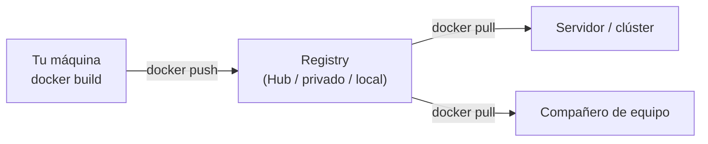
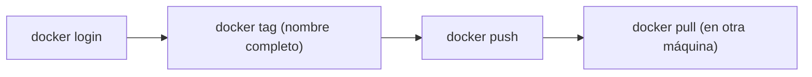
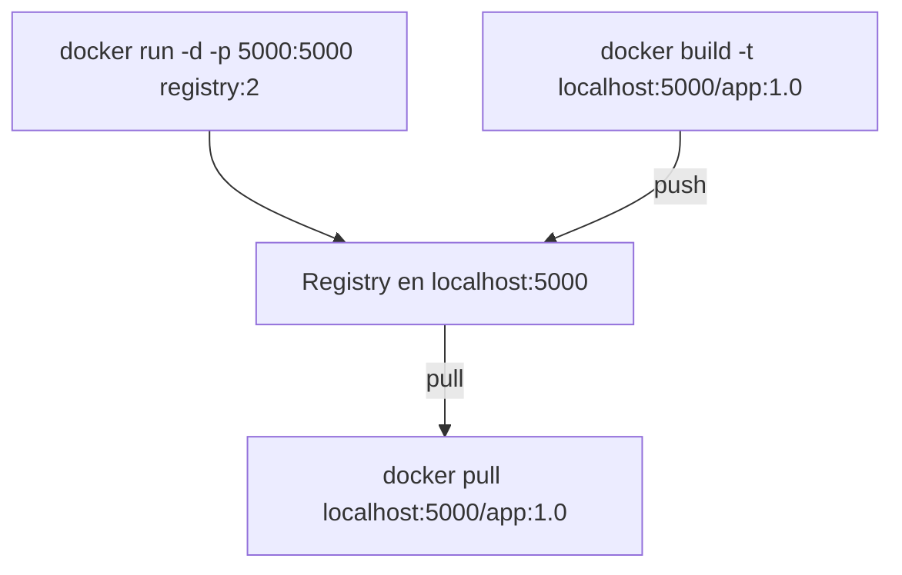
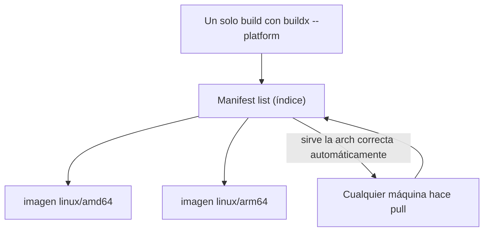

# Nivel 14: Registries y distribución de imágenes

## 1. ¿Dónde viven las imágenes?

Hasta ahora tus imágenes vivían solo en tu máquina. Para compartirlas (con tu equipo, con producción, con un clúster) se publican en un **registry**: un almacén de imágenes. Docker Hub es el público por defecto, pero puedes tener uno privado, en la nube (ECR, GCR, ACR, GHCR) o local.



| Registry | Host | Nota |
|---|---|---|
| Docker Hub | `docker.io` (implícito) | Público por defecto; límites de pull anónimo |
| GitHub Container Registry | `ghcr.io` | Integrado con repos de GitHub |
| AWS ECR / Google GCR / Azure ACR | nube | Privados gestionados |
| Registry local | `localhost:5000` | La imagen oficial `registry:2` |

---

## 2. El nombre completo de una imagen (anatomía)

```
registry.ejemplo.com:5000 / equipo / mi-api : 1.4.2
└──────── host ─────────┘   └ repo ┘  └ tag ┘
```
Si omites el host, Docker asume **Docker Hub** (`docker.io/library/...`). Si omites el tag, asume `latest`. Para reproducibilidad total se usa el **digest**: `mi-api@sha256:abc...`.

---

## 3. Autenticación y el ciclo push / pull

```bash
docker login                          # Docker Hub
docker login ghcr.io -u USUARIO       # otro registry (pide token/password)
# 1. Etiqueta con el destino completo
docker tag mi-api:1.4.2 localhost:5000/mi-api:1.4.2
# 2. Sube
docker push localhost:5000/mi-api:1.4.2
# 3. Otro lo baja
docker pull localhost:5000/mi-api:1.4.2
docker logout
```



---

## 4. Registry local con `registry:2`

Para practicar sin cuentas en la nube, Docker ofrece la imagen oficial `registry:2`: tu propio registry en `localhost:5000`.



```bash
docker run -d -p 5000:5000 --name registry registry:2
docker tag mi-app:1.0 localhost:5000/mi-app:1.0
docker push localhost:5000/mi-app:1.0
docker pull localhost:5000/mi-app:1.0
curl http://localhost:5000/v2/_catalog   # API: listar repos del registry
```
> **HTTP vs HTTPS**: `localhost:5000` funciona en claro por ser local. Un registry remoto en HTTP exigiría marcarlo como *insecure-registry* en la config del demonio (no recomendado en producción).

---

## 5. Multi-arch con buildx

Tu portátil puede ser `amd64` (Intel/AMD) pero un servidor o un Mac M-series `arm64`. **buildx** construye imágenes **multi-arquitectura** publicadas bajo un único nombre; cada máquina baja la suya.



```bash
docker buildx create --use --name multi          # crear un builder con QEMU
docker buildx build --platform linux/amd64,linux/arm64 \
    -t miregistry/app:1.0 --push .
docker buildx imagetools inspect miregistry/app:1.0   # ver las arquitecturas del manifest
```
> **Limitación**: el multi-arch normalmente requiere `--push` directo a un registry (las manifest lists no se guardan bien en el almacén local de imágenes). La emulación con QEMU para otra arquitectura es más lenta.

---

## 6. Limitaciones y errores típicos
- **`push` sin etiquetar con el host**: `docker push mi-api:1.0` intenta ir a Docker Hub bajo tu usuario, no a tu registry local.
- **Límites de pull anónimo en Docker Hub**: en CI conviene autenticarse o usar un mirror.
- **Olvidar versionar**: subir siempre `latest` impide rollback y trazabilidad.
- **Registry local sin persistencia**: si no montas un volumen en `/var/lib/registry`, pierdes las imágenes al borrar el contenedor del registry.
- **Multi-arch sin builder buildx configurado**: falla; crea el builder con `buildx create --use`.

> **Regla**: construye → etiqueta con versión explícita → escanea → push. El registry es el puente entre "funciona en mi máquina" y "corre en el clúster". El siguiente tema: ese clúster, con Kubernetes.
