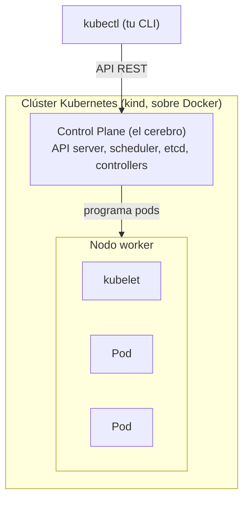
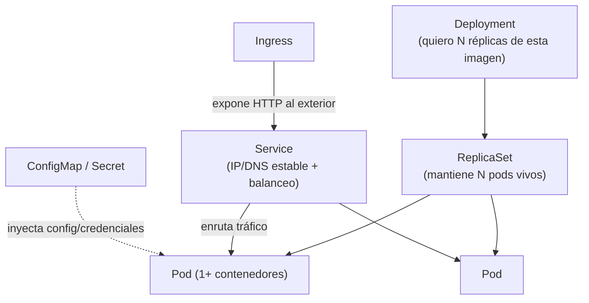
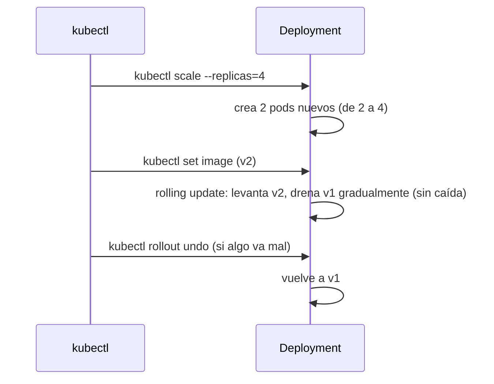

# Nivel 15: Introducción a Kubernetes (con kind)

## 1. De Compose a Kubernetes

Compose orquesta contenedores **en una sola máquina**. Kubernetes (K8s) los orquesta **en un clúster de muchas máquinas**, con autorreparación, escalado (manual y automático), despliegues sin caída (rolling updates), balanceo y descubrimiento de servicios. Aquí damos una **introducción práctica** con **kind** ("Kubernetes IN Docker"), que levanta un clúster real dentro de contenedores Docker en tu portátil.



| Componente del clúster | Rol |
|---|---|
| **API server** | Puerta de entrada; recibe tus `kubectl apply` |
| **etcd** | Base de datos del estado deseado del clúster |
| **scheduler** | Decide en qué nodo va cada Pod |
| **controllers** | Reconcilian estado real → estado deseado |
| **kubelet** | Agente en cada nodo que arranca los contenedores |

---

## 2. Los objetos que necesitas conocer



| Objeto K8s | Análogo Docker/Compose | Para qué |
|---|---|---|
| **Pod** | un contenedor (o grupo acoplado) | Unidad mínima ejecutable; comparte red/almacenamiento |
| **ReplicaSet** | `--scale` | Mantiene N réplicas de un Pod |
| **Deployment** | `restart` + `--scale` + actualización | Gestiona ReplicaSets, rolling updates y rollback |
| **Service** | red + DNS + balanceo | Punto de acceso estable a Pods (que son efímeros) |
| **ConfigMap** | `env_file` / `--env-file` | Configuración no sensible |
| **Secret** | secretos de Compose | Credenciales (base64, no cifrado fuerte por defecto) |
| **Ingress** | reverse proxy | Enrutado HTTP/host hacia Services |
| **Namespace** | proyecto de Compose | Aísla recursos por equipo/entorno |
| **PersistentVolume / Claim** | volumen | Almacenamiento persistente |

### Tipos de Service
| Tipo | Expone | Uso |
|---|---|---|
| `ClusterIP` (por defecto) | Solo dentro del clúster | Comunicación interna |
| `NodePort` | Un puerto en cada nodo | Acceso externo simple (dev/kind) |
| `LoadBalancer` | IP externa (cloud) | Producción en la nube |

---

## 3. El flujo declarativo (vs imperativo de Docker)

A diferencia de `docker run` (imperativo: "haz esto ahora"), en K8s **declaras el estado deseado** en YAML y el clúster trabaja para alcanzarlo y **mantenerlo** (si matas un Pod, lo recrea).

```bash
kind create cluster --name masterclass               # crea el clúster
kind load docker-image mi-app:1.0 --name masterclass # mete tu imagen LOCAL en el clúster
kubectl apply -f deployment.yaml                     # declara el estado deseado
kubectl get pods -w                                  # observa (watch)
kubectl rollout status deployment/mi-app             # espera a que el despliegue esté listo
kubectl get svc                                      # ver el service y su puerto
kubectl logs deploy/mi-app                           # logs
kubectl describe pod <pod>                           # diagnóstico detallado
kubectl delete -f deployment.yaml                    # borrar
kind delete cluster --name masterclass               # destruir el clúster
```
> **kind + imágenes locales**: kind corre en su propio Docker; **no ve** tus imágenes locales automáticamente. Por eso `kind load docker-image` (o un registry) es imprescindible, o el Pod quedará en `ImagePullBackOff`.

---

## 4. Manifiesto mínimo (Deployment + Service)
```yaml
apiVersion: apps/v1
kind: Deployment
metadata:
  name: mi-app
spec:
  replicas: 2
  selector:
    matchLabels: { app: mi-app }
  template:
    metadata:
      labels: { app: mi-app }
    spec:
      containers:
        - name: mi-app
          image: mi-app:1.0
          ports:
            - containerPort: 8080
          readinessProbe:               # ¿listo para tráfico? (como healthcheck)
            httpGet: { path: /health, port: 8080 }
          livenessProbe:                # ¿sigue vivo? si no, reinicia el Pod
            httpGet: { path: /health, port: 8080 }
---
apiVersion: v1
kind: Service
metadata:
  name: mi-app
spec:
  selector: { app: mi-app }
  ports:
    - port: 80
      targetPort: 8080
  type: NodePort
```

> **Probes**: `readinessProbe` (¿recibe tráfico?) y `livenessProbe` (¿reiniciar?) son el equivalente avanzado del HEALTHCHECK de Docker.

---

## 5. Rolling updates, escalado y rollback



```bash
kubectl scale deployment/mi-app --replicas=4
kubectl set image deployment/mi-app mi-app=mi-app:2.0
kubectl rollout status deployment/mi-app
kubectl rollout undo deployment/mi-app        # rollback
```

### ConfigMap y Secret
```bash
kubectl create configmap app-config --from-literal=APP_ENV=prod
kubectl create secret generic db-secret --from-literal=PASSWORD=secret
```
Se inyectan en el Pod como variables de entorno o ficheros montados.

---

## 6. Limitaciones y errores típicos
- **`ImagePullBackOff` en kind**: olvidaste `kind load docker-image` o un registry accesible.
- **Pensar imperativamente**: no borres Pods a mano esperando que "se queden"; el Deployment los recrea. Cambia el Deployment.
- **Olvidar `imagePullPolicy`**: con imágenes locales en kind usa `IfNotPresent` para que no intente bajarlas del registry.
- **Confundir `port` y `targetPort`** en el Service: `port` es el del Service, `targetPort` el del contenedor.
- **Secrets no son cifrado fuerte**: por defecto son base64 en etcd; para secretos serios se añade cifrado en reposo / gestores externos.
- **K8s es complejo**: esto es una introducción; producción real implica RBAC, Ingress, almacenamiento, observabilidad, etc.

> **Regla**: en K8s no tocas pods a mano; cambias el Deployment y el clúster reconcilia. `kind` te da un clúster real para practicar sin coste. El último tema reúne TODO en el Boss Final.
