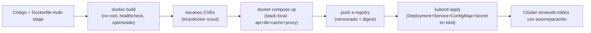
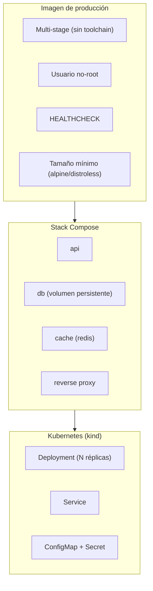
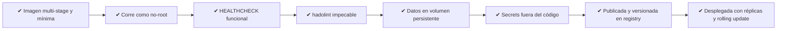
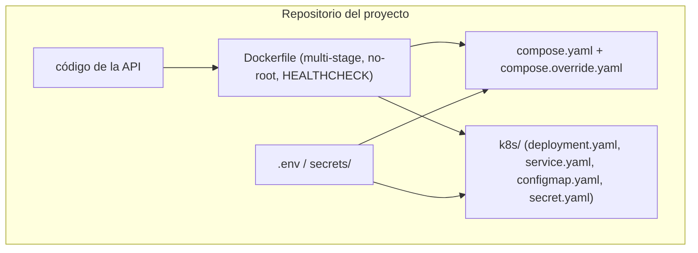

# Nivel 16: El Despliegue Corporativo Total (teoría del Boss Final)

Llegaste al final. Este tema no enseña conceptos nuevos: **integra todos** los que ya dominas en el flujo que vive una aplicación real desde el código hasta producción. Aquí no se aprende una herramienta más, se aprende a **encadenarlas** en una cadena de valor sin eslabones rotos.

---

## 1. El viaje completo de una app (la cadena CI/CD mental)



Cada flecha es una **puerta de calidad** (quality gate): si una etapa falla, no se pasa a la siguiente. Es exactamente lo que hace un pipeline de CI/CD (GitHub Actions, GitLab CI, Jenkins) salvo que aquí lo orquestas tú a mano para **entenderlo**.

| Etapa | Herramienta del bootcamp | Gate (qué bloquea el avance) | Nivel donde se aprendió |
|---|---|---|---|
| Lint del Dockerfile | `hadolint` | Reglas DLxxxx / SCxxxx | 04 |
| Build reproducible | `docker build` + BuildKit | Build falla = no hay imagen | 02, 07 |
| Auditoría de imagen | `container-structure-test` | Metadata/ficheros/comandos incorrectos | (todos) |
| Escaneo de CVEs | `trivy` / `docker scout` | CVEs críticas/altas | 08 |
| Integración local | `docker compose` | Servicios no `healthy` | 12, 13 |
| Distribución | `docker push` a registry | Tag sin versión / sin auth | 14 |
| Orquestación | `kubectl` sobre `kind` | `rollout status` no converge | 15 |

---

## 2. Las piezas que se ensamblan



### La misma imagen, tres contextos
Lo más importante de este diagrama: **es la MISMA imagen** la que corre en tu portátil con `docker run`, en el stack de Compose y en el Pod de Kubernetes. Eso es el corazón de la promesa de Docker: *build once, run anywhere*. Lo único que cambia entre entornos es la **configuración inyectada** (variables, secretos, réplicas), nunca el artefacto.

| Capa | Qué aporta | Qué pasa si falta |
|---|---|---|
| Imagen mínima multi-stage | Arranque rápido, poca superficie de ataque, menos CVEs | Imágenes de 1GB con compiladores y CVEs heredadas |
| No-root | Si comprometen el proceso, no es root del host | Escalada de privilegios trivial |
| HEALTHCHECK / probes | El orquestador sabe cuándo enrutar tráfico y cuándo reiniciar | Tráfico a un Pod que aún arranca → errores 5xx |
| Volumen persistente | Los datos sobreviven al ciclo de vida del contenedor | `down -v` o un crash borra la base de datos |
| Secrets externos | Credenciales fuera de la imagen y del repositorio git | Secreto filtrado en cada `docker pull` y en el historial git |
| Registry versionado | Rollback y trazabilidad por tag/digest | `latest` te impide saber qué corre y volver atrás |

---

## 3. Checklist de "producción de verdad"



### Tabla de auditoría (lo que un revisor senior te exigiría)
| # | Requisito | Cómo se comprueba | Antipatrón que descarta |
|---|---|---|---|
| 1 | Multi-stage sin toolchain | `container-structure-test`: no existe `/usr/bin/gcc`, `go`, `mvn`... | Compilador en la imagen final |
| 2 | Usuario no-root | Metadata test: `user` ≠ `root`/`0` | `USER` ausente (corre como root) |
| 3 | HEALTHCHECK | Inspección del manifiesto / probe en K8s | Sin healthcheck = ceguera del orquestador |
| 4 | Lint limpio | `hadolint Dockerfile` sin warnings | `apt-get` sin `--no-install-recommends`, `latest` pineado mal |
| 5 | Persistencia | Volumen nombrado montado en la ruta de datos | Datos en la capa de escritura del contenedor |
| 6 | Secrets fuera | `Secret`/`--env-file`/secret de Compose | Password hardcodeado en `ENV` o en el código |
| 7 | Versionado | Tag explícito + digest en el registry | `push` de `latest` únicamente |
| 8 | Réplicas + rolling | `replicas: N` y `rollout status` OK | Réplica única, despliegue con caída |

> **Regla de oro**: cada ✔ del checklist corresponde a un nivel del bootcamp. El Boss Final no es un examen nuevo, es la **suma comprobada** de todo lo anterior a la vez.

---

## 4. Anatomía del artefacto final (lo que ensamblas en el ej. 40)



| Fichero | Responsabilidad | Conceptos que integra |
|---|---|---|
| `Dockerfile` | Construir la imagen de producción | multi-stage, BuildKit, no-root, HEALTHCHECK, distroless/alpine |
| `compose.yaml` | Stack local reproducible (prod-like) | servicios, redes, volúmenes, `depends_on: service_healthy` |
| `compose.override.yaml` | Ajustes de desarrollo (bind mounts, hot reload) | fusión automática de overrides |
| `.env` / `secrets/` | Configuración y credenciales fuera del código | `${VAR}`, secretos montados |
| `k8s/*.yaml` | Estado deseado en el clúster | Deployment, Service, ConfigMap, Secret, probes |

---

## 5. El orden de batalla del Boss Final (comandos)

```bash
# 1) Calidad del Dockerfile
docker run --rm -i hadolint/hadolint < Dockerfile

# 2) Build de producción (BuildKit)
DOCKER_BUILDKIT=1 docker build -t masterclass/ej40:1.0 .

# 3) Auditoría de la imagen
container-structure-test test --image masterclass/ej40:1.0 --config tests/40_*.yaml

# 4) Escaneo de vulnerabilidades
docker scout cves masterclass/ej40:1.0     # o: trivy image masterclass/ej40:1.0

# 5) Stack completo en local de extremo a extremo
docker compose up -d --build
curl -f http://localhost:8080/health        # proxy -> api -> db/cache

# 6) Distribución
docker tag masterclass/ej40:1.0 localhost:5000/ej40:1.0
docker push localhost:5000/ej40:1.0

# 7) Orquestación en clúster
kind load docker-image masterclass/ej40:1.0 --name masterclass
kubectl apply -f k8s/
kubectl rollout status deployment/ej40
kubectl get pods,svc
```

> Cada paso es un **gate**: si el `hadolint` ensucia, no compiles "a ver si cuela"; si el escaneo encuentra una CVE crítica, no la subas al registry. La disciplina del orden ES la competencia profesional.

---

## 6. Lo que valida el Boss Final

La suite del ejercicio 40 es la más dura del bootcamp y comprueba **a la vez**:
- **hadolint limpio** sobre el Dockerfile de producción (gate de estilo/seguridad).
- **container-structure-test** exhaustivo: multi-stage (sin compilador), no-root, healthcheck, metadata, puertos expuestos, ficheros esperados.
- **Scripts e2e**: el stack de Compose responde de extremo a extremo (proxy → api → db/cache) y la persistencia sobrevive a un reinicio.
- **Kubernetes**: `kubectl rollout status` exitoso, pods `Running`, Service sirviendo, un `rollout undo` recupera la versión anterior.

---

## 7. Limitaciones y honestidad sobre el "de verdad"

Este bootcamp te lleva de noob a pro en **fundamentos sólidos**, pero producción real a gran escala añade capas que aquí solo se nombran:

- **Esto sigue siendo `kind`**: un clúster de juguete en tu portátil. Producción real usa clústeres gestionados (EKS, GKE, AKS) con múltiples nodos físicos, autoescalado de nodos y alta disponibilidad del control plane.
- **Falta el pipeline automatizado**: aquí encadenas los gates a mano; en una empresa, GitHub Actions / GitLab CI los ejecuta en cada push y bloquea el merge.
- **Observabilidad**: producción exige métricas (Prometheus), trazas (OpenTelemetry) y dashboards (Grafana). El `docker logs` y `kubectl logs` son el primer escalón, no el final.
- **Seguridad avanzada**: RBAC, Network Policies, firma de imágenes (cosign), políticas de admisión (OPA/Kyverno), gestores de secretos (Vault, Sealed Secrets) quedan fuera del temario.
- **Ingress y TLS**: aquí expones con `NodePort`; producción usa Ingress controllers + certificados gestionados (cert-manager).
- **GitOps**: herramientas como ArgoCD/Flux sincronizan el clúster con el repositorio automáticamente; aquí haces `kubectl apply` a mano para entender qué ocurre por debajo.

> **No es debilidad reconocer los límites: es madurez de ingeniero.** Sabes lo que dominas y sabes el nombre de lo que viene después.

---

## 8. Cierre

Si superas el ejercicio 40, has demostrado el ciclo completo de containerización profesional: **build → optimización → seguridad → orquestación local → distribución → orquestación de clúster**. Dominas el artefacto (imagen), el stack (Compose) y el clúster (Kubernetes), y entiendes las puertas de calidad que separan "funciona en mi máquina" de "corre en producción con autorreparación".

**Eso es ser pro en Docker.** 🐳
