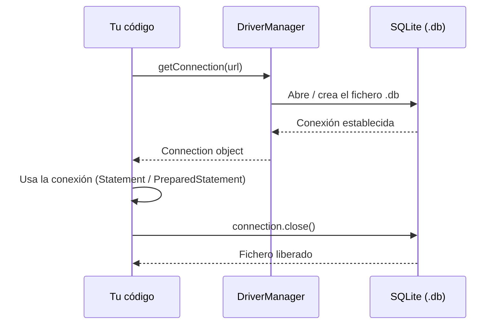
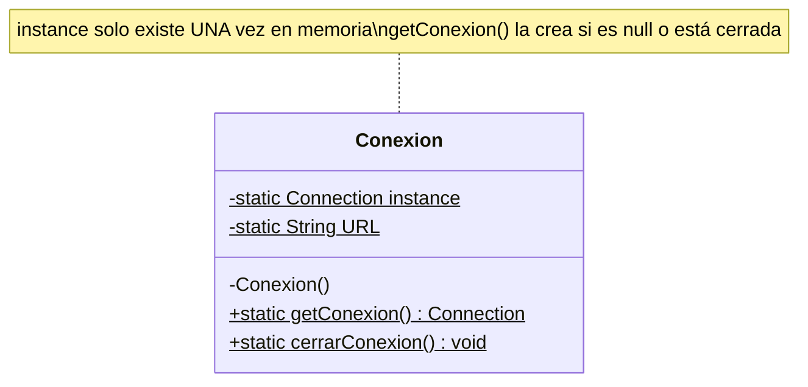
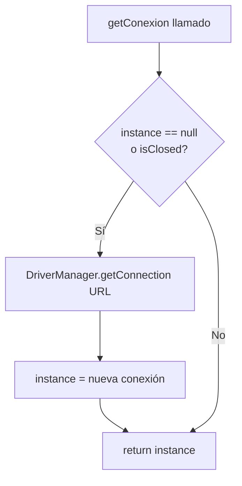
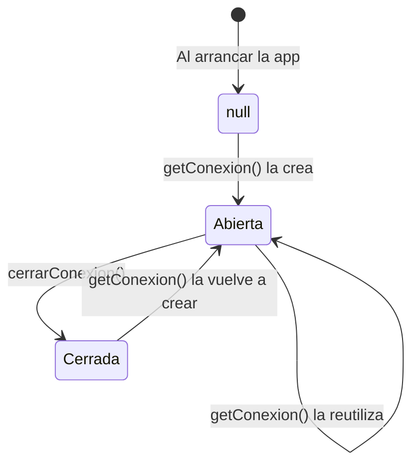

# Nivel 1 — La Conexión: JDBC y el Patrón Singleton

---

## ¿Qué es JDBC?

JDBC (Java Database Connectivity) es la API estándar de Java para hablar con bases de datos relacionales. No importa si es SQLite, MySQL o PostgreSQL — siempre se usa la misma API; solo cambia el **driver** y la **URL de conexión**.

El driver que usamos en este bootcamp es `org.xerial:sqlite-jdbc`, declarado en el `pom.xml`.

---

## La URL de conexión

```
jdbc:sqlite:nombre_del_archivo.db
```

- `jdbc:` → protocolo JDBC
- `sqlite:` → dialecto (qué motor de base de datos)
- `nombre.db` → ruta del archivo físico en disco (SQLite guarda todo en un fichero)

Para bases de datos **en memoria** (solo existen mientras corre el programa, útil para tests):

```
jdbc:sqlite::memory:
```

---

## Ciclo de vida de una conexión JDBC



---

## ¿Por qué el patrón Singleton para la conexión?

Abrir una conexión a la base de datos es **caro** en recursos. Si cada operación abre y cierra su propia conexión, el rendimiento se degrada. El Singleton garantiza que existe **una sola instancia** de la conexión durante toda la vida del programa.

### Diagrama del Singleton en RAM



### Flujo del método `getConexion()`



---

## `try-with-resources` — el cierre automático

En Java, `Statement`, `PreparedStatement` y `ResultSet` implementan `AutoCloseable`. Esto permite usar la sintaxis `try(...)` que **cierra automáticamente** el recurso al salir del bloque, haya excepción o no.

```java
// Sin try-with-resources (hay que cerrar a mano, riesgo de leak)
Statement stmt = conn.createStatement();
stmt.execute(sql);
stmt.close(); // ¿qué pasa si execute() lanza excepción antes de llegar aquí?

// Con try-with-resources (siempre se cierra)
try (Statement stmt = conn.createStatement()) {
    stmt.execute(sql);
} // stmt.close() se llama aquí automáticamente
```

> **Nota:** La `Connection` en este bootcamp NO se cierra con try-with-resources porque es un Singleton — vive durante toda la ejecución. Solo se cierra al final con `cerrarConexion()`.

---

## `Statement` vs `PreparedStatement`

| | `Statement` | `PreparedStatement` |
|---|---|---|
| Uso | Queries estáticas (no reciben parámetros externos) | Queries con parámetros (`?`) |
| SQL Injection | Vulnerable | Protegido |
| Cuándo usarlo | `CREATE TABLE`, `DROP TABLE` | Todo INSERT / SELECT / UPDATE / DELETE |

---

## Métodos clave de `Statement`

```java
stmt.execute(sql);        // DDL: CREATE TABLE, DROP TABLE — devuelve boolean
stmt.executeUpdate(sql);  // DML sin parámetros: devuelve filas afectadas (int)
stmt.executeQuery(sql);   // SELECT sin parámetros: devuelve ResultSet
```

---

## Diagrama de estado de la conexión



---

## Resumen en una frase

> **Abre la conexión una vez (Singleton), úsala con try-with-resources en cada operación, ciérrala solo al terminar el programa.**

---

## Ejercicios de este nivel

| Ej | Lo que practicas |
|---|---|
| 01 | Abrir una conexión cruda sin Singleton |
| 02 | Construir el Singleton completo |
| 03 | Usar try-with-resources con Statement |
| 04 | Crear una tabla con `CREATE TABLE IF NOT EXISTS` |
| 05 | Cerrar la conexión de forma segura |
| 06 | Verificar el estado antes de reutilizar |
| 07 | Crear dos tablas desde el mismo Singleton |
| 08 | Hacer DROP + recrear tabla |
