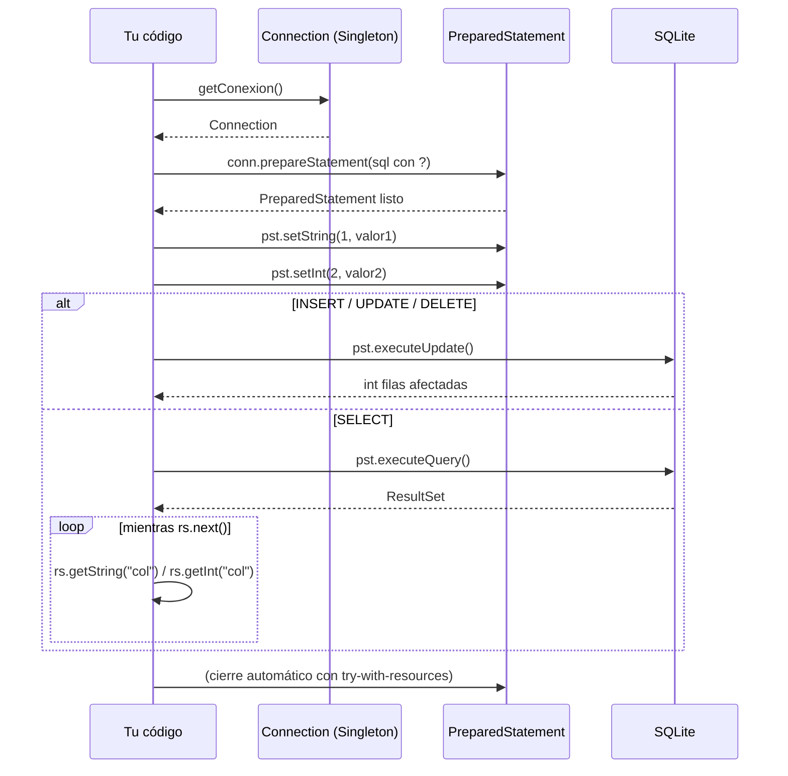
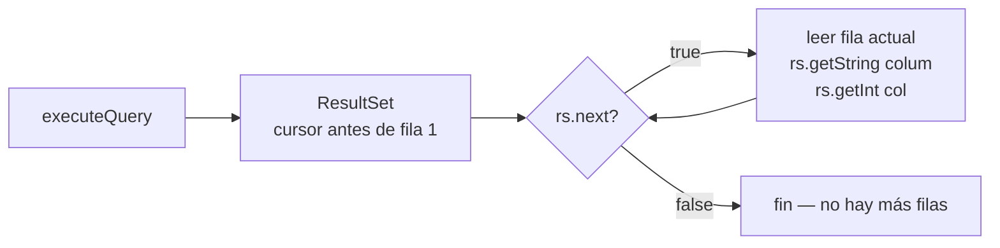
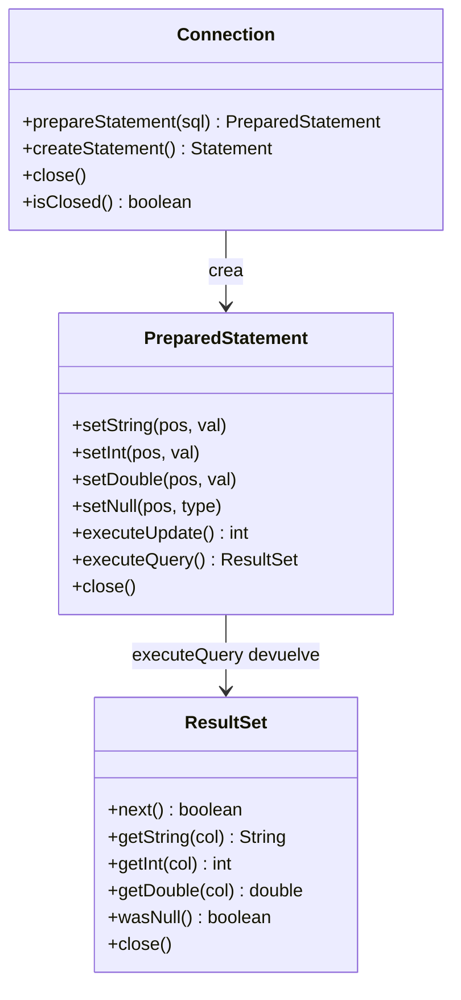
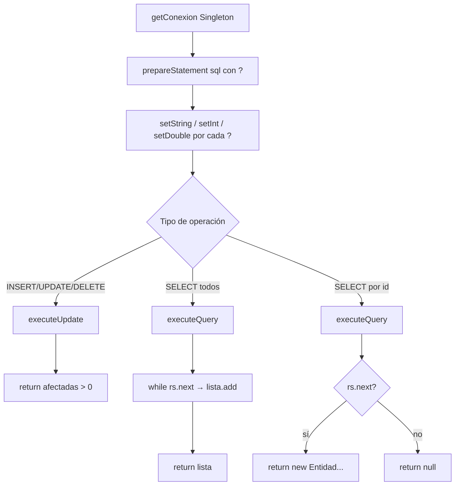

# Nivel 2 — PreparedStatement y ResultSet: el CRUD completo

---

## ¿Por qué PreparedStatement y no Statement?

`Statement` ejecuta SQL en crudo. Si construyes la query concatenando strings del usuario, eres vulnerable a **SQL Injection**. `PreparedStatement` separa la query de los datos: primero defines la estructura con `?` como marcadores, luego bind cada valor con `set*()`. El driver se encarga de escapar todo.

```java
// MAL — vulnerable a SQL Injection
String sql = "SELECT * FROM Usuarios WHERE nombre = '" + nombre + "'";
stmt.executeQuery(sql);

// BIEN — PreparedStatement
String sql = "SELECT * FROM Usuarios WHERE nombre = ?";
PreparedStatement pst = conn.prepareStatement(sql);
pst.setString(1, nombre);
pst.executeQuery();
```

---

## Flujo completo de una operación CRUD



---

## Métodos de bind — setXxx(posición, valor)

Los índices empiezan en **1**, no en 0.

| Tipo Java | Método PreparedStatement |
|---|---|
| `String` | `pst.setString(pos, valor)` |
| `int` | `pst.setInt(pos, valor)` |
| `double` | `pst.setDouble(pos, valor)` |
| `boolean` | `pst.setBoolean(pos, valor)` |
| `null` | `pst.setNull(pos, Types.VARCHAR)` |

---

## executeUpdate() vs executeQuery()

| Método | Cuándo usarlo | Devuelve |
|---|---|---|
| `executeUpdate()` | INSERT, UPDATE, DELETE | `int` — filas afectadas |
| `executeQuery()` | SELECT | `ResultSet` |
| `execute()` | DDL (CREATE, DROP) | `boolean` |

**Patrón boolean de insert/update/delete:**
```java
int afectadas = pst.executeUpdate();
return afectadas > 0;  // true si se modificó algo, false si no
```

---

## ResultSet — navegando el resultado de un SELECT



### SELECT todos → List

```java
List<Entidad> lista = new ArrayList<>();
while (rs.next()) {
    Entidad e = new Entidad(
        rs.getInt("id"),
        rs.getString("nombre")
    );
    lista.add(e);
}
return lista;
```

### SELECT por id → objeto o null

```java
if (rs.next()) {
    return new Entidad(rs.getInt("id"), rs.getString("nombre"));
}
return null;  // no encontrado
```

---

## Valores NULL en ResultSet

SQLite puede almacenar NULL en cualquier columna. Tras leer un valor con `rs.getInt()` o `rs.getString()`, usa `rs.wasNull()` para saber si el valor en base de datos era NULL.

```java
int valor = rs.getInt("campo_opcional");
if (rs.wasNull()) {
    // el campo era NULL en base de datos
}
```

---

## Diagrama de clases: la relación entre los objetos JDBC



---

## Resumen del patrón en una sola vista



---

## Ejercicios de este nivel

| Ej | Lo que practicas |
|---|---|
| 09 | INSERT con `setString` + `executeUpdate` |
| 10 | INSERT con tipos mixtos (`setInt`, `setDouble`) |
| 11 | INSERT que devuelve boolean con `afectadas > 0` |
| 12 | SELECT todos → `while(rs.next())` → `List<Entidad>` |
| 13 | SELECT por id → `if(rs.next())` → objeto o null |
| 14 | UPDATE con PreparedStatement → boolean |
| 15 | DELETE con PreparedStatement → boolean |
| 16 | Navegar ResultSet con todos los tipos de `get*()` |
| 17 | Detectar NULL con `rs.wasNull()` |
| 18 | Loop de inserts múltiples + conteo de éxitos |
