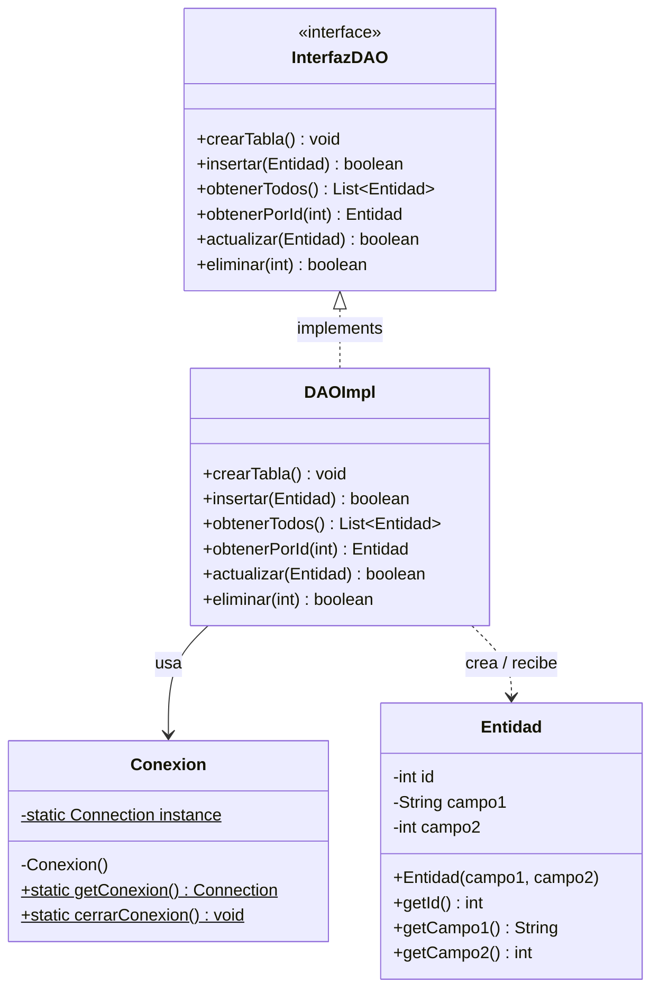
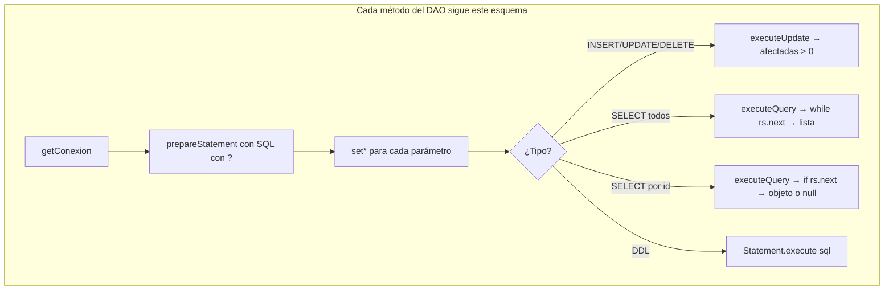
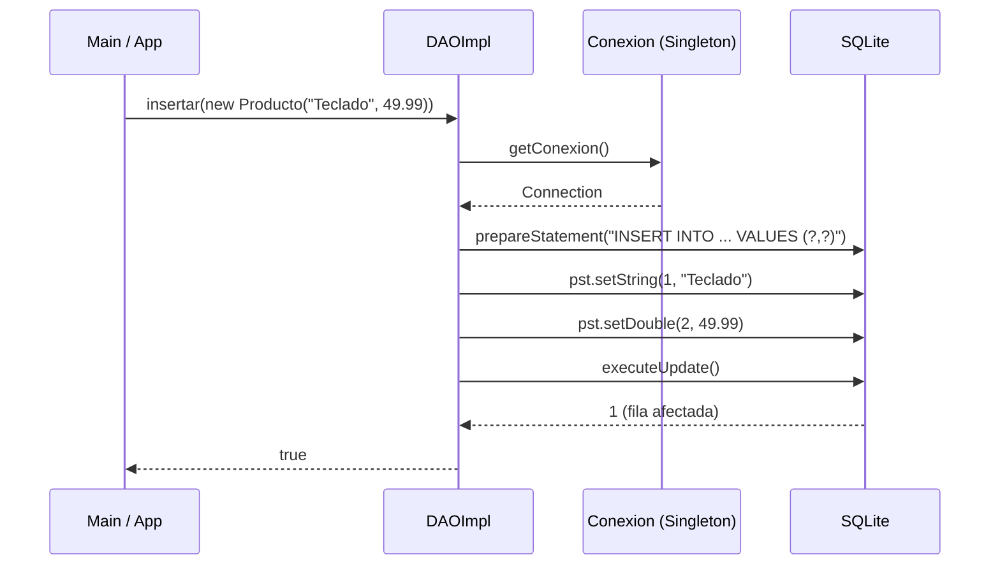
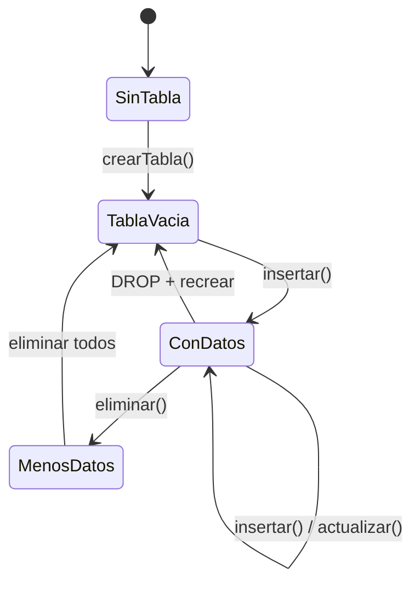

# Nivel 3 — El Patrón DAO Completo

---

## ¿Qué problema resuelve el patrón DAO?

Sin DAO, cada vez que necesitas acceder a la base de datos escribes SQL mezclado con lógica de negocio. El código queda acoplado, difícil de cambiar y de testear.

**DAO (Data Access Object)** separa completamente la lógica de acceso a datos del resto del programa. La regla es simple:

> Todo lo que toca SQL va dentro del DAO. El resto del código no sabe que existe una base de datos.

---

## Los tres elementos del patrón



---

## La Entidad — POJO puro

La entidad es un simple contenedor de datos. No tiene lógica, no sabe nada de la BD. Solo:
- Atributos privados
- Constructor con los campos sin `id` (el id lo asigna la BD con AUTOINCREMENT)
- Solo **getters** — sin setters (inmutable por diseño)

```java
public class Producto {
    private int id;
    private String nombre;
    private double precio;

    public Producto(String nombre, double precio) {
        this.nombre = nombre;
        this.precio = precio;
    }

    public int getId()       { return id; }
    public String getNombre(){ return nombre; }
    public double getPrecio(){ return precio; }
}
```

> ¿Por qué sin setters? Una vez construido el objeto, sus datos no deberían cambiar desde fuera. Si quieres "actualizar" un producto, creas uno nuevo con los datos modificados y llamas al DAO.

---

## La Interfaz DAO — el contrato

Define QUÉ puede hacer el DAO, sin decir CÓMO. Esto permite cambiar la implementación (SQLite → MySQL) sin tocar el resto del código.

```java
public interface IProductoDAO {
    void crearTabla() throws SQLException;
    boolean insertar(Producto p) throws SQLException;
    List<Producto> obtenerTodos() throws SQLException;
    Producto obtenerPorId(int id) throws SQLException;
    boolean actualizar(Producto p) throws SQLException;
    boolean eliminar(int id) throws SQLException;
}
```

---

## La Implementación DAO — el cuerpo

Implementa cada método de la interfaz usando PreparedStatement y el Singleton de Conexion.



---

## Flujo completo de una llamada



---

## Diagrama de estado de la tabla gestionada por el DAO



---

## Estructura de archivos en el examen

Cuando te entreguen el proyecto en el examen, lo que vas a construir es:

```
MiEntidad.java          ← POJO (5 min)
IMiEntidadDAO.java      ← interface con 6 firmas (3 min)
MiEntidadDAO.java       ← implementación con Singleton (15 min)
Conexion.java           ← Singleton ya conocido (2 min)
Main.java               ← demo de uso
```

Total estimado sabiendo la lógica: **25 minutos**.

---

## El SpeedRun — cómo practicar para el examen

El ejercicio 27 simula exactamente la presión del examen:
1. Tienes una entidad nueva que no has visto antes
2. Sin plantilla, sin andamiaje previo
3. Construyes Entidad + Conexión + DAO completo desde cero
4. Los tests confirman que todo funciona

Si lo completas, el examen es **sota, caballo y rey**.

---

## Ejercicios de este nivel

| Ej | Lo que practicas |
|---|---|
| 19 | Entidad POJO: atributos privados, constructor, solo getters |
| 20 | Interfaz DAO: definir las 6 firmas del contrato |
| 21 | DAO impl: `crearTabla()` con Statement |
| 22 | DAO impl: `insertar(Entidad)` → boolean |
| 23 | DAO impl: `obtenerTodos()` → `List<Entidad>` |
| 24 | DAO impl: `obtenerPorId(int)` → objeto o null |
| 25 | DAO impl: `actualizar(Entidad)` → boolean |
| 26 | DAO impl: `eliminar(int)` → boolean |
| 27 | SpeedRun: Entidad + Singleton + DAO completo desde cero |
