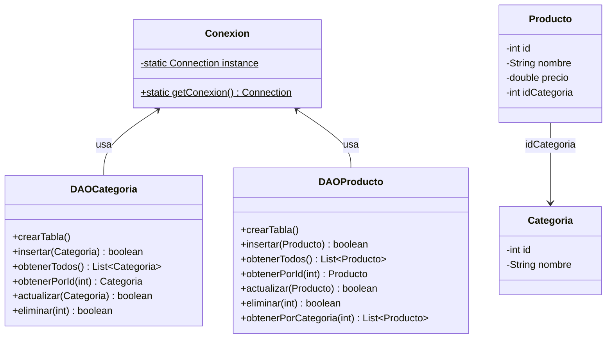
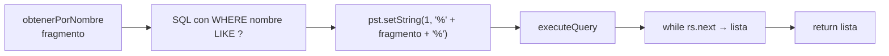
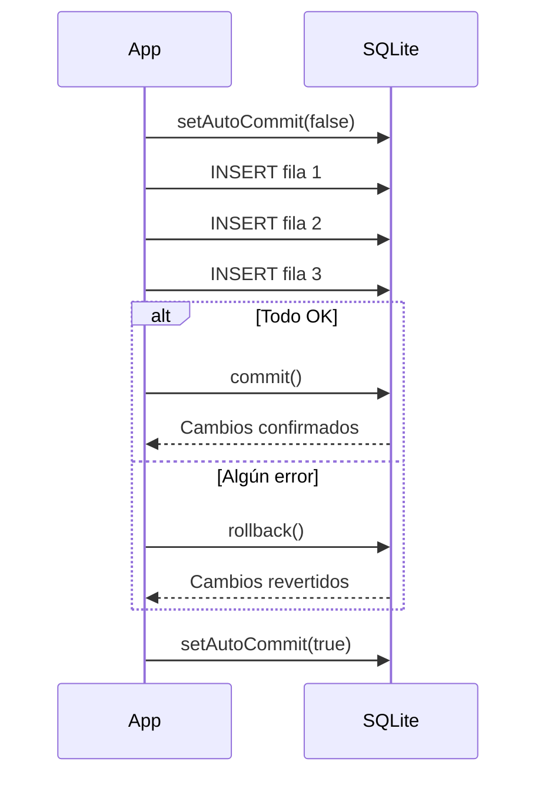
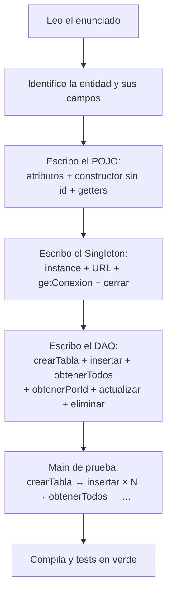

# Nivel 4 — Integración y Escenarios Reales

---

## De un DAO a un sistema con dos entidades relacionadas

Los ejercicios anteriores trabajaron con una sola entidad. En la realidad (y en el examen) aparecen dos entidades donde una referencia a la otra mediante un campo `id_xxx`. El Singleton de Conexion garantiza que ambos DAOs comparten la misma conexión sin abrirla dos veces.



---

## Consultas filtradas con LIKE y WHERE

Cuando la query lleva un filtro dinámico, sigue siendo PreparedStatement — solo cambia el valor del `?`.



---

## Consultas ordenadas con ORDER BY

`ORDER BY` va en el SQL estático — no en los parámetros. El `?` solo sirve para valores de datos, no para nombres de columnas ni palabras clave SQL.

```java
// BIEN
String sql = "SELECT * FROM Productos ORDER BY precio ASC";

// MAL — ORDER BY no puede ir como parámetro
String sql = "SELECT * FROM Productos ORDER BY ?";  // no funciona
```

---

## Transacciones: autoCommit, commit y rollback

Por defecto SQLite confirma cada sentencia al instante (`autoCommit = true`). Para agrupar varias operaciones en una sola unidad atómica (todo o nada):



Patrón en código:

```java
Connection conn = Conexion.getConexion();
conn.setAutoCommit(false);
try {
    dao.insertar(obj1);
    dao.insertar(obj2);
    conn.commit();
} catch (SQLException e) {
    conn.rollback();
    throw e;
} finally {
    conn.setAutoCommit(true);
}
```

---

## Manejo de errores en DAO

Cada método del DAO propaga `SQLException`. El llamador decide si la captura o la re-lanza. Lo que SÍ debe hacer el DAO internamente es imprimir mensajes útiles antes de relanzar:

```java
public boolean insertar(Entidad e) throws SQLException {
    try (PreparedStatement pst = ...) {
        // lógica
    } catch (SQLException ex) {
        System.err.println("Error al insertar " + e.getNombre() + ": " + ex.getMessage());
        throw ex;  // re-lanza para que el llamador también lo gestione
    }
}
```

---

## SpeedRun de examen — el flujo mental



---

## El Boss Final — sin red de seguridad

El Boss Final simula el examen real:
- Dos entidades nuevas que no has visto
- Sin plantilla, sin código base
- Construyes Conexion + dos DAOs + Main desde cero
- La suite de tests es la más extensa del bootcamp

Si llegas aquí y lo resuelves, el examen es **sota, caballo y rey**.

---

## Ejercicios de este nivel

| Ej | Lo que practicas |
|---|---|
| 28 | Dos entidades relacionadas — dos DAOs, una sola Conexion |
| 29 | `WHERE nombre LIKE ?` — consultas filtradas |
| 30 | `ORDER BY campo ASC/DESC` — consultas ordenadas |
| 31 | `setAutoCommit(false)` + `commit()` + `rollback()` |
| 32 | `try/catch SQLException` con mensaje + re-lanzar |
| 33 | SpeedRun de examen — Entidad + Singleton + DAO completo contrarreloj |
| Boss | Sistema Productos + Categorías — dos DAOs completos desde cero |
