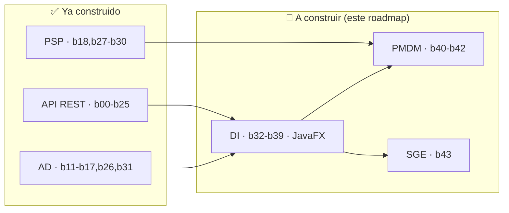

# ROADMAP DE CONSTRUCCIÓN · Completar la Masterclass para cubrir TODO 2º DAM

> **Qué es este archivo:** la especificación para **construir** (buildear) los bloques que
> aún faltan en `11_APIRESTMasterclass`, hasta cubrir **los cinco módulos técnicos de 2º DAM**.
> Está escrito para entregarse a un agente (skill `mejorar-bloque` / `Prompt_Generador_Masterclass`):
> cada bloque trae módulo·RA, tabla de ejercicios, anatomía exacta (10 TODOs + retos extra con
> guía + test espejo) y esquema de teoría, con el detalle para construirlo con **la misma
> profundidad** que `b00`/`b01`.
>
> **Qué NO es:** no es la ruta de estudio. Para "en qué orden estudiar" ver
> [RUTA_ESTUDIO_2DAM.md](RUTA_ESTUDIO_2DAM.md). El índice del proyecto está en [SYLLABUS.md](SYLLABUS.md).

---

## 0. Estado de cobertura por módulo de 2º DAM

La masterclass nació como bootcamp de **API REST con Java 21 + Spring Boot**. Sobre esa base
se amplió para cubrir el BOE de 2º DAM. Estado actual y objetivo de este roadmap:

| Módulo de 2º DAM | Tecnología natural en este proyecto | Estado | Bloques |
|---|---|---|---|
| **0486 Acceso a Datos (AD)** | JDBC / JPA / Mongo / ficheros | ✅ **Completo** | b11–b17, **b26**, **b31** |
| **0490 Prog. Servicios y Procesos (PSP)** | Hilos / procesos / sockets / cripto / REST | ✅ **Completo** | b18, **b27**–**b30** + toda la API |
| **0487 Desarrollo de Interfaces (DI)** | **JavaFX** | ❌ **A construir** | **b32–b39** *(este roadmap)* |
| **0488 Prog. Multimedia y Móvil (PMDM)** | JavaFX Media / Canvas / Android | ❌ **A construir** | **b40–b42** *(este roadmap)* |
| **0489 Sistemas de Gestión Empresarial (SGE)** | Integración ERP/CRM (Odoo) | ❌ **A construir (opcional)** | **b43** *(este roadmap)* |
| 0491 Empresa e Iniciativa Emprendedora | (no es de programación) | ⛔ Fuera de alcance | — |
| 0492 Proyecto / 0493 FCT | El proyecto entero sirve de base | ✅ Indirecto | b24 Boss Final |

> **Nota de honestidad sobre el BOE.** El PDF del repo (`BOE-A-2023-13221`) solo redacta los
> módulos **0486** y **0490** (es una modificación parcial del título). Las RA de DI, PMDM y SGE
> que se citan abajo provienen del currículo del título DAM (RD 450/2010 y desarrollos
> autonómicos); se mapean fielmente, pero si tu comunidad numera las RA distinto, ajusta el
> mapeo manteniendo los criterios.

**Objetivo de este roadmap:** especificar **12 bloques nuevos** (`b32`–`b43`, ejercicios
255–336) que cierran DI, PMDM y SGE. Tras construirlos, el proyecto cubre **los 5 módulos
técnicos de 2º DAM** y queda **finalizado** (b00–b43, 336 ejercicios).



---

## 1. Convenciones obligatorias (heredadas de b00/b01) — válidas para TODOS los bloques

Un agente que cree un bloque DEBE replicar exactamente esta anatomía, verificada en
`b01_java/.../Ej013StreamsBasics.java` y su test espejo. **Es el estándar de calidad mínimo
de la skill `mejorar-bloque`.**

### 1.1 Anatomía de cada clase de ejercicio
- Paquete `com.masterclass.api.bNN_nombre`. Clase `public final`, **constructor privado**,
  todos los métodos `static` (salvo excepción JavaFX, ver §1.6).
- Javadoc de clase con referencia a la sección de teoría: `Teoría: {@code teoria/NN_*.md} (sección X.Y)`.
- **2–3 métodos "core"** que reparten **exactamente 10 TODOs numerados** (`// TODO 1:` … `// TODO 10:`),
  granulares (validación, casos límite, pasos del algoritmo, retorno). Devuelven un **valor
  centinela** que hace fallar el test hasta implementarlo (`-1`, `List.of()`, `null`, `""`).
- Un `main(String[] args)` corto que demuestra los métodos core (sirve de Playground).
- **10 "Retos Extra"** (`retoExtra01`…`retoExtra10`): cada uno con javadoc, un comentario
  `// GUÍA:` extenso (pista conceptual + snippet + trampa del test, estilo pedagógico de `Ej013`)
  y cuerpo `throw new UnsupportedOperationException("TODO: Implementar la lógica del reto extra para <metodo>");`.
  Los retos NO son TODOs genéricos: cada GUÍA es una **guía paso a paso** (qué API usar, en qué
  orden, qué error típico evita el test).

### 1.2 Test espejo (`src/test/.../EjNNNxxxTest.java`)
- Un `@Test` por método core (con casos límite reales) + 10 `@Test` `retoExtraNN_<metodo>`.
- JUnit 5 (`org.junit.jupiter`), asserts estáticos. Los tests nacen **en rojo** (centinela /
  excepción) y se ponen verdes al implementar. Para asincronía/UI usar `assertTimeout`,
  `CountDownLatch.await(timeout)`, `WaitForAsyncUtils` (TestFX) o latches; **nunca** `Thread.sleep`
  ni `Platform.runLater` sin esperar.

### 1.3 Teoría (`teoria/NN_Nombre.md`)
- Cabecera con cita motivadora ("vienes de…, esto te falta…").
- Sección "Cómo usar este documento" + tabla `| Sección | Tema | Ejercicio |`.
- Una sección `## N.M` por ejercicio, con prosa, bloques de código, **diagramas Mermaid**
  (`classDiagram`, `sequenceDiagram`, `stateDiagram-v2`, `flowchart`) y recuadro final
  **"Lo practicas en `EjNNN…`"**.

### 1.4 Alta como módulo Maven
- Carpeta `bNN_nombre/` con su `pom.xml` propio (copiar el de un bloque hermano; cambiar
  `artifactId` y añadir dependencias del bloque). `src/main` y `src/test` espejo.
- **No** hace falta declarar nada a mano: `bloque.py` autodetecta cualquier carpeta `^b\d{2}_` con `pom.xml`.
- Añadir el módulo a `<modules>` del `pom.xml` raíz solo al compilar todo (`python bloque.py todos`).
- Registrar el bloque en `SYLLABUS.md` (tabla de rangos + tabla detallada + checklist).

### 1.5 Estilo
- Todo en **castellano**, comentarios incluidos. Codificación UTF-8. Nombres de método en
  español (`facturaFormateada`, `validarFormularioCliente`).

### 1.6 Addendum JavaFX/UI (bloques b32–b42) — testabilidad determinista
JavaFX rompe dos supuestos del resto del proyecto: necesita un *toolkit* inicializado y no todo
es `static`. Reglas para mantener la filosofía "rojo→verde" sin pantalla:

- **Separar lógica de pintado.** El método core SIEMPRE es lógica pura y headless-testable:
  conversores, validadores, *bindings* calculados, estado de un *ViewModel*, formateadores,
  modelo de datos de un informe. Eso se prueba con JUnit puro, sin abrir ventana.
- **El `main`/Playground** sí monta la UI real (extiende `Application`, `launch(args)`): es el
  escaparate visual que el alumno ejecuta con *Run*.
- **Toolkit en tests:** para lo que sí toca nodos/propiedades JavaFX, inicializar el toolkit una
  vez (`new JFXPanel()` o una `@BeforeAll` con `Platform.startup`), y para *smoke* de UI usar
  **TestFX + Monocle headless** (`-Dtestfx.headless=true -Dglass.platform=Monocle -Dprism.order=sw`).
- **pom.xml JavaFX (base para b32–b42):** sobre el pom de un bloque hermano añadir:
  ```xml
  <properties><javafx.version>21.0.4</javafx.version></properties>
  <dependencies>
    <dependency><groupId>org.openjfx</groupId><artifactId>javafx-controls</artifactId><version>${javafx.version}</version></dependency>
    <dependency><groupId>org.openjfx</groupId><artifactId>javafx-fxml</artifactId><version>${javafx.version}</version></dependency>
    <!-- test headless -->
    <dependency><groupId>org.testfx</groupId><artifactId>testfx-junit5</artifactId><version>4.0.18</version><scope>test</scope></dependency>
    <dependency><groupId>org.testfx</groupId><artifactId>openjfx-monocle</artifactId><version>21.0.2</version><scope>test</scope></dependency>
  </dependencies>
  <!-- plugin org.openjfx:javafx-maven-plugin para `mvn javafx:run` -->
  ```
- **Regla de oro JavaFX:** si un `@Test` necesita una pantalla real para pasar, está mal
  diseñado. Empuja la lógica al ViewModel y deja la vista como cascarón.

---

## 2. Plan de bloques nuevos (resumen y prioridad)

| Nuevo | Carpeta | Tema | Módulo·RA | Ejercicios | Nº | Prioridad |
|---|---|---|---|---|---|---|
| **B32** | `b32_fxbase` | JavaFX: app, escena, *scene graph*, layouts | DI·RA1 | 255–262 | 8 | **Máxima** |
| **B33** | `b33_fxcontrols` | Controles + Properties + Binding observable | DI·RA1/RA2 | 263–270 | 8 | **Máxima** |
| **B34** | `b34_fxfxml` | FXML + Scene Builder + MVC/MVVM + eventos | DI·RA1 | 271–278 | 8 | Alta |
| **B35** | `b35_fxdata` | Colecciones observables, TableView, Task/Service, REST/JPA | DI·RA2/RA4 | 279–286 | 8 | Alta |
| **B36** | `b36_fxstyle` | CSS, usabilidad, accesibilidad, i18n | DI·RA3 | 287–292 | 6 | Media |
| **B37** | `b37_fxcustom` | Controles personalizados, Canvas, Charts | DI·RA2 | 293–298 | 6 | Media |
| **B38** | `b38_fxreports` | Informes (JasperReports) + PDF + impresión | DI·RA4 | 299–304 | 6 | Media |
| **B39** | `b39_fxdeploy` | Documentación, ayuda, i18n, `jpackage`/instaladores | DI·RA5/RA6 | 305–310 | 6 | Media |
| **B40** | `b40_media` | Multimedia: imagen, audio, vídeo en Java/JavaFX | PMDM·RA1/RA2 | 311–318 | 8 | Alta |
| **B41** | `b41_anim` | Animación, *game loop*, juego 2D en Canvas | PMDM·RA2/RA5 | 319–324 | 6 | Media |
| **B42** | `b42_mobile` | Móvil/Android: entorno, ciclo de vida, sensores | PMDM·RA3/RA4/RA6 | 325–330 | 6 | Media (parcial "guion") |
| **B43** | `b43_erp` | Integración ERP/CRM, ETL, BI (Odoo) | SGE·RA4/RA5/RA6 | 331–336 | 6 | **Opcional (baja)** |

**Total nuevo:** 12 bloques · 82 ejercicios (255–336). **Proyecto final:** b00–b43 · **336 ejercicios**.

**Orden de construcción recomendado:** `b32 → b33 → b34 → b35 → b36 → b37 → b38 → b39`
(DI completo y en orden, porque cada bloque usa el anterior) → `b40 → b41 → b42` (PMDM)
→ `b43` (SGE, opcional). **Empezamos por `b32`.**

---

# MÓDULO 0487 · DESARROLLO DE INTERFACES (DI) — JavaFX · b32–b39

> **Tecnología:** JavaFX 21 (no Swing). Es la opción moderna, declarativa (FXML), con
> *properties/binding* y CSS, y encaja con un proyecto Java 21 + Maven.
> **Puente con lo ya hecho:** la API REST (b05) y JPA (b12) son el *backend*; aquí construyes
> el **cliente de escritorio** que lo consume. DI = "ponerle cara a la API".
>
> **RA cubiertas (módulo 0487):** RA1 (genera GUI con herramientas), RA2 (crea componentes
> visuales), RA3 (usabilidad/accesibilidad), RA4 (informes), RA5 (documentación), RA6
> (distribución/internacionalización/instaladores).

## B32 · `b32_fxbase` — JavaFX: aplicación, escena y layouts (DI·RA1) · PRIORIDAD MÁXIMA

**Cubre RA1:** ciclo de vida de una app JavaFX, jerarquía `Stage`→`Scene`→*scene graph*,
contenedores de disposición (*layout panes*) y posicionamiento. Es el "Hola mundo" estructural
del módulo: sin esto no hay interfaz.

**pom.xml:** base JavaFX (§1.6). **Teoría:** `teoria/32_JavaFX_Base.md`.

| # | Archivo | Concepto clave |
|---|---|---|
| 255 | `Ej255AppLifecycle.java` | `Application`, `init`/`start`/`stop`, `Stage`, `launch` |
| 256 | `Ej256SceneGraph.java` | Árbol de nodos: `Parent`/`Node`, raíz, recorrer/buscar por `id` |
| 257 | `Ej257StageWindow.java` | `Stage`: título, tamaño, modalidad, `Stage` secundarios |
| 258 | `Ej258LayoutBoxes.java` | `VBox`/`HBox`: spacing, padding, `setMargin`, `Priority.ALWAYS` |
| 259 | `Ej259BorderGridPane.java` | `BorderPane` (5 zonas) y `GridPane` (filas/columnas, `colspan`) |
| 260 | `Ej260StackAnchorFlow.java` | `StackPane`, `AnchorPane`, `FlowPane`, `TilePane` |
| 261 | `Ej261SizingAndBounds.java` | pref/min/max size, `Insets`, *bounds*, *resizable* |
| 262 | `Ej262SceneSwitching.java` | Cambiar de escena/vista, raíz dinámica, navegación |

**Detalle por ejercicio** (core = 10 TODOs; retos = guía paso a paso):
- **255:** core `construirRaiz()` → devuelve un `Parent` con N nodos (testeable headless), y
  `contarNodos(Parent)`. TODOs: validar args, crear contenedor, añadir hijos, asignar `id`,
  devolver. El Playground extiende `Application` y hace `launch`. Retos: orden de `init`→`start`,
  parámetros `getParameters()`, `Platform.exit()`, varias `Stage`, `stop()` liberando recursos…
- **256:** core `buscarPorId(Parent, id)` (recorrido del árbol) y `profundidadArbol(Parent)`.
  Retos: `lookup("#id")`, `getChildrenUnmodifiable`, *managed* vs *visible*, *z-order*…
- **258/259/260:** cada layout con un core que **calcula** la disposición esperada (p.ej.
  número de hijos en una fila del `GridPane`, o el `Priority` resultante) — assertable sin pintar.
- **262:** core `cambiarRaiz(Scene, Parent)` y un mini-router de vistas por nombre (enlaza con
  b34 FXML y prepara navegación multi-pantalla).

**Teoría — secciones:** `classDiagram` de `Application`→`Stage`→`Scene`→`Parent`/`Node`;
`stateDiagram-v2` del ciclo de vida (`init`→`start`→running→`stop`); tabla comparativa de
*layout panes* (cuándo usar cada uno); diagrama del *scene graph* como árbol. Recuadro
"un `Stage` es la ventana del SO; la `Scene` su contenido; el resto, un árbol de nodos".

---

## B33 · `b33_fxcontrols` — Controles, Properties y Binding (DI·RA1/RA2) · PRIORIDAD MÁXIMA

**Cubre RA1/RA2:** controles estándar y, sobre todo, el **modelo reactivo de JavaFX**:
`Property`/`ObservableValue`, *binding* uni/bidireccional y `Bindings`. Es el concepto que más
diferencia a JavaFX de Swing y el que sostiene los bloques siguientes.

**pom.xml:** base JavaFX. **Teoría:** `teoria/33_JavaFX_Controles_Binding.md`.

| # | Archivo | Concepto clave |
|---|---|---|
| 263 | `Ej263BasicControls.java` | `Label`, `Button`, `TextField`, `PasswordField`, `CheckBox`, `RadioButton` |
| 264 | `Ej264ChoiceComboPicker.java` | `ChoiceBox`, `ComboBox`, `DatePicker`, `Spinner`, `Slider` |
| 265 | `Ej265PropertiesBasics.java` | `StringProperty`/`IntegerProperty`, `get/set/addListener` |
| 266 | `Ej266UnidirectionalBinding.java` | `bind()`, `ObservableValue`, recálculo automático |
| 267 | `Ej267BidirectionalBinding.java` | `bindBidirectional`, sincronizar dos controles |
| 268 | `Ej268BindingsExpressions.java` | `Bindings.when/concat/createStringBinding`, *fluent* |
| 269 | `Ej269Converters.java` | `StringConverter`, formateo/parsing en controles |
| 270 | `Ej270FormValidationLive.java` | Validación reactiva: habilitar botón según estado del form |

**Detalle:**
- **265:** core `crearPropiedadObservada()` que registra cambios en una lista (assert sobre
  los cambios recibidos) y `contarNotificaciones(...)`. Retos: `InvalidationListener` vs
  `ChangeListener`, *lazy* vs *eager*, `getValue` null-safety, *property* en un POJO…
- **266/267:** core `total = precio.multiply(cantidad)` con `IntegerBinding`; assert que al
  cambiar `cantidad` cambia `total` sin recalcular a mano. **267:** dos `StringProperty`
  enlazadas bidireccionalmente; cambiar una refleja en la otra.
- **268:** core `etiquetaEstado(saldo)` con `Bindings.when(saldo.lessThan(0)).then("Rojo").otherwise("OK")`.
- **269:** core `StringConverter<LocalDate>` para un `DatePicker` (formato dd/MM/yyyy); test de
  ida y vuelta texto↔objeto. **270:** ViewModel de login: `botonHabilitado` *bindeado* a
  `usuario.isNotEmpty().and(pass.length().greaterThan(7))` — **100% testeable sin UI**.

**Teoría:** `flowchart` de la cadena reactiva (cambia *property* → *binding* recalcula → UI se
repinta); tabla `bind` vs `bindBidirectional` vs listener; sección "por qué nunca actualizas la
UI a mano en JavaFX"; `classDiagram` `Observable`→`ObservableValue`→`Property`. Enlaza con
b01·Ej017 (interfaces funcionales) y prepara el patrón MVVM de b34.

---

## B34 · `b34_fxfxml` — FXML, Scene Builder, MVC/MVVM y eventos (DI·RA1)

**Cubre RA1:** construir la GUI con **herramientas de diseño** (FXML declarativo + Scene Builder)
separando vista de lógica (Controller), y el **modelo de eventos** de JavaFX.

**pom.xml:** base JavaFX (incluye `javafx-fxml`). **Teoría:** `teoria/34_JavaFX_FXML_MVC.md`.

| # | Archivo | Concepto clave |
|---|---|---|
| 271 | `Ej271FxmlLoaderBasics.java` | `FXMLLoader`, cargar `.fxml`, `fx:controller` |
| 272 | `Ej272ControllerInjection.java` | `@FXML` campos/métodos, `fx:id`, `initialize()` |
| 273 | `Ej273EventHandlers.java` | `onAction`, `EventHandler`, `ActionEvent`, lambdas |
| 274 | `Ej274MouseKeyboardEvents.java` | `MouseEvent`/`KeyEvent`, *event filters* vs *handlers*, propagación |
| 275 | `Ej275MvcSeparation.java` | Modelo–Vista–Controlador: dónde vive cada cosa |
| 276 | `Ej276MvvmViewModel.java` | MVVM: ViewModel *bindeado*, vista pasiva |
| 277 | `Ej277MultiViewNavigation.java` | Varias vistas FXML, navegación, paso de datos |
| 278 | `Ej278DialogsAndAlerts.java` | `Alert`, `Dialog`, `ChoiceDialog`, resultado del diálogo |

**Detalle:**
- **271/272:** los `.fxml` van en `src/main/resources/.../bNN/`. core `cargarVista(ruta)` que
  devuelve el `Parent` y `obtenerControlador(loader)`; test verifica que los `@FXML` no son null
  tras `load()` (usa toolkit headless). Retos: `fx:include`, `fx:root`, `controllerFactory`,
  `ResourceBundle` en el loader, error por `fx:id` mal escrito…
- **273/274:** core de *event handling* desacoplado: un `registrarManejador` que cuenta
  disparos (assert sobre nº de eventos). Mostrar *event filter* (captura, fase descendente) vs
  *handler* (fase ascendente) con un `sequenceDiagram`.
- **275/276:** **núcleo del bloque.** core = un `ViewModel` (estado + comandos) totalmente
  testeable; la vista FXML solo *bindea*. Caso guía: formulario de alta de cliente que consume
  el DTO de b07. Retos: *commands*, *dirty checking*, deshacer, `BooleanProperty` de carga…
- **277:** mini-router entre 2–3 FXML pasando un objeto seleccionado. **278:** `Alert` de
  confirmación cuyo `showAndWait()` se abstrae tras una interfaz para poder testear la decisión.

**Teoría:** `classDiagram` MVC vs MVVM; `sequenceDiagram` de `FXMLLoader` inyectando el
controlador; diagrama de propagación de eventos (capturing/target/bubbling); tabla "qué va en
FXML, qué en Controller, qué en ViewModel". Enlaza con b03 (DI/IoC) y b07 (DTOs).

---

## B35 · `b35_fxdata` — Datos observables, tablas y asincronía (DI·RA2/RA4)

**Cubre RA2/RA4:** mostrar **colecciones de datos** en controles (`TableView`, `ListView`),
enlazarlos a un modelo observable, y hacerlo **sin congelar la UI** (concurrencia JavaFX:
`Task`/`Service`). Aquí el cliente de escritorio se conecta al *backend* (REST de b05 / JPA de b12).

**pom.xml:** base JavaFX + cliente HTTP (`java.net.http` del JDK; opcional Jackson de b02 para
parsear). **Teoría:** `teoria/35_JavaFX_Datos_Async.md`.

| # | Archivo | Concepto clave |
|---|---|---|
| 279 | `Ej279ObservableCollections.java` | `ObservableList`, `FXCollections`, escuchar cambios |
| 280 | `Ej280ListViewCellFactory.java` | `ListView`, `cellFactory`, render personalizado |
| 281 | `Ej281TableViewColumns.java` | `TableView`, `TableColumn`, `cellValueFactory` (property) |
| 282 | `Ej282TableEditSortFilter.java` | Edición *in-cell*, `SortedList`/`FilteredList` |
| 283 | `Ej283TaskBackground.java` | `Task<V>`: `call()`, `updateProgress/Message`, hilo de fondo |
| 284 | `Ej284ServiceAndBindProgress.java` | `Service<V>`, reusar, `ProgressBar` *bindeada* |
| 285 | `Ej285PlatformRunLater.java` | `Platform.runLater`, regla del hilo de aplicación FX |
| 286 | `Ej286ConsumeRestApi.java` | Cliente: GET a la API (b05), poblar `TableView` en background |

**Detalle:**
- **279:** core `filtrarObservable(lista, predicado)` devolviendo `FilteredList`; assert que al
  mutar la fuente cambia la vista. **281:** core `columnaDe(propiedad)` con
  `new PropertyValueFactory<>("nombre")` o lambda `cellData -> cellData.getValue().nombreProperty()`;
  test sobre el valor extraído de una fila (sin pintar tabla).
- **282:** envolver `ObservableList` en `FilteredList`→`SortedList` y *bindear* el comparator de
  la tabla; core `aplicarFiltro(texto)`. **283/284:** core = un `Task` cuyo `call()` calcula y
  reporta progreso; test usa `Task` directamente (no UI) verificando `getValue()`/excepción y
  que `updateProgress` es monótono. **285:** demostrar la regla "solo el FX App Thread toca la
  UI" y por qué `Platform.runLater`; reto que falla si actualizas un nodo desde otro hilo.
- **286:** **integración estrella.** core `parsearClientes(json)` (puro, testeable con Jackson)
  + `cargarEnSegundoPlano(url)` que devuelve un `Task<List<ClienteDto>>`. Conecta el cliente
  JavaFX con la API REST del propio proyecto. Retos: manejo de error HTTP, timeout, *retry*,
  cancelar `Task`, paginación, *spinner* de carga…

**Teoría:** `sequenceDiagram` UI→`Task`(hilo fondo)→`Platform.runLater`→UI; tabla `Task` vs
`Service`; diagrama del *threading model* de JavaFX; sección "el pecado de bloquear el FX App
Thread". Enlaza con b27 (concurrencia) y b05 (la API que consume).

---

## B36 · `b36_fxstyle` — CSS, usabilidad, accesibilidad e i18n (DI·RA3)

**Cubre RA3:** aplicar **recomendaciones de usabilidad y accesibilidad** y dar estilo
profesional. Incluye internacionalización de la interfaz (también toca RA6).

**pom.xml:** base JavaFX. **Teoría:** `teoria/36_JavaFX_Estilo_Accesibilidad.md`.

| # | Archivo | Concepto clave |
|---|---|---|
| 287 | `Ej287CssStylesheets.java` | Hoja `.css`, selectores por tipo/clase/id, `getStyleClass` |
| 288 | `Ej288PseudoClassesStates.java` | Pseudo-clases (`:hover`,`:focused`), estados, `PseudoClass` propia |
| 289 | `Ej289ThemingAndVariables.java` | Temas claro/oscuro, *looked-up colors*, cambiar tema en caliente |
| 290 | `Ej290AccessibilityA11y.java` | `accessibleText`, orden de foco, `mnemonicParsing`, atajos |
| 291 | `Ej291UsabilityFeedback.java` | Mensajes de error, estados deshabilitado/cargando, *tooltips* |
| 292 | `Ej292Internationalization.java` | `ResourceBundle`, `Locale`, textos por idioma en la UI |

**Detalle:**
- **287/288:** core que resuelve la *style class* aplicable a un estado (lógica de presentación
  testeable: dado un estado del modelo, qué clase CSS corresponde). Retos: especificidad,
  `setStyle` inline vs hoja, `PseudoClass.getPseudoClass("error")`…
- **289:** core `alternarTema(actual)` → devuelve la hoja a aplicar; test del *toggle*.
- **290:** core `ordenFocoCorrecto(List<Node>)` y `mnemonicDe("_Guardar")` → atajo `Alt+G`;
  comprueba reglas de accesibilidad sin pantalla. **292:** core `traducir(clave, locale)` con
  `ResourceBundle`; archivos `mensajes_es.properties`/`mensajes_en.properties`; test ES vs EN.

**Teoría:** modelo CSS de JavaFX vs CSS web (diferencias), `flowchart` de resolución de estilos,
checklist WCAG aplicable a escritorio (contraste, foco, teclado, lectores de pantalla), tabla de
pseudo-clases. Enlaza con b25 (i18n de facturas Thymeleaf) reutilizando el concepto de `Locale`.

---

## B37 · `b37_fxcustom` — Componentes personalizados, Canvas y gráficos (DI·RA2)

**Cubre RA2:** **crear componentes visuales propios** (no solo usar los de la librería),
dibujar con `Canvas` y representar datos con `Chart`.

**pom.xml:** base JavaFX. **Teoría:** `teoria/37_JavaFX_Componentes_Canvas.md`.

| # | Archivo | Concepto clave |
|---|---|---|
| 293 | `Ej293CustomControlCompose.java` | Componente compuesto extendiendo un layout, API propia |
| 294 | `Ej294SkinnableControl.java` | `Control` + `Skin` (patrón MVC del control), propiedades |
| 295 | `Ej295CanvasDrawing.java` | `Canvas`/`GraphicsContext`: formas, texto, transformaciones |
| 296 | `Ej296CanvasInteractive.java` | Canvas interactivo: dibujar con el ratón, *hit testing* |
| 297 | `Ej297ChartsBuiltIn.java` | `LineChart`/`BarChart`/`PieChart`, series, ejes |
| 298 | `Ej298ShapesAndEffects.java` | `Shape`, `Color`/`Paint`, `Effect` (sombra, blur) |

**Detalle:**
- **293:** core = un control "campo etiquetado" con `StringProperty texto` y `valido`; API pública
  testeable. **294:** separar `Control` (estado/propiedades) de `Skin` (pintado); core sobre el
  estado. **295/296:** core de **geometría pura** (calcular puntos de un polígono, detectar si un
  click cae dentro de una figura — *hit testing*), assertable sin Canvas real. **297:** core
  `serieDesde(datos)` → `XYChart.Series` con los `Data` correctos (assert sobre los valores).

**Teoría:** `classDiagram` `Control`→`Skin`→`SkinBase`; sistema de coordenadas del Canvas;
tabla de tipos de `Chart`; sección "componer vs heredar un control". Enlaza con b38 (los
gráficos alimentan informes) y prepara el render multimedia de b40.

---

## B38 · `b38_fxreports` — Informes, PDF e impresión (DI·RA4)

**Cubre RA4:** **generar informes** a partir de datos integrando controles visuales, exportarlos
a PDF e imprimir. Reutiliza el motor de PDF ya visto en b25 (Thymeleaf→PDF) y lo formaliza con
JasperReports, el estándar del módulo.

**pom.xml:** base JavaFX + `net.sf.jasperreports:jasperreports`. **Teoría:** `teoria/38_Informes_PDF.md`.

| # | Archivo | Concepto clave |
|---|---|---|
| 299 | `Ej299ReportDataModel.java` | Modelo de datos del informe (`JRBeanCollectionDataSource`) |
| 300 | `Ej300JasperFillExport.java` | Compilar `.jrxml`, `fillReport`, exportar a PDF |
| 301 | `Ej301ReportParamsAndGroups.java` | Parámetros, agrupaciones, totales/subtotales |
| 302 | `Ej302SubreportsAndCharts.java` | Subinformes y gráficos embebidos en el informe |
| 303 | `Ej303JavaFxPrinting.java` | `PrinterJob` de JavaFX: imprimir un nodo/escena |
| 304 | `Ej304ExportFormats.java` | Exportar a PDF/XLSX/CSV, comparar formatos |

**Detalle:**
- **299:** core `fuenteDatos(List<FacturaDto>)` → `JRBeanCollectionDataSource`; test del nº de
  registros y campos. **300:** core `generarPdf(jrxml, datos, params)` → `byte[]` del PDF; el
  test valida la cabecera `%PDF` y que no está vacío (determinista, sin abrir visor). Plantillas
  `.jrxml` en `resources`. **301:** parámetros (título, fecha) y `GROUP BY` con subtotales; core
  que calcula los totales esperados (lógica pura) y los contrasta. **304:** un mismo dataset a
  varios formatos; core que devuelve los bytes y comprueba la *magic number* de cada formato.

**Teoría:** `flowchart` del pipeline Jasper (`.jrxml`→compile→`.jasper`→fill→export); tabla
JasperReports vs Thymeleaf-PDF (cuándo cada uno); anatomía de una banda de informe (title,
detail, summary). Enlaza con b25 (PDF) y b15 (las consultas que alimentan el informe).

---

## B39 · `b39_fxdeploy` — Documentación, ayuda y distribución (DI·RA5/RA6)

**Cubre RA5/RA6:** **documentar** la aplicación y **prepararla para distribución**: ayuda
integrada, internacionalización completa, empaquetado nativo (`jlink`/`jpackage`) y generación
de instaladores. Cierra el módulo DI.

**pom.xml:** base JavaFX + plugin `javafx-maven-plugin`/`jpackage`. **Teoría:** `teoria/39_Distribucion_Instaladores.md`.

| # | Archivo | Concepto clave |
|---|---|---|
| 305 | `Ej305JavadocAndManifest.java` | Javadoc del proyecto, `package-info`, metadatos |
| 306 | `Ej306IntegratedHelp.java` | Ayuda en la app: "Acerca de", manual, `Hyperlink` a docs |
| 307 | `Ej307UserPreferences.java` | `Preferences` API: persistir ajustes del usuario |
| 308 | `Ej308ModularJlink.java` | `module-info.java`, runtime mínimo con `jlink` |
| 309 | `Ej309JpackageInstaller.java` | `jpackage`: instalador nativo (msi/deb/dmg) |
| 310 | `Ej310VersioningAndUpdate.java` | Versionado de la app, comprobación de actualizaciones |

**Detalle:**
- **305/306:** core sobre metadatos/versión (`Manifest`, `Implementation-Version`) y un modelo
  de "Acerca de" testeable. **307:** core `guardarPreferencia/leerPreferencia` con `java.util.prefs`
  (test con un nodo de prefs temporal). **308/309:** en gran parte **"guion"** (scripts y comandos
  `jlink`/`jpackage` documentados en teoría y en un README del bloque), con un core mínimo que
  valide la lectura del `module-info`/metadata. **310:** core `hayActualizacion(actual, ultima)`
  comparando *semantic versioning*.

**Teoría:** `flowchart` del empaquetado (`mvn` → `module-info` → `jlink` runtime → `jpackage`
instalador); tabla de formatos de instalador por SO; sección "documentar para que otro humano
mantenga tu app"; checklist de release. Enlaza con b22/b23 (despliegue/CI del *backend*) — aquí
es el despliegue del *cliente*.

✅ **Tras b39, el módulo DI (0487) queda cubierto al completo.**

---

# MÓDULO 0488 · PROGRAMACIÓN MULTIMEDIA Y DISPOSITIVOS MÓVILES (PMDM) — b40–b42

> **Tecnología:** la parte **multimedia** se hace en Java/JavaFX (imagen `BufferedImage`, audio
> `javafx.media`, vídeo `MediaView`, animación). La parte **móvil/Android** se cubre de forma
> **honesta y parcial**: su lógica testeable en Java + ejercicios "guion" (conceptuales/scripts),
> porque el toolchain Android (Gradle/AVD) no encaja en el Maven/JUnit del proyecto. Se avisa al
> alumno con claridad, igual que se hace con Docker/CI.
>
> **RA cubiertas (0488):** RA1 (tecnologías multimedia), RA2 (manipular imagen/audio/vídeo),
> RA3 (apps móviles), RA4 (eventos/sensores), RA5 (juegos), RA6 (distribución móvil — guion).

## B40 · `b40_media` — Multimedia: imagen, audio y vídeo (PMDM·RA1/RA2) · PRIORIDAD ALTA

**pom.xml:** base JavaFX + `javafx-media` + `javafx-swing` (para `SwingFXUtils` imagen↔`BufferedImage`).
**Teoría:** `teoria/40_Multimedia.md`.

> **Frontera con b26 (no se re-enseña):** la lectura/escritura de bytes y ficheros ya está en
> `b26_io` (`InputStream`/`OutputStream`, NIO.2). Aquí **se da por sabida**: b40 usa `ImageIO`/
> `Media` solo como puerta de entrada y se centra en lo que b26 NO toca — el **procesamiento de
> los píxeles/muestras** (filtros, transformaciones, formatos multimedia). La teoría debe abrir
> con un "esto lo lees con lo de b26; lo nuevo es qué haces con el contenido".

| # | Archivo | Concepto clave |
|---|---|---|
| 311 | `Ej311ImageLoadSave.java` | `BufferedImage`/`ImageIO`, formatos (PNG/JPG), `Image`/`ImageView` |
| 312 | `Ej312ImageFilters.java` | Filtros por píxel: escala de grises, brillo, umbral, convolución |
| 313 | `Ej313ImageTransform.java` | Recortar, escalar, rotar, *thumbnails* |
| 314 | `Ej314AudioPlayback.java` | `Media`/`MediaPlayer`: reproducir, volumen, estados |
| 315 | `Ej315AudioControl.java` | *Seek*, *playlist*, eventos de fin, espectro/metadatos |
| 316 | `Ej316VideoMediaView.java` | `MediaView`: reproducir vídeo, controles, ajuste |
| 317 | `Ej317NodeSnapshot.java` | `snapshot` de un nodo/escena a imagen, guardar |
| 318 | `Ej318FormatMetadata.java` | Metadatos multimedia, conversión y compresión básica |

**Detalle:** el grueso es **procesamiento de imagen testeable**: core `aGrises(int[][] pixeles)`,
`ajustarBrillo(...)`, `convolucionar(matriz, kernel)` — matemática pura sobre arrays de píxeles,
assertable sin pantalla. Audio/vídeo (314–316) tienen el core en la **máquina de estados** del
`MediaPlayer` (READY/PLAYING/PAUSED/STOPPED) y la lógica de *playlist*, dejando la reproducción
real al Playground. Retos: histograma, *sepia*, detección de bordes (Sobel), recorte por *bounding
box*, normalizar audio, etc.

**Teoría:** modelo RGB/ARGB y manipulación por píxel (`classDiagram` `Image`/`BufferedImage`);
`stateDiagram-v2` del `MediaPlayer`; tabla de formatos y compresión; convolución explicada con
diagrama. Enlaza con b37 (Canvas) y b26 (I/O de ficheros binarios).

## B41 · `b41_anim` — Animación, *game loop* y juego 2D (PMDM·RA2/RA5)

**pom.xml:** base JavaFX. **Teoría:** `teoria/41_Animacion_Juegos.md`.

| # | Archivo | Concepto clave |
|---|---|---|
| 319 | `Ej319TimelineTransitions.java` | `Timeline`, `KeyFrame`, `TranslateTransition`/`FadeTransition` |
| 320 | `Ej320AnimationTimerLoop.java` | `AnimationTimer`: *game loop* a 60 fps, `deltaTime` |
| 321 | `Ej321SpriteAndMovement.java` | Posición/velocidad, mover *sprites*, límites de pantalla |
| 322 | `Ej322CollisionDetection.java` | Colisiones AABB/círculo, respuesta a colisión |
| 323 | `Ej323InputGameState.java` | Entrada de teclado en juego, máquina de estados del juego |
| 324 | `Ej324MiniGame2D.java` | Mini-juego integrador (tipo *breakout*/*snake*) |

**Detalle:** **física y colisiones puras** (core `colisionan(rectA, rectB)`, `nuevaPosicion(pos,
vel, dt)`, `rebote(...)`) — totalmente testeables. El `AnimationTimer`/Canvas solo pinta. 324
integra todo en un juego jugable en el Playground. Retos: gravedad, *score*, niveles, *spawn*…

**Teoría:** `flowchart` del *game loop* (input→update→render); matemática de colisiones AABB;
`stateDiagram-v2` de estados del juego (menú/jugando/pausa/fin). Enlaza con b37 (Canvas) y
b27 (el bucle y el tiempo).

## B42 · `b42_mobile` — Desarrollo móvil / Android (PMDM·RA3/RA4/RA6) · parcial "guion"

> **Aviso honesto (va en la teoría):** Android usa Gradle/Kotlin-Java y emulador, fuera del
> Maven de este proyecto. Aquí se cubre lo **transferible y testeable** en Java puro + ejercicios
> "guion" (código comentado + pasos) para lo específico de Android.

**pom.xml:** base JDK (sin Android). **Teoría:** `teoria/42_Movil_Android.md`.

| # | Archivo | Concepto clave |
|---|---|---|
| 325 | `Ej325MobileEnvOverview.java` | Entornos móviles, SDK/AVD, estructura de proyecto (guion) |
| 326 | `Ej326ActivityLifecycle.java` | Ciclo de vida `Activity` (modelado como máquina de estados en Java) |
| 327 | `Ej327LayoutsAndViews.java` | Layouts Android vs JavaFX (mapa conceptual), `findViewById` |
| 328 | `Ej328EventsAndIntents.java` | Eventos, navegación por `Intent` (modelo testeable) |
| 329 | `Ej329SensorsModel.java` | Sensores (acelerómetro/GPS): modelo de lectura/filtrado en Java |
| 330 | `Ej330PublishDistribution.java` | Firmar APK, *stores*, distribución (guion) |

**Detalle:** core testeable donde se pueda: **326** modela el ciclo de vida `Activity`
(onCreate→onStart→onResume→onPause→onStop→onDestroy) como `stateDiagram` + máquina de estados
Java verificable; **329** core `filtrarLecturaSensor(...)` (media móvil/umbral). 325/330 son
"guion". Retos: persistencia con `SharedPreferences` (modelado), permisos, *fragments*…

**Teoría:** tabla Android↔JavaFX (`Activity`≈`Stage`, layout≈pane, `Intent`≈navegación);
`stateDiagram-v2` del ciclo de vida de `Activity`; recomendaciones de publicación. Enlaza con
b34 (ciclo de vida/eventos) y b32 (`Stage` lifecycle).

✅ **Tras b42, el módulo PMDM (0488) queda cubierto en su parte programable en Java + guion del resto.**

---

# MÓDULO 0489 · SISTEMAS DE GESTIÓN EMPRESARIAL (SGE) — b43 · OPCIONAL

> **Opcional (prioridad baja), igual que `b31`.** SGE gira en torno a implantar/parametrizar un
> ERP-CRM (típicamente **Odoo**, en Python), lo que no es Java. Pero **sí encaja** la RA de
> *desarrollar componentes, integrar y migrar datos*: ahí esta masterclass aporta de verdad,
> porque ya sabes consumir/exponer servicios (b05, b06) y mover datos (b16, b26). Hay un MCP de
> **Odoo** disponible en el entorno para prácticas reales contra una instancia.

## B43 · `b43_erp` — Integración, ETL e inteligencia de negocio (SGE·RA4/RA5/RA6)

**Cubre SGE RA4** (desarrollar componentes para el ERP), **RA5** (data warehouse / BI / informes)
y **RA6** (importación/exportación e integración de datos).

**pom.xml:** base JDK + Jackson (b02) + cliente HTTP. **Teoría:** `teoria/43_SGE_Integracion.md`.

> **Frontera con b16/b06 (no se re-enseña):** parsear CSV/XML ya está en `b16_xml` y los clientes
> HTTP en `b06`. b43 **los reutiliza** aplicándolos al caso ERP (mapear maestros, sincronizar);
> lo nuevo es el **flujo de integración** (ETL idempotente, conciliación), no la lectura de
> ficheros ni el HTTP en sí.

| # | Archivo | Concepto clave |
|---|---|---|
| 331 | `Ej331ErpConcepts.java` | Qué es un ERP/CRM, módulos, modelo de datos (guion + glosario) |
| 332 | `Ej332CsvXmlImportExport.java` | Importar/exportar maestros (clientes/productos) CSV/XML |
| 333 | `Ej333ErpApiClient.java` | Consumir la API del ERP (Odoo JSON-RPC/REST): leer/crear registros |
| 334 | `Ej334DataMappingEtl.java` | ETL: mapear/transformar/validar datos entre sistemas |
| 335 | `Ej335BiAggregations.java` | Agregaciones para BI (KPIs, ventas por periodo) — enlaza b15 |
| 336 | `Ej336IntegrationSync.java` | Sincronización idempotente entre la API propia y el ERP |

**Detalle:** core de **transformación y validación de datos pura** (332/334/335): `mapearCliente(
filaCsv)`, `validarMaestro(...)`, `ventasPorMes(List<Pedido>)` — testeables sin ERP. 333/336 con
la lógica de cliente abstraída tras una interfaz (mock en test); contra Odoo real se prueban a
mano vía el MCP. Retos: deduplicar, *upsert* idempotente, conciliación, *bulk*, reintentos…

**Teoría:** `classDiagram` del modelo ERP (partner/product/order); `sequenceDiagram` de la
sincronización propia↔ERP; tabla "integración por fichero vs por API vs por BD"; nota honesta de
que parametrizar Odoo (RA1–RA3) se hace en la propia herramienta, no en Java. Enlaza con b16
(CSV/XML), b15 (agregaciones) y b06 (clientes HTTP).

✅ **Tras b43, SGE queda cubierto en su vertiente de integración/desarrollo (la parte Java).**

---

## 3. Cobertura final tras construir b32–b43

| Módulo 2º DAM | Antes | Después |
|---|---|---|
| 0486 Acceso a Datos | ✅ | ✅ |
| 0490 PSP | ✅ | ✅ |
| 0487 Desarrollo de Interfaces | ❌ | ✅ (**b32–b39**) |
| 0488 Prog. Multimedia y Móvil | ❌ | ✅ Java + guion (**b40–b42**) |
| 0489 Sistemas de Gestión Empresarial | ❌ | ✅ integración (**b43**, opcional) |

Con b32–b43 la masterclass cubre **los 5 módulos técnicos de 2º DAM** y el proyecto queda
**finalizado**: b00–b43, **336 ejercicios**.

---

## 4. Verificación al construir cada bloque

1. `python bloque.py bNN` → `mvn -pl bNN_nombre test` compila y deja los tests **en rojo**
   (centinela / `UnsupportedOperationException`); tras implementar, en **verde**.
2. Para bloques JavaFX: los tests de lógica (core/ViewModel) pasan **headless**; los *smoke* de UI
   corren con Monocle (`-Dtestfx.headless=true`). Ningún test depende de una pantalla real.
3. `python bloque.py` (sin args) lista el nuevo bloque como detectado automáticamente.
4. Cada bloque cumple la anatomía §1: 2–3 core con 10 TODOs + 10 retos extra con GUÍA + test
   espejo + teoría con Mermaid.

## 5. Notas de ejecución

- Construir cada bloque con la skill `mejorar-bloque` / `Prompt_Generador_Masterclass`,
  pasándole la sección correspondiente de este roadmap.
- Tras crear un bloque, actualizar `SYLLABUS.md` (rangos + tabla detallada + checklist) y, si
  procede, la [RUTA_ESTUDIO_2DAM.md](RUTA_ESTUDIO_2DAM.md).
- **Próximo paso:** a la espera de luz verde para construir **B32 · `b32_fxbase`**.

---

## Apéndice A · Bloques de ampliación YA CONSTRUIDOS (AD + PSP) — b26–b31

> Spec conservada del roadmap original. Estos bloques **ya existen** (ver checklist en
> `SYLLABUS.md`); se mantienen aquí como referencia de anatomía y para futuras revisiones.

| Bloque | Carpeta | Tema | Módulo·RA | Ejercicios | Estado |
|---|---|---|---|---|---|
| B26 | `b26_io` | I/O de ficheros de bajo nivel y NIO.2 | AD·RA1 | 207–214 | ✅ Construido (12 retos/ej) |
| B27 | `b27_concur` | Concurrencia y multihilo a fondo | PSP·RA2 | 215–226 | ✅ Construido |
| B28 | `b28_proc` | Multiproceso e IPC | PSP·RA1 | 227–232 | ✅ Construido |
| B29 | `b29_sockets` | Sockets y programación en red | PSP·RA3 | 233–240 | ✅ Construido |
| B30 | `b30_crypto` | Criptografía y programación segura | PSP·RA5 | 241–248 | ✅ Construido |
| B31 | `b31_oodb` | BD objeto-relacionales/OO + procedimientos | AD·RA4+RA2.k | 249–254 | ✅ Construido |

**B26 (`b26_io`):** byte/char streams, `RandomAccessFile`, serialización, NIO.2 (`Path`/`Files`/
`walk`), `FileChannel`/`ByteBuffer`, conversión de formatos. Teoría `26_IO_Ficheros_NIO2.md`.

**B27 (`b27_concur`):** `Thread`/`Runnable`, estados, `synchronized`, `wait/notify`,
`ExecutorService`, `Callable`/`Future`, `ReentrantLock`/`ReadWriteLock`, semáforos/latches/barreras,
atómicos y colecciones concurrentes, deadlock, `CompletableFuture`, `ThreadLocal`/prioridades.
Teoría `27_Concurrencia_Multihilo.md`.

**B28 (`b28_proc`):** `ProcessBuilder`/`Process`, redirección de I/O, IPC por pipes, timeout/
destroy, procesos en paralelo, entorno/directorio. Proceso hijo determinista `ProcesoHijo.java`
para tests. Teoría `28_Multiproceso_IPC.md`.

**B29 (`b29_sockets`):** TCP `ServerSocket`/`Socket`, cliente, servidor multicliente (hilo por
conexión), protocolo de aplicación propio (mini key-value), UDP, objetos por socket, pool de
conexiones, cierre ordenado/timeouts. Teoría `29_Sockets_Red.md`.

**B30 (`b30_crypto`):** hashing (`MessageDigest`), salt+PBKDF2, AES simétrico, RSA asimétrico,
firma digital, HMAC/`SecureRandom`, `KeyStore`, canal TLS (`SSLSocket`). Teoría `30_Criptografia_Seguridad.md`.

**B31 (`b31_oodb`):** `CallableStatement`/procedimientos, funciones almacenadas, tipos
objeto-relacionales (`ARRAY`), persistir grafo de objetos, consultas estilo OQL, transacciones
sobre objetos. Teoría `31_ObjetoRelacional_OO.md`.
