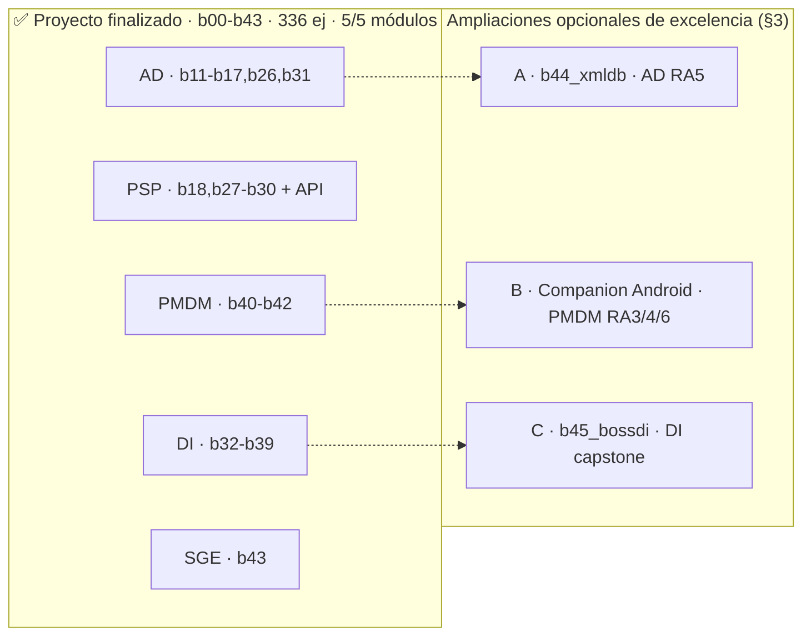

# ROADMAP DE CONSTRUCCIÓN · Masterclass 2º DAM — proyecto finalizado + ampliaciones de excelencia

> **Qué es este archivo (revisión 2026-06-24).** La masterclass `11_APIRESTMasterclass` está
> **terminada**: cubre **los cinco módulos técnicos de 2º DAM** con **b00–b43 (336 ejercicios)**.
> Este documento ya no es "lo que falta por construir para aprobar" —no falta nada—, sino:
>
> 1. el **veredicto de cobertura** módulo por módulo (sección "Veredicto"),
> 2. el **mapa del proyecto finalizado** (§2),
> 3. la **especificación, a nivel de construcción, de las 3 ampliaciones OPCIONALES de nota alta**
>    (§3) que llevan el proyecto del "sobresaliente cubierto" al "maestría sin asteriscos", y
> 4. el **histórico** de los bloques de ampliación ya construidos (Apéndice A).
>
> **Qué NO es:** no es la ruta de estudio. Para "en qué orden estudiar" ver
> [RUTA_ESTUDIO_2DAM.md](RUTA_ESTUDIO_2DAM.md) *(pendiente de actualizar a b00–b43)*. El índice
> completo del proyecto está en [SYLLABUS.md](SYLLABUS.md).
>
> Las **convenciones de construcción** (§1) siguen vigentes: son el estándar de calidad con el que
> se han construido los 44 bloques y con el que se construirían las ampliaciones de §3.

---

# ✅ VEREDICTO FINAL DE COBERTURA · revisión del 2026-06-24

> Veredicto emitido tras auditar **SYLLABUS.md** (336 ejercicios, b00–b43 dados de alta), los
> **43 ficheros de `teoria/`** (todos entre 326 y ~680 líneas, con prosa, código y diagramas
> Mermaid) y los **42 módulos Maven** presentes en disco.

## Dictamen en una frase

**El proyecto cubre los CINCO módulos técnicos de 2º DAM y está finalizado (b00–b43).** A nivel de
Resultado de Aprendizaje no queda ningún hueco que impida aprobar ni sacar buena nota en ninguno de
los cinco. Lo que sigue en §3 son **tres profundizaciones opcionales de excelencia**, no requisitos.

## Cobertura real comprobada (módulo → RA → bloque)

| Módulo 2º DAM | RA clave | ¿Cubierto? | Dónde | Profundidad |
|---|---|---|---|---|
| **0486 AD** | RA1 ficheros/XML · RA2 conectores · RA3 ORM · RA4 OO/Mongo · RA5 XML nativo · componentes | ✅ Sí | b11–b17, **b26**, **b31** | Alta. *Único matiz:* AD·RA5 "BD **nativas XML** + **XSD/DTD** + **XQuery**" se toca de pasada en b16 (JAXB/Jackson/DOM/SAX/XPath, sin XSD ni XQuery). → **Ampliación A (§3.1)**. |
| **0490 PSP** | RA1 multiproceso · RA2 multihilo · RA3 sockets · RA4 servicios red · RA5 prog. segura | ✅ Sí | b18, **b27**–**b30** + toda la API REST | **Completa y sobrada.** El módulo mejor cubierto. |
| **0487 DI** | RA1 GUI · RA2 componentes · RA3 usabilidad/a11y · RA4 informes · RA5 docs · RA6 distribución/i18n | ✅ Sí | **b32–b39** (JavaFX) | **Completa.** Las 6 RA construidas. Mejora opcional: un capstone integrador end-to-end. → **Ampliación C (§3.3)**. |
| **0488 PMDM** | RA1/RA2 multimedia · RA5 juegos · RA3/RA4/RA6 móvil | 🟡 Java completo + móvil "guion" | **b40–b42** | Multimedia y juego 2D: **completos**. Móvil (b42): **modelo mental + "guion"**, no una app Android real (Gradle/AVD no caben en Maven). Limitación **asumida y avisada**. → **Ampliación B (§3.2)**. |
| **0489 SGE** | RA4 componentes ERP · RA5 BI/DW · RA6 integración/ETL | ✅ Sí (vertiente Java) | **b43** | **Construido (2026-06-24).** Integración/ETL/BI con Odoo (JSON-RPC, CSV/XML, KPIs, sync idempotente). Parametrizar Odoo (RA1–RA3) no es Java y queda fuera, como avisa la teoría. |
| 0491 EIE · 0492 Proyecto · 0493 FCT | — | n/a | b24 / proyecto entero | Fuera de alcance de programación / cubierto indirectamente. |

## Las 3 ampliaciones pendientes (opcionales, por valor)

| # | Ampliación | Módulo·RA | Qué cierra | Forma | Prioridad |
|---|---|---|---|---|---|
| **A** | `b44_xmldb` · BD nativas XML, XSD/DTD, XPath/XQuery, XSLT | AD·RA5 | El único micro-hueco de AD | Bloque Maven (6 ej, 337–342) | **Media-alta** |
| **B** | *Companion Android* · app real que consume la API REST | PMDM·RA3/RA4/RA6 | El "asterisco" de PMDM móvil | Proyecto Android Studio aparte (guiado) | **Alta** (la de más valor formativo) |
| **C** | `b45_bossdi` · "Boss Final de Interfaces" (capstone DI) | DI·RA1–RA6 | Consolida DI en un entregable de portfolio | Bloque Maven (2 ej, 343–344) | Media |

> **Conclusión:** para **aprobar y sacar buena nota en los 5 módulos técnicos, el proyecto ya está
> completo.** Las 3 ampliaciones son escalones de maestría. Si solo se hace una, que sea la **B**
> (Android real), porque es el único punto donde el proyecto sustituye práctica real por modelo
> mental; las otras dos pulen matices ya cubiertos.

---

## 0. Estado de cobertura por módulo de 2º DAM

La masterclass nació como bootcamp de **API REST con Java 21 + Spring Boot**. Sobre esa base se
amplió hasta cubrir el BOE de 2º DAM. Estado **actual** (todo construido):

| Módulo de 2º DAM | Tecnología en el proyecto | Estado | Bloques |
|---|---|---|---|
| **0486 Acceso a Datos (AD)** | JDBC / JPA / Mongo / ficheros | ✅ **Completo** | b11–b17, b26, b31 |
| **0490 Prog. Servicios y Procesos (PSP)** | Hilos / procesos / sockets / cripto / REST | ✅ **Completo** | b18, b27–b30 + toda la API |
| **0487 Desarrollo de Interfaces (DI)** | **JavaFX** | ✅ **Completo** | b32–b39 |
| **0488 Prog. Multimedia y Móvil (PMDM)** | JavaFX Media / Canvas / Android | ✅ **Java completo + móvil guion** | b40–b42 |
| **0489 Sistemas de Gestión Empresarial (SGE)** | Integración ERP/CRM (Odoo) | ✅ **Completo** (vertiente Java) | b43 |
| 0491 Empresa e Iniciativa Emprendedora | (no es de programación) | ⛔ Fuera de alcance | — |
| 0492 Proyecto / 0493 FCT | El proyecto entero sirve de base | ✅ Indirecto | b24 Boss Final |

> **Nota de honestidad sobre el BOE.** El PDF del repo (`BOE-A-2023-13221`) solo redacta los
> módulos **0486** y **0490** (es una modificación parcial del título). Las RA de DI, PMDM y SGE
> provienen del currículo del título DAM (RD 450/2010 y desarrollos autonómicos); se mapean
> fielmente, pero si tu comunidad numera las RA distinto, ajusta el mapeo manteniendo los criterios.

---

## 1. Convenciones obligatorias (heredadas de b00/b01) — válidas para construir CUALQUIER bloque

Un agente que cree o amplíe un bloque DEBE replicar esta anatomía, verificada en
`b01_java/.../Ej013StreamsBasics.java` y su test espejo. **Es el estándar de calidad de la skill
`crear-bloque`.**

### 1.1 Anatomía de cada clase de ejercicio
- Paquete `com.masterclass.api.bNN_nombre`. Clase `public final`, **constructor privado**,
  todos los métodos `static` (salvo excepción JavaFX, ver §1.6).
- Javadoc de clase con referencia a teoría: `Teoría: {@code teoria/NN_*.md} (sección X.Y)`.
- **2–3 métodos "core"** con TODOs numerados (`// TODO 1:` … `// TODO N:`), granulares (validación,
  casos límite, pasos del algoritmo, retorno). Devuelven un **valor centinela** que hace fallar el
  test hasta implementarlo (`-1`, `List.of()`, `null`, `""`, `false`, `Optional.empty()`).
- Un `main(String[] args)` corto que demuestra los core (sirve de Playground).
- **10 "Retos Extra"** con **nombre descriptivo en español**: cada uno con javadoc, un comentario
  `// GUÍA:` por capas (teoría → pasos → `PISTA` → `OJO` → `CULTURA`) y cuerpo
  `throw new UnsupportedOperationException("TODO: Implementar la lógica del reto extra para <metodo>");`.
  Los retos van **de lo simple a lo avanzado** y **cubren el tópico entero**; 2–3 de ellos enlazan
  con otros bloques (capa `CULTURA`).

### 1.2 Test espejo (`src/test/.../EjNNNxxxTest.java`)
- Un `@Test` por método core (con casos límite reales) + 10 `@Test` `testRetoExtraNN_<metodo>`.
- JUnit 5 (`org.junit.jupiter`), asserts estáticos. Los tests nacen **en rojo** (centinela /
  excepción) y se ponen verdes al implementar. Para asincronía/UI usar `assertTimeout`,
  `@Timeout`, `CountDownLatch.await(timeout)`, `WaitForAsyncUtils` (TestFX) o latches; **nunca**
  `Thread.sleep` a ciegas ni `Platform.runLater` sin esperar.

### 1.3 Teoría (`teoria/NN_Nombre.md`) — ~450–680 líneas
- Cabecera con cita motivadora ("vienes de…, esto te falta…, por qué importa").
- "Cómo usar este documento" + ("Antes de empezar" si hay trampa de setup) + tabla índice
  `| Sección | Tema | Ejercicio |` + recuadro de modelo mental + diagrama general.
- Una sección `## N` por ejercicio: prosa (de lo simple a lo avanzado) + **diagramas Mermaid** +
  **tablas de referencia que cubren el tópico más allá del ejercicio** + snippets + trampas +
  recuadro **"Lo practicas en `EjNNN…`"**.
- **Cierres obligatorios:** "Errores comunes del bloque" (tabla ≥10), "Chuleta final" (bloque de
  código con `concepto = resumen`) y "Autoevaluación" (≈1 pregunta por sección con ref `*(N)*`).

### 1.4 Alta como módulo Maven
- Carpeta `bNN_nombre/` con su `pom.xml` propio (copiar el de un bloque hermano; cambiar
  `artifactId` y añadir solo las dependencias del bloque). `src/main` y `src/test` espejo.
- `bloque.py` autodetecta cualquier carpeta `^b\d{2}_` con `pom.xml`. Para compilar todo:
  `python bloque.py todos`; para activar solo uno: `python bloque.py bNN`.
- Registrar el bloque en `SYLLABUS.md` (tabla de rangos §3 + tabla detallada §4 + checklist §5).

### 1.5 Estilo
- Todo en **castellano**, comentarios incluidos. Codificación UTF-8. Nombres de método en español
  (`mapearCliente`, `validarMaestro`, `ventasPorMes`).

### 1.6 Addendum JavaFX/UI (bloques b32–b42 y la futura ampliación C) — testabilidad determinista
- **Separar lógica de pintado.** El método core SIEMPRE es lógica pura headless-testable
  (conversores, validadores, *bindings* calculados, estado de un *ViewModel*, modelo de datos de un
  informe). Se prueba con JUnit puro, sin abrir ventana.
- **El `main`/Playground** monta la UI real (extiende `Application`, `launch(args)`).
- **Toolkit en tests:** para lo que toca nodos/propiedades JavaFX, inicializar el toolkit una vez
  (`new JFXPanel()` o `Platform.startup`) y para *smoke* de UI usar **TestFX + Monocle headless**
  (`-Dtestfx.headless=true -Dglass.platform=Monocle -Dprism.order=sw`).
- **pom.xml JavaFX base:** sobre el pom de un bloque hermano añadir `javafx-controls`,
  `javafx-fxml` (versión 21.0.4) y, en `test`, `testfx-junit5` (4.0.18) + `openjfx-monocle` (21.0.2);
  plugin `org.openjfx:javafx-maven-plugin` para `mvn javafx:run`.
- **Regla de oro:** si un `@Test` necesita pantalla real para pasar, está mal diseñado. Empuja la
  lógica al ViewModel y deja la vista como cascarón.

### 1.7 Ejercicios "guion"
Cuando el tema no es testeable en Maven/JUnit (Docker, `jlink`/`jpackage`, Android, comandos de
Odoo), el core construye/valida **configuraciones y comandos como cadenas** (testeable y
determinista) y la ejecución real se documenta en la teoría/README. **Se avisa al alumno con
claridad** — es honesto, no un atajo. Precedentes: b22 (Dockerfile), b39 (`jlink`/`jpackage`),
b42 (Android), b43 (comandos JSON-RPC de Odoo).

---

## 2. Mapa del proyecto finalizado (b00–b43)

| Rango | Bloques | Tema | Módulo |
|---|---|---|---|
| b00–b10 | http, java, json, core, boot, web, webadv, dto, valid, err, arch | Fundamentos HTTP + Java moderno + Spring REST | (base) |
| b11–b17 | jdbc, jpa, rel, jpaadv, query, xml, nosql | JDBC, JPA/Hibernate, consultas, XML, Mongo | **AD** |
| b18 | sec | Spring Security + JWT | PSP/transversal |
| b19–b25 | test, obs, perf, deploy, ci, boss, thymeleaf | Testing, observabilidad, resiliencia, Docker, CI/CD, PDF | producción |
| b26 | io | I/O y NIO.2 | **AD** |
| b27–b30 | concur, proc, sockets, crypto | Concurrencia, procesos, sockets, criptografía | **PSP** |
| b31 | oodb | BD objeto-relacionales y procedimientos | **AD** |
| b32–b39 | fxbase, fxcontrols, fxfxml, fxdata, fxstyle, fxcustom, fxreports, fxdeploy | JavaFX: GUI, binding, FXML, datos, CSS, componentes, informes, distribución | **DI** |
| b40–b42 | media, anim, mobile | Multimedia, animación/juego 2D, móvil/Android | **PMDM** |
| b43 | erp | Integración ERP/CRM, ETL, BI (Odoo) | **SGE** |

**336 ejercicios.** Cada bloque: 2–3 cores con TODOs + 10 retos guiados + test espejo + teoría con
Mermaid. Detalle exhaustivo por ejercicio en [SYLLABUS.md](SYLLABUS.md) §4.

---

# 3. CAMBIOS PENDIENTES · Ampliaciones OPCIONALES de excelencia

> Tres ampliaciones que el proyecto **no necesita para cubrir el temario**, pero que lo llevan de
> "sobresaliente cubierto" a "maestría sin asteriscos". Cada una está especificada al nivel de
> construcción de §1, lista para entregarse a `crear-bloque` (A y C) o como proyecto guiado (B).
>
> **Orden de construcción recomendado:** `B` (Android real, máximo valor) → `A` (`b44_xmldb`,
> cierra el micro-hueco de AD) → `C` (`b45_bossdi`, capstone de portfolio).

---

## 3.1 · Ampliación A — `b44_xmldb`: BD nativas XML, XSD/DTD, XPath/XQuery y XSLT (AD·RA5)

**Por qué.** Es el **único punto del temario de AD** que el proyecto roza en vez de practicar. b16
cubre XML como ficheros (JAXB, Jackson-XML, DOM/SAX, XPath de lectura), pero la RA5 de AD habla
explícitamente de **bases de datos nativas XML** (eXist-db/BaseX), **validación con esquemas**
(XSD/DTD), **XPath/XQuery** como lenguaje de consulta y **XSLT** como transformación. Este bloque lo
cierra de forma testeable.

**Carpeta:** `b44_xmldb`. **Ejercicios:** 337–342 (6). **Teoría:** `teoria/44_BDNativasXML.md`.
**pom.xml:** JDK puro para XSD/XPath/XSLT (todo en `javax.xml.*`, sin dependencias) **+ opcional**
`org.basex:basex` (BaseX embebido, BD nativa XML que corre en proceso, ideal para tests
deterministas sin servidor). Si se prefiere no añadir dependencia, los ejercicios de XQuery/BD
nativa quedan como **"guion"** (§1.7) construyendo y validando consultas FLWOR como cadenas.

| # | Archivo | Concepto clave |
|---|---|---|
| 337 | `Ej337XsdSchemaValidation.java` | Validar XML contra **XSD** (`javax.xml.validation.SchemaFactory`/`Validator`); recoger errores |
| 338 | `Ej338DtdValidation.java` | Validar contra **DTD**, comparar DTD vs XSD, well-formed vs valid |
| 339 | `Ej339XPathQueries.java` | **XPath** sobre DOM (`javax.xml.xpath`): ejes, predicados `[ ]`, funciones, nodos vs valores |
| 340 | `Ej340XQueryFlwor.java` | **XQuery** FLWOR (`for`/`let`/`where`/`order by`/`return`) — BaseX embebido o "guion" |
| 341 | `Ej341NativeXmlDb.java` | **BD nativa XML** (BaseX/eXist): colecciones, insertar/consultar documentos — "guion" + core de modelado |
| 342 | `Ej342XsltAndBridge.java` | **XSLT** (`javax.xml.transform`) XML→HTML/XML, y puente XML↔relacional (*shredding*) |

**Detalle por ejercicio** (core = TODOs; retos = guía paso a paso):
- **337:** core `validarContraXsd(String xml, String xsd)` → `List<String>` de errores (vacía =
  válido), con un `ErrorHandler` que acumula. Retos: namespaces, `xsi:schemaLocation`, tipos
  simples/complejos, `minOccurs/maxOccurs`, restricciones (`pattern`, `enumeration`), validar en
  *streaming* (SAX), distinguir *fatalError*/*error*/*warning*. **CULTURA:** es la validación de
  Bean Validation (b08) pero a nivel de documento.
- **338:** core `esValidoSegunDtd(String xml)` (DTD inline o externa). Retos: `<!ELEMENT>`,
  `<!ATTLIST>`, entidades, por qué XSD ganó a DTD (tipos, namespaces), well-formed≠valid.
- **339:** core `seleccionar(String xml, String xpath)` → `List<String>` de valores. Retos: ejes
  (`child`, `descendant`, `parent`, `following-sibling`), predicados por posición/atributo,
  `count()`/`sum()`/`text()`, `//` vs `/`, *context node*. **CULTURA:** XPath ≙ derived queries de
  JPA (b12) sobre un árbol.
- **340:** core `construirFlwor(...)` que arma una consulta FLWOR como cadena válida (testeable) y,
  si BaseX está, la ejecuta y parsea el resultado. Retos: `where` (≙ WHERE), `order by` (≙ ORDER
  BY), `let` (variables), `return` con constructores XML, joins de dos colecciones. **CULTURA:**
  FLWOR ≙ SQL `SELECT` (b15) sobre XML.
- **341:** core de modelado de la BD nativa (nombre de colección/documento válido, ruta, comando de
  inserción/consulta como cadena — "guion" estilo b43). Si BaseX embebido: abrir contexto en
  memoria, crear colección, `db:add`, consultar. Retos: índices, colección vs documento, XML nativo
  vs XML-en-columna (b16/b31), cuándo una BD nativa XML gana a una relacional.
- **342:** core `transformar(String xml, String xslt)` → texto resultante (HTML u otro XML). Retos:
  `xsl:template`/`match`, `xsl:value-of`, `xsl:for-each`, `xsl:if`/`choose`, identidad+override, y
  **puente XML↔relacional**: `shred` (XML → filas, enlaza b11) y `publish` (filas → XML, enlaza b16).

**Teoría — secciones:** `flowchart` del pipeline de validación (parse → schema → validate →
errores); tabla **DTD vs XSD vs RelaxNG**; `classDiagram` del API `javax.xml` (`DocumentBuilder`,
`XPath`, `Validator`, `Transformer`); tabla de **ejes XPath**; anatomía de una consulta **FLWOR**
comparada con `SELECT`; tabla **BD nativa XML vs XML-en-columna vs relacional** (cuándo cada una);
sección "XSLT no es un lenguaje imperativo: es transformación por plantillas". Enlaza con b16 (XML
como fichero), b08 (validación), b15 (consultas) y b31 (modelos OO/relacional).

**DoD específico:** los cores de validación/XPath/XSLT corren con **solo el JDK** (sin red ni BD);
los de XQuery/BD nativa pasan headless con BaseX embebido **o** quedan como "guion" verificando la
cadena de consulta. ~520–650 líneas de teoría con los tres cierres obligatorios.

---

## 3.2 · Ampliación B — *Companion Android*: app real que consume la API REST (PMDM·RA3/RA4/RA6)

**Por qué (la de más valor).** b42 da el **modelo mental** correcto de Android (ciclo de vida,
layouts, `Intent`, sensores) como lógica Java testeable, pero **honestamente avisa** de que no es una
app Android real porque Gradle/AVD no caben en este Maven. La única forma de cerrar PMDM·RA3/RA4/RA6
con **práctica real** es un **proyecto Android Studio aparte** que reutilice todo lo aprendido y
**consuma la API REST del propio proyecto** (b05). No es un bloque Maven: es un proyecto compañero,
guiado paso a paso, igual de honesto que los "guion" pero llevándolo hasta el dispositivo.

**Forma de entrega:** carpeta hermana **fuera** del Maven (`companion-android/`, su propio Gradle) +
un documento `teoria/42b_Android_Companion.md` que la guía. NO lleva ejercicios numerados ni tests
JUnit del proyecto: su "test" es **la app corriendo en el emulador/dispositivo** mostrando datos
reales de la API.

**Especificación del proyecto compañero** (mínimo viable que cierra las 3 RA):

| Pieza | Qué construye | RA | Reutiliza |
|---|---|---|---|
| `MainActivity` + ciclo de vida | `onCreate`/`onResume`/`onPause` reales; estado en `onSaveInstanceState` | RA3 | Modelo de b42·Ej326 |
| `RecyclerView` + Adapter | Lista de clientes/pedidos de la API | RA3/RA4 | TableView de b35 (mismo concepto) |
| Cliente HTTP (Retrofit/`HttpURLConnection`) | GET a la API REST de b05 en hilo de fondo | RA4 | `Task` de b35, `HttpClient` de b35·Ej286 |
| Navegación por `Intent` | Lista → detalle pasando el id (`putExtra`) | RA4 | Modelo de b42·Ej328 |
| Permisos en runtime + 1 sensor | Pedir permiso y leer acelerómetro/GPS con filtrado | RA4 | Filtrado de b42·Ej329 |
| Firma del APK + `bundleRelease` | Generar el `.aab` firmado | RA6 | "Guion" de b42·Ej330, firma de b30 |

**Pasos guiados en la teoría (`42b`):**
1. Instalar Android Studio + SDK + un AVD (Pixel 6 API 34); validar `minSdk≤target≤compileSdk`
   (el modelo de b42·Ej325 ya lo enseñó).
2. Crear proyecto "Empty Activity" (Kotlin o Java; el modelo de b42 vale para ambos).
3. Levantar la API REST del proyecto (`mvn -pl b05_web spring-boot:run`) y, si el cliente corre en
   emulador, apuntar a `http://10.0.2.2:8080` (el host visto desde el AVD).
4. Pegar el modelo de back stack/`Intent` de b42·Ej328 sobre la navegación real.
5. Filtrar el sensor con el algoritmo de b42·Ej329.
6. Firmar y empaquetar con el comando de b42·Ej330.

**Teoría — secciones:** tabla **modelo b42 → equivalente real Android** (cada core de b42 ↔ su API
de Android Studio); `sequenceDiagram` app↔API REST (`10.0.2.2`, hilo de fondo, parsear JSON);
checklist de release (firmado ∧ minificado ∧ ¬debuggable, de b42·Ej330); nota honesta: "esto SÍ es
una app real; lo que aprendiste en b42 era el modelo, aquí lo ejecutas". Enlaza con b42 (modelo),
b05 (la API que consume), b35 (cliente async), b30 (firma).

**DoD específico:** la app **arranca en un AVD**, lista datos reales de la API REST del proyecto,
navega a detalle por `Intent`, lee un sensor filtrado y genera un `.aab` firmado. El documento `42b`
guía cada paso. (No hay tests JUnit del monorepo: la validación es la app corriendo, como cualquier
proyecto Android.)

---

## 3.3 · Ampliación C — `b45_bossdi`: "Boss Final de Interfaces" (capstone DI·RA1–RA6)

**Por qué.** Igual que `b24` es el "Boss Final" que integra toda la API REST, DI merece su capstone:
un **cliente de escritorio JavaFX completo** que consuma la **API REST del propio proyecto** y
reúna en un solo entregable las 6 RA del módulo. No añade conceptos nuevos: **consolida** los de
b32–b39 en una app de portfolio. Es el gemelo de escritorio del Boss Final.

**Carpeta:** `b45_bossdi`. **Ejercicios:** 343–344 (2, multi-parte como b24). **Teoría:**
`teoria/45_BossDI.md`. **pom.xml:** base JavaFX (§1.6) + Jackson (b02) + `java.net.http` + opcional
`jasperreports` (b38).

| # | Archivo | Concepto clave |
|---|---|---|
| 343 | `Ej343DesktopClientCoreVM.java` | **ViewModel del cliente**: login JWT (b18), lista paginada/filtrada (b35), validez de formularios (b33/b34), comandos — **100% testeable headless** |
| 344 | `Ej344DesktopClientSecuredObservable.java` | **El Boss DI**: integra el VM con `Task` async (b35), binding (b33), CSS/tema e i18n (b36), export PDF del listado (b38) y diálogos (b34); el Playground es la app real con `launch` |

**Detalle:**
- **343:** core = un `ClienteEscritorioVM` con `StringProperty usuario/clave`, `BooleanProperty
  botonLoginHabilitado` (bindeado a la validez), `ObservableList<ClienteDto>` paginada, `aplicarFiltro
  (texto)` (FilteredList de b35), `estadoSesion` (sin sesión / autenticando / autenticado / error).
  Todo se testea sin UI: dado un estado, qué propiedades calculadas resultan. TODOs: validar
  credenciales no vacías, construir el header `Authorization: Bearer`, paginar (page/size), filtrar,
  manejar 401. Retos: refresh token (b18·Ej163), *dirty checking* del formulario, deshacer, *retry*
  con backoff (b21/b43), cancelar carga, ordenación multinivel (b35·Ej282), traducir mensajes de
  error (b36/i18n + RFC 7807 de b09).
- **344:** integra todo. El core sigue siendo lógica pura (parsear la respuesta de login → token;
  parsear la lista → `List<ClienteDto>`; decidir si exportar). El **Playground** monta la app real:
  pantalla de login → tabla con filtro → botón "Exportar PDF" (b38) → selector de tema claro/oscuro
  e idioma (b36). Retos: `Service` reutilizable (b35·Ej284), `ProgressBar` bindeada, `Alert` de
  confirmación abstraída tras interfaz (b34·Ej278), persistir preferencias del usuario (b39·Ej307),
  "Acerca de"/`Hyperlink` (b39·Ej306).

**Teoría — secciones:** `classDiagram` de la arquitectura del cliente (Vista FXML → ViewModel →
ServicioREST → API); `sequenceDiagram` del login JWT (cliente → `/auth` → token → llamadas
autenticadas); tabla "qué RA de DI toca cada parte del Boss" (RA1 escena/FXML, RA2 TableView/celdas,
RA3 CSS/a11y/i18n, RA4 PDF, RA5 ayuda/docs, RA6 preferencias/distribución); sección "el cliente de
escritorio es el gemelo del Boss Final de la API: misma arquitectura por capas, otra piel". Enlaza
con **todo el módulo DI** (b32–b39), b18 (JWT), b05 (la API), b09 (errores RFC 7807).

**DoD específico:** el ViewModel pasa **headless** (sin pantalla); el Playground arranca con
`mvn -pl b45_bossdi javafx:run` y, contra la API REST levantada, hace login, lista paginado/filtrado,
cambia tema/idioma y exporta el listado a PDF. ~480–620 líneas de teoría con los tres cierres.

---

## 4. Verificación al construir cada ampliación

1. `python bloque.py bNN` → `mvn -pl bNN_nombre test` compila y deja los tests **en rojo**
   (centinela / `UnsupportedOperationException`); tras implementar, en **verde**.
2. Para bloques JavaFX (ampliación C): los tests de lógica (core/ViewModel) pasan **headless**; los
   *smoke* de UI corren con Monocle. Ningún test depende de una pantalla real.
3. Para la ampliación A: cores de validación/XPath/XSLT con **solo JDK**; XQuery/BD nativa con BaseX
   embebido o como "guion".
4. La ampliación B se valida **en el emulador/dispositivo** (no hay test JUnit del monorepo).
5. `python bloque.py` (sin args) lista el nuevo bloque como detectado automáticamente.
6. Cada bloque cumple la anatomía §1: 2–3 core con TODOs + 10 retos extra con GUÍA por capas + test
   espejo + teoría con Mermaid y los tres cierres obligatorios.

## 5. Notas de ejecución

- Construir cada ampliación con la skill **`crear-bloque bNN`** (A y C), pasándole su sección de
  este roadmap; la ampliación B se construye a mano siguiendo `teoria/42b`.
- Tras crear un bloque, actualizar `SYLLABUS.md` (rangos + tabla detallada + checklist) y la
  [RUTA_ESTUDIO_2DAM.md](RUTA_ESTUDIO_2DAM.md).
- **`RUTA_ESTUDIO_2DAM.md` está desactualizada** (refleja el proyecto cuando solo llegaba a b31 y
  decía que DI/PMDM/SGE quedaban fuera). Conviene reescribirla para b00–b43 con el orden de estudio
  por módulo. Es independiente de construir las ampliaciones.
- **Estado actual (2026-06-24):** proyecto **finalizado** (b00–b43, 336 ej, 5/5 módulos). Las tres
  ampliaciones de §3 son **opcionales**; ninguna es necesaria para cubrir el temario de 2º DAM.
- **Próximo paso sugerido si se busca excelencia:** ampliación **B** (Companion Android real), por
  ser el único punto donde el proyecto sustituye práctica real por modelo mental.

---

## Apéndice A · Bloques de ampliación YA CONSTRUIDOS (AD + PSP + DI + PMDM + SGE) — b26–b43

> Spec conservada como referencia de anatomía. Estos bloques **ya existen** (ver checklist en
> `SYLLABUS.md`).

| Bloque | Carpeta | Tema | Módulo·RA | Ejercicios | Estado |
|---|---|---|---|---|---|
| B26 | `b26_io` | I/O de ficheros de bajo nivel y NIO.2 | AD·RA1 | 207–214 | ✅ (12 retos/ej) |
| B27 | `b27_concur` | Concurrencia y multihilo a fondo | PSP·RA2 | 215–226 | ✅ |
| B28 | `b28_proc` | Multiproceso e IPC | PSP·RA1 | 227–232 | ✅ |
| B29 | `b29_sockets` | Sockets y programación en red | PSP·RA3 | 233–240 | ✅ |
| B30 | `b30_crypto` | Criptografía y programación segura | PSP·RA5 | 241–248 | ✅ |
| B31 | `b31_oodb` | BD objeto-relacionales/OO + procedimientos | AD·RA4+RA2.k | 249–254 | ✅ |
| B32 | `b32_fxbase` | JavaFX: app, escena, *scene graph*, layouts | DI·RA1 | 255–262 | ✅ |
| B33 | `b33_fxcontrols` | Controles + Properties + Binding observable | DI·RA1/RA2 | 263–270 | ✅ |
| B34 | `b34_fxfxml` | FXML + Scene Builder + MVC/MVVM + eventos | DI·RA1 | 271–278 | ✅ |
| B35 | `b35_fxdata` | Colecciones observables, TableView, Task/Service, REST | DI·RA2/RA4 | 279–286 | ✅ |
| B36 | `b36_fxstyle` | CSS, usabilidad, accesibilidad, i18n | DI·RA3 | 287–292 | ✅ |
| B37 | `b37_fxcustom` | Controles personalizados, Canvas, Charts | DI·RA2 | 293–298 | ✅ |
| B38 | `b38_fxreports` | Informes (JasperReports) + PDF + impresión | DI·RA4 | 299–304 | ✅ |
| B39 | `b39_fxdeploy` | Documentación, ayuda, `jpackage`/instaladores | DI·RA5/RA6 | 305–310 | ✅ |
| B40 | `b40_media` | Multimedia: imagen, audio, vídeo | PMDM·RA1/RA2 | 311–318 | ✅ |
| B41 | `b41_anim` | Animación, *game loop*, juego 2D | PMDM·RA2/RA5 | 319–324 | ✅ |
| B42 | `b42_mobile` | Móvil/Android: entorno, ciclo de vida, sensores | PMDM·RA3/RA4/RA6 | 325–330 | ✅ (parcial "guion") |
| B43 | `b43_erp` | Integración ERP/CRM, ETL, BI (Odoo) | SGE·RA4/RA5/RA6 | 331–336 | ✅ |

**B43 (`b43_erp`) — el último construido (2026-06-24):** modelo de datos del ERP y "guion" de
conceptos (`Ej331`), import/export de maestros CSV/XML con round-trip y escape (`Ej332`), cliente
JSON-RPC de Odoo construido/parseado con Jackson sin red (`Ej333`), ETL de mapeo/validación con
descarte de filas inmapeables (`Ej334`), KPIs de BI con `groupingBy`/`summingDouble` (`Ej335`) y
sincronización idempotente con upsert/huella/backoff/conciliación (`Ej336`). Modelos compartidos
`ClienteErp`/`PedidoErp`/`SyncPlan`. 73 tests en rojo. Práctica real contra el **MCP de Odoo**.
Teoría `43_SGE_Integracion.md`. **Cierra SGE y los 5 módulos técnicos de 2º DAM.**

**B26–B42:** ver detalle por ejercicio en [SYLLABUS.md](SYLLABUS.md) §4 y la teoría homónima de cada
bloque en `teoria/`.
