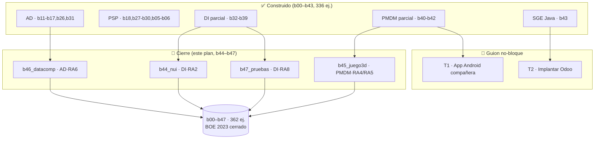

# ROADMAP DE CIERRE · Pulir la Masterclass al 100 % del BOE 2023

> **Documento independiente.** No sustituye ni modifica `ROADMAP_BUILD_MASTERCLASS.md` ni
> `SYLLABUS.md`: es el **plan de cierre** que nace de una **lectura detenida y punto por punto del
> Boletín Oficial del Estado** que reside en el repositorio:
>
> > **`BOE-A-2023-13221.pdf`** — Real Decreto **405/2023**, de 29 de mayo (publicado en el BOE
> > núm. 132, sábado **3 de junio de 2023**), *"por el que se actualizan los títulos de Técnico
> > Superior en Desarrollo de Aplicaciones Multiplataforma y Técnico Superior en Desarrollo de
> > Aplicaciones Web"*. 97 páginas. Páginas relevantes para este análisis: **79028–79047**
> > (módulos profesionales 0486, 0488, 0489, 0490 y 0491).
>
> **Objetivo:** que, tras ejecutar este plan, **cada Resultado de Aprendizaje (RA) y cada Criterio
> de Evaluación (CE) del BOE 2023** quede trazado o bien a un **bloque construido** de la
> masterclass, o bien a un **guion documentado** justificado. **Nada pendiente, sin asteriscos
> ocultos.**

---

## Índice

1. [Cómo se ha hecho esta auditoría (metodología)](#1-cómo-se-ha-hecho-esta-auditoría-metodología)
2. [Corrección de raíz: el mapeo previo usaba el plan de 2010](#2-corrección-de-raíz-el-mapeo-previo-usaba-el-plan-de-2010)
3. [Auditoría módulo por módulo, RA por RA, CE por CE](#3-auditoría-módulo-por-módulo-ra-por-ra-ce-por-ce)
   - [3.1 · 0486 Acceso a Datos](#31--0486-acceso-a-datos-9-ects--6-ra)
   - [3.2 · 0490 Programación de Servicios y Procesos](#32--0490-programación-de-servicios-y-procesos-5-ects--5-ra)
   - [3.3 · 0488 Desarrollo de Interfaces](#33--0488-desarrollo-de-interfaces-9-ects--8-ra)
   - [3.4 · 0489 Programación Multimedia y Dispositivos Móviles](#34--0489-programación-multimedia-y-dispositivos-móviles-7-ects--5-ra)
   - [3.5 · 0491 Sistemas de Gestión Empresarial](#35--0491-sistemas-de-gestión-empresarial-6-ects--5-ra)
4. [Resumen de lagunas y veredicto](#4-resumen-de-lagunas-y-veredicto)
5. [Plan de cierre: bloques nuevos b44–b47](#5-plan-de-cierre-bloques-nuevos-b44b47)
6. [Especificación construible para `crear-bloque`](#6-especificación-construible-para-crear-bloque)
   - [§B44 · `b44_nui`](#b44--b44_nui--interfaces-naturales-de-usuario-dira2)
   - [§B45 · `b45_juego3d`](#b45--b45_juego3d--javafx-3d-y-arquitectura-de-motores-de-juego-pmdmra4ra5)
   - [§B46 · `b46_datacomp`](#b46--b46_datacomp--componentes-de-acceso-a-datos-adra6)
   - [§B47 · `b47_pruebas`](#b47--b47_pruebas--estrategia-de-pruebas-dira8)
7. [Tareas de pulido que NO son bloque (T0–T2)](#7-tareas-de-pulido-que-no-son-bloque-t0t2)
8. [Cómo alimentar a la skill `crear-bloque`](#8-cómo-alimentar-a-la-skill-crear-bloque)
9. [Definición de "hecho" (cierre total)](#9-definición-de-hecho-cierre-total)

---

## 1. Cómo se ha hecho esta auditoría (metodología)

1. **Extracción del texto** del PDF `BOE-A-2023-13221.pdf` (97 páginas) y localización de los
   bloques `Módulo profesional: …` → `Resultados de aprendizaje y criterios de evaluación`.
2. **Transcripción literal** de los RA y CE de los cinco módulos técnicos de 2º DAM (abajo, §3).
3. **Mapeo CE→bloque**: para cada criterio de evaluación se ha buscado el bloque/ejercicio/teoría
   que lo practica, verificando por `grep` sobre `teoria/` y sobre el código de los bloques cuando
   había duda (interfaces naturales, 3D, componentes, pruebas de volumen…).
4. **Clasificación**: ✅ cubierto con práctica · 🟡 parcial o "guion" (modelo Java + concepto, sin
   herramienta real) · ❌ no cubierto.
5. **Contraste con el estado del disco** (2026-06-24): bloques `b00`–`b43` construidos (**336
   ejercicios**), 43 ficheros de teoría, 43 módulos Maven.

> **Honestidad sobre el alcance.** La masterclass nació como bootcamp de **API REST con Java 21 +
> Spring Boot** y se amplió para cubrir el BOE de 2º DAM. Algunos CE del BOE describen tareas de
> **herramienta** (parametrizar un ERP, desplegar en un emulador Android, entrenar un motor de
> reconocimiento), que no son programación Java y no caben en un módulo Maven con JUnit. Para esos
> casos el criterio —ya usado en b22 (Docker), b23 (CI/CD) y b42 (Android)— es **"guion"**: modelar
> en Java puro lo transferible y testeable, y documentar el resto con pasos y diagramas. Este plan
> respeta esa frontera y la marca explícitamente.

---

## 2. Corrección de raíz: el mapeo previo usaba el plan de 2010

La auditoría que figura dentro de `ROADMAP_BUILD_MASTERCLASS.md` ("VEREDICTO FINAL 5/5") se realizó
contra las RA del **RD 450/2010** (el título antiguo), **no** contra el BOE de 2023 que está en el
repositorio. La prueba: ese documento afirma que *"el PDF solo redacta los módulos 0486 y 0490"*.
**Es inexacto: el `BOE-A-2023-13221` redacta los diez módulos profesionales**, incluidos DI, PMDM y
SGE, con RA **distintas** a las de 2010. De ahí salen dos errores heredados que este plan corrige:

### 2.1 Códigos de módulo (el orden cambió en 2023)

El BOE 2023 enumera, en este orden, los módulos: 0483 Sistemas informáticos · 0484 Bases de datos ·
0485 Programación · 0373 Lenguajes de marcas · **0487 Entornos de desarrollo** · **0486 Acceso a
datos** · **0488 Desarrollo de interfaces** · **0489 Programación multimedia y dispositivos
móviles** · **0490 Programación de servicios y procesos** · **0491 Sistemas de gestión
empresarial** · 0492 Proyecto.

| Módulo (nombre) | Código en SYLLABUS/ROADMAP | Código real BOE 2023 | ¿Correcto? |
|---|---|---|---|
| Acceso a Datos | 0486 | **0486** | ✅ |
| Desarrollo de Interfaces | 0487 | **0488** | ❌ → corregir |
| Prog. Multimedia y Disp. Móviles | 0488 | **0489** | ❌ → corregir |
| Prog. de Servicios y Procesos | 0490 | **0490** | ✅ |
| Sistemas de Gestión Empresarial | 0489 | **0491** | ❌ → corregir |

> **0487 NO es Desarrollo de Interfaces**: es *Entornos de desarrollo* (módulo de 1º). Etiquetar DI
> como "0487" en SYLLABUS/ROADMAP es un error factual. → **Tarea T0**.

### 2.2 Recomendación obsoleta a retirar

En el plan de **2010**, el RA5 de Acceso a Datos era *"BD nativas **XML**"* (validación XSD/DTD,
consultas XQuery). En **2023 ese RA5 pasa a ser "BD documentales nativas"** (modelo documento tipo
**MongoDB**), que **ya está cubierto por b17_nosql**. Por tanto, la recomendación previa de añadir
**XSD/XQuery** a b16 **ya no responde a ningún CE del BOET 2023** y debe retirarse para no malgastar
esfuerzo. → **Tarea T0**.

---

## 3. Auditoría módulo por módulo, RA por RA, CE por CE

> Para cada módulo se transcribe el RA con sus CE (resumidos cuando son largos, literales en lo
> crítico) y se mapea a bloque + estado. Leyenda: ✅ práctica real · 🟡 parcial/guion · ❌ ausente.

### 3.1 · 0486 Acceso a Datos (9 ECTS · 6 RA)

**RA1 — Desarrolla aplicaciones que gestionan información almacenada en ficheros.**
CE: (a) clases de gestión de ficheros/directorios · (b) valorar formas de acceso · (c) recuperar ·
(d) almacenar · (e) **conversiones entre formatos** · (f) excepciones · (g) probar/documentar.
→ **b16_xml** (XML/JSON, JAXB, DOM/SAX, CSV) + **b26_io** (byte/char streams, `RandomAccessFile`,
serialización, NIO.2, `FileChannel`, conversión texto↔binario). **Estado: ✅** (todos los CE).

**RA2 — …información en bases de datos relacionales, mecanismos de conexión.**
CE: (a) conectores · (b) gestores embebidos/independientes · (c) conector idóneo · (d) conexión ·
(e) estructura BD · (f) DML · (g) objetos para resultado · (h) consultas · (i) liberar objetos ·
(j) transacciones · **(k) ejecutar procedimientos almacenados**.
→ **b11_jdbc** (Connection, PreparedStatement, ResultSet, pool, JdbcTemplate, transacciones) +
**b31_oodb** (CallableStatement / procedimientos, CE2.k). **Estado: ✅** (incluido el k).

**RA3 — Gestiona la persistencia con ORM.**
CE: (a) instalar ORM · (b) configurar · (c) mapeo · (d) persistencia · (e) modificar/recuperar ·
(f) consultas SQL · (g) transacciones.
→ **b12_jpa**, **b13_rel**, **b14_jpaadv**, **b15_query** (Hibernate/JPA completo). **Estado: ✅.**

**RA4 — …bases de datos objeto-relacionales y orientadas a objetos.**
CE: (a) ventajas/inconvenientes · (b) conexiones · (c) persistencia objetos simples · (d) objetos
estructurados · (e) consultas · (f) modificar · (g) transacciones · (h) probar/documentar.
→ **b31_oodb** (tipos objeto-relacionales `ARRAY`, persistir grafo de objetos, consultas estilo
OQL, transacciones sobre objetos). **Estado: ✅.**

**RA5 — …bases de datos documentales nativas.**
CE: (a) ventajas/inconvenientes · (b) conexión · (c) consultas · (d) añadir/eliminar colecciones ·
(e) CRUD de documentos.
→ **b17_nosql** (MongoDB: `@Document`, `MongoRepository`, `MongoTemplate`, agregación, endpoint
REST). **Estado: ✅.** (Este RA, en 2023, **es Mongo, no XML** — ver §2.2.)

**RA6 — Programa componentes de acceso a datos.**
CE: (a) ventajas de la programación orientada a componentes · (b) herramientas de desarrollo de
componentes · (c) componentes que gestionan **ficheros** · (d) componentes que gestionan **vía
conectores** una BD · (e) componentes que usan **ORM** · (f) componentes para **BD OO/OR** · (g)
componentes para **BD documental** · (h) **probar y documentar** los componentes · (i) **integrar**
los componentes en aplicaciones.
→ **❌ LAGUNA.** El concepto BOE de *componente* (modelo **JavaBean**: propiedades, **eventos**
`PropertyChangeListener`, **persistencia/serialización**, **empaquetado** como JAR, **integración**)
no se practica en ningún bloque. El acceso a datos en sí está sobradamente cubierto (b11–b17, b26,
b31), pero **envolverlo en un componente reutilizable** según el patrón del CE no se hace. Spring
`@Repository` cubre la *idea* de inyección, pero no el modelo de componente que pide el criterio
(propiedades + eventos + serialización + empaquetado). → **Construir `b46_datacomp`.**

**Veredicto AD:** **5/6 RA con práctica plena; RA6 sin cubrir.**

---

### 3.2 · 0490 Programación de Servicios y Procesos (5 ECTS · 5 RA)

**RA1 — Aplicaciones de varios procesos (programación paralela).**
CE: concurrencia y ámbitos · paralela vs distribuida · procesos y su ejecución por el SO · hilos vs
procesos · clases para subprocesos · compartir información · sincronizar/obtener valor devuelto ·
gestionar procesos para tareas en paralelo · depurar/documentar.
→ **b28_proc** (`ProcessBuilder`/`Process`, IPC por pipes, redirección, timeout/destroy, procesos
en paralelo). **Estado: ✅.**

**RA2 — Aplicaciones de varios hilos.**
CE: cuándo usar hilos · crear/iniciar/finalizar · varios hilos · estados de un hilo · compartir
información · sincronizar · prioridades · depurar · contexto de ejecución · librerías multihilo ·
problemas de compartición.
→ **b27_concur** (`Thread`/`Runnable`, `synchronized`, `wait/notify`, `ExecutorService`,
`Callable`/`Future`, locks, semáforos/latches/barreras, atómicos, deadlock, `CompletableFuture`,
`ThreadLocal`/prioridades). **Estado: ✅.**

**RA3 — Comunicación en red con sockets.**
CE: escenarios de red · roles cliente/servidor · librerías · concepto de socket y tipos · cliente ·
servidor · intercambio · **hilos para multicliente** · modelos de comunicación · depurar.
→ **b29_sockets** (TCP `ServerSocket`/`Socket`, cliente, servidor multicliente con hilo por
conexión, protocolo propio, UDP, objetos por socket, pool, cierre/timeout). **Estado: ✅.**

**RA4 — Servicios en red con protocolos estándar.**
CE: protocolos estándar · ventajas · librerías · desarrollar/probar servicios · clientes ·
**comunicación simultánea** · disponibilidad · depurar.
→ **b05_web** + **b06_webadv** (toda la API REST sobre HTTP) + **b29** (servidor concurrente).
**Estado: ✅** (el módulo entero de API REST es, literalmente, este RA).

**RA5 — Protege aplicaciones y datos (programación segura).**
CE: programación segura · técnicas criptográficas · políticas de seguridad/acceso · esquemas por
roles · algoritmos para proteger almacenamiento · asegurar la información transmitida ·
comunicaciones seguras · depurar.
→ **b30_crypto** (hashing, PBKDF2+salt, AES, RSA, firma digital, HMAC, `KeyStore`, TLS `SSLSocket`)
+ **b18_sec** (Spring Security, JWT, roles, BCrypt). **Estado: ✅.**

**Veredicto PSP:** **5/5 RA, completo y sobrado. Sin lagunas. El módulo mejor cubierto.**

---

### 3.3 · 0488 Desarrollo de Interfaces (9 ECTS · **8 RA**)

> ⚠️ El BOE 2023 define **8 RA** para DI. El mapeo previo solo contó 6 (los del plan de 2010),
> saltándose **RA2 (interfaces naturales)** y **RA8 (estrategia de pruebas)**. Aquí están los ocho.

**RA1 — Genera interfaces gráficas mediante editores visuales.**
CE: (a) analizar herramientas/librerías · (b) crear GUI con **editor visual** · (c) ubicar
componentes · (d) modificar propiedades · (e) **analizar el código generado** · (f) **modificar el
código generado** · (g) asociar acciones a eventos · (h) app que incluye la GUI.
→ **b32_fxbase** (escena/layouts), **b33_fxcontrols** (controles/binding), **b34_fxfxml** (FXML +
**Scene Builder** + eventos). **Estado: ✅.**

**RA2 — Genera interfaces NATURALES de usuario.**
CE: (a) **herramientas de aprendizaje automático** para UI · (b) crear una **interfaz natural** ·
(c) **reconocimiento de voz** para acciones · (d) **detección del movimiento del cuerpo** · (e)
**detección de partes del cuerpo** · (f) **realidad aumentada** en la UI.
→ **❌ LAGUNA TOTAL.** Verificado por `grep` sobre los 8 ficheros de teoría DI (32–39): **cero
cobertura** de voz, gestos, cuerpo, RA o ML para UI. Es un RA entero sin tocar. → **Construir
`b44_nui`** (lógica testeable en Java + guion de motores reales).

**RA3 — Crea componentes visuales.**
CE: (a) herramientas de diseño/prueba de componentes · (b) crear componentes visuales · (c)
métodos/propiedades con valores por defecto · (d) eventos del componente · (e) **pruebas unitarias**
sobre el componente · (f) documentar · (g) **empaquetar** · (h) app que usa los componentes.
→ **b37_fxcustom** (control compuesto, `Control`+`Skin`, Canvas, charts). **Estado: ✅.**

**RA4 — Diseña interfaces con usabilidad y accesibilidad.**
CE: (a) estándares de usabilidad/accesibilidad · (b) importancia de estándares · (c) menús · (d)
distribución de acciones · (e) controles · (f) control apropiado · (g) aspecto/legibilidad · (h)
mensajes adecuados · (i) **pruebas de usabilidad/accesibilidad**.
→ **b36_fxstyle** (CSS, pseudo-clases, temas, accesibilidad WCAG, i18n; verificado: 25 menciones).
**Estado: ✅.**

**RA5 — Crea informes con herramientas gráficas.**
CE: (a) estructura · (b) informes básicos por asistente · (c) **filtros** · (d) **valores
calculados/recuentos/totales** · (e) **gráficos** · (f) generar código de informes · (g) modificar ·
(h) **informes incrustados**.
→ **b38_fxreports** (JasperReports: modelo de datos, compilar/rellenar/exportar a PDF, parámetros,
agrupaciones/subtotales, subinformes y gráficos, impresión, exportación PDF/XLSX/CSV). **Estado: ✅.**

**RA6 — Documenta aplicaciones.**
CE: (a) sistemas de ayuda · (b) ayudas en formatos habituales · (c) ayudas **sensibles al
contexto** · (d) documentar la estructura de la información persistente · (e) manual de usuario y
guía de referencia · (f) manuales de instalación/configuración/administración · (g) tutoriales.
→ **b39_fxdeploy** (Javadoc, `package-info`, "Acerca de", manual, `Hyperlink` a docs). **Estado:
✅** (la generación de ayuda sensible al contexto y tutoriales se cubre a nivel de teoría/guion).

**RA7 — Prepara aplicaciones para su distribución.**
CE: (a) empaquetar componentes · (b) personalizar asistente · (c) instaladores con el IDE · (d)
instaladores con herramientas externas · (e) **firma digital** · (f) instalación **desatendida** ·
(g) desinstalación correcta · (h) **canales de distribución**.
→ **b39_fxdeploy** (`module-info`, `jlink`, `jpackage` msi/deb/dmg, versionado, actualización).
**Estado: ✅** (instaladores nativos por SO; firma y canales a nivel de teoría/guion).

**RA8 — Evalúa el funcionamiento diseñando y ejecutando pruebas.**
CE: (a) **estrategia de pruebas** · (b) **pruebas de integración** · (c) **pruebas de regresión** ·
(d) **pruebas de volumen y estrés** · (e) **pruebas de seguridad** · (f) **pruebas de uso de
recursos** · (g) documentar estrategia y resultados.
→ **🟡 LAGUNA FINA.** **b19_test** cubre unit/integración/seguridad/parametrizados **para la API**,
y **b21_perf** toca rendimiento/resiliencia, pero **no** hay: estrategia formal de pruebas como
artefacto, **regresión con línea base**, **volumen/estrés/carga** medidos, ni **uso de recursos**
(memoria/CPU/hilos) con presupuesto. → **Construir `b47_pruebas`** para formalizar RA8.

**Veredicto DI:** **6/8 RA con práctica plena; RA2 ausente y RA8 parcial.** *No es "DI completo"
como afirmaba el plan previo.*

---

### 3.4 · 0489 Programación Multimedia y Dispositivos Móviles (7 ECTS · 5 RA)

**RA1 — Aplica tecnologías de desarrollo para dispositivos móviles.**
CE: (a) limitaciones de ejecución en móvil · (b) tecnologías de desarrollo · (c) **instalar/
configurar/usar entornos** · (d) configuraciones por características · (e) perfiles dispositivo↔app ·
(f) analizar apps existentes · (g) modificar apps existentes · (h) **emuladores**.
→ **b42_mobile** (entorno, SDK/AVD, estructura — en su mayoría **guion**). **Estado: 🟡 guion**
(instalar SDK/emulador no es Java; se documenta).

**RA2 — Desarrolla aplicaciones para dispositivos móviles.**
CE: (a) estructura de clases · (b) ventanas/menús/alertas/controles · (c) **dispositivos
inalámbricos** · (d) **sensores** · (e) **HTTP/HTTPS** · (f) **persistencia** · (g) pruebas de
interacción en emulador · (h) **empaquetar y desplegar en dispositivos reales** · (i) documentar ·
(j) **permisos**.
→ **b42_mobile** (ciclo de vida `Activity` modelado, sensores `Ej329` con filtrado, intents,
persistencia modelada; deploy real = guion). **Estado: 🟡** (modelos Java + guion; la app real
necesita Gradle/AVD → **Tarea T1**, proyecto compañero, fuera de `crear-bloque`).

**RA3 — Programas con contenidos multimedia.**
CE: (a) entornos multimedia · (b) **captura/procesamiento/almacenamiento** · (c) **conversión** de
formato · (d) **procesar** datos · (e) eventos/tipos de media/excepciones · (f) **animaciones** ·
(g) **reproducir** · (h) depurar/documentar.
→ **b40_media** (imagen por píxel: grises/brillo/umbral/convolución; transformaciones; audio
`MediaPlayer` y su máquina de estados; vídeo `MediaView`; snapshot; formatos/metadatos). **Estado:
✅.**

**RA4 — Selecciona y prueba motores de juegos (2D y 3D).**
CE: (a) **arquitectura de un juego 2D y 3D** · (b) **componentes de un motor de juegos** · (c)
entornos de desarrollo de juegos · (d) **diferentes motores** · (e) bloques funcionales · (f)
representación lógica y **espacial** de una escena.
→ **🟡/❌ LAGUNA.** **b41_anim** cubre 2D con Canvas (game loop, sprites, colisiones AABB), pero
**no hay 3D**, ni **arquitectura de motor** (scene graph 3D, ECS), ni análisis de motores reales.
→ **Construir `b45_juego3d`.**

**RA5 — Desarrolla juegos 2D y 3D sencillos.**
CE: (a) lógica del juego · (b) objetos y características · (c) **escenas** y distribución · (d)
**materiales** · (e) **propiedades físicas** · (f) **sonido** en eventos · (g) **cámaras e
iluminación** · (h) juegos para móvil · (i) pruebas/optimización · (j) documentar.
→ **b41_anim** (juego **2D** integrador). **El 3D** (escenas, materiales, cámaras, iluminación) no
está. → **Construir `b45_juego3d`** (JavaFX 3D: `PerspectiveCamera`, `Box`/`Sphere`/`MeshView`,
materiales `PhongMaterial`, `PointLight`/`AmbientLight`).

**Veredicto PMDM:** **multimedia ✅; 2D ✅; 3D y motores de juego ❌; móvil real 🟡 guion.**

---

### 3.5 · 0491 Sistemas de Gestión Empresarial (6 ECTS · 5 RA)

**RA1 — Identifica sistemas ERP-CRM y verifica la configuración.**
CE: ERP-CRM del mercado · licencias · comparar · SO adecuado · SGBD adecuado · verificar config ·
documentar.
→ **b43_erp** (`Ej331ErpConcepts`, glosario + guion). **Estado: 🟡 guion** (es tarea de herramienta,
no Java).

**RA2 — Implanta sistemas ERP-CRM.**
CE: módulos · tipos de instalación · configurar módulos · instalaciones adaptadas · verificar ·
documentar.
→ **b43_erp** (teoría + guion). **Estado: 🟡 guion** (instalar/parametrizar Odoo, no Java) →
**Tarea T2** (ampliar la teoría con el recorrido de implantación vía el MCP de Odoo del entorno).

**RA3 — Gestión, consulta y análisis de la información.**
CE: lenguajes de consulta del ERP · formularios · informes · **exportar datos/informes** ·
**automatizar extracciones** · rendimiento · documentar · **obtener información relevante**.
→ **b43_erp** (`Ej335BiAggregations`) + **b15_query** (agregaciones). **Estado: 🟡** (la parte de
análisis/BI en Java ✅; formularios/informes del propio ERP = guion).

**RA4 — Adapta sistemas ERP-CRM.** *(En el plan, también: desarrolla componentes.)*
CE: posibilidades de adaptación · campos/tablas/vistas · consultas · interfaces de entrada ·
informes · paneles · **procedimientos de servidor** · pruebas · documentar · **integración con otro
sistema**.
→ **b43_erp** (`Ej333ErpApiClient`, `Ej336IntegrationSync`). **Estado: ✅ (parte Java:
integración/componentes)**; adaptar la herramienta = guion.

**RA5 — Desarrolla componentes para un ERP-CRM.**
CE: lenguaje propio del ERP · elementos de programación · **modificar componentes** · **integrar**
nuevos componentes · verificar · documentar · **arquitectura del ERP**.
→ **b43_erp** (`Ej332CsvXmlImportExport`, `Ej334DataMappingEtl`, `Ej336IntegrationSync`: ETL,
mapeo, sincronización idempotente). **Estado: ✅ (vertiente Java).**

**Veredicto SGE:** **la vertiente programable en Java (integración/ETL/BI/componentes, RA3–RA5) ✅
con b43; la vertiente de herramienta (RA1–RA2, parametrizar Odoo) queda como guion** → **Tarea
T2**. No requiere bloque nuevo.

---

## 4. Resumen de lagunas y veredicto

| Módulo (BOE 2023) | RA totales | ✅ | 🟡 | ❌ | Acción |
|---|---|---|---|---|---|
| 0486 Acceso a Datos | 6 | 5 | 0 | 1 (RA6) | **b46_datacomp** |
| 0490 PSP | 5 | 5 | 0 | 0 | — (completo) |
| 0488 Desarrollo de Interfaces | 8 | 6 | 1 (RA8) | 1 (RA2) | **b44_nui** + **b47_pruebas** |
| 0489 PMDM | 5 | 2 (RA3+½) | 2 (RA1/RA2 móvil) | 2 (RA4/RA5 3D) | **b45_juego3d** + T1 |
| 0491 SGE | 5 | 3 (Java) | 2 (herramienta) | 0 | T2 (guion) |

**Dictamen honesto:** con b00–b43 **se aprueba y se saca buena nota en los cinco módulos**, pero
**NO es "100 % sin asteriscos"**: faltan **cuatro cierres construibles** (DI·RA2, DI·RA8, AD·RA6,
PMDM·3D) y **dos tareas guion** (móvil real, parametrización Odoo). Este plan los cierra todos.

---

## 5. Plan de cierre: bloques nuevos b44–b47

| Nuevo | Carpeta | Tema | Módulo·RA (BOE 2023) | Ejercicios | Nº | Prioridad |
|---|---|---|---|---|---|---|
| **B44** | `b44_nui` | Interfaces naturales: voz, gestos/cuerpo, RA, ML-UI | **0488 DI·RA2** | 337–344 | 8 | **Máxima** (RA entero ausente) |
| **B45** | `b45_juego3d` | JavaFX 3D + arquitectura de motores de juego | **0489 PMDM·RA4/RA5** | 345–350 | 6 | **Alta** (3D ausente) |
| **B46** | `b46_datacomp` | Componentes de acceso a datos (JavaBean) | **0486 AD·RA6** | 351–356 | 6 | Media |
| **B47** | `b47_pruebas` | Estrategia de pruebas: regresión, volumen/estrés, recursos | **0488 DI·RA8** | 357–362 | 6 | Media |

**Total tras cierre:** **b00–b47 · 362 ejercicios.**
**Orden recomendado:** `b44 → b45 → b46 → b47` (ataca primero las dos lagunas duras; son
independientes entre sí, así que el orden es de impacto, no de dependencia).

**Convenciones obligatorias:** todos heredan la anatomía de calidad del proyecto (ver §1 de
`ROADMAP_BUILD_MASTERCLASS.md`): clase `final` + ctor privado + métodos `static`; **2–3 core con
EXACTAMENTE 10 TODOs** (centinela que falla el test); `main` Playground; **10 retos** con nombre en
español y GUÍA por capas **teoría→pasos→PISTA→OJO→CULTURA**; **test espejo** JUnit5 en rojo→verde;
**teoría canónica ~450–680 líneas** con Mermaid, "Errores comunes" (≥10), "Chuleta" y
"Autoevaluación". Bloques con UI (b44, b45 y el smoke de b47) aplican el **addendum JavaFX §1.6**
(lógica core *headless*; UI solo en el Playground; tests con TestFX + Monocle).

---

## 6. Especificación construible para `crear-bloque`

> Cada sección siguiente está en el formato que la skill `crear-bloque` espera: **tabla de
> ejercicios** (`# | Archivo | Concepto clave`) + **"Detalle por ejercicio"** (métodos core, reparto
> de TODOs, temática de los 10 retos) + **esquema de teoría**. Es directamente consumible (ver §8).

### §B44 · `b44_nui` — Interfaces naturales de usuario (DI·RA2)

**Cubre 0488 DI·RA2 al completo:** interfaces **naturales** —ML para UI, **reconocimiento de voz**,
**detección de movimiento y partes del cuerpo**, **realidad aumentada**—. Es el RA de DI que ningún
bloque tocaba.

> **Frontera honesta (va en la cabecera de la teoría):** los motores reales (Vosk/CMU Sphinx para
> voz, MediaPipe/OpenCV para cuerpo, ARCore/Vuforia para RA, Weka/DL4J para ML) viven fuera de este
> Maven. Aquí se construye **la lógica transferible y testeable en Java puro** —la gramática que
> convierte voz en intención, la clasificación de un gesto por su trayectoria, la geometría de los
> keypoints del cuerpo, la homografía de un marcador de RA, el pipeline de features→predicción— y
> se deja en **guion** la integración con el motor concreto. Mismo criterio honesto que b42/Android.

**pom.xml:** base JavaFX (el Playground muestra la UI reaccionando al comando/gesto en vivo).
**Teoría:** `teoria/44_Interfaces_Naturales.md`.

| # | Archivo | Concepto clave |
|---|---|---|
| 337 | `Ej337NuiOverview.java` | Tipos de interfaz natural; pipeline percepción→intención→acción (guion + modelo) |
| 338 | `Ej338VoiceCommandGrammar.java` | Gramática de comandos de voz: frase → intención + *slots* |
| 339 | `Ej339SpeechToIntent.java` | Transcripción → acción de UI; sinónimos, confianza, *fuzzy match* |
| 340 | `Ej340GestureStateMachine.java` | Clasificar gesto (swipe/tap/hold) por trayectoria; máquina de estados |
| 341 | `Ej341BodyKeypointsGeometry.java` | Keypoints del cuerpo: ángulo entre articulaciones, postura, normalización |
| 342 | `Ej342MotionDetection.java` | Detección de movimiento: diferencia de frames, umbral, suavizado |
| 343 | `Ej343ARMarkerMath.java` | Realidad aumentada: pose de marcador, homografía, proyección 2D↔3D |
| 344 | `Ej344MlForUiPipeline.java` | ML para UI: features → modelo → predicción; entrenamiento (guion) |

**Detalle por ejercicio:**

- **337 `NuiOverview` (guion + modelo).** core `clasificarModalidad(String entrada)` → `enum
  Modalidad{VOZ,GESTO,CUERPO,RA,ML}` y `pipelineDe(Modalidad)` → lista ordenada de etapas
  (captura→preproceso→reconocimiento→intención→acción). 10 TODOs: validar entrada, detectar
  palabras clave por modalidad, construir el pipeline, etapa desconocida, retorno centinela
  `List.of()`. Retos: latencia por etapa, *fallback* entre modalidades, accesibilidad (NUI como
  apoyo, no sustituto), multimodal (voz+gesto), privacidad de datos biométricos, *wake word*,
  *confidence gating*, internacionalización del comando, modo manos libres, enlace con b36 (a11y).

- **338 `VoiceCommandGrammar`.** core `interpretarComando(String frase)` → `Intencion(String accion,
  Map<String,String> slots)`. 10 TODOs: normalizar (minúsculas/tildes), tokenizar, reconocer
  verbo→acción ("abre/cierra/guarda"), extraer slot tras artículo ("abre **el fichero ventas**"),
  número hablado→entero, frase vacía/no-comando → `Intencion.desconocida()`, confianza por nº de
  tokens reconocidos, retorno. Retos (simple→avanzado): sinónimos ("abre"≈"muestra"), *stop words*,
  comando compuesto ("abre X y ordénalo"), idioma (es/en por `Locale`), corrección de typo por
  distancia de edición, *slot* opcional con defecto, gramática como tabla de datos (no `if`),
  prioridad de comandos, comando contextual (depende de la vista activa), enlace con b34 (la acción
  dispara un evento de UI).

- **339 `SpeechToIntent`.** core `aAccionUi(String transcripcion, double confianza, double umbral)`
  → `Optional<AccionUi>` (descarta bajo el umbral) y `mejorCoincidencia(String, List<String>
  comandos)` por distancia de Levenshtein. 10 TODOs: validar umbral [0,1], normalizar, descartar
  por confianza, calcular distancia, elegir mínima, empate→ninguna, mapear a `enum`, retorno
  `Optional.empty()`. Retos: n-best (varias hipótesis), *rejection* explícito, historial/contexto,
  confirmación ("¿dijiste borrar?"), barge-in, métricas WER (word error rate), umbral adaptativo,
  comandos numéricos, normalización fonética (soundex), enlace con b30 (no loguear audio sensible).

- **340 `GestureStateMachine`.** core `clasificarGesto(List<Punto> trayectoria)` →
  `enum Gesto{TAP,SWIPE_IZQ,SWIPE_DER,SWIPE_ARRIBA,SWIPE_ABAJO,HOLD,DESCONOCIDO}` (por dirección
  dominante, longitud y duración) y una máquina `estadoSiguiente(Estado, Evento)`
  (`IDLE→PRESSED→DRAG→RELEASE`). 10 TODOs: validar lista, punto inicial/final, vector
  desplazamiento, magnitud<umbral→TAP, ángulo→dirección, duración→HOLD, transición inválida→IDLE,
  retorno. Retos: *velocity* (flick), *pinch* (dos punteros), *long-press* con temporizador, doble
  tap, trayectoria curva, *dead zone*, cancelación, multitáctil, suavizado de la trayectoria,
  enlace con b41 (entrada por estados del juego).

- **341 `BodyKeypointsGeometry`.** core `anguloArticulacion(Punto a, Punto b, Punto c)` (ángulo en
  `b` por producto escalar) y `esPosturaValida(Map<String,Punto> keypoints, Postura objetivo,
  double tolerancia)`. 10 TODOs: validar puntos, vectores BA y BC, producto escalar, magnitudes,
  `acos`, grados, comparar con objetivo, retorno `-1`. Retos: normalizar por *bounding box* (escala
  invariante), simetría izquierda/derecha, contar repeticiones (sentadillas), detección de caída
  (centro de masa), *jitter filter*, confianza por keypoint, oclusión (keypoint ausente), esqueleto
  como grafo, *pose matching* por DTW, enlace con b40 (los keypoints vienen de procesar imagen).

- **342 `MotionDetection`.** core `movimientoEntreFrames(int[][] f1, int[][] f2, int umbral)` →
  fracción [0,1] de píxeles que cambian más que el umbral, y `suavizar(double[] serie, int
  ventana)` (media móvil). 10 TODOs: validar dimensiones iguales, recorrer, diferencia absoluta,
  comparar con umbral, contar, dividir por total, validar ventana, media móvil, retorno. Retos:
  *background subtraction*, regiones de interés, ruido sal-y-pimienta, *thresholding* adaptativo,
  detección de dirección del movimiento, *frame skipping*, sensibilidad por iluminación, *bounding
  box* del movimiento, alarma por umbral sostenido, enlace con b40 (convolución/filtros) y b27
  (procesar frames en paralelo).

- **343 `ARMarkerMath`.** core `proyectar(double[] punto3D, double[][] matrizPose)` (multiplicación
  matriz·vector + división perspectiva) y `homografiaDesdeEsquinas(Punto[] origen, Punto[]
  destino)` (resolver el sistema 3×3). 10 TODOs: validar dimensiones, multiplicar, normalizar por
  w, esquinas (4), montar sistema, resolver, validar singularidad, retorno `null`. Retos: rotación
  por ejes (roll/pitch/yaw), *pose* desde 4 puntos (PnP simplificado), *reprojection error*,
  oclusión del marcador, varios marcadores, escala del mundo real, anclaje de un objeto virtual,
  *jitter* de pose, marcador→ID, enlace con b45 (matemática 3D compartida).

- **344 `MlForUiPipeline` (guion + modelo).** core `normalizarFeatures(double[] crudo, double[]
  min, double[] max)` (escalado [0,1]) y `predecir(double[] features, double[] pesos, double
  sesgo)` (modelo lineal/logístico: producto + sigmoide → clase). 10 TODOs: validar longitudes,
  escalar cada feature, clamp, producto punto, sumar sesgo, sigmoide, umbral 0.5→clase, retorno
  `-1`. Retos: *one-hot* de categóricas, *train/test split*, matriz de confusión,
  precisión/recall, *threshold tuning* (curva ROC conceptual), *overfitting* (regularización),
  *feature importance*, *online learning* (actualizar pesos), exportar/importar el modelo
  (serialización, enlace b46), guion de entrenamiento real con Weka/DL4J.

**Esquema de teoría (`44_Interfaces_Naturales.md`):** cabecera con la frontera motor-real-vs-modelo;
recuadro modelo mental "una NUI traduce señales del mundo (voz/imagen/movimiento) en intenciones";
`flowchart` del pipeline percepción→preproceso→reconocimiento→intención→acción; tabla de modalidades
(voz/gesto/cuerpo/RA/ML) con su motor real, su entrada y su salida; `stateDiagram-v2` del gesto;
geometría de keypoints con diagrama de vectores; sección de **accesibilidad y privacidad** (la NUI
es apoyo, los datos biométricos son sensibles → enlaza con b30 y b36); "Errores comunes" (≥10:
confiar en confianza baja, no normalizar por escala, olvidar el *wake word*, bloquear el FX thread
procesando frames…); "Chuleta" (snippets de gramática, distancia de edición, ángulo, media móvil) y
"Autoevaluación". Enlaza con **b40** (imagen), **b33/b34** (eventos y acciones de UI), **b36** (a11y),
**b45** (matemática 3D) y **b46** (serializar el modelo).

---

### §B45 · `b45_juego3d` — JavaFX 3D y arquitectura de motores de juego (PMDM·RA4/RA5)

**Cubre 0489 PMDM·RA4/RA5 en su parte 3D:** lo que b41 (solo 2D) dejó abierto. Ambos RA citan
literalmente "2D **y 3D**", "escenas", "materiales", "cámaras e iluminación" y "componentes de un
motor de juegos".

> **Frontera con b41 (no se re-enseña):** *game loop*, sprites, colisiones AABB 2D y entrada por
> teclado ya están en b41. b45 **sube a 3D**: vectores y transformaciones en tres ejes, cámara en
> perspectiva, mallas y materiales, y **formaliza la arquitectura de motor** (scene graph 3D + ECS)
> que en b41 estaba implícita. JavaFX trae API 3D real (`javafx.scene.PerspectiveCamera`,
> `javafx.scene.shape.{Box,Sphere,MeshView}`, `PhongMaterial`, `PointLight`): construible y, lo
> esencial, **testeable** (la matemática 3D es lógica pura).

**pom.xml:** base JavaFX. **Teoría:** `teoria/45_Juegos3D_Motores.md`.

| # | Archivo | Concepto clave |
|---|---|---|
| 345 | `Ej345Vector3DMath.java` | Vector 3D: suma, escala, producto escalar/vectorial, normalizar, distancia |
| 346 | `Ej346Transforms3D.java` | Traslación/rotación/escala 3D; composición de transformaciones |
| 347 | `Ej347PerspectiveCameraScene.java` | `PerspectiveCamera`, escena 3D, `Box`/`Sphere`/`MeshView`, materiales/luces |
| 348 | `Ej348Collision3DAABB.java` | Colisiones 3D: AABB y esfera en tres ejes; respuesta |
| 349 | `Ej349GameEngineArchitecture.java` | Arquitectura de motor: scene graph, ECS, sistemas, bucle |
| 350 | `Ej350MiniGame3D.java` | Mini-juego 3D integrador (mover objeto, cámara, colisión, *score*) |

**Detalle por ejercicio:**

- **345 `Vector3DMath`.** core `productoVectorial(double[] u, double[] v)`, `normalizar(double[]
  v)`, `distancia(double[] a, double[] b)`. 10 TODOs: validar longitud 3, componentes del producto
  cruz, magnitud, dividir (magnitud cero→vector cero), diferencia, raíz, retorno `null`. Retos:
  ángulo entre vectores, proyección de u sobre v, reflexión sobre normal, *lerp*, *slerp*
  conceptual, triple producto, base ortonormal, comprobar coplanaridad, *clamp* de magnitud, enlace
  con b343 (homografía/proyección de b44).

- **346 `Transforms3D`.** core `componer(List<double[][]> matrices)` (producto de matrices 4×4) y
  `aplicar(double[][] m, double[] punto)`. 10 TODOs: validar 4×4, identidad, multiplicar, orden
  (no conmuta), coordenada homogénea w=1, aplicar, normalizar, retorno. Retos: traslación,
  escala, rotación X/Y/Z, rotación sobre eje arbitrario (Rodrigues), pivote, inversa de una
  transformación, descomponer T·R·S, *gimbal lock* (por qué cuaterniones), jerarquía de
  transformaciones (padre→hijo), enlace con b349 (el scene graph compone transformaciones).

- **347 `PerspectiveCameraScene`.** El Playground monta una escena 3D real (cubo girando, luz,
  cámara). core testeable `posicionEnPantalla(double[] punto3D, Camara cam)` (proyección
  perspectiva: dividir por z, mapear a viewport) y `dentroDelFrustum(punto3D, cam)`. 10 TODOs:
  validar, transformar a espacio cámara, comprobar z>near, dividir por z, mapear a píxeles, fuera de
  pantalla→fuera, fov, retorno. Retos: *field of view*, *near/far clipping*, cámara orbital
  (coordenadas esféricas), *look-at*, *depth buffer* conceptual, *culling*, materiales
  `PhongMaterial` (difuso/especular), `PointLight` vs `AmbientLight`, *subscene* 3D embebida en 2D,
  enlace con b37 (Canvas y gráficos 2D).

- **348 `Collision3DAABB`.** core `colisionanAABB3D(Caja a, Caja b)` (solapan en los tres ejes) y
  `colisionEsfera(double[] c1, double r1, double[] c2, double r2)` (distancia < suma de radios).
  10 TODOs: validar, solape en X, en Y, en Z, AND de los tres, distancia al cuadrado (evitar raíz),
  comparar, retorno `false`. Retos: AABB vs esfera, *swept* AABB (movimiento continuo), suelo y
  gravedad 3D, rebote con normal de cara, *raycast* contra AABB, *broad phase* (grid/octree
  conceptual), penetración y resolución, plano infinito, *trigger* vs colisión sólida, enlace con
  b41 (era 2D; aquí el tercer eje) y b322.

- **349 `GameEngineArchitecture`.** **núcleo conceptual del bloque.** core = un mini-**ECS**
  testeable: `Mundo` con `Entidad` (id) + `Componente` (datos: `Posicion`, `Velocidad`, `Salud`) +
  `Sistema.actualizar(Mundo, double dt)`. core `tick(Mundo, dt)` aplica los sistemas y
  `consultar(Mundo, Class<? extends Componente>)` devuelve las entidades con ese componente. 10
  TODOs: validar dt, iterar sistemas, sistema de movimiento (pos += vel·dt), filtrar por
  componente, añadir/quitar componente, entidad sin componente, retorno. Retos: *event bus*,
  *prefab*/factoría de entidades, sistema de render desacoplado, orden de sistemas, *fixed
  timestep* (enlaza b41), *component pool*, serializar el mundo (enlace b46), tabla de motores
  reales (Unity/Godot/Unreal: scene graph, componentes, scripting), *query* multi-componente,
  pausa del mundo.

- **350 `MiniGame3D`.** integra 345–349 en un juego 3D mínimo jugable en el Playground (mover un
  objeto en 3D con teclado, cámara que lo sigue, recoger ítems con colisión de esfera, *score*).
  core = la lógica de actualización del estado del juego (sin pintar). Retos: niveles, enemigos con
  IA simple (perseguir), física (gravedad/salto), *spawn*, *power-ups*, cámara en tercera persona,
  HUD, condición de victoria/derrota, optimización (culling), enlace con b41 (2D) como contraste.

**Esquema de teoría (`45_Juegos3D_Motores.md`):** recuadro modelo mental "un juego 3D es un grafo de
nodos con transformación, una cámara que lo proyecta y un bucle que lo actualiza"; matemática de
vectores y matrices 3D con diagramas; `classDiagram` del **scene graph 3D** y del **ECS**;
`flowchart` del bucle con sistemas (input→update sistemas→render); tabla comparativa de **motores de
juego** (RA4: Unity/Godot/Unreal/jMonkeyEngine — lenguaje, arquitectura, 2D/3D, licencia); sección
"materiales, cámaras e iluminación" (RA5 CE d/e/g) con `PhongMaterial`/`PointLight`; "Errores
comunes" (≥10: olvidar dividir por z, orden de matrices, *gimbal lock*, no normalizar normales,
colisión por raíz innecesaria…); "Chuleta" y "Autoevaluación". Enlaza con **b41** (2D→3D), **b37**
(Canvas/gráficos), **b27** (bucle y tiempo) y **b44** (matemática de proyección compartida).

---

### §B46 · `b46_datacomp` — Componentes de acceso a datos (AD·RA6)

**Cubre 0486 AD·RA6 al completo:** programar **componentes de acceso a datos** según el modelo del
BOE (**JavaBean**): **propiedades**, **eventos** (`PropertyChangeListener`),
**persistencia/serialización** del componente, **empaquetado** (JAR) e **integración** en
aplicaciones. Es el único RA de AD sin practicar.

> **Frontera (no se re-enseña):** JDBC (b11), ORM (b12–b15), ficheros (b16/b26), OO/OR (b31) y Mongo
> (b17) ya están. b46 **los envuelve** en componentes reutilizables: lo nuevo es el **patrón de
> componente** (propiedad observable + evento + serialización + empaquetado + integración), no el
> acceso a datos en sí. Es la diferencia entre "saber consultar una BD" y "entregar un componente
> que cualquiera enchufa y escucha".

**pom.xml:** base JDK (reutiliza H2/Jackson de bloques hermanos según el componente).
**Teoría:** `teoria/46_Componentes_Datos.md`.

| # | Archivo | Concepto clave |
|---|---|---|
| 351 | `Ej351BeanProperties.java` | JavaBean: propiedades, getters/setters, convención, introspección |
| 352 | `Ej352PropertyChangeEvents.java` | `PropertyChangeSupport`: disparar/escuchar; *bound* y *vetoable* |
| 353 | `Ej353ComponentSerialization.java` | Serializar el estado del componente; `transient`; versionado |
| 354 | `Ej354DataAccessComponent.java` | Componente DAO reutilizable: API, propiedades de conexión, eventos |
| 355 | `Ej355ComponentPackaging.java` | Empaquetar como JAR; `MANIFEST`; manifiesto de componente (guion) |
| 356 | `Ej356ComponentIntegration.java` | Integrar el componente en una app; configuración/inyección |

**Detalle por ejercicio:**

- **351 `BeanProperties`.** core `propiedadesDe(Class<?> clase)` (por `java.beans.Introspector` o
  reflexión: descubrir pares get/set) y `leerPropiedad(Object bean, String nombre)`. 10 TODOs:
  validar clase, obtener métodos, filtrar getters `getX`/`isX`, derivar nombre de propiedad,
  emparejar con setter, tipo, leer valor por reflexión, propiedad inexistente→error controlado,
  retorno `List.of()`. Retos: propiedad *read-only*, propiedad indexada, *boolean* con `is`,
  herencia de propiedades, propiedad calculada, *naming* (camelCase), valor por defecto, copiar
  propiedades entre beans, validar convención JavaBean, enlace con b07 (DTOs) y b01 (records vs
  beans).

- **352 `PropertyChangeEvents`.** core `componenteObservable()` que usa `PropertyChangeSupport`:
  al cambiar una propiedad dispara `PropertyChangeEvent`; el test registra un listener y comprueba
  nombre/valor viejo/nuevo. core `contarNotificaciones(Consumer<...> mutaciones)`. 10 TODOs: crear
  support, registrar listener, setter que dispara, no disparar si no cambia, valor viejo/nuevo,
  quitar listener, listener por propiedad concreta, evento con índice (indexed), retorno. Retos:
  `VetoableChangeListener` que rechaza un cambio (`PropertyVetoException`), varios listeners, orden
  de notificación, *fire* manual, propiedad *constrained*, *weak listener* (fuga de memoria),
  hilo-seguridad de la notificación, *debounce*, enlace con b33 (Properties de JavaFX como
  evolución del bean *bound*), b27 (notificar entre hilos).

- **353 `ComponentSerialization`.** core `serializar(Object componente)` → `byte[]` y
  `deserializar(byte[])` → objeto (round-trip), con la conexión marcada `transient`. 10 TODOs:
  validar `Serializable`, `ObjectOutputStream`, flush, bytes, leer, *cast*, restaurar campos
  transient (reconectar), versión incompatible→error, retorno `null`. Retos: `serialVersionUID`
  explícito, evolución de esquema (campo nuevo), `Externalizable` (control total), `readObject`
  personalizado, no serializar secretos (enlace b30), serializar a fichero (b26), tamaño/compresión
  (GZIP), alternativa JSON (Jackson, b02), *deep* vs *shallow*, enlace con b46 entre ejercicios.

- **354 `DataAccessComponent`.** **núcleo del bloque.** core = un `ComponenteClientesDao` que es un
  JavaBean completo: **propiedades** (`url`, `usuario`, `tamanoPagina`), **eventos**
  (`onCargaCompletada`, `onError` vía `PropertyChangeSupport`/listener propio) y **métodos CRUD**
  (`buscar`, `guardar`, `borrar`) contra un *store* en memoria inyectable. El test ejercita la
  lógica sin BD real (store *fake*) y verifica que dispara los eventos. 10 TODOs: validar
  propiedades, *store* por defecto, buscar con paginación, guardar (alta/actualización), borrar,
  disparar evento de carga, capturar y disparar error, estado conectado/desconectado, retorno.
  Retos: componente sobre JDBC real (H2, b11), componente sobre ORM (b12), componente sobre Mongo
  (b17) — **esto cubre los CE c/d/e/g de AD·RA6**—, *connection pooling*, reintento, caché interna,
  *thread-safe*, *builder* de configuración, *health check* del componente, enlace con b10
  (arquitectura/DAO).

- **355 `ComponentPackaging` (guion + core mínimo).** Empaquetar el componente como JAR
  reutilizable: `MANIFEST.MF` con metadatos, *service provider* (`META-INF/services`),
  versionado. core testeable `leerMetadatos(Manifest)` → `Map` (nombre, versión, vendor) y
  `validarManifiesto(...)`. 10 TODOs: validar, leer atributos principales, versión, *vendor*,
  *automatic module name*, atributo ausente→defecto, validar formato semver, retorno. Retos: SPI
  (`ServiceLoader`), `module-info` (enlace b39), firmar el JAR, dependencias transitivas, *shading*,
  *javadoc* del componente (CE h: documentar), *changelog*, compatibilidad binaria, enlace b39
  (jpackage del cliente que usa el componente).

- **356 `ComponentIntegration`.** Integrar el componente en una aplicación: descubrirlo, configurarlo
  y usar sus eventos. core `integrar(ComponenteDao comp, Configuracion cfg)` que aplica la config y
  registra los listeners de la app, y `usar(comp, peticion)` que ejecuta y recoge el resultado vía
  evento. 10 TODOs: validar componente y config, aplicar propiedades, registrar listener de la app,
  invocar operación, recibir evento, propagar error, desregistrar al cerrar, retorno. Retos:
  inyección por constructor (enlace b03 IoC), `ServiceLoader` para descubrir implementaciones,
  *factory* de componentes, configuración externalizada (b04), varios componentes coordinados,
  *lifecycle* (init/destroy), test de integración del componente (CE h), *mock* del componente,
  componente como bean de Spring (contraste), enlace con b24 (Boss Final) integrando todo.

**Esquema de teoría (`46_Componentes_Datos.md`):** recuadro modelo mental "un componente es una
clase que se autodescribe (propiedades), avisa de sus cambios (eventos), se guarda (serialización) y
se entrega empaquetada (JAR) para que otro la enchufe"; `classDiagram` del modelo de componente
(propiedad/evento/persistencia); cadena `set → PropertyChangeEvent → listener`; tabla *bound* vs
*constrained* vs simple; tabla "componente JavaBean vs clase normal vs bean de Spring vs record";
sección "los cinco sabores del CE de AD·RA6: componente sobre fichero, sobre conector, sobre ORM,
sobre OO/OR, sobre documental — y cómo este bloque toca los cinco"; "Errores comunes" (≥10: no
disparar si no cambia, fuga por listener fuerte, serializar la conexión, romper compatibilidad
binaria, olvidar `serialVersionUID`…); "Chuleta" (snippets de introspección, `PropertyChangeSupport`,
round-trip) y "Autoevaluación". Enlaza con **b11/b12/b17** (el acceso que envuelve), **b03** (IoC),
**b33** (Properties) y **b39** (empaquetado).

---

### §B47 · `b47_pruebas` — Estrategia de pruebas (DI·RA8)

**Cubre 0488 DI·RA8 al completo:** **diseñar y ejecutar pruebas** como estrategia —integración,
**regresión**, **volumen y estrés**, seguridad y **uso de recursos**— y **documentar** los
resultados. b19 cubre el "cómo se escribe un test" de la API; aquí se formaliza el **nivel
estrategia** y lo que falta: regresión con línea base, carga, recursos.

> **Frontera con b19 (no se re-enseña):** JUnit5, Mockito, MockMvc, `@DataJpaTest`, Testcontainers,
> parametrizados y cobertura ya están en b19. b47 **no repite** la mecánica del test; aporta **qué
> probar, en qué orden, cómo medir regresión, carga y recursos, y cómo documentarlo** — el artefacto
> "plan de pruebas" del RA8.

**pom.xml:** base JDK + JUnit5 (opcional JMH para el microbenchmark del reto avanzado).
**Teoría:** `teoria/47_Estrategia_Pruebas.md`.

| # | Archivo | Concepto clave |
|---|---|---|
| 357 | `Ej357TestStrategyPlan.java` | Plan de pruebas: niveles, pirámide, cobertura objetivo, criterio de salida |
| 358 | `Ej358RegressionBaseline.java` | Regresión: línea base, comparar, detectar desviación (*golden master*) |
| 359 | `Ej359LoadVolumeTest.java` | Volumen/carga: generar N peticiones, medir *throughput* |
| 360 | `Ej360StressLatency.java` | Estrés: percentiles p50/p95/p99, punto de saturación |
| 361 | `Ej361ResourceUsageTest.java` | Uso de recursos: memoria/CPU/hilos, fuga, presupuesto |
| 362 | `Ej362SecuritySmokeChecklist.java` | Seguridad: checklist OWASP básico, *smoke* automatizado |

**Detalle por ejercicio:**

- **357 `TestStrategyPlan`.** core `planDePruebas(Modulo m)` → `PlanPruebas(niveles, nºCasos,
  criterioSalida)` y `cumpleCriterioSalida(Resultados r)` (p.ej. 0 críticos, cobertura ≥ X %). 10
  TODOs: validar, definir niveles (unit/integración/sistema), repartir casos por nivel según riesgo,
  cobertura objetivo, criterio de salida, evaluar resultados, fallo crítico→no pasa, retorno. Retos:
  pirámide vs trofeo de pruebas, análisis de riesgo, matriz de trazabilidad RA→prueba, *test
  doubles* (mapa de cuándo usar mock/stub/fake), priorización por impacto, *flaky tests*, criterios
  de entrada, estimación de esfuerzo, *definition of done* de QA, enlace con b19 (la mecánica) y
  b23 (quality gate en CI).

- **358 `RegressionBaseline`.** core `compararConBaseline(Map<String,Object> actual,
  Map<String,Object> baseline, double tolerancia)` → lista de regresiones, y `guardarBaseline(...)`
  (serializar). 10 TODOs: validar, recorrer claves, valor ausente en baseline→nuevo, comparar
  numérico con tolerancia, comparar texto exacto, registrar desviación, ordenar por severidad,
  retorno `List.of()`. Retos: *golden master*/*snapshot testing*, tolerancia por métrica, aprobar
  cambios intencionados, *diff* legible, baseline versionada (git), regresión de rendimiento (no
  solo funcional), *approval testing*, datos no deterministas (fechas/ids), *seed* fijo, enlace con
  b358 entre corridas y b23 (CI compara contra baseline).

- **359 `LoadVolumeTest`.** core `medirThroughput(Runnable tarea, int nIteraciones)` →
  operaciones/segundo (determinista sobre carga simulada, **sin red real**) y
  `generarCarga(Supplier<Peticion>, int n)`. 10 TODOs: validar n>0, *warmup* (descartar primeras),
  cronometrar, ejecutar n veces, acumular tiempo, ops/seg, evitar *dead-code elimination* (consumir
  resultado), retorno `-1`. Retos: *ramp-up* gradual, carga sostenida vs pico, concurrencia con
  `ExecutorService` (enlace b27), *back-pressure*, volumen de datos (datasets grandes), *throughput*
  vs latencia, JMH (microbenchmark serio) en guion, medir GC durante la carga, *steady state*,
  enlace con b21 (rendimiento) y b29 (servidor bajo carga).

- **360 `StressLatency`.** core `percentil(List<Long> latencias, int p)` (ordenar, índice p/100) y
  `puntoSaturacion(List<Medida> curva)` (donde la latencia se dispara). 10 TODOs: validar p [0,100],
  copiar y ordenar, índice, interpolar, p50/p95/p99, detectar codo de la curva, lista vacía→-1,
  retorno. Retos: *tail latency* (por qué p99 importa), *coordinated omission*, histograma de
  latencias, SLA (¿cumple p95 < X ms?), degradación graceful (enlace b21 circuit breaker), *load
  shedding*, *timeout* bajo estrés, recuperación tras pico, *spike* test, enlace con b186
  (resiliencia).

- **361 `ResourceUsageTest`.** core `presupuestoMemoria(long antes, long despues, long limite)` →
  boolean (no excede) y `detectarFugaHilos(int hilosAntes, int hilosDespues)` con
  `Runtime`/`ThreadMXBean`. 10 TODOs: validar, delta de memoria, comparar con límite, forzar GC
  para medir (con cautela), hilos vivos, delta de hilos, *file handles*, fuga→fallo, retorno
  `false`. Retos: *heap diff* tras N operaciones, *memory leak* clásico (colección que crece),
  *try-with-resources* y cierre (enlace b01/b26), *thread pool* que no se apaga, descriptores de
  fichero, *off-heap*, perfilado básico (`-Xss`/`-Xmx`), presupuesto de CPU, *soak test* (larga
  duración), enlace con b27 (hilos) y b21 (recursos).

- **362 `SecuritySmokeChecklist`.** core `checklistSeguridad(ConfigApp cfg)` → `List<Hallazgo>`
  (faltan headers de seguridad, CORS abierto, sin rate limit, contraseña débil, secreto en
  claro…) reutilizando lo de b18/b21. 10 TODOs: validar config, comprobar HTTPS forzado, headers
  (HSTS/CSP/X-Frame), CORS no comodín, rate limit presente, política de contraseñas, secretos fuera
  del código, severidad por hallazgo, retorno `List.of()`. Retos: inyección (SQL/`PreparedStatement`
  de b11), validación de entrada (b08), *fuzzing* básico de un parser, dependencias vulnerables
  (OWASP Dependency-Check, guion), *authz* por roles (b18), *JWT* mal validado (b18), *logging* de
  datos sensibles (b30), CSRF (b164), checklist OWASP Top 10 como tabla, enlace con b18/b21.

**Esquema de teoría (`47_Estrategia_Pruebas.md`):** recuadro modelo mental "una prueba dice si algo
funciona **hoy**; una estrategia dice **qué** probar, **cuánto** y **cuándo parar**"; **pirámide de
pruebas** (diagrama); tabla de los seis tipos del RA8 (integración/regresión/volumen/estrés/
seguridad/recursos) con objetivo, qué mide y herramienta típica; cómo **leer percentiles** y por qué
p99 manda; `flowchart` de la estrategia (plan→ejecutar→comparar baseline→documentar); sección "medir
antes de optimizar" (enlaza b21); "Errores comunes" (≥10: medir sin *warmup*, *coordinated
omission*, baseline no versionada, forzar GC mal, *flaky tests*, confundir carga con estrés…);
"Chuleta" (snippets de percentil, throughput, heap diff, checklist) y "Autoevaluación". Enlaza con
**b19** (la base mecánica), **b21** (rendimiento/resiliencia), **b18** (seguridad) y **b23** (quality
gate en CI).

---

## 7. Tareas de pulido que NO son bloque (T0–T2)

> Estas tres tareas **no** las construye `crear-bloque` (no son bloques de ejercicios). Son
> correcciones/ampliaciones manuales para que **literalmente nada** quede sin trazar.

- **T0 · Corregir códigos de módulo y notas falsas.** En `SYLLABUS.md` y
  `ROADMAP_BUILD_MASTERCLASS.md`: DI **0488** (no 0487), PMDM **0489** (no 0488), SGE **0491** (no
  0489). Borrar la afirmación *"el BOE solo redacta 0486 y 0490"* (redacta los diez) y **retirar la
  recomendación de XSD/XQuery para AD·RA5** (el RA5 de 2023 es Mongo, ya cubierto por b17). Es la
  más rápida y la de mayor valor de rigor.

- **T1 · Proyecto compañero Android (PMDM·RA1/RA2 deploy real).** Una app Android mínima **fuera de
  este Maven** (Android Studio / Gradle) que consuma la API REST de b05: 1 `Activity` +
  `RecyclerView`, navegación por `Intent`, una llamada `Retrofit`/`HttpURLConnection`, persistencia
  con `Room`/`SharedPreferences`, permisos y **firma + generación del APK**. Documentar en un
  apéndice de `teoria/42_Movil_Android.md` (pasos + capturas). Con el modelo mental de b42 ya
  interiorizado, son pocas horas y cierra los CE de deploy real (h) y permisos (j) **con práctica**.

- **T2 · Guion de implantación de Odoo (SGE·RA1–RA3).** Ampliar `teoria/43_SGE_Integracion.md` con
  un recorrido explícito —usando el **MCP de Odoo** disponible en el entorno— de: instalar/verificar
  el sistema (RA1), implantar módulos (RA2), y generar formularios/informes/exportaciones dentro de
  la herramienta (RA3). Es trabajo de **herramienta, no Java**; se documenta como guion con pasos y
  capturas, igual que Docker (b22) o CI (b23).

---

## 8. Cómo alimentar a la skill `crear-bloque`

La skill `crear-bloque bNN` lee la especificación de la sección **`## BNN · bNN_nombre — …`** del
fichero **`ROADMAP_BUILD_MASTERCLASS.md`**. Como este plan vive en un fichero aparte (por petición
expresa), para construir cada bloque hay **dos vías equivalentes**:

1. **Copiar** la sección `§BNN` correspondiente de este documento (§6) al
   `ROADMAP_BUILD_MASTERCLASS.md` —renombrando el encabezado a `## BNN · bNN_nombre — …`— y luego
   invocar `crear-bloque b44`. *(Recomendada: deja la fuente que la skill espera intacta y
   actualizada.)*
2. **Invocar `crear-bloque b44`** indicándole expresamente que la especificación está en
   `ROADMAP_CIERRE_BOE2023.md §B44` (la skill, si no encuentra la sección en su fichero por
   defecto, pregunta por la lista de ejercicios; se le señala este archivo).

En ambos casos la skill produce: carpeta `bNN_…/` con su `pom.xml`, los ejercicios y tests espejo,
la teoría canónica y el alta en `SYLLABUS.md`. Tras crear cada bloque: `python bloque.py bNN` lo
autodetecta y `mvn -pl bNN_… test` deja los tests en rojo→verde al implementar.

> **Sugerencia de proceso:** construir **uno a uno** en el orden `b44 → b45 → b46 → b47`, revisando
> cada bloque (anatomía §1, tests en rojo, teoría profunda) antes del siguiente, para mantener la
> calidad b01/b02 sin acumular deuda.

---

## 9. Definición de "hecho" (cierre total)

La masterclass queda **pulida al máximo frente al BOE 2023** cuando se cumplen, sin excepción:

1. **`b44`–`b47` construidos** con `crear-bloque`, cada uno con la anatomía estándar (2–3 core con
   10 TODOs + 10 retos con GUÍA por capas + test espejo rojo→verde + teoría canónica ~450–680
   líneas con Mermaid, "Errores comunes" ≥10, "Chuleta" y "Autoevaluación") y **dados de alta en
   `SYLLABUS.md`** (rangos 337–362 + tabla detallada + checklist).
2. **`python bloque.py todos`** compila los **47 módulos**; los tests nacen en rojo y pasan al
   implementarse; ningún test depende de una pantalla real (UI con TestFX + Monocle headless).
3. **T0–T2 aplicadas**: códigos de módulo correctos, nota del BOE corregida, recomendación
   XSD/XQuery retirada, apéndice Android en `teoria/42`, guion de implantación Odoo en `teoria/43`.
4. **Trazabilidad completa**: existe una fila por cada RA de cada módulo del BOE 2023 que apunta a un
   **bloque construido** o a un **guion documentado y justificado**.

**Estado objetivo final:**

| Módulo (BOE 2023) | Estado tras el cierre |
|---|---|
| 0486 Acceso a Datos | ✅ 6/6 RA (RA6 con **b46**) |
| 0488 Desarrollo de Interfaces | ✅ 8/8 RA (RA2 con **b44**, RA8 con **b47**) |
| 0489 Prog. Multimedia y Disp. Móviles | ✅ Java pleno (3D con **b45**) + guion móvil real (**T1**) |
| 0490 Prog. de Servicios y Procesos | ✅ 5/5 RA (ya estaba) |
| 0491 Sistemas de Gestión Empresarial | ✅ vertiente Java (**b43**) + guion implantación (**T2**) |

**Proyecto final:** b00–b47 · **362 ejercicios** · los **cinco módulos técnicos de 2º DAM cerrados a
nivel de RA frente al `BOE-A-2023-13221`, sin asteriscos ocultos.**

---

> *Documento generado tras la lectura detenida del `BOE-A-2023-13221.pdf` (RD 405/2023) y el
> contraste punto por punto contra los bloques b00–b43 y los 43 ficheros de `teoria/` de la
> masterclass `11_APIRESTMasterclass`. Revisión: 2026-06-24.*
