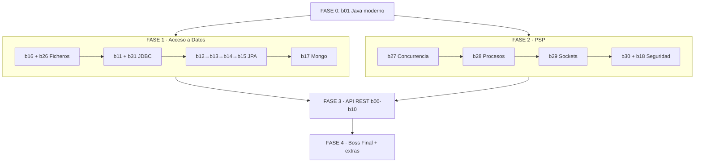

# RUTA DE ESTUDIO · Adelantar 2º DAM con esta Masterclass

> **Para quién es esto:** alumno que ha terminado **1º de DAM** y quiere usar los 254
> ejercicios de esta masterclass para **llegar a 2º con los módulos clave medio ganados**.
>
> **Qué NO es esto:** no es el `ROADMAP_BUILD_MASTERCLASS.md` (ese explica cómo se *construyen*
> los bloques). Esto es el **orden en que TÚ debes estudiarlos**, optimizado para 2º DAM,
> no de `b00` a `b31` en fila.

---

## 0. Idea central: esta masterclass NO va en orden de dificultad para 2º

El proyecto está ordenado para construir **una API REST profesional** (`b00` → `b31`).
Pero los módulos de 2º DAM que esto cubre tienen **otro orden lógico**. Si vas en fila
del 1 al 254, tardas semanas en tocar lo que más pesa en los exámenes de 2º (concurrencia,
sockets, acceso a datos). Esta ruta **reordena** los bloques por módulo y por urgencia.

### Qué módulos de 2º DAM cubre (y cuáles no)

| Módulo de 2º DAM | ¿Lo cubre esta masterclass? | Bloques |
|---|---|---|
| **0486 Acceso a Datos (AD)** | ✅ **Sí, a fondo (6/6 RA)** | b11, b12, b13, b14, b15, b16, b17, b26, b31, b46 |
| **0490 Programación de Servicios y Procesos (PSP)** | ✅ **Sí, a fondo (5/5 RA)** | b18, b27, b28, b29, b30 + toda la API REST |
| **0488 Desarrollo de Interfaces (DI)** | ✅ **Sí (8/8 RA)** | b32–b39 (JavaFX) + b44 (naturales) + b47 (pruebas); b25 (Thymeleaf) de apoyo |
| **0489 Programación Multimedia y Móvil (PMDM)** | ✅ **Java completo + móvil guion** | b40 (media), b41 (2D), b45 (3D), b42 (móvil, guion) |
| **0491 Sistemas de Gestión Empresarial (SGE)** | ✅ **Sí (vertiente Java)** | b43 (ERP/CRM Odoo: ETL, BI, sync) |
| 0492 Proyecto / 0493 FCT | ✅ Indirecto (te da un proyecto entero) | b24 Boss Final |

> **Conclusión (actualizada 2026-06-26):** la masterclass cubre **los cinco módulos técnicos de 2º
> DAM** a nivel de RA frente al BOE 2023 (b00–b47, 362 ejercicios). Acceso a Datos y PSP siguen
> siendo los más a fondo, pero DI, PMDM y SGE **ya están construidos** (antes esta nota decía que
> "iban por otro lado": era cierto en una versión temprana del proyecto, ya no). Detalle RA→bloque
> en `ROADMAP_CIERRE_BOE2023.md`.

---

## 1. Cómo se trabaja cada bloque (no te saltes esto)

El flujo está en [README_GUIA_TERMINAL.md](README_GUIA_TERMINAL.md). Resumen operativo:

1. **Activa solo el bloque** que estudias (rendimiento del IDE):
   ```bash
   python bloque.py b27    # Windows / Linux (mismo comando)
   ```
2. **Lee la teoría primero**: `teoria/NN_*.md` (tiene diagramas Mermaid).
3. Abre el ejercicio, lee el Javadoc y los `// TODO 1..10:`.
4. Implementa. Corre el `main` (`*Playground`) para ver salida.
5. **Valida con el test** hasta verde:
   ```powershell
   mvn test -Dtest=Ej215ThreadRunnableTest
   ```
6. Marca el checkbox en [SYLLABUS.md](SYLLABUS.md).
7. Antes de cualquier commit o `mvn test` global: `python bloque.py todos`.

> **Regla de oro:** un ejercicio está hecho **solo cuando el test está en verde**.
> Los tests nacen en rojo a propósito. Si llevas 3 días leyendo y sin escribir código,
> te caíste en el bucle de tutoriales.

> Los **retos extra** (`retoExtra01..10`, lanzan `UnsupportedOperationException`) son
> opcionales: hazlos en segunda pasada o si quieres nota de sobresaliente. Para *adelantar*
> 2º, con los 10 TODOs core de cada ejercicio vas servido.

---

## 2. La ruta recomendada (orden global)

Cinco fases. Cada una es autocontenida y deja una habilidad cerrada de 2º DAM.
**Sigue este orden**, no el numérico.

```
FASE 0  Puente desde 1º        → b01            (repaso Java moderno)
FASE 1  ACCESO A DATOS (AD)    → b16→b26→b11→b31→b12→b13→b14→b15→b17
FASE 2  PSP (procesos/red)     → b27→b28→b29→b30→b18
FASE 3  La API REST (proyecto) → b00→b02→b03→b04→b05→b06→b07→b08→b09→b10 (+19,20,21)
FASE 4  Integración y extras   → b24 Boss Final, b25 Thymeleaf, b22/b23 DevOps
```

¿Por qué este orden y no el del proyecto?

- **AD y PSP primero** porque son los módulos de 2º que esto cubre de verdad y donde
  más se suspende. Llegar a septiembre con esto medio dominado es la mayor ventaja.
- **Spring/REST después**: es potentísimo para tu proyecto y la FCT, pero en el
  *temario oficial* de 2º pesa menos que AD y PSP. Es tu "superpoder" extra.
- **b01 primero del todo** porque records, streams, genéricos y `Optional` los vas a
  usar en TODOS los bloques siguientes.



---

## FASE 0 · Puente desde 1º DAM — *Java moderno* (1 semana)

Antes de tocar nada de 2º, asegura las herramientas de Java que en 1º no se ven a fondo.

| Bloque | Ejercicios | Qué ganas | Prioridad |
|---|---|---|---|
| **b01_java** | 011–022 | Records (DTO), `Optional`, Streams, genéricos, `sealed`, `java.time`, `equals/hashCode` | **Imprescindible** |

- **Ej011 Records** y **Ej013/014 Streams** son los que más usarás después.
- **Ej021 ConcurrencyBasics** es el aperitivo de la FASE 2 (PSP): no lo exprimas aquí,
  se profundiza en `b27`.
- Teoría: [teoria/01_Java_Moderno_para_APIs.md](teoria/01_Java_Moderno_para_APIs.md).

✅ **Checkpoint:** sabes leer/escribir un `record`, encadenar `stream().filter().map().collect()`
y usar `Optional` sin `NullPointerException`.

---

## FASE 1 · ACCESO A DATOS (módulo 0486) — el grande (4–6 semanas)

Es el módulo que **más** adelantas. Orden interno pensado para ir de lo simple (ficheros)
a lo complejo (ORM), que es como lo da el temario de AD.

### 1A · Ficheros y persistencia básica — *AD RA1*
| Bloque | Ejercicios | Tema |
|---|---|---|
| **b16_xml** | 143–148 | XML (JAXB, Jackson, DOM/SAX), repo en fichero, CSV |
| **b26_io** | 207–214 | `java.io` (byte/char streams), `RandomAccessFile`, serialización, **NIO.2** (`Path`/`Files`) |

> Empieza por **b26** si quieres la base pura de `java.io`/NIO.2 (lo que pregunta el examen
> de AD sobre ficheros), o por **b16** si prefieres entrar por XML/CSV. Recomendado: **b26 → b16**.

### 1B · Bases de datos relacionales con JDBC — *AD RA2*
| Bloque | Ejercicios | Tema |
|---|---|---|
| **b11_jdbc** | 093–102 | `Connection`, `PreparedStatement` (inyección SQL), `ResultSet`, DAO, transacciones, pool, `JdbcTemplate` |
| **b31_oodb** | 249–254 | `CallableStatement` (procedimientos), tipos objeto-relacionales, OQL *(opcional, cierra RA4)* |

> **b31 es opcional/baja prioridad**: cubre tecnología marginal (BD objeto puras), pero
> sus ejercicios 249–250 (**procedimientos almacenados**) sí entran en AD. Haz al menos esos dos.

### 1C · ORM con JPA / Hibernate — *AD RA3* (el corazón de AD)
| Bloque | Ejercicios | Tema |
|---|---|---|
| **b12_jpa** | 103–114 | `@Entity`, `JpaRepository`, JPQL, queries derivadas, ciclo de vida |
| **b13_rel** | 115–122 | Relaciones `@OneToMany`/`@ManyToOne`/`@ManyToMany`, cascade, LAZY/EAGER, N+1 |
| **b14_jpaadv** | 123–132 | Transacciones, aislamiento, locking, caché, auditoría, herencia, Flyway |
| **b15_query** | 133–142 | Paginación, `Sort`, `Specification`, Criteria, proyecciones, agregaciones |

> Esto es **mucho más** de lo que pide AD en 2º, pero es justo donde marcas diferencia.
> Mínimo para aprobar AD: **b12 + b13**. El resto (b14, b15) es maestría.

### 1D · NoSQL — *AD RA4/RA5*
| Bloque | Ejercicios | Tema |
|---|---|---|
| **b17_nosql** | 149–154 | MongoDB: `@Document`, `MongoRepository`, `MongoTemplate`, agregación |

> Necesita Docker: `docker compose up -d mongo`.

✅ **Checkpoint FASE 1:** sabes leer/escribir ficheros, hacer un CRUD con JDBC puro **y**
con JPA, mapear relaciones entre entidades y consultar Mongo. **Acceso a Datos: ganado.**

---

## FASE 2 · PSP (módulo 0490) — procesos, hilos y red (4–5 semanas)

El otro módulo grande. Es donde más gente suspende porque concurrencia y sockets
son abstractos. Aquí están aterrizados en código que corre.

| Orden | Bloque | Ejercicios | RA PSP | Tema | Prioridad |
|---|---|---|---|---|---|
| 1 | **b27_concur** | 215–226 | RA2 | Hilos, `synchronized`, `wait/notify`, `ExecutorService`, locks, deadlock | **Máxima** |
| 2 | **b28_proc** | 227–232 | RA1 | `ProcessBuilder`, IPC por pipes, procesos en paralelo | Media |
| 3 | **b29_sockets** | 233–240 | RA3 | TCP/UDP, servidor multicliente, protocolo propio | **Máxima** |
| 4 | **b30_crypto** | 241–248 | RA5 | Hash, AES, RSA, firma digital, HMAC, TLS | Alta |
| 5 | **b18_sec** | 155–164 | RA5 | Spring Security + JWT, roles *(es Spring; déjalo si aún no viste FASE 3)* |

Notas de orden:
- **b27 antes que b29**: el servidor multicliente de sockets usa hilos. Concurrencia es prerequisito.
- **b28 (procesos)** es el más independiente; puedes intercalarlo cuando quieras.
- **b18 (Security/JWT)** es PSP·RA5 pero está montado sobre Spring. Puedes dejarlo para
  el final de la FASE 3 si todavía no controlas Spring Boot. La cripto pura (b30) no necesita Spring.
- Los tests de sockets/hilos usan timeouts y puertos efímeros: **no metas `Thread.sleep` a ciegas**.

✅ **Checkpoint FASE 2:** entiendes una condición de carrera y sabes arreglarla; levantas
un servidor TCP que atiende a varios clientes a la vez; ciframos y firmamos datos. **PSP: ganado.**

---

## FASE 3 · La API REST con Spring Boot — tu superpoder (5–7 semanas)

No está en el temario "puro" de ningún módulo de 2º como tal, pero es **lo que te hace
empleable** y la base de tu Proyecto y FCT. Aquí sí conviene ir **en orden numérico**,
porque cada bloque construye sobre el anterior hasta tener una API completa.

| Bloque | Ejercicios | Tema |
|---|---|---|
| **b00_http** | 001–010 | Fundamentos HTTP (request/response, status, verbos, REST, caché) |
| **b02_json** | 023–028 | JSON y Jackson |
| **b03_core** | 029–038 | Spring IoC / inyección de dependencias |
| **b04_boot** | 039–044 | Configuración, perfiles, `application.yml` |
| **b05_web** | 045–054 | Controllers REST (GET/POST/PUT/PATCH/DELETE, CRUD) |
| **b06_webadv** | 055–062 | Negociación de contenido, CORS, ficheros, ETag, filtros |
| **b07_dto** | 063–068 | DTOs y mapeo |
| **b08_valid** | 069–076 | Bean Validation |
| **b09_err** | 077–084 | Manejo de errores (RFC 7807) |
| **b10_arch** | 085–092 | Arquitectura por capas, DAO/Repository, hexagonal |
| **b19_test** | 165–176 | Testing (JUnit5, Mockito, MockMvc, Testcontainers) |
| **b20_obs** | 177–182 | OpenAPI/Swagger, Actuator |
| **b21_perf** | 183–188 | Caché, async, rate limiting, resiliencia |

> **Atajo posible:** si solo quieres adelantar AD/PSP y no Spring, puedes posponer toda
> la FASE 3 a después del verano. Pero `b00` (HTTP) y `b05` (controllers) son tan formativos
> que merece la pena al menos esos dos.

✅ **Checkpoint FASE 3:** construyes una API REST con validación, errores estándar,
capas limpias y tests. Estás por encima de la media de 2º DAM.

---

## FASE 4 · Integración y extras (a tu ritmo)

| Bloque | Ejercicios | Tema | Cuándo |
|---|---|---|---|
| **b24_boss** | 199–200 | **Boss Final**: API corporativa completa que integra TODO | Cuando termines FASE 3 |
| **b25_thymeleaf** | 201–206 | Plantillas + generación de PDF (roza DI·0488) | Cuando quieras |
| **b22_deploy** | 189–194 | Docker, Compose, despliegue | Antes de la FCT |
| **b23_ci** | 195–198 | CI/CD, GitHub Actions, calidad | Antes de la FCT |

El **Boss Final (b24)** es tu examen de verdad: si lo sacas, dominas el stack entero.

---

## 3. Calendario sugerido (verano para llegar fuerte a 2º)

Asumiendo ~10–12 h/semana. Ajústalo a tu ritmo; **mejor poco y constante que atracones**.

| Semanas | Fase | Meta |
|---|---|---|
| 1 | FASE 0 | b01 completo |
| 2–7 | FASE 1 | Acceso a Datos (mínimo b26, b16, b11, b12, b13) |
| 8–12 | FASE 2 | PSP (mínimo b27, b29, b30) |
| 13–19 | FASE 3 | API REST (al menos hasta b10) |
| 20+ | FASE 4 | Boss Final + DevOps |

> Si solo tienes tiempo para **una cosa**, haz la **FASE 1 (Acceso a Datos)**: es el módulo
> con más horas y más peso en 2º. Si tienes para dos, añade **FASE 2 (PSP)**.

---

## 4. Mínimos para "ir con ventaja" (versión exprés)

Si vas justo de tiempo, este es el subconjunto que más rentabiliza el adelanto:

- **AD:** `b26` (ficheros) · `b11` (JDBC) · `b12` + `b13` (JPA y relaciones)
- **PSP:** `b27` (concurrencia) · `b29` (sockets) · `b30` (cripto)
- **Java base:** `b01`

Con esos 8 bloques llegas a 2º habiendo tocado lo esencial de los dos módulos duros.

---

## 5. Tabla resumen: bloque → módulo de 2º DAM

| Bloque | Módulo 2º DAM | RA | Fase |
|---|---|---|---|
| b01 | (base Java) | — | 0 |
| b11, b31 | AD 0486 | RA2 (JDBC, procedimientos) | 1 |
| b12, b13, b14, b15 | AD 0486 | RA3 (ORM/JPA) | 1 |
| b16, b26 | AD 0486 | RA1 (ficheros) | 1 |
| b17 | AD 0486 | RA4/RA5 (NoSQL) | 1 |
| b27 | PSP 0490 | RA2 (multihilo) | 2 |
| b28 | PSP 0490 | RA1 (multiproceso) | 2 |
| b29 | PSP 0490 | RA3 (sockets) | 2 |
| b30, b18 | PSP 0490 | RA5 (seguridad/cripto) | 2 |
| b00–b10, b19–b23 | (extra REST / Proyecto / FCT) | RA4 servicios red | 3–4 |
| b25 | roza DI 0488 | — | 4 |

---

*Documento de estudio. Para el detalle de cómo está construido cada bloque, ver
[ROADMAP_BUILD_MASTERCLASS.md](ROADMAP_BUILD_MASTERCLASS.md) y [SYLLABUS.md](SYLLABUS.md).*
