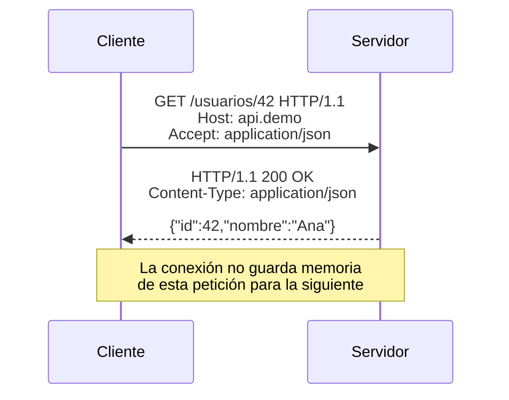
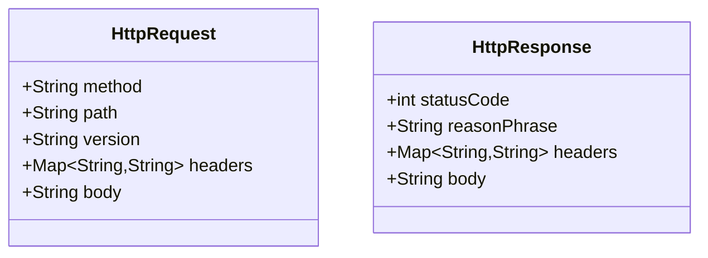
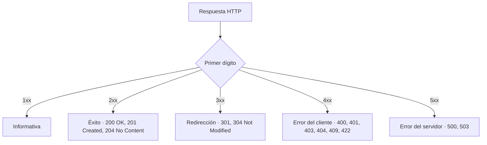
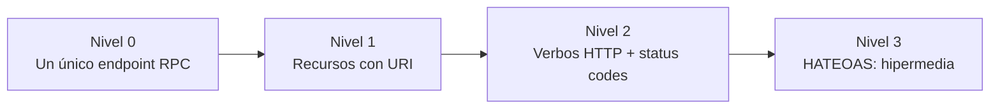
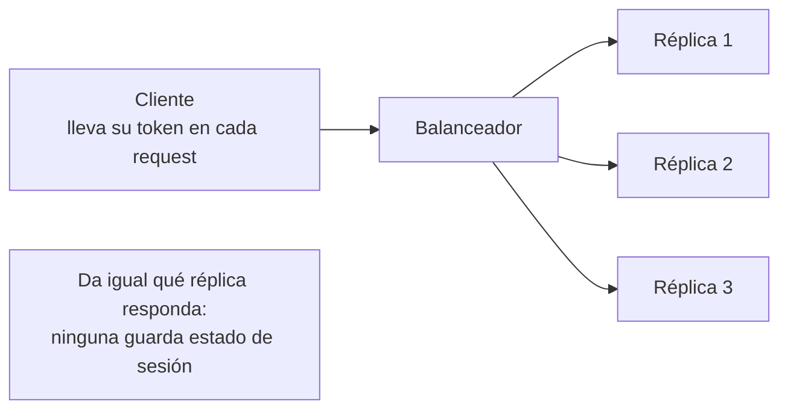
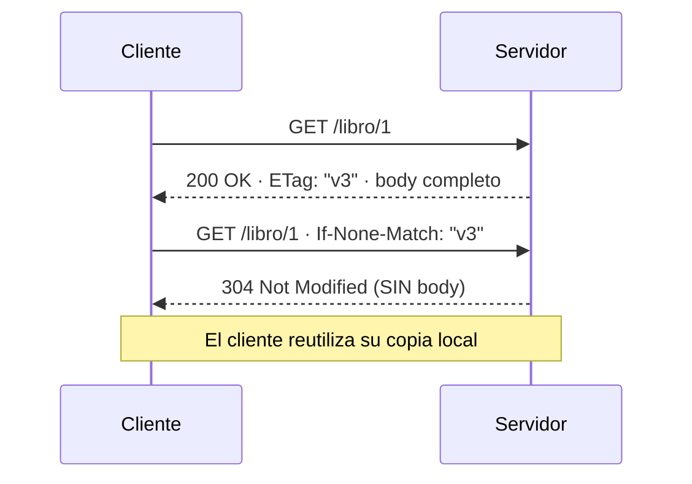

# Bloque 0 · Fundamentos HTTP y Web

> Antes de Spring, antes de JPA, antes de nada: **HTTP**. Una API REST no es más que
> un programa que habla HTTP con disciplina. Si dominas esto, el resto es sintaxis.

## Cómo usar este documento

Cada sección termina con un recuadro **"Lo practicas en…"** que apunta al ejercicio
correspondiente. El flujo ideal: lee UNA sección → haz SU ejercicio → vuelve. No
leas el documento entero de golpe; la teoría sin código se evapora en 48 horas.

| Sección | Tema | Ejercicio |
|---|---|---|
| 0.1–0.2 | Qué es HTTP · anatomía de la petición | `Ej001HttpRequestParser` |
| 0.3 | Anatomía de la respuesta | `Ej002HttpResponseBuilder` |
| 0.4 | Códigos de estado | `Ej003StatusCodeResolver` |
| 0.5 | Verbos, seguridad e idempotencia | `Ej004HttpMethodsSemantics` |
| 0.6 | Headers a fondo | `Ej005HeadersToolkit` |
| 0.7 | Negociación de contenido | `Ej006ContentTypeNegotiation` |
| 0.8 | URLs y query strings | `Ej007UrlAndQueryParser` |
| 0.9 | Modelado de recursos REST | `Ej008RestResourceModeler` |
| 0.10 | Modelo de madurez de Richardson | `Ej009RestMaturityRichardson` |
| 0.11 | Statelessness y caché | `Ej010StatelessAndCache` |

---

## 0.1 ¿Qué es HTTP?

HTTP es un protocolo **petición–respuesta**, **sin estado** (stateless) y **textual**
(en HTTP/1.1). El cliente manda una *request*, el servidor devuelve una *response*.
Cada intercambio es independiente: el servidor no recuerda el anterior.

Matiz de versión que conviene tener claro desde el principio: lo de "textual" es
exclusivo de HTTP/1.x. **HTTP/2 y HTTP/3 son binarios y multiplexados**: empaquetan
los mensajes en *frames* binarios y permiten varias peticiones simultáneas sobre una
sola conexión (sin el bloqueo *head-of-line* de 1.1). La **semántica** (métodos,
códigos, headers) es idéntica; cambia solo cómo se serializa por el cable. Por eso
todo lo de este bloque sigue valiendo, pero no podrías leer un HTTP/2 con un editor
de texto como harás con HTTP/1.1 en `Ej001`.



Tres consecuencias prácticas de que sea **texto plano**:

1. Puedes leer (y escribir) una petición HTTP con un editor de texto. De hecho,
   eso es exactamente lo que harás en `Ej001`: parsearla "a mano".
2. Todo lo que viaja es `String` hasta que alguien lo interpreta. Los bugs de
   parsing (espacios, mayúsculas, saltos de línea) son la primera fuente de
   errores en integraciones reales.
3. Las herramientas (`curl`, Postman, DevTools del navegador) solo te enseñan
   este texto con formato bonito. Cuando sepas leer el texto crudo, ninguna
   herramienta te resultará mágica.

### El detalle que rompe parsers: CRLF vs LF

El estándar (RFC 9112) exige que cada línea termine en `\r\n` (**CRLF**: carriage
return + line feed). En la práctica, muchísimos clientes y tests envían solo `\n`
(**LF**). Un parser robusto **tolera ambos**: la técnica habitual es buscar `\n`
como separador y luego quitar el `\r` residual con `trim()` o `replace("\r", "")`.
Lo sufrirás en primera persona en los retos extra de `Ej001`.

---

## 0.2 Anatomía de una petición (request)

```
GET /productos?categoria=libros&page=2 HTTP/1.1   ← línea de petición
Host: api.tienda.com                              ← headers
Accept: application/json
Authorization: Bearer eyJhbGc...
                                                  ← línea en blanco (separador)
{ "opcional": "cuerpo solo en POST/PUT/PATCH" }   ← body
```

Cuatro zonas, siempre en este orden:

1. **Línea de petición**: `MÉTODO RUTA VERSIÓN`, separados por **un espacio**.
   - Método: `GET`, `POST`… (la lista cerrada está en 0.5).
   - Ruta: siempre empieza por `/` en peticiones directas. Puede llevar query
     string pegada (`/buscar?q=java`).
   - Versión: `HTTP/1.1`, `HTTP/2.0`…
2. **Headers**: una por línea, formato `Clave: Valor`. Ojo: el valor puede
   contener `:` (piensa en `Host: localhost:8080`), así que al parsear se corta
   por el **primer** `:` únicamente.
3. **Línea en blanco**: el separador sagrado. Todo lo anterior son metadatos;
   todo lo posterior es body. En texto crudo es `\n\n` (o `\r\n\r\n`).
4. **Body**: opcional. `GET` y `DELETE` no suelen llevar; `POST`/`PUT`/`PATCH` sí.



### ¿Cuánto body leo? Content-Length y chunked

El servidor necesita saber dónde acaba el body. Hay dos mecanismos:

- **`Content-Length: 27`** → el body mide exactamente 27 bytes. Leer más de lo
  declarado es una vulnerabilidad clásica (request smuggling / DoS); leer menos,
  un bug. Por eso los servidores serios cortan el body al tamaño declarado.
- **`Transfer-Encoding: chunked`** → el body llega por fragmentos de tamaño
  variable (streaming, tamaño desconocido a priori). Es incompatible con
  `Content-Length`: si aparecen ambas, gana chunked.

Esa "incompatibilidad" no es un detalle académico: es la raíz del **request
smuggling**. Si una petición llega con `Content-Length` *y* `Transfer-Encoding`
(o con **dos `Content-Length` distintos**), y el proxy de delante y el servidor de
detrás eligen un mecanismo distinto para delimitar el body, uno ve una petición y el
otro ve dos. El atacante "cuela" una petición oculta en el body de otra. Por eso la
RFC 9112 obliga a **rechazar (400) toda petición ambigua** en lugar de adivinar: ante
cabeceras de longitud contradictorias, un servidor serio no intenta ser listo, corta.

> **Lo practicas en `Ej001HttpRequestParser`**: parsear método, ruta, headers y
> body de una petición cruda. Los retos extra cubren CRLF, validación de verbos,
> versión del protocolo, query string, headers case-insensitive, `Connection:
> close`, chunked y lectura segura con `Content-Length`.

---

## 0.3 Anatomía de una respuesta (response)

La respuesta es simétrica a la petición, cambiando solo la primera línea:

```
HTTP/1.1 201 Created                  ← línea de estado: VERSIÓN CÓDIGO FRASE
Content-Type: application/json        ← headers
Location: /usuarios/43
Content-Length: 27
                                      ← línea en blanco
{"id":43,"nombre":"Ana"}              ← body
```

- **Código de estado**: número de 3 dígitos (ver 0.4). Es lo que las máquinas leen.
- **Frase de razón** (*reason phrase*): `OK`, `Created`, `Not Found`… Es para
  humanos; en HTTP/2 directamente desapareció. No tomes decisiones de código
  basándote en ella.
- Headers típicos de respuesta: `Content-Type` (qué formato tiene el body),
  `Location` (dónde quedó el recurso recién creado — obligatorio de facto en un
  201), `Content-Length`, `Cache-Control`, `ETag`.

Regla de oro al construir respuestas: **204 No Content y 304 Not Modified jamás
llevan body**. Un 201 debería llevar `Location`. Un body JSON exige
`Content-Type: application/json`.

> **Lo practicas en `Ej002HttpResponseBuilder`**: construir respuestas crudas
> válidas, línea de estado incluida, respetando estas reglas.

---

## 0.4 Códigos de estado



Regla mental: **4xx = la culpa es de quien llama**; **5xx = la culpa es del servidor**.

Los que usarás a diario diseñando APIs (apréndete ESTOS, el resto se consulta):

| Código | Nombre | Cuándo |
|---|---|---|
| 200 | OK | Lectura o actualización correcta con body de respuesta |
| 201 | Created | POST que crea recurso; añade header `Location` |
| 204 | No Content | Operación correcta sin nada que devolver (DELETE típico) |
| 301 | Moved Permanently | La URL cambió para siempre |
| 304 | Not Modified | Caché válida: "usa la copia que ya tienes" (ver 0.11) |
| 400 | Bad Request | Petición malformada: JSON inválido, parámetro ilegible |
| 401 | Unauthorized | No sé quién eres (falta autenticación o es inválida) |
| 403 | Forbidden | Sé quién eres y NO puedes hacer esto |
| 404 | Not Found | El recurso no existe (o no quiero admitir que existe) |
| 405 | Method Not Allowed | La ruta existe pero no con ese verbo |
| 409 | Conflict | Choca con el estado actual: email duplicado, versión obsoleta |
| 422 | Unprocessable Entity | Sintaxis correcta, semántica inválida (validación de negocio) |
| 429 | Too Many Requests | Rate limiting: frena |
| 500 | Internal Server Error | Excepción no controlada: el servidor tiene un bug |
| 503 | Service Unavailable | Sobrecarga o mantenimiento: reintenta luego |

Matices que diferencian a un junior de alguien que sabe HTTP:

- **401 vs 403**: 401 = "identifícate"; 403 = "te identifico perfectamente, y no".
  Detalle del estándar que casi nadie respeta: un **401 obliga a incluir la cabecera
  `WWW-Authenticate`** indicando *cómo* autenticarse (`WWW-Authenticate: Bearer` o
  `Basic realm="..."`). Es la diferencia semántica real con el 403: el 401 te dice
  qué esquema usar para reintentar; el 403 no, porque reintentar no va a servirte.
- **400 vs 422**: 400 = no entiendo lo que mandas (sintaxis); 422 = lo entiendo
  pero viola reglas de negocio. Muchas APIs lo colapsan todo en 400; ambas
  decisiones son defendibles, pero sé consistente.
- **404 deliberado**: ante un recurso ajeno, responder 404 en vez de 403 evita
  filtrar que el recurso existe (lo hace GitHub con repos privados).

```java
// Así se verá en Spring (bloque 5); por ahora, quédate con el mapeo conceptual
@GetMapping("/{id}")
public ResponseEntity<Usuario> getUsuario(@PathVariable Long id) {
    return repository.findById(id)
            .map(ResponseEntity::ok)                 // 200 OK
            .orElse(ResponseEntity.notFound().build()); // 404 Not Found
}
```

> **Lo practicas en `Ej003StatusCodeResolver`**: clasificar códigos por familia y
> elegir el código correcto para cada escenario.

---

## 0.5 Verbos y su semántica

| Verbo | Significado | ¿Seguro? | ¿Idempotente? | ¿Body? |
|---|---|---|---|---|
| GET | Leer un recurso | Sí | Sí | No |
| HEAD | Como GET pero sin body de respuesta | Sí | Sí | No |
| OPTIONS | ¿Qué operaciones soporta este recurso? (CORS) | Sí | Sí | No |
| POST | Crear / acción no encajable en otro verbo | No | **No** | Sí |
| PUT | Reemplazar el recurso COMPLETO | No | **Sí** | Sí |
| PATCH | Modificación parcial | No | No (normalmente) | Sí |
| DELETE | Borrar | No | **Sí** | No |

Dos propiedades que tienes que poder explicar sin mirar:

- **Seguro (safe)**: no modifica estado en el servidor. Un GET que borra algo es
  un crimen contra HTTP (y los crawlers de Google lo ejecutarán por ti).
- **Idempotente**: ejecutarlo N veces deja el servidor en el **mismo estado** que
  ejecutarlo 1 vez. No significa "devuelve lo mismo": el primer DELETE da 204 y
  el segundo 404, pero el estado del servidor (recurso borrado) es idéntico →
  DELETE **es** idempotente.

¿Por qué importa la idempotencia? **Reintentos**. Si mandas un PUT y se corta la
red sin recibir respuesta, puedes reintentar a ciegas: el resultado será el mismo.
Con POST no: podrías crear el recurso dos veces. Toda la lógica de reintentos de
clientes HTTP, proxies y gateways se apoya en esta tabla.

**PUT vs PATCH** con el mismo recurso `{"nombre":"Ana","email":"ana@x.com"}`:

```http
PUT /usuarios/42          → body: {"nombre":"Ana María"}
                            resultado: {"nombre":"Ana María"}  ← email DESAPARECE
PATCH /usuarios/42        → body: {"nombre":"Ana María"}
                            resultado: {"nombre":"Ana María","email":"ana@x.com"}
```

PUT reemplaza el documento entero (lo que no mandas, se va). PATCH aplica el
delta. Por eso PUT es idempotente y PATCH en general no se garantiza.

> **Lo practicas en `Ej004HttpMethodsSemantics`**: clasificar verbos por
> seguridad/idempotencia y razonar escenarios de reintento.

---

## 0.6 Headers a fondo

Los headers son los metadatos del intercambio. Reglas del estándar que SÍ se
aplican en código real:

1. **Los nombres son case-insensitive**: `Content-Type`, `content-type` y
   `CONTENT-TYPE` son la misma cabecera. Tu código debe buscar ignorando
   mayúsculas (en Java: `equalsIgnoreCase`, o normaliza claves con `toLowerCase`).
2. **Los valores conservan su caso** y pueden llevar espacios alrededor que se
   recortan al parsear: `Host:   api.demo  ` → valor `api.demo`.
3. **El valor puede contener `:`**: corta solo por el primero.

Mini-catálogo por dirección:

| Header | Dirección | Para qué |
|---|---|---|
| `Host` | request | Dominio destino (obligatoria en HTTP/1.1) |
| `Accept` | request | Formatos que el cliente acepta como respuesta |
| `Content-Type` | ambas | Formato del body QUE SE ENVÍA en ese mensaje |
| `Content-Length` | ambas | Tamaño del body en bytes |
| `Authorization` | request | Credenciales: `Bearer <token>`, `Basic <base64>` |
| `User-Agent` | request | Quién es el cliente |
| `Location` | response | Dónde está el recurso (201, 3xx) |
| `Cache-Control` | ambas | Política de caché (`no-store`, `max-age=3600`) |
| `ETag` / `If-None-Match` | resp / req | Validación de caché (ver 0.11) |
| `Connection` | ambas | `keep-alive` (reusar conexión TCP) o `close` |

Confusión clásica: **`Accept` habla del futuro** ("quiero que ME respondas en
JSON"), **`Content-Type` habla del presente** ("esto que TE mando es JSON"). Un
POST puede llevar ambas y con valores distintos.

Una cabecera de seguridad que verás siempre en producción: **`Strict-Transport-Security`**
(HSTS). La manda el servidor en la respuesta (`Strict-Transport-Security: max-age=31536000`)
y obliga al navegador a usar **solo HTTPS** con ese dominio durante el tiempo indicado,
aunque el usuario teclee `http://`. El porqué: un `Authorization: Bearer <token>` o un
`Basic <base64>` viajando por HTTP plano es texto legible para cualquiera en la red;
HTTPS lo cifra y HSTS impide la degradación a HTTP. Regla mínima: **ninguna API que
maneje credenciales debería aceptar tráfico HTTP sin cifrar.**

> **Lo practicas en `Ej005HeadersToolkit`**: parsear, normalizar y consultar
> headers respetando case-insensitivity y valores con `:`.

---

## 0.7 Negociación de contenido

El mismo recurso puede representarse en JSON, XML o CSV. El cliente expresa
preferencias en `Accept` y el servidor elige:

```http
Accept: application/json, application/xml;q=0.8, */*;q=0.1
```

- Cada alternativa lleva un **factor de calidad `q`** entre 0 y 1 (por defecto
  `q=1.0` si no aparece). Mayor q = más preferido.
- `*/*` significa "cualquier cosa"; `application/*` cualquier subtipo de
  application.
- El servidor elige el formato soportado con mayor q. Si no soporta ninguno:
  **406 Not Acceptable**.

En el ejemplo: JSON (q=1) > XML (q=0.8) > lo que sea (q=0.1). Si el servidor solo
sabe generar CSV, encaja en `*/*` y responde CSV; si el cliente no hubiera puesto
`*/*`, recibiría 406.

Estructura de un media type: `tipo/subtipo;parámetros` →
`text/html;charset=utf-8`. Al comparar tipos se ignoran los parámetros.

> **Lo practicas en `Ej006ContentTypeNegotiation`**: parsear `Accept` con factores
> q y elegir la representación correcta (o 406).

---

## 0.8 URLs y query strings

```
https://api.tienda.com:443/v1/productos?categoria=libros&page=2#seccion
└─┬─┘   └──────┬──────┘└┬┘└─────┬─────┘└──────────┬──────────┘└──┬───┘
esquema      host      puerto  path           query string    fragmento
```

- El **fragmento** (`#...`) nunca llega al servidor: es cosa del navegador.
- La **query string** son pares `clave=valor` separados por `&`. Una clave puede
  repetirse (`?tag=java&tag=http`) y un valor puede faltar (`?debug`).
- **Percent-encoding**: los caracteres reservados viajan escapados. Un espacio es
  `%20` (o `+` en formularios), `ñ` es `%C3%B1`. En Java: `URLDecoder.decode(s,
  StandardCharsets.UTF_8)`. Decodifica SIEMPRE después de separar por `&` y `=`,
  nunca antes (un `%26` decodificado antes de tiempo se convierte en un `&` falso
  que rompe el split).

> **Lo practicas en `Ej007UrlAndQueryParser`**: trocear URLs y parsear query
> strings con repetidos, valores vacíos y percent-encoding.

---

## 0.9 Modelado de recursos REST

REST piensa en **recursos** (sustantivos) sobre los que actúan los verbos HTTP,
no en acciones (verbos en la URL). El contraste:

```
RPC (mal)                          REST (bien)
POST /crearUsuario                 POST   /usuarios
POST /obtenerUsuario?id=42         GET    /usuarios/42
POST /borrarUsuario?id=42          DELETE /usuarios/42
POST /listarPedidosDeUsuario       GET    /usuarios/42/pedidos
```

Convenciones que el sector da por supuestas:

1. **Sustantivos en plural**: `/productos`, no `/producto` ni `/getProductos`.
2. **Jerarquía = pertenencia**: `/usuarios/42/pedidos/7` es el pedido 7 DEL
   usuario 42. No anides más de 2 niveles: se vuelve ilegible.
3. **Colección vs elemento**: `GET /productos` lista (200 con array, aunque esté
   vacío); `GET /productos/99` devuelve uno (o 404).
4. **Filtros, orden y paginación van en query**, no en el path:
   `/productos?categoria=libros&sort=precio&page=2`.
5. **Las acciones que no encajan en CRUD** se modelan como sub-recursos:
   `POST /pedidos/7/cancelacion` (o, pragmáticamente, `POST /pedidos/7/cancelar`;
   puristas y pragmáticos llevan 20 años discutiendo esto).

Tabla CRUD completa de referencia:

| Operación | Verbo + ruta | Éxito | Fallo típico |
|---|---|---|---|
| Listar | `GET /productos` | 200 | — |
| Detalle | `GET /productos/{id}` | 200 | 404 |
| Crear | `POST /productos` | 201 + `Location` | 400/422 |
| Reemplazar | `PUT /productos/{id}` | 200 (o 204) | 404 |
| Modificar | `PATCH /productos/{id}` | 200 | 404, 409 |
| Borrar | `DELETE /productos/{id}` | 204 | 404 |

> **Lo practicas en `Ej008RestResourceModeler`**: convertir operaciones de negocio
> en rutas + verbos + códigos correctos.

---

## 0.10 Modelo de madurez de Richardson

Una escalera para medir "cuán REST" es una API:



- **Nivel 0**: un solo endpoint (`POST /api`) y el body decide qué hacer. SOAP, RPC.
- **Nivel 1**: URIs distintas por recurso (`/usuarios`, `/pedidos`), pero todo es
  POST y todo devuelve 200.
- **Nivel 2**: verbos con semántica + códigos de estado correctos. **Aquí vive el
  99% de las APIs "REST" reales, y está bien.** Es el objetivo de este bootcamp.
- **Nivel 3 (HATEOAS)**: las respuestas incluyen enlaces que indican qué puedes
  hacer a continuación:

```json
{
  "id": 7, "estado": "PENDIENTE",
  "_links": {
    "self":     { "href": "/pedidos/7" },
    "cancelar": { "href": "/pedidos/7/cancelacion", "method": "POST" },
    "pagar":    { "href": "/pedidos/7/pago", "method": "POST" }
  }
}
```

El cliente no necesita hardcodear URLs: navega los enlaces como tú navegas una
web. Elegante, pero poco adoptado porque los clientes reales (apps móviles, SPAs)
acaban hardcodeando igualmente.

> **Lo practicas en `Ej009RestMaturityRichardson`**: clasificar APIs por nivel y
> detectar qué les falta para subir el siguiente escalón.

---

## 0.11 Statelessness y caché

**Stateless**: cada request lleva TODO lo necesario para procesarla (token de
autenticación incluido); el servidor no guarda sesión entre peticiones. ¿Premio?
Escalado horizontal trivial: cualquier réplica del servidor puede atender
cualquier petición, sin "afinidad de sesión".



¿Y si el cliente pide lo mismo 50 veces? Para eso está la **caché HTTP**, cuyo
mecanismo de validación es el dúo `ETag` / `If-None-Match`:



1. El servidor calcula una **huella** del recurso (hash del contenido, versión…)
   y la manda en `ETag: "v3"`.
2. El cliente guarda body + etag. La próxima vez pregunta con
   `If-None-Match: "v3"`.
3. Si la huella actual coincide → **304 sin body** (ahorro de ancho de banda y
   de serialización). Si no coincide → 200 con el contenido nuevo y nuevo ETag.

El otro mando de la caché es `Cache-Control` (en la respuesta):
`max-age=3600` (cachea 1 hora sin preguntar), `no-cache` (cachea pero revalida
con ETag cada vez), `no-store` (ni se te ocurra guardar esto: datos sensibles).

> **Lo practicas en `Ej010StatelessAndCache`**: implementar la lógica
> ETag/If-None-Match y decidir cuándo responder 200 vs 304.

---

## Errores comunes del bloque (apréndelos antes de cometerlos)

| # | Error | Antídoto |
|---|---|---|
| 1 | Cortar headers por TODOS los `:` (`split(":")` rompe `Host: localhost:8080`) | `split(":", 2)` o `indexOf(':')` |
| 2 | Buscar headers respetando mayúsculas | Nombres case-insensitive siempre |
| 3 | Asumir que las líneas acaban en `\n` (o en `\r\n`) | Tolerar ambos: separa por `\n`, limpia `\r` |
| 4 | Devolver body en un 204 o un 304 | Esos códigos NUNCA llevan body |
| 5 | `startsWith()` / `contains()` con un regex dentro | Esos métodos comparan literales; regex es `matches()` |
| 6 | Decodificar percent-encoding antes de separar la query | Primero split por `&` y `=`, luego decode |
| 7 | Verbos en la URL (`/crearUsuario`) | Sustantivos + verbo HTTP |
| 8 | "DELETE no es idempotente porque la 2ª vez da 404" | Idempotencia = mismo ESTADO del servidor, no misma respuesta |
| 9 | Confundir `Accept` (lo que quiero recibir) con `Content-Type` (lo que mando) | Futuro vs presente |
| 10 | Leer el body ignorando `Content-Length` | Corta al tamaño declarado: lo extra no es tuyo |
| 11 | "Adivinar" el body si llegan dos `Content-Length` o CL + chunked | Petición ambigua = 400; no inventes (request smuggling) |
| 12 | Responder 401 sin cabecera `WWW-Authenticate` | El 401 debe decir cómo autenticarse; si no, usa 403 |

## Chuleta final del bloque

```
REQUEST  = MÉTODO SP RUTA SP VERSIÓN \n  headers \n  LÍNEA-EN-BLANCO  body
RESPONSE = VERSIÓN SP CÓDIGO SP FRASE \n headers \n  LÍNEA-EN-BLANCO  body

Seguros:       GET HEAD OPTIONS
Idempotentes:  GET HEAD OPTIONS PUT DELETE
Con body:      POST PUT PATCH

2xx éxito · 3xx redirección · 4xx culpa del cliente · 5xx culpa del servidor
201 → Location · 204/304 → sin body · 401 quién eres · 403 no puedes
401 → lleva WWW-Authenticate · HTTP/2 = binario y multiplexado
Accept = quiero recibir · Content-Type = te estoy mandando
ETag/If-None-Match → 304 = usa tu copia
CL + chunked o doble CL = petición ambigua → 400 (request smuggling)
```

## Autoevaluación (responde sin mirar; si fallas 2+, relee la sección)

1. ¿Por qué DELETE es idempotente si la segunda llamada devuelve 404? *(0.5)*
2. `Host: localhost:8080` — ¿clave y valor exactos tras parsear? *(0.6)*
3. Un cliente manda `Accept: text/csv` y solo generas JSON. ¿Código? *(0.7)*
4. ¿Qué responde un servidor con caché válida y qué header lo decidió? *(0.11)*
5. Ruta REST para "los pedidos del usuario 42, página 3". *(0.8, 0.9)*
6. ¿Qué diferencia hay entre 400 y 422? ¿Y entre 401 y 403? *(0.4)*
7. ¿Por qué un PUT se puede reintentar a ciegas y un POST no? *(0.5)*
