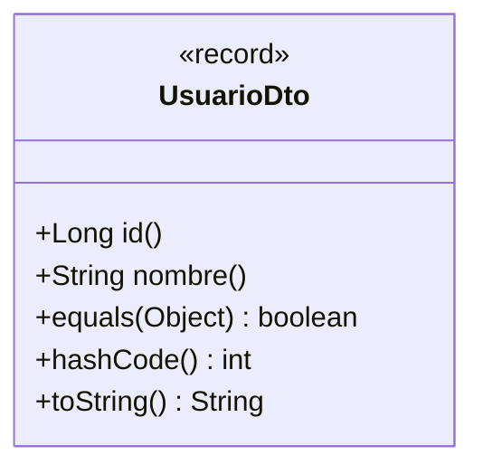
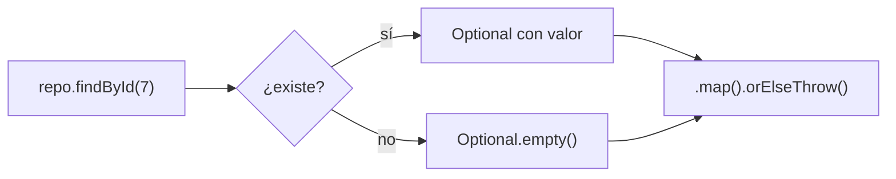
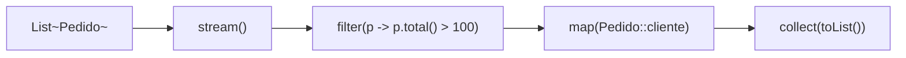
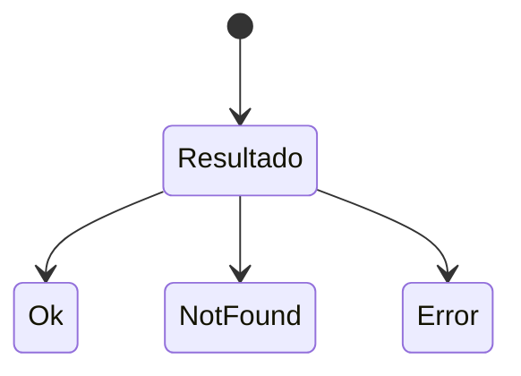

# Bloque I · Java moderno para APIs

> Vienes de Java hasta interfaces. Las APIs reales usan herramientas que DAM1 roza
> de pasada: `record`, `Optional`, streams, genéricos serios, `sealed`, concurrencia.
> Sin esto, Spring se siente mágico; con esto, se siente lógico.

## Cómo usar este documento

Igual que en el bloque 0: lee UNA sección → haz SU ejercicio → vuelve. Cada
sección termina con el recuadro **"Lo practicas en…"**.

| Sección | Tema | Ejercicio |
|---|---|---|
| 1.1 | Records: el DTO inmutable | `Ej011Records` |
| 1.2 | Optional: el fin del NPE | `Ej012OptionalSafeAccess` |
| 1.3 | Streams básicos | `Ej013StreamsBasics` |
| 1.4 | Streams avanzados (collectors) | `Ej014StreamsAdvanced` |
| 1.5 | Genéricos serios | `Ej015GenericsRepository` |
| 1.6 | Wildcards y varianza | `Ej016WildcardsVariance` |
| 1.7 | Interfaces funcionales y lambdas | `Ej017FunctionalInterfaces` |
| 1.8 | Sealed + pattern matching | `Ej018SealedPatternMatching` |
| 1.9 | Excepciones y try-with-resources | `Ej019ExceptionsAndTryWith` |
| 1.10 | java.time | `Ej020DateTimeApi` |
| 1.11 | Concurrencia mínima viable | `Ej021ConcurrencyBasics` |
| 1.12 | Contratos equals/hashCode | `Ej022EqualsHashCodeContracts` |

---

## 1.1 `record`: el DTO inmutable

Un `record` es una clase **inmutable** cuyo único propósito es transportar datos.
El compilador genera por ti: constructor canónico, accesores (`id()`, no
`getId()`), `equals`, `hashCode` y `toString`.

```java
public record UsuarioDto(Long id, String nombre) {}
```

Eso son ~40 líneas de la clase clásica equivalente, gratis. Y como es inmutable,
es seguro compartirla entre hilos y usarla como clave de mapa.



Tres herramientas que convierten un record de "struct tonta" a DTO de producción:

**1. Constructor compacto** — valida ANTES de asignar, sin repetir parámetros:

```java
public record UsuarioDto(Long id, String nombre, String email) {
    public UsuarioDto {                       // sin paréntesis: compacto
        if (email == null || email.isBlank())
            throw new IllegalArgumentException("email obligatorio");
        nombre = nombre.trim();               // puedes normalizar antes de asignar
    }
}
```

**2. Métodos derivados** — un record puede tener métodos (lo que no puede es
tener más estado):

```java
public record Linea(String producto, int cantidad, double precioUnitario) {
    public double total() { return cantidad * precioUnitario; }
}
```

**3. "Withers" manuales** — al ser inmutable, "modificar" = crear una copia:

```java
public UsuarioDto conNombre(String nuevo) {
    return new UsuarioDto(id, nuevo, email);
}
```

¿Por qué inmutable? Porque un DTO que no cambia no puede ser corrompido por otro
hilo, ni por un método que lo recibe y lo "arregla" por su cuenta. La mitad de
los bugs de estado desaparecen por diseño.

> **Lo practicas en `Ej011Records`**: records con validación, métodos derivados
> y copias inmutables.

---

## 1.2 `Optional`: el fin del `NullPointerException`

`Optional<T>` hace **explícito en el tipo** que un valor puede no existir. Una
búsqueda por id no devuelve `Usuario` (que podría ser null silencioso) sino
`Optional<Usuario>`: el compilador te obliga a decidir qué pasa si no está.



El kit completo:

| Método | Qué hace | Cuándo |
|---|---|---|
| `Optional.of(x)` | Envuelve x; NPE si x es null | Cuando null sería un bug |
| `Optional.ofNullable(x)` | Envuelve x o empty si es null | Frontera con código legacy |
| `map(f)` | Transforma el valor SI existe | Encadenar transformaciones |
| `flatMap(f)` | Como map cuando f ya devuelve Optional | Evitar `Optional<Optional<T>>` |
| `filter(p)` | Vacía el Optional si no cumple p | Validaciones encadenadas |
| `orElse(v)` | Valor o el default v | Default barato (ya calculado) |
| `orElseGet(sup)` | Valor o calcula el default | Default caro (solo si hace falta) |
| `orElseThrow(sup)` | Valor o lanza excepción | "Si no está, es un 404" |
| `ifPresent(c)` | Ejecuta c si hay valor | Efectos colaterales |

El patrón de oro de una API (lo verás idéntico en Spring):

```java
return repo.findById(id)
        .map(UsuarioDto::from)                       // transforma si existe
        .orElseThrow(() -> new NotFoundException(id)); // 404 si no
```

Dos reglas de estilo que separan al que entiende Optional del que lo sufre:

1. **`isPresent()` + `get()` es un anti-patrón**: es el mismo `if (x != null)`
   con más letras. Encadena `map`/`filter`/`orElse` en su lugar.
2. **Nunca uses Optional en campos ni parámetros**, solo como tipo de RETORNO.
   (Es la convención del JDK y de Spring.)

> **Lo practicas en `Ej012OptionalSafeAccess`**: cadenas de map/flatMap/filter
> sobre datos que pueden faltar.

---

## 1.3 Streams: tuberías de datos



Un stream es una **tubería**: la colección entra por un lado, pasa por etapas
declarativas y sale el resultado. Nada se modifica; todo se deriva.

Vocabulario esencial:

- **Operaciones intermedias** (devuelven otro stream, perezosas): `filter`,
  `map`, `sorted`, `distinct`, `limit`, `skip`.
- **Operaciones terminales** (disparan la ejecución): `collect`, `toList()`,
  `count`, `sum`, `anyMatch`, `findFirst`, `forEach`, `reduce`.
- Un stream **se consume una sola vez**: si necesitas dos pasadas, crea dos streams.
- Trampa silenciosa: `Stream.toList()` (Java 16+) devuelve una lista
  **inmodificable**. Si luego haces `.add(...)` salta `UnsupportedOperationException`.
  Si necesitas mutarla, envuélvela: `new ArrayList<>(stream.toList())`. El viejo
  `collect(Collectors.toList())` sí da una lista mutable, pero sin garantía de tipo.

Los cuatro patrones que cubren el 80 % de la lógica de servicio:

```java
// 1. Filtrar y transformar
List<String> nombres = usuarios.stream()
        .filter(Usuario::activo).map(Usuario::nombre).toList();

// 2. Agregar (con tipos primitivos especializados: IntStream/DoubleStream)
double total = pedidos.stream().mapToDouble(Pedido::total).sum();

// 3. Buscar (devuelve Optional: conecta con 1.2)
Optional<Usuario> primero = usuarios.stream()
        .filter(u -> u.edad() > 18).findFirst();

// 4. Comprobar
boolean hayInactivos = usuarios.stream().anyMatch(u -> !u.activo());
```

> **Lo practicas en `Ej013StreamsBasics`**: filter, map, sorted, distinct y
> reducciones numéricas.

---

## 1.4 Streams avanzados: collectors

`collect(Collectors.xxx)` es donde los streams se vuelven una herramienta de
informes. Los cuatro collectors que tienes que dominar:

```java
// groupingBy: List → Map<clave, List<elemento>>
Map<String, List<Pedido>> porCliente = pedidos.stream()
        .collect(Collectors.groupingBy(Pedido::cliente));

// groupingBy con downstream: agrupa Y agrega en una pasada
Map<String, Double> totalPorCliente = pedidos.stream()
        .collect(Collectors.groupingBy(Pedido::cliente,
                 Collectors.summingDouble(Pedido::total)));

// partitioningBy: divide en exactamente dos grupos (Map<Boolean, List>)
Map<Boolean, List<Pedido>> caros = pedidos.stream()
        .collect(Collectors.partitioningBy(p -> p.total() > 100));

// joining: concatena con separador
String csv = clientes.stream().collect(Collectors.joining(", "));
```

> Dos trampas de `Collectors` que aparecen en cuanto pasas de los ejemplos:
> `groupingBy` devuelve un `HashMap` (orden no garantizado); si necesitas
> preservar el orden de inserción usa la sobrecarga
> `groupingBy(clave, LinkedHashMap::new, downstream)`. Y `toMap` **lanza**
> `IllegalStateException` ante claves duplicadas: pásale una función de fusión
> como tercer argumento (`toMap(k, v, (a, b) -> a)`) si pueden repetirse.

Y `flatMap`, la operación que aplana estructuras anidadas
(`List<Pedido>` donde cada pedido tiene `List<Linea>` → stream de TODAS las líneas):

```java
List<Linea> todas = pedidos.stream()
        .flatMap(p -> p.lineas().stream()).toList();
```

Regla mental: `map` = 1→1; `flatMap` = 1→muchos (y aplana).

> **Lo practicas en `Ej014StreamsAdvanced`**: groupingBy, partitioningBy,
> flatMap y collectors compuestos.

---

## 1.5 Genéricos serios

Sin genéricos escribirías un `UsuarioRepository`, un `PedidoRepository`… todos
idénticos. Con genéricos escribes UNO:

```java
public class InMemoryRepository<T, ID> {
    private final Map<ID, T> data = new HashMap<>();
    private final Function<T, ID> idExtractor;   // cómo sacar el id de un T

    public T save(T entity) { data.put(idExtractor.apply(entity), entity); return entity; }
    public Optional<T> findById(ID id) { return Optional.ofNullable(data.get(id)); }
}
```

Esto es EXACTAMENTE lo que hace Spring Data: `JpaRepository<Usuario, Long>`.
Cuando llegues al bloque 12 reconocerás esta firma al instante.

Conceptos que tienes que poder explicar:

- **Parámetro de tipo acotado**: `<T extends Comparable<T>>` = "cualquier T que
  sepa compararse consigo mismo". Necesario para ordenar genéricamente.
- **Método genérico**: el `<T>` puede vivir en el método, no solo en la clase:
  `public static <T> T primero(List<T> lista)`.
- **Borrado de tipos (erasure)**: en runtime `List<String>` y `List<Integer>`
  son la misma clase. Por eso no puedes hacer `new T()` ni `T[]` directamente.

> **Lo practicas en `Ej015GenericsRepository`**: un repositorio genérico
> completo con CRUD, igual que el que te dará Spring.

---

## 1.6 Wildcards y varianza: `? extends` y `? super`

La pregunta que responden: si `Perro extends Animal`, ¿es `List<Perro>` un
`List<Animal>`? **NO** (podrías meterle un Gato). Los wildcards expresan qué
relación SÍ es segura:

```java
// ? extends Animal: "una lista de Animal O CUALQUIER SUBTIPO"
double pesoTotal(List<? extends Animal> animales) {   // acepta List<Perro>
    return animales.stream().mapToDouble(Animal::peso).sum();
    // puedes LEER como Animal; NO puedes añadir (¿de qué tipo exacto es?)
}

// ? super Perro: "una lista de Perro O CUALQUIER SUPERTIPO"
void llenarDePerros(List<? super Perro> destino) {     // acepta List<Animal>, List<Object>
    destino.add(new Perro());
    // puedes AÑADIR Perros; al LEER solo obtienes Object
}
```

La regla nemotécnica universal — **PECS**: *Producer Extends, Consumer Super*.

- La colección te **produce** datos (tú lees de ella) → `? extends T`.
- La colección **consume** datos (tú escribes en ella) → `? super T`.

Es la firma real de `Collections.copy(List<? super T> dest, List<? extends T> src)`.

> **Lo practicas en `Ej016WildcardsVariance`**: métodos que aceptan jerarquías
> completas aplicando PECS correctamente.

---

## 1.7 Interfaces funcionales y lambdas

Una **interfaz funcional** tiene exactamente un método abstracto, y por eso una
lambda puede implementarla al vuelo. Las cuatro del JDK que usarás cada día:

| Interfaz | Firma | Se lee como | Ejemplo |
|---|---|---|---|
| `Predicate<T>` | `T → boolean` | "¿cumple?" | `u -> u.edad() > 18` |
| `Function<T,R>` | `T → R` | "transforma" | `Usuario::nombre` |
| `Consumer<T>` | `T → void` | "haz algo con" | `System.out::println` |
| `Supplier<T>` | `() → T` | "fabrica" | `ArrayList::new` |

Lo potente es que se **componen**:

```java
Predicate<Usuario> adulto = u -> u.edad() >= 18;
Predicate<Usuario> activo = Usuario::activo;
Predicate<Usuario> cliente = adulto.and(activo);          // composición
Predicate<Usuario> noCliente = cliente.negate();

Function<String, String> limpiar = String::trim;
Function<String, String> normalizar = limpiar.andThen(String::toLowerCase);
```

Las cuatro formas de referencia a método (`::`):

```java
String::valueOf        // estática:            x -> String.valueOf(x)
String::toLowerCase    // de instancia (sobre el parámetro): s -> s.toLowerCase()
sb::append             // de instancia (sobre un objeto concreto): x -> sb.append(x)
ArrayList::new         // constructor:          () -> new ArrayList<>()
```

> **Lo practicas en `Ej017FunctionalInterfaces`**: componer predicados y
> funciones, y crear tus propias interfaces funcionales.

---

## 1.8 `sealed` + pattern matching: resultados sin sorpresas

Una interfaz `sealed` declara su lista CERRADA de implementaciones. El premio:
el `switch` sabe que están todas y **no necesita `default`** — y si mañana
añades un caso nuevo, el compilador te marca cada switch incompleto.

```java
public sealed interface Resultado permits Ok, NotFound, Error {}
public record Ok(Object dato) implements Resultado {}
public record NotFound(String id) implements Resultado {}
public record Error(String motivo) implements Resultado {}

int statusHttp(Resultado r) {
    return switch (r) {              // exhaustivo: sin default
        case Ok ok        -> 200;
        case NotFound nf  -> 404;
        case Error err    -> 500;
    };
}
```



Las piezas del pattern matching moderno (Java 21):

```java
// instanceof con binding: comprueba Y castea en un paso
if (obj instanceof String s && s.length() > 3) { ... }

// Record pattern: destructura el record dentro del case
case Ok(Object dato) -> "valor: " + dato;

// Guarda (when): condición extra sobre el patrón
case Error e when e.motivo().contains("timeout") -> 503;
```

¿Por qué importa para APIs? Porque "el servicio devolvió OK / no encontró /
falló" es EL flujo de toda operación, y modelarlo con sealed elimina la categoría
entera de bugs "olvidé manejar ese caso".

> **Lo practicas en `Ej018SealedPatternMatching`**: jerarquía sellada de
> resultados + switch exhaustivo que la traduce a HTTP.

---

## 1.9 Excepciones bien hechas y try-with-resources

Lo que el bloque espera que domines:

**1. Checked vs unchecked.** Checked (`IOException`) = el compilador te obliga a
manejarla; unchecked (`RuntimeException` y descendientes) = no. La práctica
moderna en APIs: **excepciones de negocio unchecked** con nombre expresivo:

```java
public class RecursoNoEncontradoException extends RuntimeException {
    public RecursoNoEncontradoException(String id) {
        super("No existe el recurso " + id);
    }
}
```

(En el bloque 9 un `@ExceptionHandler` las convertirá en 404/409/422.)

**2. try-with-resources.** Todo lo que implementa `AutoCloseable` se cierra solo,
incluso si explota a mitad:

```java
try (var reader = Files.newBufferedReader(ruta)) {
    return reader.readLine();
}   // close() garantizado, sin finally
```

Puedes declarar varios recursos separados por `;` — se cierran en orden INVERSO.

**3. Encadenamiento de causas.** Al relanzar, NUNCA pierdas la excepción original:

```java
catch (SQLException e) {
    throw new RepositorioException("fallo al guardar", e);  // e = la causa
}
```

Sin la causa, el stack trace que leas a las 3 AM termina en tu wrapper y no
sabrás qué pasó de verdad.

**4. Multicatch**: `catch (IOException | SQLException e)` — un solo bloque para
varios tipos sin relación de herencia.

> **Lo practicas en `Ej019ExceptionsAndTryWith`**: excepciones propias, causas
> encadenadas y recursos que se cierran solos.

---

## 1.10 `java.time`: fechas que no muerden

Olvida `java.util.Date` (mutable, índices de mes desde 0, un desastre). La API
moderna, inmutable y thread-safe:

| Clase | Representa | Ejemplo |
|---|---|---|
| `LocalDate` | fecha sin hora ni zona | `2026-06-10` |
| `LocalTime` | hora sin fecha | `14:30:00` |
| `LocalDateTime` | fecha+hora SIN zona | `2026-06-10T14:30` |
| `Instant` | punto exacto en la línea temporal (UTC) | timestamp de máquina |
| `ZonedDateTime` | fecha+hora CON zona | reunión a las 9 de Madrid |
| `Duration` | cantidad de tiempo (horas/min/seg) | "90 minutos" |
| `Period` | cantidad de calendario (años/meses/días) | "2 meses y 3 días" |

Reglas de uso en APIs:

- **Persistencia y JSON: `Instant`** (UTC siempre). La zona horaria es un
  problema de PRESENTACIÓN, no de almacenamiento.
- **Inmutable**: `fecha.plusDays(7)` devuelve una NUEVA fecha. Olvidar reasignar
  (`fecha = fecha.plusDays(7)`) es el bug nº 1 de esta API.
- **Formateo**: `DateTimeFormatter.ISO_LOCAL_DATE`, `ofPattern("dd/MM/yyyy")`.
  El formato de intercambio de las APIs REST es ISO-8601
  (`2026-06-10T14:30:00Z`) — exactamente lo que produce `Instant.toString()`.
- **Diferencias**: `Duration.between(a, b)` para tiempo,
  `Period.between(fecha1, fecha2)` y `ChronoUnit.DAYS.between(...)` para calendario.

> **Lo practicas en `Ej020DateTimeApi`**: cálculos, formateos y conversiones
> entre estas clases.

---

## 1.11 Concurrencia mínima viable

Una API atiende cientos de peticiones simultáneas: tu código DEBE asumir
concurrencia. El kit mínimo de este bloque:

**El problema**: `contador++` son TRES operaciones (leer, sumar, escribir). Dos
hilos a la vez → se pierden incrementos. Soluciones por orden de preferencia:

```java
// 1. AtomicInteger/AtomicLong: para contadores
AtomicInteger contador = new AtomicInteger();
contador.incrementAndGet();                  // atómico de verdad

// 2. Colecciones concurrentes: para estado compartido
Map<String, Integer> visitas = new ConcurrentHashMap<>();
visitas.merge(ruta, 1, Integer::sum);        // atómico por clave

// 3. synchronized: el martillo genérico (último recurso)
synchronized (lock) { saldo += cantidad; }
```

**`CompletableFuture`**: trabajo asíncrono componible, sin bloquear el hilo:

```java
CompletableFuture<Precio> precio = CompletableFuture.supplyAsync(() -> consultarPrecio(id));
CompletableFuture<Stock>  stock  = CompletableFuture.supplyAsync(() -> consultarStock(id));

// combinar dos resultados cuando AMBOS terminen:
precio.thenCombine(stock, (p, s) -> new Ficha(p, s))
      .thenApply(Ficha::toJson)        // transformar (como map)
      .join();                         // esperar el resultado final
```

`supplyAsync` = lanza; `thenApply` = transforma; `thenCombine` = junta dos;
`join`/`get` = espera. Con eso cubres este bloque; PSP profundiza en 2º.

> Detalle que sorprende: `ConcurrentHashMap` **no admite claves ni valores
> `null`** (lanza `NullPointerException`), al contrario que `HashMap`. Es
> deliberado: en un mapa concurrente, `get` devolviendo `null` sería ambiguo
> ("no está" vs "está pero vale null"). Si necesitas representar ausencia, usa un
> valor centinela o un `Optional` como valor.

> **Lo practicas en `Ej021ConcurrencyBasics`**: contadores atómicos, mapas
> concurrentes y composición de CompletableFuture.

---

## 1.12 Los contratos `equals`/`hashCode`

Dos objetos con los mismos datos ¿son "iguales"? Solo si alguien implementó
`equals`. Y si dos objetos son equals, **DEBEN** tener el mismo `hashCode` — ese
es el contrato. Romperlo tiene un síntoma diabólico:

```java
Set<Usuario> set = new HashSet<>();
set.add(new Usuario(1L, "Ana"));
set.contains(new Usuario(1L, "Ana"));   // ¡FALSE! si hashCode no está bien
```

El `HashSet` busca por hashCode primero: si dos "iguales" devuelven hashes
distintos, busca en el cajón equivocado y no los encuentra.

Implementación canónica (cuando no puedas usar un record, que los trae gratis):

```java
@Override public boolean equals(Object o) {
    if (this == o) return true;                       // identidad
    if (!(o instanceof Usuario u)) return false;      // tipo + binding (cubre null)
    return Objects.equals(id, u.id);                  // campos relevantes
}
@Override public int hashCode() {
    return Objects.hash(id);                          // MISMOS campos que equals
}
```

Decisión de diseño que te pedirán argumentar: para **entidades** con identidad
(BD), compara solo por `id`; para **objetos de valor**, compara todos los campos
(o usa un record). Lo que nunca: usar en equals un campo que no esté en hashCode.

> **Lo practicas en `Ej022EqualsHashCodeContracts`**: implementar y verificar
> los contratos, y ver fallar un HashSet con un equals roto.

---

## Errores comunes del bloque

| # | Error | Antídoto |
|---|---|---|
| 1 | `optional.get()` sin comprobar | Encadena `map`/`orElseThrow`; `get()` casi nunca |
| 2 | Reusar un stream consumido (`IllegalStateException`) | Un stream = un uso; crea otro |
| 3 | `fecha.plusDays(7)` sin reasignar | java.time es INMUTABLE: captura el retorno |
| 4 | `List<Perro>` donde piden `List<Animal>` | No compila: usa `List<? extends Animal>` |
| 5 | equals sin hashCode (o con campos distintos) | Mismos campos en ambos, siempre |
| 6 | `contador++` compartido entre hilos | `AtomicInteger.incrementAndGet()` |
| 7 | `catch (Exception e) {}` vacío | Maneja, registra o relanza CON causa |
| 8 | Modificar la lista original dentro del stream | Streams derivan, no mutan |
| 9 | `Optional` como tipo de campo o parámetro | Solo como tipo de RETORNO |
| 10 | switch sobre sealed con `default` | Sin default: que el compilador vigile la exhaustividad |
| 11 | `.add()` sobre el resultado de `Stream.toList()` | Es inmodificable: `new ArrayList<>(...)` si vas a mutarla |
| 12 | `Collectors.toMap` con claves repetidas (`IllegalStateException`) | Pasa función de fusión: `toMap(k, v, (a,b)->a)` |
| 13 | `null` como clave/valor en `ConcurrentHashMap` | No lo admite: usa centinela o `Optional` como valor |

## Chuleta final del bloque

```
record      = DTO inmutable con equals/hashCode/toString gratis
Optional    = "puede faltar" en el tipo · map → filter → orElseThrow
Stream      = filter/map (intermedias, perezosas) → collect/count (terminales)
Collectors  = groupingBy (Map por clave) · partitioningBy (true/false) · joining
PECS        = Producer Extends (lees) · Consumer Super (escribes)
Funcionales = Predicate ¿cumple? · Function transforma · Consumer hace · Supplier fabrica
sealed      = jerarquía cerrada → switch exhaustivo sin default
try (res)   = AutoCloseable se cierra solo · relanza SIEMPRE con causa
java.time   = inmutable · Instant para guardar · ISO-8601 para intercambiar
Atómicos    = AtomicInteger, ConcurrentHashMap.merge, CompletableFuture.thenCombine
Contrato    = a.equals(b) ⟹ a.hashCode() == b.hashCode()
```

## Autoevaluación (responde sin mirar; si fallas 2+, relee la sección)

1. ¿Qué genera el compilador automáticamente en un record? ¿Dónde validarías
   que un campo no sea null? *(1.1)*
2. ¿Cuál es la diferencia entre `map` y `flatMap` en Optional? ¿Y en Stream? *(1.2, 1.4)*
3. ¿Por qué `List<Perro>` no es un `List<Animal>`? ¿Qué firma usarías para un
   método que lee de cualquier lista de animales? *(1.6)*
4. ¿Qué interfaz funcional usarías para "dado un Usuario, decide si pasa el
   filtro"? ¿Y para "fabrica un valor por defecto"? *(1.7)*
5. ¿Qué ventaja concreta da `sealed` a un `switch`? *(1.8)*
6. ¿Por qué `set.contains()` puede devolver false para un objeto "igual" a uno
   insertado? *(1.12)*
7. ¿Qué diferencia hay entre `orElse` y `orElseGet`? *(1.2)*
8. ¿Por qué `contador++` no es seguro entre hilos y qué usarías en su lugar? *(1.11)*
