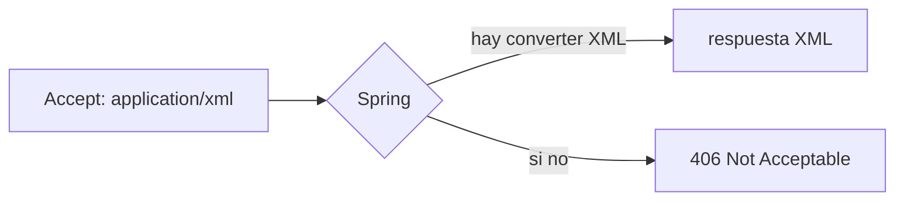
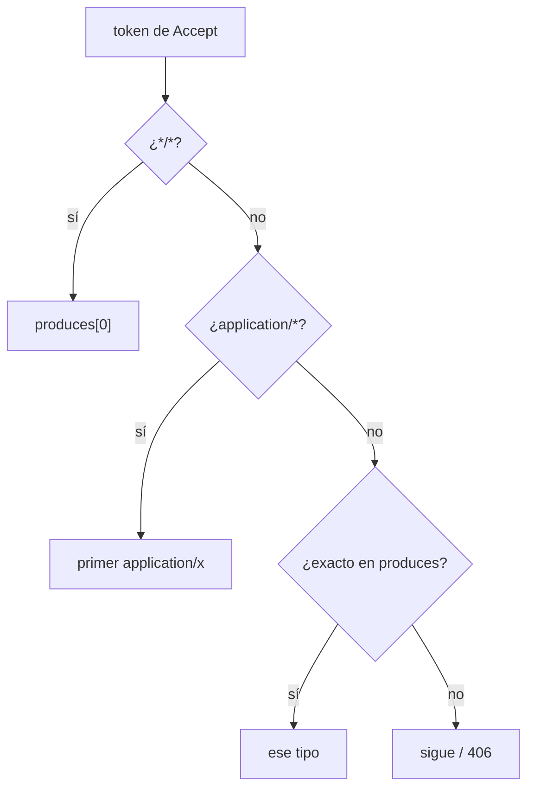
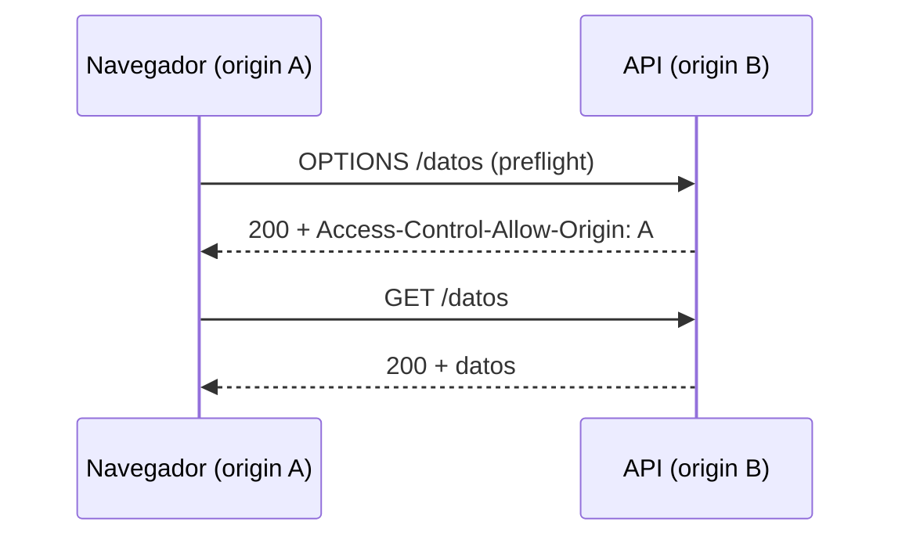
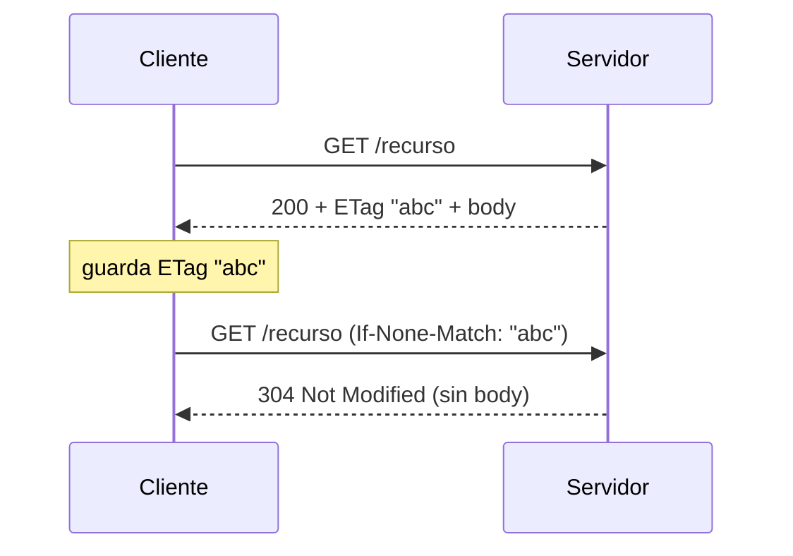
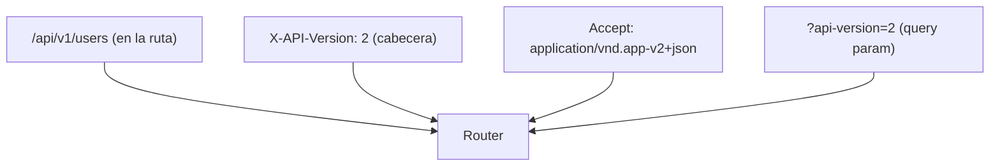
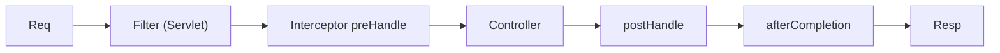

# Bloque VI · Request/Response avanzado

> El "hola mundo" ya lo sabes: recibir JSON, devolver JSON. Este bloque es el
> día a día de una API en producción — negociar formatos, dejar entrar al
> navegador (CORS), subir y bajar ficheros, hablar el idioma de las cabeceras
> HTTP, cachear con ETag, versionar sin romper clientes y meter lógica
> transversal con filtros e interceptores. Casi todo es **manipular cadenas y
> cabeceras con cuidado**: aquí Java moderno (bloque 1) y HTTP (bloque 0) se
> juntan.

## Cómo usar este documento

Lee UNA sección → haz SU ejercicio → vuelve. Cada sección cierra con el recuadro
**"Lo practicas en…"**. Los ejercicios base están guiados con `// TODO`
numerados; los **retos extra** llevan su propia guía dentro del `.java`. Los
tests son la verdad: si una pista y un test discrepan, gana el test.

| Sección | Tema | Ejercicio |
|---|---|---|
| 6.1 | Negociación de contenido (Accept / q-values) | `Ej055ContentNegotiation` |
| 6.2 | CORS: el portero del navegador | `Ej056CorsConfiguration` |
| 6.3 | Subida de ficheros (`MultipartFile`) | `Ej057FileUpload` |
| 6.4 | Descarga de ficheros (`Content-Disposition`) | `Ej058FileDownload` |
| 6.5 | Cabeceras de petición y respuesta | `Ej059RequestResponseHeaders` |
| 6.6 | Caché HTTP con ETag (304) | `Ej060HttpCacheEtag` |
| 6.7 | Estrategias de versionado | `Ej061VersioningStrategies` |
| 6.8 | Filtros e interceptores | `Ej062FilterAndInterceptor` |

---

## 6.1 Negociación de contenido

El cliente dice qué formatos sabe leer con la cabecera `Accept`; el servidor
declara qué sabe producir (`produces`). La **negociación** es elegir el mejor
encaje. Si no hay ninguno, la respuesta correcta es `406 Not Acceptable`.



La cabecera `Accept` tiene una gramática rica (RFC 7231):

```
Accept: text/html, application/json;q=0.9, application/*;q=0.8, */*;q=0.1
```

- Se separa por **comas** en *media-ranges*.
- Cada uno puede llevar un **q-value** (`;q=0.9`): la "calidad" o preferencia,
  de 0 a 1. **Si falta, q = 1.0** (máxima preferencia). Un `q=0` significa lo
  contrario: "este formato **no** lo quiero" (lo excluye explícitamente).
- Hay **comodines**: `*/*` (cualquier cosa), `application/*` (cualquier subtipo
  de application). La preferencia se ordena de más específico a menos: un tipo
  exacto gana a `application/*`, que a su vez gana a `*/*`.

Reglas de resolución que implementas en el ejercicio base:

| Caso | Resultado |
|---|---|
| `produces` vacío/null | `""` (no hay nada que ofrecer) |
| `Accept` null/blank | equivale a `*/*` → el primero de `produces` |
| token `*/*` | el primero de `produces` (orden = preferencia del servidor) |
| token `application/*` | el primer `produces` cuyo tipo sea `application/…` |
| token exacto que está en `produces` | ese tipo |
| nada casa | `""` (el 406) |

Para partir un media-type en tipo y subtipo: `"application/json".split("/", 2)`.
Para descartar el q-value de un token: `token.split(";")[0].trim()`.



En Spring esto lo hace un `HttpMessageConverter` por ti (uno para JSON con
Jackson, otro para XML…), pero entender el algoritmo es lo que te permite
depurar un `406` inesperado o exponer formatos a medida (`vnd.empresa.v2+json`).

**Caché y negociación: la cabecera `Vary`.** Si la misma URL puede responder en
JSON o en XML según el `Accept`, una caché intermedia que solo se fije en la URL
serviría la representación equivocada. Por eso, cuando negocias, debes añadir
`Vary: Accept` a la respuesta: le dices a la caché que la respuesta **depende**
de esa cabecera. La misma idea aplica a `Vary: Accept-Encoding` (gzip vs sin
comprimir) y `Vary: Origin` en CORS. Olvidarlo es una fuente clásica de bugs de
"a unos usuarios les llega XML y a otros JSON".

> **Lo practicas en `Ej055ContentNegotiation`**: resolver el MediaType de salida
> a partir de `Accept` y `produces`, con comodines, q-values, charset y tipos
> *vendor-specific*.

---

## 6.2 CORS: el portero del navegador

Por seguridad, el navegador **bloquea** que una página servida desde el origen A
(`https://miapp.com`) llame por `fetch`/XHR a una API en el origen B
(`https://api.com`) — es la *Same-Origin Policy*. CORS es el mecanismo por el
que el servidor B **autoriza explícitamente** al origen A con cabeceras de
respuesta. Sin esa cabecera, el navegador descarta la respuesta (aunque el
servidor la haya enviado).



Para métodos "no simples" (PUT, DELETE, o con cabeceras custom) el navegador
manda primero una petición **preflight** `OPTIONS` preguntando "¿puedo?". Una
petición es preflight si su método es `OPTIONS` **y** trae
`Access-Control-Request-Method`.

¿Qué es "simple" (y por tanto NO dispara preflight)? Solo:

- **Método** entre `GET`, `HEAD` o `POST`.
- **Cabeceras** entre `Accept`, `Accept-Language`, `Content-Language` y
  `Content-Type` — pero `Content-Type` **solo** si vale `text/plain`,
  `multipart/form-data` o `application/x-www-form-urlencoded`.

La consecuencia que sorprende a todo el mundo: **un `POST` con
`Content-Type: application/json` NO es simple** (el JSON no está en esa lista
blanca), así que tu llamada `fetch` con `body: JSON.stringify(...)` dispara un
`OPTIONS` previo. Ese OPTIONS "fantasma" que ves en la pestaña Red del navegador
es justo esto, y es la causa nº 1 de errores CORS al hacer POST de JSON.

Detalle importante del preflight: la petición `OPTIONS` **nunca** lleva cookies
ni el cuerpo; solo pregunta. El navegador valida la respuesta del preflight
contra las cabeceras `Access-Control-Request-Method` /
`Access-Control-Request-Headers` que envió, y solo si pasa lanza la petición
real (que ya sí lleva credenciales si procede).

Las cabeceras CORS clave:

| Cabecera (respuesta) | Significado |
|---|---|
| `Access-Control-Allow-Origin` | origen autorizado (`*` o un origen concreto) |
| `Access-Control-Allow-Methods` | métodos permitidos |
| `Access-Control-Allow-Headers` | cabeceras que el cliente puede enviar |
| `Access-Control-Allow-Credentials` | si se permiten cookies/credenciales |
| `Access-Control-Expose-Headers` | cabeceras de respuesta que el JS puede leer |
| `Access-Control-Max-Age` | segundos que se cachea el preflight |

La trampa de seguridad nº 1: **`Allow-Origin: *` y `Allow-Credentials: true` son
incompatibles**. Si permites credenciales, tienes que devolver el origen
concreto (eco), nunca el comodín. Lo practicas literalmente en un reto. Y cuando
haces eco del origen, recuerda el `Vary: Origin` de antes: si no, una caché
podría servirle a un origen las cabeceras CORS calculadas para otro.

Dos detalles que castigan los retos: el `Access-Control-Max-Age` se **acota** a
un rango razonable (p.ej. `[60, 1800]`) y, en el ejercicio, un valor **no
numérico cae al máximo** (`1800`), no al mínimo — es la decisión defensiva
"ante la duda, cachea lo permitido". Además, el valor de `Origin` que entra debe
**sanearse** antes de devolverlo en una cabecera: si trae `\r`/`\n` lo rechazas,
porque reflejarlo crudo abre la puerta a *header injection* (CRLF).

En Spring lo configuras una vez con `WebMvcConfigurer`:

```java
@Configuration
public class CorsConfig implements WebMvcConfigurer {
    @Override
    public void addCorsMappings(CorsRegistry registry) {
        registry.addMapping("/api/**")
                .allowedOrigins("https://miapp.com")
                .allowedMethods("GET", "POST", "PUT", "DELETE")
                .allowCredentials(true);
    }
}
```

> **Lo practicas en `Ej056CorsConfiguration`**: calcular las cabeceras CORS para
> un origen, comodines de subdominio, detección de preflight, acotado de
> `Max-Age` y clasificación de métodos/cabeceras "simples".

---

## 6.3 Subida de ficheros (`MultipartFile`)

Un formulario `multipart/form-data` empaqueta uno o varios ficheros en partes.
Spring te entrega cada parte como un `MultipartFile`:

```java
@PostMapping(value = "/upload", consumes = MediaType.MULTIPART_FORM_DATA_VALUE)
public String subir(@RequestParam("file") MultipartFile file) {
    if (file == null || file.isEmpty()) return "vacio";
    return file.getOriginalFilename() + ":" + file.getSize();
}
```

La API mínima de `MultipartFile`:

| Método | Devuelve |
|---|---|
| `isEmpty()` | `true` si no hay contenido |
| `getOriginalFilename()` | nombre tal cual lo mandó el cliente (¡puede ser null o malicioso!) |
| `getSize()` | tamaño en bytes (`long`) |
| `getContentType()` | MIME declarado (`image/png`…) |
| `getBytes()` | el contenido entero como `byte[]` (lanza `IOException`) |
| `getInputStream()` | flujo para leerlo sin cargarlo todo en memoria |

Tres riesgos de seguridad que aparecen en los retos:

1. **Directory traversal**: el nombre puede ser `../../etc/passwd`. Nunca lo uses
   crudo para construir rutas; quédate solo con el nombre de fichero con
   `Paths.get(nombre).getFileName().toString()`.
2. **Confiar en la extensión o el MIME declarado**: ambos los pone el cliente y
   mienten. Valídalos, pero como primera barrera, no como garantía.
3. **Tamaño**: acota siempre (un upload de 4 GB tumba el servicio).

> **Lo practicas en `Ej057FileUpload`**: el endpoint de subida y validaciones
> reales — extensión, tamaño, MIME, saneo de nombre, MD5 de integridad y lectura
> de cabeceras CSV.

---

## 6.4 Descarga de ficheros (`Content-Disposition`)

Para devolver un fichero usas `ResponseEntity<byte[]>` (o `Resource`) y la
cabecera `Content-Disposition`, que le dice al navegador qué hacer con él:

```java
@GetMapping("/download")
public ResponseEntity<byte[]> descargar() {
    byte[] datos = "hola mundo".getBytes(StandardCharsets.UTF_8);
    return ResponseEntity.ok()
            .header("Content-Disposition", "attachment; filename=\"datos.txt\"")
            .header("Content-Type", "text/plain")
            .contentLength(datos.length)
            .body(datos);
}
```

`Content-Disposition` tiene dos modos:

| Valor | Efecto en el navegador |
|---|---|
| `attachment; filename="x.pdf"` | fuerza la **descarga** (diálogo Guardar) |
| `inline; filename="x.pdf"` | intenta **mostrarlo** en la pestaña |

Regla práctica: PDF e imágenes suelen ir `inline`; ZIP, EXE y binarios,
`attachment` (más seguro). Si el nombre tiene caracteres no ASCII (`canción.mp3`)
el estándar **RFC 5987** obliga a codificarlo:
`filename*=UTF-8''canci%C3%B3n.mp3` (porcentaje sobre los bytes UTF-8).

Para escribir un MIME correcto según la extensión usas un mapeo
(`csv → text/csv`, `pdf → application/pdf`, desconocido →
`application/octet-stream`, el "no sé qué es, descárgalo en bruto"). Ese
`application/octet-stream` por defecto no es relleno: es la opción **segura**,
porque obliga al navegador a tratar el fichero como binario opaco en vez de
intentar interpretarlo (un MIME adivinado mal puede acabar ejecutando contenido).

Si el nombre del fichero a servir lo elige el cliente, vuelve el riesgo de
*directory traversal* de 6.3: hay que sanear el nombre **y** confinar la lectura
a un directorio base (*sandboxing*), comprobando que la ruta resuelta sigue
dentro de él. Servir `../../etc/passwd` por una descarga es el mismo agujero,
solo que de lectura.

> **Lo practicas en `Ej058FileDownload`**: construir la respuesta de descarga,
> sanear el nombre, RFC 5987, mapeo extensión→MIME, GZIP, ETags y *sandboxing*
> de rutas.

---

## 6.5 Cabeceras de petición y respuesta

Una API seria *lee* cabeceras de entrada y *escribe* cabeceras de salida. El
patrón canónico es el **correlation id**: el cliente manda `X-Request-Id`, el
servidor lo refleja en `X-Correlation-Id` para poder rastrear una petición a
través de logs y microservicios.

```java
@GetMapping("/trace")
public ResponseEntity<String> trace(
        @RequestHeader(value = "X-Request-Id", required = false) String requestId) {
    String correlation = (requestId != null) ? requestId : "gen-" + UUID.randomUUID();
    return ResponseEntity.ok().header("X-Correlation-Id", correlation).body("ok");
}
```

`@RequestHeader(required = false)` te da el valor o `null` — siempre prevé el
fallback. Cabeceras de entrada que se leen a diario y aparecen en los retos:

| Cabecera | Para qué | Formato |
|---|---|---|
| `Accept-Language` | idioma preferido | `es-ES,es;q=0.9,en;q=0.8` |
| `Authorization` | credenciales | `Basic base64(user:pass)` o `Bearer <jwt>` |
| `X-Forwarded-For` | IP real tras proxies | `ip-cliente, proxy1, proxy2` (la 1ª) |
| `User-Agent` | navegador/dispositivo | cadena libre |
| `Accept-Encoding` | compresión soportada | `gzip, deflate` |
| `X-Requested-With` | petición AJAX | `XMLHttpRequest` |

Decodificar **Basic Auth**: quitar el prefijo `Basic `, `Base64.getDecoder()`,
y `split(":", 2)` (el password puede contener `:`). Extraer **Bearer**: quitar
el prefijo de forma insensible a mayúsculas. Para `X-Forwarded-For`, la IP del
cliente es la **primera** de la lista.

Cabeceras de salida útiles: `X-Content-Type-Options: nosniff`,
`X-Frame-Options: DENY` (seguridad básica, casi gratis).

> **Lo practicas en `Ej059RequestResponseHeaders`**: reflejar el correlation id
> y parsear/generar cabeceras reales — idioma, Basic/Bearer, IP de proxy,
> compresión y firma de integridad.

---

## 6.6 Caché HTTP con ETag (304 Not Modified)

Un **ETag** es una huella (hash) del contenido de un recurso. El cliente la
guarda y, en la siguiente petición, la manda en `If-None-Match`. Si el recurso
no ha cambiado, el servidor responde `304 Not Modified` **sin cuerpo**: ahorras
ancho de banda y el navegador reusa su copia.



```java
public ResponseEntity<String> get(
        @RequestHeader(value = "If-None-Match", required = false) String ifNoneMatch) {
    String etag = "\"" + Integer.toHexString(RECURSO.hashCode()) + "\"";
    if (etag.equals(ifNoneMatch)) {
        return ResponseEntity.status(HttpStatus.NOT_MODIFIED).header("ETag", etag).build();
    }
    return ResponseEntity.ok().header("ETag", etag).body(RECURSO);
}
```

Vocabulario del bloque:

| Concepto | Qué es |
|---|---|
| ETag **fuerte** | `"abc"` — coincidencia **byte a byte** |
| ETag **débil** | `W/"abc"` — "semánticamente equivalente" (mismo contenido lógico aunque difieran los bytes) |
| `If-None-Match` | en GET: "dame solo si cambió" → 304 si igual |
| `If-Match` | en PUT/DELETE: "modifica solo si sigue igual" → 412 si no |
| `Cache-Control` | política: `public, max-age=3600, must-revalidate`, `no-store` |
| `Last-Modified` / `If-Modified-Since` | misma idea con **fechas** RFC 1123 |

¿Cuándo fuerte y cuándo débil? El **fuerte** garantiza identidad byte a byte:
úsalo cuando el cliente vaya a hacer *range requests* (descargas parciales), que
exigen bytes idénticos. El **débil** basta cuando dos respuestas son
"equivalentes" aunque no idénticas — el caso típico es que una vaya comprimida
con gzip y la otra no: el contenido lógico es el mismo, pero los bytes difieren,
así que un ETag fuerte sería incorrecto. Por eso muchos servidores marcan como
débiles los ETags de respuestas comprimidas. Convertir fuerte→débil es **anteponer
`W/`**, y debe ser *idempotente*: si ya empieza por `W/`, no lo dupliques.

`If-None-Match` admite además el comodín `*` (casa con "cualquier versión que
exista") y una **lista** separada por comas (`"a", "b"` — ojo al espacio tras la
coma, hay que hacer `trim`). Y la regla defensiva del ejercicio: si te falta uno
de los dos valores que comparas (ETag actual o cabecera), no puedes garantizar la
condición, así que el resultado es **falso** (no asumas coincidencia con `null`).

Las fechas HTTP usan el formato RFC 1123 (`Wed, 21 Oct 2015 07:28:00 GMT`):
`DateTimeFormatter.RFC_1123_DATE_TIME` las parsea y formatea. Cuidado al
formatear un `Instant` "pelado": no tiene zona, así que lanza
`UnsupportedTemporalTypeException` — antes hay que anclarlo a una zona
(`.atZone(ZoneOffset.UTC)` o `ZoneId.of("GMT")`). El `412 Precondition Failed`
(con `If-Match`) es la base del **control de concurrencia optimista**: evita que
dos clientes pisen el mismo recurso sin enterarse (lo retomarás en JPA, bloque
14, con `@Version`).

> **Lo practicas en `Ej060HttpCacheEtag`**: el flujo 200/304, ETags fuertes y
> débiles (SHA-256), `If-Match`/`If-None-Match` con múltiples valores, fechas
> RFC 1123 y directivas `Cache-Control`.

---

## 6.7 Estrategias de versionado

Una API que tiene clientes **no puede romper contratos**. Cuando un cambio es
incompatible, publicas una versión nueva y mantienes la vieja un tiempo. Las
tres estrategias habituales:



| Estrategia | Ejemplo | Pros / Contras |
|---|---|---|
| **URI** | `/api/v2/users` | visible, fácil de cachear / "ensucia" la URL |
| **Cabecera** | `X-API-Version: 2` | URL limpia / invisible, difícil de probar a mano |
| **Accept** | `…vnd.empresa.app-v2+json` | "correcto" según REST / críptico |
| **Query param** | `?api-version=2` | trivial / se mezcla con filtros |

En el ejercicio base resuelves la versión con **precedencia**: la cabecera
`X-API-Version` pisa la versión de la ruta; si no hay ninguna, por defecto `1`.
Una versión no numérica o `< 1` es un `IllegalArgumentException`.

Para extraer `/v2/` de una ruta de forma robusta usa una expresión regular
**anclada entre barras** (`/v(\\d+)/` o `/v(\\d+)(/|$)`): así `/api/av2/users`
**no** cuela como versión (la `a` delante rompe el patrón) y `/api/v/users`
(sin número) tampoco. Un `contains("v2")` dejaría pasar ambos falsos positivos.

Cuando jubilas una versión vieja no la apagas de golpe: la marcas como
*deprecated* avisando con cabeceras de respuesta (`Deprecation: true`, `Sunset:
<fecha>` con la fecha de retirada) para que los clientes tengan tiempo de migrar. El versionado semántico (SemVer
`MAJOR.MINOR.PATCH`, p.ej. `1.4.2`) y los rangos de compatibilidad (`^1.0.0` =
`>=1.0.0 <2.0.0`) son el modelo que usan Maven y npm para decidir qué
actualizaciones son seguras.

> **Lo practicas en `Ej061VersioningStrategies`**: resolver la versión efectiva
> y todas las estrategias — Accept, query, validación de segmento, SemVer,
> rangos, cabeceras de deprecación y *stripping* de la versión.

---

## 6.8 Filtros e interceptores

Ambos meten lógica **transversal** (logging, seguridad, métricas) sin tocar cada
controller, pero operan a distinta altura:



| | Filtro (`jakarta.servlet.Filter`) | Interceptor (`HandlerInterceptor`) |
|---|---|---|
| Nivel | Servlet (antes de Spring MVC) | Spring MVC |
| Conoce el handler | No | **Sí** (`HandlerMethod`) |
| Ve excepciones del controller | No (Spring ya las gestionó) | Sí (en `afterCompletion`) |
| Puede envolver request/response | **Sí** (`chain.doFilter` con *wrappers*) | No |
| Uso típico | CORS, compresión, logging crudo | auth por endpoint, métricas, ETag |

El filtro envuelve a TODO Spring MVC (incluida la gestión de excepciones y el
`@ControllerAdvice`), por eso es el sitio para cosas que deben pasar pase lo que
pase y para *envolver* el cuerpo (cachear el body para loggearlo, comprimir). El
interceptor vive **dentro** de MVC: ya sabe qué método Java se va a ejecutar, lo
que te permite decisiones por endpoint (auth según anotaciones del handler).

Un `HandlerInterceptor` tiene tres ganchos:

```java
public class TimingInterceptor implements HandlerInterceptor {
    @Override
    public boolean preHandle(HttpServletRequest req, HttpServletResponse res, Object handler) {
        res.addHeader("X-Handled", "true");
        req.setAttribute("inicio", System.nanoTime());
        return true;   // false cortaría la cadena aquí mismo
    }
    @Override
    public void afterCompletion(HttpServletRequest req, HttpServletResponse res, Object handler, Exception ex) {
        Object t = req.getAttribute("inicio");
        if (t != null) res.addHeader("X-Duration-Nanos", String.valueOf(System.nanoTime() - (long) t));
    }
}
```

- `preHandle` corre **antes** del controller; devolver `false` aborta la
  petición (lo usas para un 401 por API key inválida). Importante: si cortas con
  `false`, eres tú quien debe escribir el estado/respuesta — y no se llamará a
  `postHandle`, pero **sí** a `afterCompletion`.
- `postHandle` corre tras el controller **solo si no hubo excepción** (y antes de
  renderizar la vista). No lo uses para métricas de tiempo: una petición que
  falla nunca pasa por aquí, y perderías justo los casos que quieres medir.
- `afterCompletion` corre **siempre** (haya error o no): por eso es el sitio para
  métricas y limpieza. Aquí solo *observas* `ex`, nunca relanzas.

Por eso el timing va en `preHandle` (guardas el inicio) + `afterCompletion`
(calculas la duración): así mides también las peticiones que acaban en error.

El truco para pasar datos entre `preHandle` y `afterCompletion` es
`request.setAttribute(...)` / `getAttribute(...)` (igual que el timing de
arriba). Y `handler` es un `HandlerMethod` cuando la petición la resuelve un
controller de Spring: puedes inspeccionar qué método Java va a ejecutarse.

> **Lo practicas en `Ej062FilterAndInterceptor`**: un interceptor que cuenta y
> mide, más utilidades — validación de API key, rate limiting, inspección del
> handler, cabeceras de seguridad y auditoría de excepciones.

---

## Errores comunes del bloque

| # | Error | Antídoto |
|---|---|---|
| 1 | Asumir `q=1.0` solo cuando viene escrito | Si falta `;q=`, la calidad **es** 1.0 (no 0) |
| 2 | `Accept` null → devolver `""` | null/blank equivale a `*/*`: ofrece `produces[0]` |
| 3 | `Allow-Origin: *` con `Allow-Credentials: true` | Incompatible: con credenciales, eco del origen concreto |
| 4 | Usar `getOriginalFilename()` crudo en una ruta | Saneo con `Paths.get(n).getFileName()` (traversal) |
| 5 | Confiar en la extensión/MIME del cliente | Son pistas, no garantías; valida tamaño y contenido |
| 6 | Olvidar el `q` por defecto al ordenar Accept | Tokens sin `q` van **primero** (1.0) |
| 7 | Devolver 304 **con** cuerpo | El 304 va sin body: `.build()`, no `.body(...)` |
| 8 | ETag sin comillas | El estándar exige comillas: `"abc"`, débil `W/"abc"` |
| 9 | `/api/av2/users` detectado como v2 | Regex anclada `/v(\d+)/`, no un `contains("v")` |
| 10 | Relanzar la excepción en `afterCompletion` | Ahí solo observas/registras; nunca relanzas |
| 11 | `split(":")` en Basic Auth | Usa `split(":", 2)`: el password puede llevar `:` |
| 12 | Leer `getBytes()` dos veces | El stream se consume una vez; guárdalo en `byte[]` |
| 13 | Negociar formato sin `Vary: Accept` | Una caché serviría JSON donde tocaba XML (y viceversa) |
| 14 | Creer que un POST de JSON no hace preflight | `application/json` no es "simple" → dispara `OPTIONS` |
| 15 | Listar mal los métodos CORS "simples" | Son **GET, HEAD y POST** (PUT/DELETE/PATCH no) |
| 16 | `Max-Age` inválido → tirar al mínimo | En el reto el inválido cae al **máximo** (defensivo) |
| 17 | ETag fuerte en respuesta gzip | gzip cambia los bytes → debería ser **débil** (`W/`) |
| 18 | Duplicar `W/` al convertir a débil | La conversión a débil es **idempotente** |
| 19 | Medir tiempos en `postHandle` | Se salta si hay excepción; usa `afterCompletion` |
| 20 | Reflejar `Origin` con `\r`/`\n` sin sanear | *Header injection* (CRLF); rechaza el valor |

## Chuleta final del bloque

```
Negociación  Accept (q-value, def 1.0; q=0 excluye) vs produces · null/blank=*/* · sin match="" (406) · Vary: Accept
CORS         Allow-Origin/Methods/Headers · preflight=OPTIONS+ACRM · *≠credentials · simples=GET/HEAD/POST · JSON→preflight
Upload       MultipartFile: isEmpty/getOriginalFilename/getSize/getBytes · saneo traversal
Download     ResponseEntity<byte[]> + Content-Disposition attachment|inline · RFC5987 filename* · default octet-stream
Headers      @RequestHeader(required=false) · Basic=base64(user:pass) · Bearer · XFF[0]
ETag/Caché   fuerte="h" (byte) vs débil W/"h" (gzip) · If-None-Match→304 .build() · If-Match→412 · Cache-Control
Versionado   header pisa ruta · default 1 · regex anclada /v(\d+)/ · SemVer M.m.p · ^1.0.0 · Deprecation/Sunset
Interceptor  preHandle(false corta)/postHandle(no si error)/afterCompletion(siempre) · timing en pre+after · setAttribute
```

## Autoevaluación (responde sin mirar; si fallas 2+, relee la sección)

1. En `Accept: a/b, c/d;q=0.9`, ¿qué calidad tiene `a/b` y por qué? *(6.1)*
2. ¿Por qué no puedes combinar `Access-Control-Allow-Origin: *` con
   `Allow-Credentials: true`? ¿Qué devuelves entonces? *(6.2)*
3. ¿Qué riesgo tiene usar `getOriginalFilename()` directamente y cómo lo
   neutralizas? *(6.3)*
4. ¿Qué diferencia hay entre `Content-Disposition: attachment` e `inline`? *(6.4)*
5. ¿Cómo decodificas un header `Authorization: Basic …` y por qué `split(":", 2)`
   y no `split(":")`? *(6.5)*
6. ¿Qué debe contener (y qué NO) una respuesta `304 Not Modified`? *(6.6)*
7. ¿Por qué `/api/av2/users` no debe interpretarse como versión 2? ¿Qué
   herramienta lo evita? *(6.7)*
8. ¿En cuál de los tres ganchos del interceptor pondrías las métricas de tiempo
   y por qué NO en `postHandle`? *(6.8)*
9. ¿Por qué un `POST` con `Content-Type: application/json` provoca un preflight
   `OPTIONS` y un `POST` de un formulario clásico no? *(6.2)*
10. ¿Por qué un ETag de una respuesta comprimida con gzip debería ser débil
    (`W/`) y no fuerte? *(6.6)*
