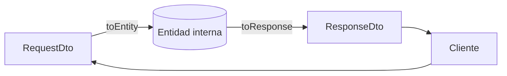
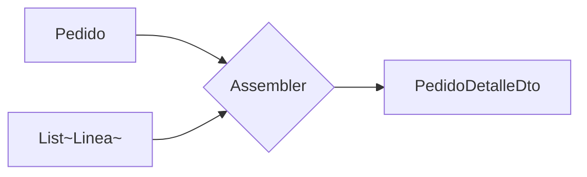
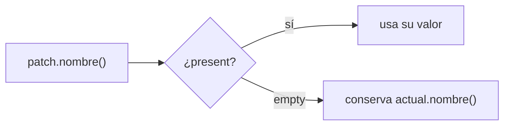

# Bloque VII · DTOs y mapeo

> Nunca expongas tu entidad de base de datos directamente en la API. El DTO es
> el **contrato público**; la entidad es **interna**. El mapeo es el aduanero que
> decide qué cruza la frontera y con qué forma.

## Cómo usar este documento

Como en los bloques anteriores: lee UNA sección → haz SU ejercicio → vuelve.
Cada sección cierra con el recuadro **"Lo practicas en…"**. Aquí los `record`,
`Optional` y `stream` del bloque 1 dejan de ser teoría y se convierten en tu
herramienta diaria: un mapper ES un stream de `map`, un PatchDto ES un record de
`Optional`. Si algo de eso te suena lejano, repasa `01_Java_Moderno_para_APIs.md`.

| Sección | Tema | Ejercicio |
|---|---|---|
| 7.1 | Por qué separar entidad y DTO | `Ej063RequestResponseDto` |
| 7.2 | Mapper manual y mapeo de listas | `Ej064ManualMapper` |
| 7.3 | Mapper declarativo (la idea de MapStruct) | `Ej065MapStructIntro` |
| 7.4 | Patrón Assembler (ensamblar desde varias fuentes) | `Ej066AssemblerPattern` |
| 7.5 | DTO de actualización parcial (PATCH) | `Ej067PartialUpdateDto` |
| 7.6 | Grafos de DTOs anidados | `Ej068NestedDtoGraphs` |

---

## 7.1 Por qué separar entidad y DTO

Un **DTO** (*Data Transfer Object*) es un objeto cuyo único trabajo es viajar
por el cable: entrar en un POST o salir en un GET. La **entidad** es lo que vive
en tu base de datos. La regla de oro de una API profesional:

> Nunca serialices una `@Entity` directamente hacia el cliente.



Cuatro razones, todas de seguridad o estabilidad:

1. **Ocultas datos sensibles.** La entidad `UsuarioEntity` tiene `passwordHash`;
   el `UsuarioResponse` solo tiene `id` y `email`. Si devolvieras la entidad,
   filtrarías el hash de contraseña en cada respuesta.
2. **Desacoplas el esquema del contrato.** La entidad cambia cuando cambia la
   tabla; el DTO no debe romper a los clientes móviles que ya están en producción.
3. **Cada DTO tiene un trabajo.** El RequestDto **valida y normaliza** lo que
   entra; el ResponseDto **formatea** lo que sale. No son la misma clase.
4. **Evitas el *mass assignment* (sobre-escritura masiva).** Si bindeas el JSON
   del cliente directo a la `@Entity`, un atacante puede colar campos que tú nunca
   pensabas exponer: `{"email":"x","rol":"ADMIN","saldo":99999}`. El RequestDto
   actúa de **lista blanca**: solo existen en él los campos que el cliente PUEDE
   tocar, así que `rol` o `saldo` simplemente se ignoran al deserializar.

Y dos trampas extra que solo aparecen con la entidad JPA real (las verás en b12+):
serializar una `@Entity` con relaciones **lazy** revienta con
`LazyInitializationException` o dispara consultas N+1 al recorrer el grafo fuera
de la sesión; y una entidad con referencias bidireccionales (`Pedido↔Linea`)
provoca **recursión infinita** al serializar a JSON. El DTO plano corta los dos
problemas de raíz.

El patrón de los dos sentidos del mapeo:

```java
// ENTRADA: del request a la entidad (aquí se valida y se "hashea")
public static UsuarioEntity toEntity(RegistroRequest req, Long id) {
    if (req == null) throw new IllegalArgumentException("request nulo");
    if (req.email() == null || !req.email().contains("@"))
        throw new IllegalArgumentException("email inválido");
    if (req.password() == null || req.password().length() < 6)
        throw new IllegalArgumentException("password demasiado corta");
    return new UsuarioEntity(id, req.email(), "hash:" + req.password());
}

// SALIDA: de la entidad al response (aquí se OMITE lo sensible)
public static UsuarioResponse toResponse(UsuarioEntity e) {
    if (e == null) throw new IllegalArgumentException("entidad nula");
    return new UsuarioResponse(e.id, e.email);   // sin passwordHash JAMÁS
}
```

El `"hash:" + password` es un simulacro: en producción sería **BCrypt** (lo verás
en el bloque 18 de seguridad). Lo que importa hoy es la frontera: lo que entra se
transforma, lo que sale se recorta.

> **Lo practicas en `Ej063RequestResponseDto`**: convertir request→entidad con
> validación, entidad→response sin filtrar el hash, y retos de
> enmascarado/sanitización de email.

---

## 7.2 Mapper manual y mapeo de listas

Un **mapper** es simplemente la función que traduce entre las dos formas. El
manual es un método estático puro: entra una cosa, sale otra, sin estado.

```java
public static ProductoDto toDto(ProductoEntity e) {
    if (e == null) throw new IllegalArgumentException("entidad nula");
    return new ProductoDto(e.id(), e.nombre(), e.precioSinIva() * 1.21);
}
```

La transformación rara vez es copia literal: aquí el mapper **aplica el IVA del
21 %**, así que el cliente recibe el precio final sin tener que calcularlo. Esa
es la lógica de presentación que NO quieres en la entidad.

Para mapear una colección, **reutiliza** el mapper de un elemento dentro de un
stream — nunca dupliques la lógica de conversión:

```java
public static List<ProductoDto> toDtoList(List<ProductoEntity> entidades) {
    if (entidades == null) throw new IllegalArgumentException("lista nula");
    return entidades.stream()
            .map(Ej064ManualMapper::toDto)   // referencia a método: reutiliza
            .toList();                        // preserva el orden
}
```

`map(toDto)` es el corazón del bloque: **un mapper de lista es un mapper de
elemento envuelto en un stream**. A partir de ahí, las variantes (filtrar nulos,
paginar, agrupar por rango de precio, redondear con `BigDecimal`) son solo
operaciones intermedias añadidas a la tubería.

| Necesitas… | Operación de stream |
|---|---|
| Convertir todos | `.map(::toDto)` |
| Saltar nulos antes de mapear | `.filter(Objects::nonNull)` |
| Paginar | `.skip(offset).limit(limit)` |
| Agrupar por categoría | `.collect(groupingBy(clasificador))` |
| Quedarte con el menor/mayor | `.min(comparingDouble(...))` → `Optional` |

Para dinero, recuerda del bloque 1: redondea con `BigDecimal` y
`RoundingMode.HALF_UP`, no con `double` a pelo (los céntimos se pierden).

> **Lo practicas en `Ej064ManualMapper`**: `toDto` con IVA, `toDtoList`
> reutilizando el mapper, y retos de descuento, filtrado robusto, mapeo inverso,
> agrupación, redondeo financiero, paginación y conversión de divisa.

---

## 7.3 Mapper declarativo: la idea de MapStruct

En proyectos grandes nadie escribe mappers a mano: usan **MapStruct**, que
**genera el código en tiempo de compilación** a partir de una interfaz anotada.
Es rápido (no usa reflexión) y *type-safe* (si un campo no casa, no compila).

El detalle clave del "en compilación": MapStruct es un *annotation processor*. Al
construir el proyecto te escribe una clase `ClienteMapperImpl` en
`target/generated-sources/` con `get`/`set` planos, **el mismo código aburrido que
escribirías tú**. Por eso no hay magia en runtime ni coste de reflexión: si el
build falla con "Unmapped target property", es MapStruct avisándote en compilación
de un campo que olvidaste mapear — un error que con un mapper de reflexión no
verías hasta producción.

```java
@Mapper(componentModel = "spring")
public interface ClienteMapper {
    @Mapping(target = "nombreCompleto", source = "nombre")
    ClienteDto toDto(Cliente entity);
}
```

No usamos la librería todavía; aquí capturamos su **idea** con lo que ya sabes
del bloque 1: una **`Function<Origen, Destino>`** es un mapper de primera clase,
y se puede **componer**.

```java
public static Function<Origen, Destino> mapper() {
    return o -> new Destino(o.a(), o.b() * 2);   // declarativo: una función-dato
}

// post-procesar SIN reescribir el mapeo base: andThen (del bloque 1.7)
public static Function<Origen, Destino> mapperMayus() {
    return mapper().andThen(d -> new Destino(d.a().toUpperCase(), d.bDoble()));
}
```

`andThen` encadena: primero corre `mapper()`, después tu post-proceso. Esto es
exactamente lo que hace un `@AfterMapping` de MapStruct. Y como un mapper es solo
una función, mapear una lista vuelve a ser `lista.stream().map(mapper()).toList()`.

> **Lo practicas en `Ej065MapStructIntro`**: `mapper()` como `Function`,
> composición con `andThen` para mayúsculas, y retos de mapear listas, filtrar,
> invertir, valores por defecto, prefijo/sufijo y envolver en `Optional`.

---

## 7.4 Patrón Assembler: ensamblar desde varias fuentes

A veces un DTO no sale de UNA entidad, sino que **combina varias fuentes**: la
cabecera del pedido por un lado y sus líneas por otro (vienen de tablas
distintas). El que ensambla ese DTO compuesto se llama **Assembler**.



El Assembler hace tres cosas que un mapper simple no: **valida la coherencia**
entre fuentes, **agrega** (suma cantidades) y **proyecta** (extrae solo los
nombres de producto):

```java
public static PedidoDetalleDto ensamblar(Pedido pedido, List<Linea> lineas) {
    if (pedido == null) throw new IllegalArgumentException("pedido nulo");
    var lns = (lineas == null) ? List.<Linea>of() : lineas;     // null → vacío

    // coherencia: toda línea debe pertenecer a ESTE pedido
    boolean coherente = lns.stream().allMatch(l -> l.pedidoId().equals(pedido.id()));
    if (!coherente) throw new IllegalArgumentException("línea de otro pedido");

    int totalUnidades = lns.stream().mapToInt(Linea::cantidad).sum();   // agrega
    List<String> productos = lns.stream().map(Linea::producto).toList(); // proyecta
    return new PedidoDetalleDto(pedido.id(), pedido.cliente(), totalUnidades, productos);
}
```

Fíjate en el tratamiento del null de `lineas`: un pedido **sin líneas** es
legítimo (total = 0), así que `null` se convierte en lista vacía, no en error.
En cambio una línea con `pedidoId` ajeno SÍ es error: estás mezclando datos.

> **Lo practicas en `Ej066AssemblerPattern`**: `ensamblar` validando coherencia y
> agregando, y retos de ensamblar listas, filtrar/agrupar líneas, formatear
> ticket y copiar el DTO de forma inmutable.

---

## 7.5 DTO de actualización parcial (PATCH)

`PUT` reemplaza el recurso entero; `PATCH` toca **solo algunos campos**. El reto:
distinguir "**no envíes esto**" de "**ponlo a este valor**". La herramienta
exacta es `Optional` (bloque 1.2) como **tipo de campo del DTO**:

```java
public record PatchDto(Optional<String> nombre,
                       Optional<String> email,
                       Optional<Boolean> activo) {}
```

> ⚠ Ojo a la convención del bloque 1: "`Optional` solo como tipo de RETORNO,
> nunca como campo". El PatchDto es la **excepción canónica** a esa regla,
> precisamente porque aquí *empty* tiene un significado de dominio: "campo
> ausente, no tocar". Es el único sitio donde un Optional como campo está bien.

La aplicación del parche resuelve cada campo con `orElse(valorActual)`:

```java
public static Usuario aplicar(Usuario actual, PatchDto patch) {
    if (actual == null || patch == null)
        throw new IllegalArgumentException("argumentos nulos");
    return new Usuario(                       // record NUEVO, no mutamos 'actual'
        patch.nombre().orElse(actual.nombre()),
        patch.email().orElse(actual.email()),
        patch.activo().orElse(actual.activo()));
}
```



La trampa mortal: tratar `Optional.empty()` como "poner a null". `empty` =
"no tocar". Si el cliente quiere borrar un campo, eso se modela como
`Optional.of(valorVacío)`, no como ausencia.

> ⚠ El agujero del mundo real: Jackson NO distingue solo. Para un JSON, tanto
> `{}` (campo ausente) como `{"email": null}` (campo a null) **deserializan a
> `Optional.empty()`** si lo dejas a su aire — y ahí pierdes justo la diferencia
> que el PATCH necesita. En este bloque lo modelas a mano con `Optional`, pero en
> Spring real para distinguir "ausente" de "null explícito" se usa
> **`JsonNullable<T>`** (de la librería `jackson-databind-nullable`): tres
> estados, no dos — *undefined* (no vino), *null* (vino y vale null) y *present*
> (vino con valor). Es la herramienta canónica del PATCH semánticamente correcto.

> **Lo practicas en `Ej067PartialUpdateDto`**: `aplicar` con `orElse`, y retos de
> detectar parche vacío/completo, contar campos, combinar dos parches y construir
> PatchDto desde valores nullable con `Optional.ofNullable`.

---

## 7.6 Grafos de DTOs anidados

Una entidad rara vez es plana: un `Cliente` tiene una `Direccion` dentro y una
`List<String>` de teléfonos. Mapear el **grafo** significa mapear cada nivel y
decidir su forma en el contrato:

```java
public static ClienteDto toDto(ClienteEntity e) {
    if (e == null) throw new IllegalArgumentException("cliente nulo");
    DireccionDto dir = (e.direccion() == null)        // sub-mapper del anidado
            ? null
            : new DireccionDto(e.direccion().calle(), e.direccion().ciudad());
    int numTel = (e.telefonos() == null) ? 0 : e.telefonos().size();
    return new ClienteDto(e.id(), e.nombre(), dir, numTel);
}
```

Dos decisiones de contrato típicas, ambas presentes aquí:

- **Anidar vs aplanar**: la dirección se mapea a un `DireccionDto` anidado
  (estructura espejo), pero la lista de teléfonos NO se expone: solo su
  **conteo** (`numTelefonos`). Es una decisión deliberada de qué revela la API.
- **Null-safety en cada nivel**: dirección nula → DTO de dirección nulo (no
  `NullPointerException`); lista de teléfonos nula → conteo 0. Cada `null` del
  grafo se maneja explícitamente.

Cuando trabajes con listas de clientes, `flatMap` (bloque 1.4) es tu aliado para
aplanar los anidados: `clientes.stream().flatMap(c -> c.telefonos().stream())`
recoge TODOS los teléfonos de TODOS los clientes en un solo stream.

> **Lo practicas en `Ej068NestedDtoGraphs`**: `toDto` mapeando el grafo con
> null-safety, y retos de extraer ciudades, `flatMap` de teléfonos, filtrar por
> ciudad, capitalizar y copiar el DTO con una calle nueva.

---

## Errores comunes del bloque

| # | Error | Antídoto |
|---|---|---|
| 1 | Devolver la `@Entity` directamente | Siempre un ResponseDto; oculta lo sensible, evita lazy/N+1 y recursión |
| 2 | Incluir `passwordHash` en la respuesta | El ResponseDto solo lleva `id` y `email` |
| 2b | Bindear el JSON directo a la `@Entity` (*mass assignment*) | RequestDto como lista blanca: `rol`/`saldo` ni existen en él |
| 3 | Duplicar la lógica de conversión en `toDtoList` | `stream().map(::toDto)`: reutiliza el mapper |
| 4 | Calcular dinero con `double` y mostrarlo | Redondea con `BigDecimal` + `RoundingMode.HALF_UP` |
| 5 | Reescribir el mapeo base en vez de componerlo | `mapper().andThen(post)` |
| 6 | Ensamblar sin validar coherencia entre fuentes | `allMatch(l -> l.pedidoId().equals(id))` |
| 7 | `null` de líneas tratado como error | Pedido sin líneas es válido: `null` → `List.of()` |
| 8 | Tratar `Optional.empty()` como "poner a null" | `empty` = "no tocar"; `orElse(actual)` |
| 8b | Creer que Jackson separa "campo ausente" de "campo null" | No lo hace solo: usa `JsonNullable<T>` para los 3 estados |
| 9 | NPE al mapear un anidado nulo | Comprueba cada nivel: dirección nula → DTO nulo |
| 10 | Mutar la entidad/DTO original | Records son inmutables: crea uno nuevo siempre |

## Chuleta final del bloque

```
DTO            = contrato público; @Entity = interna. NUNCA serialices la entidad.
RequestDto     = lista blanca contra mass assignment (rol/saldo NO existen ahí)
MapStruct      = annotation processor: genera get/set en compilación, sin reflexión
toEntity       = valida + normaliza lo que ENTRA (hash, trim, lowercase)
toResponse     = recorta lo que SALE (sin password ni flags internos)
toDtoList      = entidades.stream().map(::toDto).toList()   (reutiliza, no dupliques)
declarativo    = Function<O,D> componible · mapper().andThen(post)
Assembler      = combina varias fuentes + valida coherencia + agrega
PATCH          = record de Optional · empty = "no tocar" · orElse(actual)
anidado        = mapea cada nivel · null en un nivel → null/0 en el DTO (sin NPE)
dinero         = BigDecimal + RoundingMode.HALF_UP, jamás double a pelo
flatMap        = aplana List<Cliente>·List<Telefono> en un stream de teléfonos
```

## Autoevaluación (responde sin mirar; si fallas 2+, relee la sección)

1. Da tres razones para no serializar una `@Entity` directamente al cliente. *(7.1)*
2. ¿Qué hace `toEntity` que no hace `toResponse`, y al revés? *(7.1)*
3. ¿Por qué `toDtoList` debe llamar a `toDto` en vez de repetir el mapeo? *(7.2)*
4. ¿Cómo post-procesarías un mapper sin reescribir su lógica base? *(7.3)*
5. ¿Qué tres responsabilidades distinguen a un Assembler de un mapper simple? *(7.4)*
6. En un PatchDto, ¿qué significa `Optional.empty()` y qué `Optional.of("")`? *(7.5)*
7. ¿Por qué el PatchDto es la excepción a "Optional nunca como campo"? *(7.5)*
8. Al mapear un `Cliente` con `direccion == null`, ¿qué debe valer la dirección
   del DTO y por qué no salta un NPE? *(7.6)*
9. ¿Qué es el *mass assignment* y cómo lo frena un RequestDto bien diseñado? *(7.1)*
10. En un PATCH real, ¿por qué `Optional` con Jackson no basta para separar "campo
    ausente" de "campo a null", y qué tipo lo resuelve? *(7.5)*
