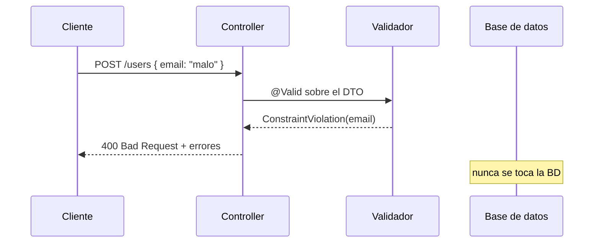
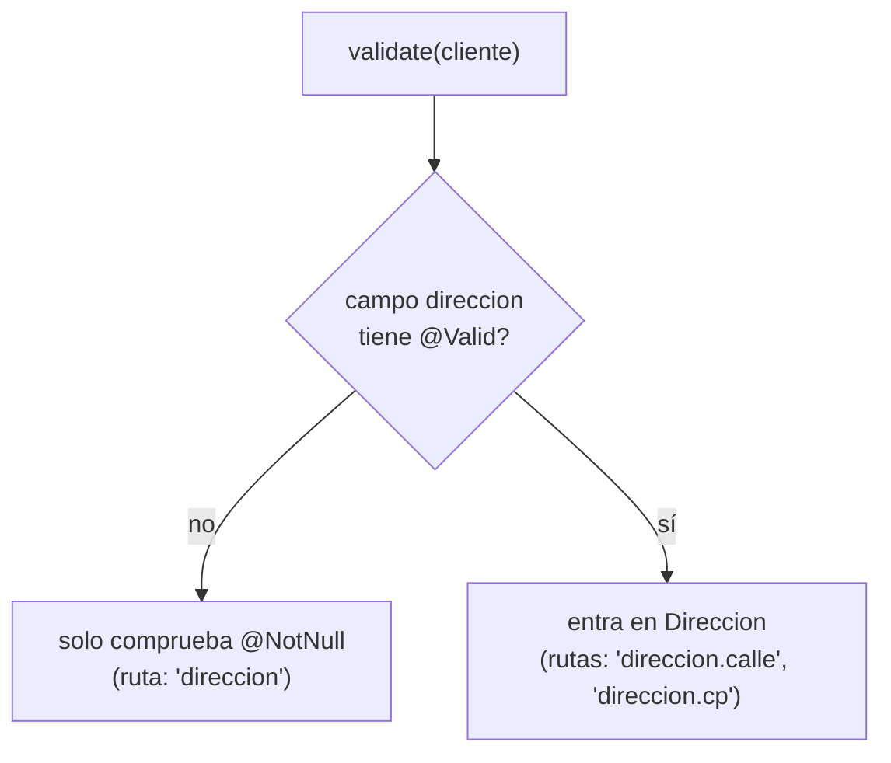
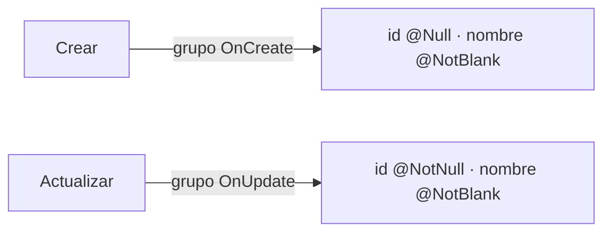
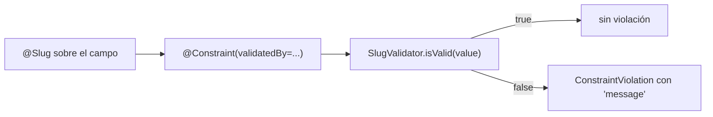

# Bloque VIII · Bean Validation

> Una API que confía en lo que le mandan es una API rota esperando su turno.
> Validar en el **borde** (el DTO que entra) evita basura en la base de datos,
> errores a las 3 AM y respuestas confusas. Jakarta Validation declara las reglas
> con anotaciones; Spring las dispara con `@Valid`. Aquí aprendes ambas mitades.

## Cómo usar este documento

Lee UNA sección → haz SU ejercicio → vuelve. Cada sección cierra con el recuadro
**"Lo practicas en…"**. No saltes: la validación de grupos (8.4) presupone las
constraints básicas (8.1), y la constraint personalizada (8.5) presupone que
entiendes el flujo del validador (8.1).

| Sección | Tema | Ejercicio |
|---|---|---|
| 8.1 | Constraints básicas y el flujo del validador | `Ej069BasicConstraints` |
| 8.2 | Constraints numéricas y de patrón | `Ej070NumericAndPattern` |
| 8.3 | Validación anidada (`@Valid` en cascada) | `Ej071NestedValidation` |
| 8.4 | Grupos: las mismas reglas, distinto contexto | `Ej072GroupValidation` |
| 8.5 | Constraint personalizada (`@Slug`) | `Ej073CustomConstraint` |
| 8.6 | Validación entre campos (cross-field) | `Ej074CrossFieldValidation` |
| 8.7 | Validar path variables y query params | `Ej075ValidatePathAndParams` |
| 8.8 | Validación programática con `Validator` | `Ej076ProgrammaticValidation` |

---

## 8.1 Constraints básicas y el flujo del validador

La idea central de Bean Validation: **las reglas viven junto al dato**, como
anotaciones sobre los campos del DTO. No escribes `if (nombre == null) ...` por
todas partes; declaras `@NotBlank` una vez y un *motor de validación* (la
implementación de referencia es **Hibernate Validator**) lo comprueba por ti.



### Las constraints que cubren el 90 % de los casos

| Anotación | Regla | Aplica a |
|---|---|---|
| `@NotNull` | el valor no puede ser `null` | cualquier tipo |
| `@NotBlank` | no `null`, no vacío, no solo espacios | `String` |
| `@NotEmpty` | no `null` y no vacío (longitud > 0) | `String`, colecciones, arrays |
| `@Size(min,max)` | longitud/tamaño en rango | `String`, colecciones |
| `@Min` / `@Max` | rango numérico (enteros) | tipos numéricos |
| `@Email` | formato de correo | `String` |
| `@Pattern(regexp=…)` | cumple una expresión regular | `String` |

La diferencia que **siempre** cae en examen: `@NotNull` vs `@NotEmpty` vs
`@NotBlank`. De menos a más estricta sobre un `String`:

- `@NotNull` → `""` (vacío) **pasa**; solo falla `null`.
- `@NotEmpty` → `""` falla, pero `"   "` (espacios) **pasa**.
- `@NotBlank` → `null`, `""` y `"   "` fallan. Es la que quieres para texto.

### Cómo se ejecuta a mano (el "motor" sin Spring)

En estos ejercicios no hay servidor: se construye el validador directamente y se
inspeccionan las violaciones. Este es el patrón de infraestructura que ya viene
hecho en los ejercicios:

```java
Validator validator = Validation.buildDefaultValidatorFactory().getValidator();

Set<ConstraintViolation<RegistroDto>> violaciones = validator.validate(dto);
// Set vacío  → el objeto es válido.
// Set no vacío → cada violación describe QUÉ campo y POR QUÉ falló.
```

De cada `ConstraintViolation` sacas:

- `getPropertyPath()` → la ruta del campo (`"email"`, o `"direccion.calle"` en
  objetos anidados). `.toString()` te da el nombre como `String`.
- `getMessage()` → el mensaje legible (el `message` de la anotación, o el
  default de la implementación).

```java
@NotBlank(message = "El nombre es obligatorio")
@Size(min = 2, max = 50)
String nombre;
```

> **Lo practicas en `Ej069BasicConstraints`**: anotar un DTO con `@NotBlank`,
> `@Size`, `@Email`, `@NotNull`, `@Min`/`@Max` y `@Pattern`, y leer del validador
> el conjunto exacto de campos inválidos.

---

## 8.2 Constraints numéricas y de patrón

Para dinero y cantidades, `@Min`/`@Max` se quedan cortas: trabajan con enteros y
no controlan los decimales. El kit numérico fino:

| Anotación | Regla | Detalle clave |
|---|---|---|
| `@DecimalMin("0.01")` | valor ≥ (o >) el decimal dado | el límite va como **String** |
| `@DecimalMax("9999.99")` | valor ≤ el decimal dado | usa `inclusive=false` para `<` |
| `@Digits(integer=6, fraction=2)` | nº máximo de dígitos enteros y decimales | "formato monetario" |
| `@Positive` / `@PositiveOrZero` | > 0 / ≥ 0 | atajo legible |
| `@Negative` / `@NegativeOrZero` | < 0 / ≤ 0 | |

```java
@NotNull
@DecimalMin("0.01")                       // precio estrictamente positivo
@Digits(integer = 6, fraction = 2)        // hasta 999999.99
java.math.BigDecimal precio;
```

> **`BigDecimal` para dinero, nunca `double`.** `0.1 + 0.2 != 0.3` con `double`.
> Es la regla de oro de cualquier cálculo monetario. `@Digits` y `@DecimalMin`
> están pensadas para `BigDecimal`.

### Patrones con `@Pattern`

`@Pattern(regexp = "...")` valida contra una expresión regular. Lo que necesitas
recordar para este bloque:

- `\\d` = un dígito. En un `String` de Java el backslash se escapa: `"\\d{9}"`
  significa "exactamente 9 dígitos".
- `[A-Z]{3}` = tres mayúsculas. `[a-z0-9-]` = minúsculas, dígitos o guion.
- `@Pattern` ancla la regex a TODA la cadena (como si tuviera `^…$`): debe
  coincidir el valor entero, no una parte.
- Cuidado: `@Pattern` sobre `null` se considera **válido**. Combínala con
  `@NotBlank`/`@NotNull` si el campo es obligatorio.

```java
@NotBlank
@Pattern(regexp = "[A-Z]{3}-\\d{4}")      // ABC-1234
String sku;
```

> **Lo practicas en `Ej070NumericAndPattern`**: `@DecimalMin`, `@Digits`,
> `@Min`/`@Max` sobre stock y descuento, y `@Pattern` para un SKU `ABC-1234`.

---

## 8.3 Validación anidada: `@Valid` en cascada

Un DTO suele contener otros objetos (`Cliente` tiene una `Direccion`). Por
defecto el validador **NO entra** en los objetos hijos: comprueba que la
dirección no sea null (si pones `@NotNull`), pero ignora las constraints DENTRO
de `Direccion`. Para que entre, anota el campo con `@Valid`:

```java
public class Cliente {
    @NotBlank String nombre;

    @NotNull                 // la dirección debe existir
    @Valid                   // ...Y validar sus campos internos EN CASCADA
    Direccion direccion;
}
```



La pista que delata si la cascada funciona es la **ruta de propiedad**: sin
`@Valid` como mucho ves `"direccion"`; con `@Valid` ves `"direccion.calle"` y
`"direccion.cp"`. Esa ruta con punto es exactamente lo que el test exige.

> **Lo practicas en `Ej071NestedValidation`**: poner `@NotNull` + `@Valid` sobre
> un objeto anidado y comprobar que las rutas `direccion.calle`/`direccion.cp`
> aparecen entre las inválidas.

---

## 8.4 Grupos: las mismas reglas en distinto contexto

El problema real: al **crear** un recurso el `id` debe venir vacío (lo asigna la
BD); al **actualizar**, el `id` es obligatorio. Mismo DTO, reglas opuestas según
el momento. Los **grupos de validación** resuelven esto sin duplicar el DTO.

Un grupo es solo una interfaz marcadora (vacía):

```java
public interface OnCreate {}
public interface OnUpdate {}

public class RecursoDto {
    @Null(groups = OnCreate.class)        // al crear: id DEBE ser null
    @NotNull(groups = OnUpdate.class)     // al actualizar: id obligatorio
    Long id;

    @NotBlank(groups = {OnCreate.class, OnUpdate.class})   // siempre
    String nombre;
}
```

Y al validar eliges el grupo activo:

```java
validator.validate(dto, OnCreate.class);   // aplica solo las reglas de OnCreate
validator.validate(dto, OnUpdate.class);   // aplica solo las de OnUpdate
```



| Constraint sin `groups` | Constraint con `groups` |
|---|---|
| pertenece al grupo `Default` | pertenece SOLO a los grupos listados |
| se evalúa con `validate(dto)` | se evalúa con `validate(dto, Grupo.class)` |
| NO se evalúa si validas un grupo concreto distinto de `Default` | |

> Detalle traicionero: si una constraint declara `groups`, deja de pertenecer al
> grupo `Default`. Una validación `validate(dto)` (sin grupo) **no** la
> comprobará. En Spring esto se activa con `@Validated(OnCreate.class)` sobre el
> método del controller.

> **Lo practicas en `Ej072GroupValidation`**: `@Null`/`@NotNull` por grupo y
> `validate(dto, Grupo.class)` para comprobar que crear-con-id y actualizar-sin-id
> fallan, y los casos correctos pasan.

---

## 8.5 Constraint personalizada: tu propia anotación

Cuando ninguna anotación estándar expresa tu regla (un "slug" de URL: solo
minúsculas, dígitos y guiones, sin guion al inicio/fin), creas la tuya. Son **dos
piezas**:

**1. La anotación** — declara el contrato y a quién delega la lógica:

```java
@Target(ElementType.FIELD)
@Retention(RetentionPolicy.RUNTIME)
@Constraint(validatedBy = SlugValidator.class)   // <-- enlaza con la lógica
public @interface Slug {
    String message() default "no es un slug válido";
    Class<?>[] groups() default {};               // obligatorio por contrato
    Class<? extends Payload>[] payload() default {};   // obligatorio por contrato
}
```

Los tres miembros `message`, `groups` y `payload` son **obligatorios**: el motor
los exige en toda constraint. Olvidar uno es error de compilación del validador.

**2. El validador** — implementa `ConstraintValidator<Anotacion, TipoDelCampo>`:

```java
public class SlugValidator implements ConstraintValidator<Slug, String> {
    @Override
    public boolean isValid(String value, ConstraintValidatorContext ctx) {
        if (value == null) return true;            // null → válido; deja @NotBlank aparte
        return value.matches("[a-z0-9]+(-[a-z0-9]+)*");
    }
}
```



> Convención universal: un validador de Jakarta trata **`null` como válido**. La
> obligatoriedad la añade otra anotación (`@NotNull`/`@NotBlank`). Así separas
> "está presente" de "tiene buen formato" y puedes combinarlas a voluntad.

### Mensaje dinámico desde el `isValid`

El `message` de la anotación es estático. Si quieres un mensaje que dependa del
valor (p. ej. "el slug 'Hola Mundo' contiene espacios"), lo construyes dentro del
validador con el `ConstraintValidatorContext`: desactivas el mensaje por defecto y
añades uno propio.

```java
public boolean isValid(String value, ConstraintValidatorContext ctx) {
    if (value == null) return true;
    if (value.matches("[a-z0-9]+(-[a-z0-9]+)*")) return true;
    ctx.disableDefaultConstraintViolation();               // quita el message por defecto
    ctx.buildConstraintViolationWithTemplate("'" + value + "' no es un slug")
       .addConstraintViolation();                          // registra el tuyo
    return false;
}
```

Si NO llamas a `disableDefaultConstraintViolation()`, acabas con **dos**
violaciones: la del `message` por defecto y la tuya. Para los ejercicios de este
bloque basta el `message` estático; esto es el recurso para casos reales.

> **Lo practicas en `Ej073CustomConstraint`**: implementar `isValid` de un
> `@Slug` (vacío→false, sin guion inicial/final, solo `[a-z0-9-]`) y anotar el DTO
> con `@Slug` + `@NotBlank`.

---

## 8.6 Validación entre campos (cross-field)

Algunas reglas no son de un campo, sino de la **relación** entre varios:
`fechaFin >= fechaInicio`, `password == confirmación`. Una anotación de campo no
puede verlas (solo recibe su propio valor), así que tienes dos caminos:

1. **Constraint a nivel de clase** (`@Target(TYPE)`): el `isValid` recibe el
   objeto entero y compara sus campos. Es el camino "Bean Validation puro".
2. **Validación programática** en el servicio: un método que recibe el objeto y
   devuelve `boolean`. Más simple y es lo que practica este ejercicio.

```java
public static boolean rangoValido(RangoFechas r) {
    if (r == null || r.inicio() == null || r.fin() == null)
        throw new IllegalArgumentException("fechas obligatorias");
    return !r.fin().isBefore(r.inicio());   // fin >= inicio
}
```

Dos trampas clásicas:

- **`isBefore` vs `isAfter` vs el "igual"**. "fin no anterior a inicio" es
  `!fin.isBefore(inicio)` — incluye el caso de fechas iguales. Si usaras
  `fin.isAfter(inicio)` rechazarías el mismo día, que sí es válido.
- **Comparar contraseñas con `equals`**, no con `==` (son objetos `String`).

> **Lo practicas en `Ej074CrossFieldValidation`**: coherencia de un rango de
> fechas (con `IllegalArgumentException` si hay nulls) y coincidencia + longitud
> mínima de un par password/confirmación.

---

## 8.7 Validar path variables y query params

No solo los bodies se validan. Un `id` de ruta debe ser positivo, `page >= 0`,
`size` en `[1, 100]`. En Spring esto se hace anotando los parámetros del método:

```java
@GetMapping("/users/{id}")
public UserDto get(@PathVariable @Positive Long id,
                   @RequestParam @Min(0) int page,
                   @RequestParam @Min(1) @Max(100) int size) { ... }
// requiere @Validated sobre la CLASE del controller para que actúe sobre params.
```

En este ejercicio (sin servidor) se valida "a mano", que es lo que hay debajo: si
el valor está fuera de rango, **lanza** `IllegalArgumentException`. La filosofía
importante:

> **Falla ruidosamente, no saturando en silencio.** Si llega `size = 9999`, el
> contrato correcto es rechazar (lanzar), no recortar calladamente a 100. Saturar
> esconde un bug del cliente. (Otra cosa son los *defaults* tolerantes que un reto
> explora aparte: ahí la decisión de negocio es perdonar.)

| Parámetro | Regla típica | Constraint Spring |
|---|---|---|
| `{id}` de ruta | > 0 | `@Positive` |
| `page` | ≥ 0 | `@Min(0)` |
| `size` | 1..100 | `@Min(1)` `@Max(100)` |

### Dos excepciones distintas según dónde valides (Spring)

Esto confunde a todo el mundo la primera vez. En Spring, **dónde** pones la
constraint decide qué excepción se lanza y, por tanto, qué `@ExceptionHandler`
la captura:

| Dónde validas | Anotación que dispara | Excepción | Código |
|---|---|---|---|
| `@RequestBody` (el DTO del body) | `@Valid` sobre el parámetro | `MethodArgumentNotValidException` | 400 |
| `@PathVariable` / `@RequestParam` | `@Validated` sobre la **clase** del controller | `ConstraintViolationException` | 400 (si lo manejas) |

> **`@Valid` (Jakarta) vs `@Validated` (Spring).** `@Valid` es el estándar
> Jakarta y dispara la cascada del body. `@Validated` es de Spring: activa la
> validación de **parámetros sueltos** a nivel de clase y, además, es la única que
> acepta **grupos** (`@Validated(OnCreate.class)`, sección 8.4) — `@Valid` no los
> admite. Por eso para validar por grupos en un controller usas `@Validated`.

> Trampa: sin `@Validated` sobre la clase, las constraints en `@PathVariable`/
> `@RequestParam` **se ignoran en silencio** (no hay quien las dispare). Si validas
> el body, basta `@Valid` sobre el parámetro y no necesitas `@Validated`.

> **Lo practicas en `Ej075ValidatePathAndParams`**: `validarId` (lanza con
> `id <= 0`, mensaje `"id debe ser positivo"`) y `validarPaginacion` (lanza fuera
> de rango, devuelve `int[]{page, size}` si todo es válido).

---

## 8.8 Validación programática con `Validator`

A veces validas **fuera** de un controller: en un servicio, un job batch, un
importador de CSV. Ahí no hay `@Valid` que dispare nada; instancias el validador
tú mismo y construyes la respuesta a partir de las violaciones.

```java
List<String> mensajesDeError(ComentarioDto dto) {
    try (var factory = Validation.buildDefaultValidatorFactory()) {
        Validator validator = factory.getValidator();
        return validator.validate(dto).stream()
                .map(ConstraintViolation::getMessage)
                .sorted()                       // salida determinista para el test
                .toList();
    }   // el factory implementa AutoCloseable: se cierra solo (teoría 1.9)
}
```

Tres detalles que el test castiga:

- **Ordena** los mensajes (`.sorted()`): si hay varias violaciones, el orden del
  `Set` no es estable; el test compara con una lista concreta.
- **Lista vacía** (no `null`) cuando el objeto es válido.
- El `ValidatorFactory` es `AutoCloseable`: ciérralo (try-with-resources). Es
  caro de crear, en producción se reutiliza uno solo (singleton).

> **Lo practicas en `Ej076ProgrammaticValidation`**: construir el `Validator` a
> mano, mapear violaciones a `getMessage()`, ordenar y devolver la lista (vacía si
> es válido).

---

## Errores comunes del bloque

| # | Error | Antídoto |
|---|---|---|
| 1 | Usar `@NotNull` donde quieres `@NotBlank` (deja pasar `""` y `"   "`) | Para texto obligatorio: `@NotBlank` |
| 2 | Objeto anidado inválido y el validador no lo detecta | Falta `@Valid` en el campo hijo (8.3) |
| 3 | Esperar `"direccion.calle"` pero solo sale `"direccion"` | Sin `@Valid` no hay cascada; la ruta no se anida |
| 4 | `@DecimalMin(0.01)` no compila / falla | El límite va como **String**: `@DecimalMin("0.01")` |
| 5 | Usar `double` para precios | `BigDecimal` siempre en dinero |
| 6 | Regex `"\d{9}"` no compila | En Java se escapa: `"\\d{9}"` |
| 7 | Validar grupo `OnCreate` y que NO falle una regla sin `groups` | Una regla con `groups` sale del grupo `Default` (8.4) |
| 8 | Constraint personalizada sin `groups()`/`payload()` | Los tres miembros son obligatorios (8.5) |
| 9 | Validador propio que rechaza `null` | Convención: `null` → `true`; obligatoriedad con `@NotNull` |
| 10 | Comparar passwords con `==` o rechazar el "mismo día" con `isAfter` | `equals` para `String`; `!fin.isBefore(inicio)` para fechas |
| 11 | Saturar `size` en silencio a 100 | El contrato es lanzar `IllegalArgumentException` (8.7) |
| 12 | Mensajes de error sin ordenar en validación programática | `.sorted()` para salida determinista (8.8) |

## Chuleta final del bloque

```
@NotNull < @NotEmpty < @NotBlank   (de menos a más estricta sobre String)
@Size(min,max) longitud · @Min/@Max rango entero
Dinero      = BigDecimal + @DecimalMin("0.01") + @Digits(integer=6,fraction=2)
@Pattern    = regex anclada a TODA la cadena · "\\d{9}" · null se considera válido
@Valid      = valida EN CASCADA el objeto hijo → rutas "padre.hijo"
Grupos      = interfaz marcadora + groups=Grupo.class + validate(dto, Grupo.class)
            (constraint con groups SALE del grupo Default)
Custom      = @interface(@Constraint(validatedBy=X)) + ConstraintValidator<A,T>
            message/groups/payload obligatorios · isValid(null) → true
Cross-field = compara varios campos · !fin.isBefore(inicio) · password.equals(conf)
Params      = @Positive id · @Min(0) page · @Min(1)@Max(100) size · falla, no satura
Programático= buildDefaultValidatorFactory().getValidator() · map(getMessage).sorted()
Motor       = validate(dto) → Set<ConstraintViolation> · getPropertyPath / getMessage
```

## Autoevaluación (responde sin mirar; si fallas 2+, relee la sección)

1. ¿Qué diferencia hay entre `@NotNull`, `@NotEmpty` y `@NotBlank` sobre un
   `String`? ¿Cuál usas para un nombre obligatorio? *(8.1)*
2. ¿Por qué para un precio usas `BigDecimal` con `@DecimalMin`/`@Digits` y no un
   `double` con `@Min`? *(8.2)*
3. Tienes un `Cliente` con una `Direccion` anidada y las constraints internas no
   se evalúan. ¿Qué falta y cómo lo notas en la ruta de propiedad? *(8.3)*
4. Una constraint declara `groups = OnUpdate.class`. ¿Se evalúa al llamar a
   `validate(dto)` sin argumentos? ¿Por qué? *(8.4)*
5. ¿Qué tres miembros debe declarar toda anotación de constraint y qué interfaz
   implementa su validador? *(8.5)*
6. ¿Por qué un `ConstraintValidator` suele devolver `true` ante `null`? *(8.5)*
7. Para "fin no anterior a inicio" (mismo día incluido), ¿usas `isAfter` o
   `!isBefore`? ¿Por qué importa? *(8.6)*
8. Si llega `size = 9999`, ¿lo recortas a 100 o lanzas excepción? Justifícalo.
   *(8.7)*
9. En validación programática, ¿por qué ordenas los mensajes y por qué cierras el
   `ValidatorFactory`? *(8.8)*
</content>
</invoke>
