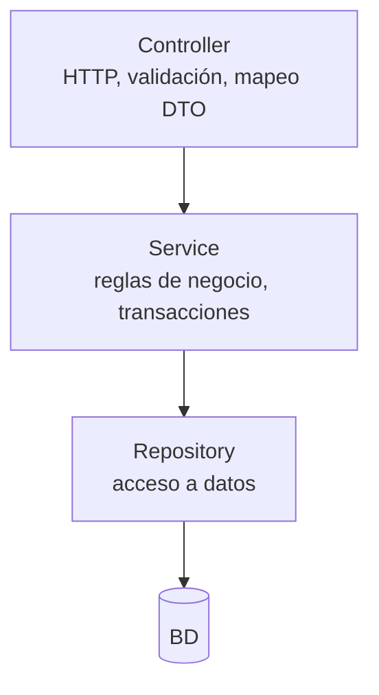
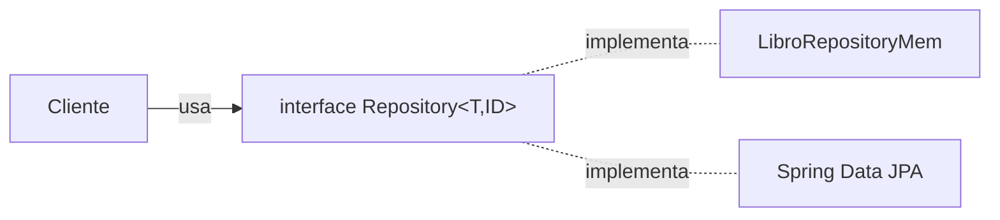
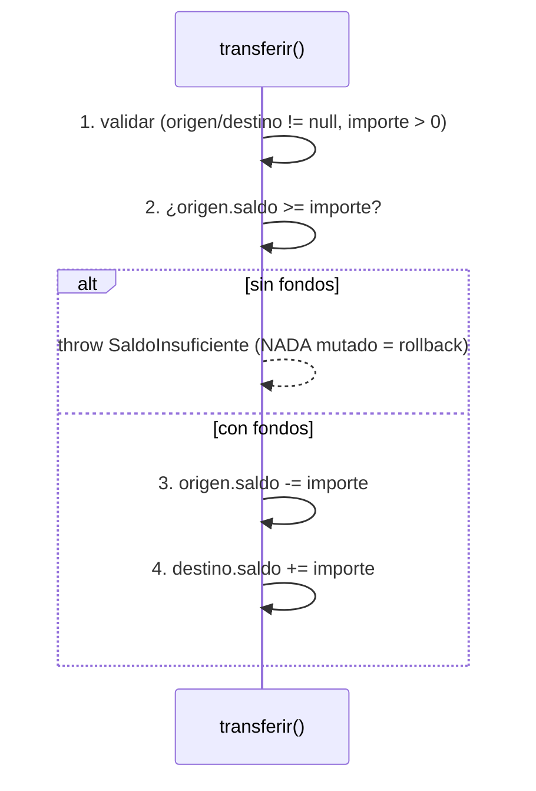
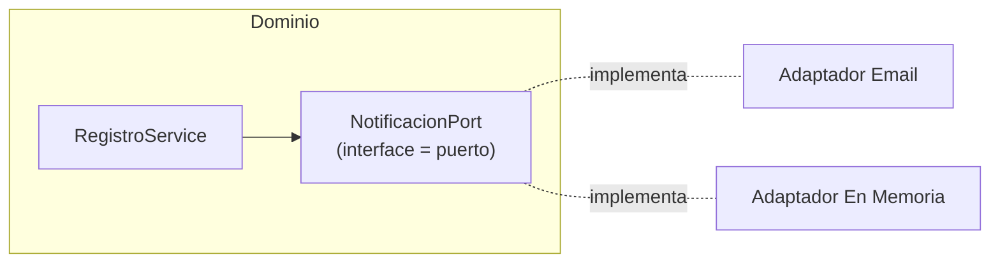

# Bloque X · Arquitectura y patrones

> Una API que crece sin capas se convierte en barro. El secreto no es saber
> muchos patrones: es saber **dónde va cada responsabilidad** y respetar la
> frontera. Controller delgado, Service con la lógica, Repository con los datos.
> Lo que aprendas aquí es el esqueleto sobre el que cuelgan los bloques 11-15.

## Cómo usar este documento

Igual que en los bloques anteriores: lee UNA sección → haz SU ejercicio →
vuelve. Cada sección cierra con el recuadro **"Lo practicas en…"**. No te saltes
el orden: las capas (10.1) son el marco mental de todo lo demás.

| Sección | Tema | Ejercicio |
|---|---|---|
| 10.1 | Arquitectura por capas (Controller→Service→Repository) | `Ej085LayeredArchitecture` |
| 10.2 | Patrón Repository genérico | `Ej086RepositoryPattern` |
| 10.3 | Patrón DAO clásico | `Ej087DaoPattern` |
| 10.4 | Servicio transaccional (atomicidad y rollback) | `Ej088ServiceTransactional` |
| 10.5 | Arquitectura hexagonal (puertos y adaptadores) | `Ej089HexagonalPorts` |
| 10.6 | Modelo rico vs anémico | `Ej090DomainModelVsAnemic` |
| 10.7 | Factory y Builder | `Ej091FactoryAndBuilder` |
| 10.8 | Strategy (políticas intercambiables) | `Ej092StrategyAndPolicy` |

---

## 10.1 Arquitectura por capas: Controller → Service → Repository

El patrón que estructura el 99 % de las APIs Spring. Tres capas, cada una con
**una** responsabilidad, y una regla de dependencia que no se rompe jamás.



| Capa | Responsabilidad | NO le corresponde |
|---|---|---|
| **Controller** | Traducir HTTP↔Java: leer la petición, mapear DTOs, devolver status | Lógica de negocio, SQL |
| **Service** | El cerebro: decide, valida reglas, orquesta, marca transacciones | Saber que existe HTTP |
| **Repository** | Persistencia pura: guardar y recuperar entidades | Tomar decisiones de negocio |

**La regla de oro**: cada capa solo conoce a la de debajo. El Controller **nunca**
llama al Repository directamente; pasa siempre por el Service. Y el Service
**no sabe que existe HTTP**: no devuelve códigos 200/404, lanza excepciones de
dominio (`NoSuchElementException`, `IllegalArgumentException`) y deja que otra
capa las traduzca a HTTP (eso es el bloque 9).

```java
public class CuentaService {
    private final CuentaRepository repo;          // depende de la INTERFAZ

    public CuentaService(CuentaRepository repo) { this.repo = repo; }

    public Cuenta ingresar(Long id, double importe) {
        if (importe <= 0) throw new IllegalArgumentException("importe > 0");
        Cuenta c = repo.findById(id)                       // habla con Repository
                .orElseThrow(() -> new NoSuchElementException("no existe " + id));
        Cuenta actualizada = new Cuenta(id, c.saldo() + importe); // record inmutable
        return repo.save(actualizada);
    }
}
```

Fíjate en dos cosas que verás idénticas en Spring: la dependencia es la
**interfaz** `CuentaRepository` (no la implementación concreta), inyectada por
**constructor**; y la "modificación" del saldo crea una `Cuenta` NUEVA porque es
un `record` inmutable (bloque 1.1).

> **Lo practicas en `Ej085LayeredArchitecture`**: un Service que valida, delega
> en el Repository y suma saldos con streams, sin tocar nunca HTTP.

---

## 10.2 Patrón Repository: la persistencia detrás de una interfaz

Un **Repository** es una interfaz que abstrae "dónde viven los datos". El cliente
programa contra el contrato (`save`, `findById`, `findAll`…) y no sabe ni le
importa si detrás hay un `HashMap`, JDBC o JPA. Mañana cambias la implementación
y **ni una línea del Service cambia**.

```java
public interface Repository<T, ID> {
    T save(T entity);
    Optional<T> findById(ID id);
    List<T> findAll();
    boolean deleteById(ID id);
    long count();
}
```

Esa firma genérica `<T, ID>` es EXACTAMENTE la de Spring Data: cuando en el
bloque 12 escribas `interface LibroRepository extends JpaRepository<Libro, Long>`
y obtengas `save`/`findById`/`findAll` gratis, estarás usando este mismo patrón
—solo que la implementación la genera Spring por ti en tiempo de arranque.

Detalles que los tests castigan:

- `findById` devuelve `Optional` (bloque 1.2), nunca `null`: `Optional.ofNullable(db.get(id))`.
- `save` es un **upsert**: `map.put(id, entity)` inserta o reemplaza según la clave.
- `findAll` devuelve una **copia** (`new ArrayList<>(db.values())`), no la vista
  interna del mapa: si devuelves la vista, quien la reciba puede corromper tu estado.



> **Lo practicas en `Ej086RepositoryPattern`**: implementar un Repository
> genérico en memoria y comprobar que el cliente solo depende de la interfaz.

---

## 10.3 Patrón DAO: el acceso a datos clásico

El **DAO** (Data Access Object) es el primo veterano del Repository, el que verás
en el módulo de Acceso a Datos. Encapsula el CRUD de UNA entidad concreta para
que el resto del código no sepa si hay JDBC, un fichero o memoria detrás.

| | Repository | DAO |
|---|---|---|
| Origen | DDD, orientado a la colección de dominio | Acceso a datos clásico (J2EE) |
| Firma típica | genérica `<T, ID>`, devuelve `Optional` | específica por entidad, suele devolver `null` |
| "No encontrado" | `Optional.empty()` | `null` (estilo clásico) |

```java
public interface EmpleadoDao {
    void insertar(Empleado e);
    Empleado buscarPorId(int id);                 // devuelve null si no existe
    List<Empleado> buscarPorDepartamento(String dep);
    boolean eliminar(int id);
}
```

Dos diferencias prácticas con el Repository que el ejercicio resalta:

1. **`buscarPorId` devuelve `null`** (no `Optional`): es el estilo DAO de toda la
   vida. En tu código moderno preferirás `Optional`, pero conviene reconocer el
   patrón clásico cuando lo veas.
2. **Insertar clave duplicada lanza `IllegalStateException`**: simula la
   restricción `PRIMARY KEY` de una BD real. Si la clave ya existe, fallas; no
   sobreescribes en silencio.

> **Lo practicas en `Ej087DaoPattern`**: un DAO en memoria que valida duplicados,
> filtra por departamento y devuelve `null` al no encontrar (estilo clásico).

---

## 10.4 Servicio transaccional: atomicidad y rollback

Una transferencia bancaria debe ser **atómica**: o se mueven los dos saldos o no
se mueve ninguno. Si a mitad falla, no puede quedar dinero "en el aire". Esa
propiedad —todo o nada— es la **A** de ACID, y en Spring se consigue con
`@Transactional` sobre el método de servicio.

```java
@Transactional                                    // Spring abre/confirma/revierte
public void transferir(Cuenta origen, Cuenta destino, double importe) { ... }
```

Aquí lo simulas a mano para entender la mecánica. El orden de las operaciones es
la clave de la atomicidad:



**Valida primero, muta después.** Toda comprobación que pueda fallar (fondos,
nulos, importe) va ANTES de tocar ningún saldo. Así, si lanzas la excepción, no
has modificado nada: ése es el "rollback" simulado. La suma total de saldos debe
permanecer constante (lo que sale de uno entra en el otro).

Ojo a un cambio de modelo respecto a 10.1: allí `Cuenta` era un `record`
inmutable y "modificar" el saldo creaba una cuenta nueva. Aquí, en cambio, la
`Cuenta` es **mutable** (`origen.saldo -= importe`): la transacción muta el
estado in situ. Es deliberado —simula filas de BD que cambian dentro de la
transacción—, pero refuerza la regla: con estado mutable, validar antes de mutar
es lo único que te da el "todo o nada". Si mutaras a medias y luego fallaras,
no habría record nuevo que descartar: el daño ya estaría hecho.

En Spring real **no** simulas el rollback a mano: `@Transactional` lo hace por
ti, pero con una regla que sorprende — por defecto solo revierte ante
`RuntimeException` y `Error`, **no** ante excepciones *checked*. Si quieres que
una `IOException` (checked) también revierta, debes pedirlo explícitamente con
`@Transactional(rollbackFor = IOException.class)`. Por eso las excepciones de
dominio del bloque 9 suelen extender `RuntimeException`: para que el rollback
sea automático.

Y el clásico que te morderá en el bloque 12: `@Transactional` funciona vía un
**proxy** de Spring. Si un método **llama a otro de la misma clase** anotado con
`@Transactional`, esa llamada interna NO pasa por el proxy y **la anotación se
ignora** (no abre transacción). Es la trampa del *self-invocation*: la solución
es mover el método transaccional a otro bean e inyectarlo.

> **Lo practicas en `Ej088ServiceTransactional`**: una transferencia atómica que,
> si no hay fondos, lanza `SaldoInsuficienteException` **sin alterar los saldos**.

---

## 10.5 Arquitectura hexagonal: puertos y adaptadores

La idea hexagonal (también "puertos y adaptadores"): el **dominio** define
interfaces —los **puertos**— que describen lo que necesita ("notificar a alguien"),
y la **infraestructura** las implementa —los **adaptadores**— (email real,
SMS, un log en memoria). El dominio depende del puerto, **nunca** del adaptador.



El premio: cambias el adaptador (email → SMS → un mock para tests) y el dominio
**no se entera**. El servicio recibe el puerto por constructor (inyección de
dependencias) y solo conoce su interfaz:

```java
public class RegistroService {
    private final NotificacionPort notificacion;          // el PUERTO, no el adaptador

    public RegistroService(NotificacionPort notificacion) {
        this.notificacion = notificacion;                 // inyección por constructor
    }

    public String registrar(String email) {
        if (!email.contains("@")) throw new IllegalArgumentException("email inválido");
        String msg = "Bienvenido " + email;
        notificacion.enviar(email, msg);                  // usa el puerto a ciegas
        return msg;
    }
}
```

Esto es la base de la "inversión de dependencias" (la **D** de SOLID): el dominio
no depende de los detalles; los detalles dependen del dominio. En los tests, el
adaptador es un `NotificacionEnMemoria` que guarda lo enviado en una lista —
exactamente cómo testearás servicios en el bloque 19 sin enviar correos reales.

> **Lo practicas en `Ej089HexagonalPorts`**: un servicio de dominio que registra
> usuarios usando un puerto, intercambiable sin tocar el dominio.

---

## 10.6 Modelo rico vs anémico: que el objeto proteja su estado

Un modelo **anémico** es una bolsa de datos con getters y setters: cualquiera le
mete cualquier valor y lo deja inconsistente. Un modelo **rico** protege sus
**invariantes**: expone métodos de negocio que son la ÚNICA puerta para cambiar
el estado, y rechazan las transiciones ilegales.

**Anémico (frágil)** — la lógica vive fuera, repetida en cada Service:

```java
public class Carrito { public int unidades; public boolean pagado; }
carrito.pagado = true;           // nadie comprueba que no esté vacío: estado corrupto
```

**Rico (robusto)** — el objeto se defiende solo:

```java
public final class Carrito {
    private int unidades;
    private boolean pagado;

    public void anadir(int n) {
        if (n <= 0) throw new IllegalArgumentException("n > 0");
        if (pagado) throw new IllegalStateException("ya pagado, no se muta");
        unidades += n;
    }
    public void pagar() {
        if (unidades == 0) throw new IllegalStateException("carrito vacío");
        if (pagado) throw new IllegalStateException("doble pago");
        pagado = true;
    }
    public int unidades() { return unidades; }
    public boolean pagado() { return pagado; }
    // NO hay setters: el estado SOLO cambia por anadir()/pagar()
}
```

La regla mental: **sin setters públicos**. Cada cambio de estado pasa por un
método que valida la transición (máquina de estados controlada). Las
invariantes — "no se añade a un carrito pagado", "no se paga un carrito vacío" —
viven DENTRO del objeto, donde no se pueden esquivar. Esto es el corazón del
Domain-Driven Design.

> **Lo practicas en `Ej090DomainModelVsAnemic`**: un `Carrito` rico que rechaza
> añadir tras pagar y pagar en vacío, sin exponer ni un setter.

---

## 10.7 Factory y Builder: construir objetos complejos con cabeza

Dos patrones de creación que resuelven problemas distintos:

**Builder** — para objetos con muchos campos, algunos opcionales con valores por
defecto. Evita el "constructor telescópico" (`new Usuario(a, b, c, d, e)` ilegible)
con una API fluida que termina en `build()`, donde se valida la invariante final:

```java
Usuario u = new UsuarioBuilder()
        .email("a@b.com")        // cada setter devuelve this → encadenable
        .rol("OPS")              // si no lo tocas, queda el default "USER"
        .activo(false)
        .build();                // valida (email obligatorio) y construye
```

La clave de la fluidez: cada método del builder hace `return this;`. Los campos
no fijados conservan su **valor por defecto** (`rol = "USER"`, `activo = true`).
`build()` es el guardián: valida lo obligatorio (email no vacío) antes de crear.

**Factory** — encapsula la "receta" de un tipo concreto de objeto, para no
repetir esa configuración por todas partes:

```java
public static Usuario crearAdmin(String email) {
    return new UsuarioBuilder().email(email).rol("ADMIN").activo(true).build();
}
```

Los dos se combinan de maravilla: la Factory usa el Builder por dentro. El cliente
pide `crearAdmin("x@y.com")` y no necesita recordar que un admin lleva
`rol="ADMIN"` y `activo=true`.

> **Lo practicas en `Ej091FactoryAndBuilder`**: un Builder fluido con defaults y
> validación en `build()`, y una Factory que produce administradores.

---

## 10.8 Strategy: algoritmos intercambiables sin `if` gigantes

El patrón **Strategy** sustituye una cadena de `if/else` (o un `switch`
kilométrico) por un conjunto de algoritmos intercambiables, cada uno encapsulado.
Elegir el algoritmo es buscar en un mapa por su clave.

```java
// cada estrategia es una función precio -> precioConDescuento
Map<String, DoubleUnaryOperator> estrategias = Map.of(
        "none",         p -> p,           // identidad
        "black-friday", p -> p * 0.70,    // -30 %
        "vip",          p -> p * 0.90);   // -10 %

public static double aplicar(double precio, String estrategia) {
    if (precio < 0) throw new IllegalArgumentException("precio >= 0");
    DoubleUnaryOperator f = estrategias.get(estrategia);
    if (f == null) throw new IllegalArgumentException("estrategia desconocida");
    return f.applyAsDouble(precio);
}
```

La ventaja decisiva (principio Abierto/Cerrado): **añadir una estrategia nueva
NO toca `aplicar`**. Solo agregas una entrada al mapa. El método que aplica la
lógica queda cerrado a modificación y abierto a extensión.

En Spring esto se potencia: en lugar de un `Map.of` a mano, inyectas
`List<EstrategiaPago>` y Spring te entrega todas las implementaciones registradas;
las indexas por su tipo en el constructor. Es el patrón que orquesta pagos,
notificaciones o validadores en aplicaciones reales.

```java
// versión Spring (bloque 4 en adelante)
public ProcesadorPagos(List<EstrategiaPago> estrategias) {
    this.porTipo = estrategias.stream()
            .collect(Collectors.toMap(EstrategiaPago::tipo, e -> e));
}
```

> **Lo practicas en `Ej092StrategyAndPolicy`**: un registro de estrategias de
> descuento como `DoubleUnaryOperator`, aplicadas por clave y cerradas a cambios.

---

## Errores comunes del bloque

| # | Error | Antídoto |
|---|---|---|
| 1 | El Controller llama al Repository saltándose el Service | Cada capa solo conoce a la de debajo; pasa por el Service |
| 2 | El Service devuelve códigos HTTP / `ResponseEntity` | El Service lanza excepciones de dominio; HTTP es del Controller |
| 3 | `findById` devuelve `null` en vez de `Optional` | `Optional.ofNullable(db.get(id))` (estilo Repository) |
| 4 | `findAll` devuelve la vista interna del mapa | Devuelve una copia: `new ArrayList<>(db.values())` |
| 5 | Insertar clave duplicada sobreescribe en silencio | Comprueba antes y lanza `IllegalStateException` (como `PRIMARY KEY`) |
| 6 | Mutar saldos ANTES de validar fondos | Valida primero, muta después: si fallas, nada cambió (rollback) |
| 7 | El dominio depende del adaptador concreto | Depende del **puerto** (interfaz), inyectado por constructor |
| 8 | Exponer setters en un modelo de dominio | Modelo rico: el estado solo cambia por métodos que validan |
| 9 | Olvidar `return this` en el Builder | Sin él la API fluida no encadena; `build()` recibe campos vacíos |
| 10 | `switch`/`if` gigante para elegir algoritmo | Strategy: mapa clave→función; añadir uno no toca el método |

## Chuleta final del bloque

```
Capas        Controller (HTTP) → Service (negocio) → Repository (datos); solo hacia abajo
Service      lanza excepciones de dominio, JAMÁS status HTTP
Repository   interfaz genérica <T,ID> · findById → Optional · findAll → copia · save = upsert
DAO          acceso clásico por entidad · buscarPorId → null · duplicado → IllegalStateException
Transacción  validar PRIMERO, mutar DESPUÉS → atomicidad (todo o nada) = rollback simulado
Hexagonal    dominio define PUERTO (interface); infra implementa ADAPTADOR; inyección por constructor
Modelo rico  sin setters; el objeto valida sus invariantes en métodos de transición
Builder      cada setter return this · defaults en campos · build() valida lo obligatorio
Factory      encapsula la "receta" de un tipo (usa el Builder por dentro)
Strategy     Map<clave, función> · añadir estrategia NO toca aplicar() (Abierto/Cerrado)
```

## Autoevaluación (responde sin mirar; si fallas 2+, relee la sección)

1. ¿Por qué el Controller no debe llamar nunca al Repository directamente? ¿Qué
   capa traduce una `NoSuchElementException` en un 404? *(10.1)*
2. ¿Qué firma genérica de Repository reconocerás en `JpaRepository<Libro, Long>`?
   ¿Por qué `findAll` debe devolver una copia? *(10.2)*
3. Cita dos diferencias entre un DAO clásico y un Repository. *(10.2, 10.3)*
4. En una transferencia, ¿por qué se valida ANTES de tocar los saldos? ¿Qué
   propiedad ACID estás simulando? *(10.4)*
5. En hexagonal, ¿quién define el puerto y quién el adaptador? ¿De cuál depende
   el dominio? *(10.5)*
6. ¿Qué distingue a un modelo rico de uno anémico? ¿Por qué un modelo rico no
   expone setters? *(10.6)*
7. ¿Qué debe devolver cada método de un Builder fluido y por qué? ¿Qué valida
   `build()`? *(10.7)*
8. Con el patrón Strategy, ¿qué tienes que tocar para añadir un descuento nuevo?
   ¿Qué principio de diseño estás respetando? *(10.8)*
