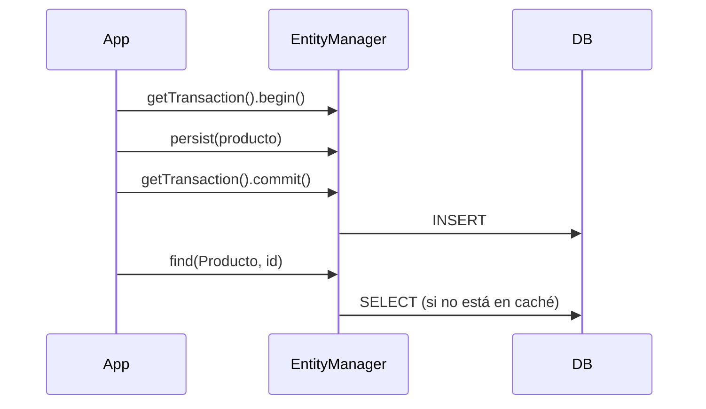
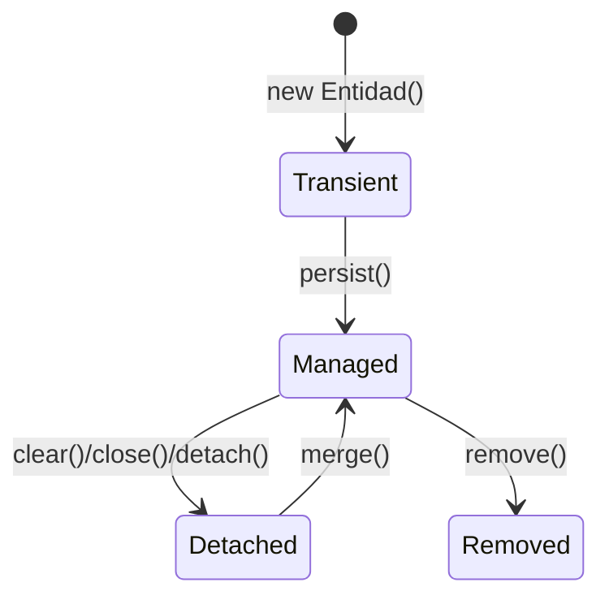

# Bloque XII · Spring Data JPA / Hibernate (el núcleo)

> JPA es el contrato (cómo se mapea un objeto a una fila); Hibernate es quien lo
> cumple. Hasta ahora guardabas datos a mano con JDBC (bloque 11); aquí dejas de
> escribir SQL para describir tus objetos y que la máquina genere el SQL por ti.
> Esto es Acceso a Datos (DAM2) RA3 en estado puro.

## Cómo usar este documento

Igual que en bloques anteriores: lee UNA sección → haz SU ejercicio → vuelve.
Cada sección cierra con el recuadro **"Lo practicas en…"**. Aquí trabajas con el
`EntityManager` "a pelo" (lo que Spring Data usa por debajo): entenderlo hace que
`JpaRepository` deje de ser magia.

| Sección | Tema | Ejercicio |
|---|---|---|
| 12.1 | Entidad ↔ tabla (`@Entity`/`@Id`/`@Column`/`@Table`) | `Ej103EntityMapping` |
| 12.2 | Generación de id (`@GeneratedValue`) | `Ej104IdGenerationStrategies` |
| 12.3 | CRUD: el repositorio por dentro | `Ej105JpaRepository` |
| 12.4 | Query methods derivados del nombre | `Ej106DerivedQueryMethods` |
| 12.5 | JPQL: consultar objetos, no tablas | `Ej107JpqlQueries` |
| 12.6 | SQL nativo (cuando JPQL no basta) | `Ej108NativeQueries` |
| 12.7 | Modificaciones masivas (`@Modifying`) | `Ej109ModifyingQueries` |
| 12.8 | Callbacks del ciclo de vida | `Ej110EntityLifecycleCallbacks` |
| 12.9 | Enums y objetos embebidos | `Ej111EnumAndEmbeddable` |
| 12.10 | El contexto de persistencia | `Ej112PersistenceContext` |
| 12.11 | Identidad: `equals`/`hashCode` | `Ej113EqualsHashCodeEntities` |
| 12.12 | Proyección por constructor a DTO | `Ej114DtoConstructorProjection` |

> **Nota sobre los tests del bloque.** Cada test monta un `EntityManagerFactory`
> aislado con **H2 en memoria** (clase `JpaTestSupport`): base limpia por test,
> sin instalar nada. Los "retos extra" (`desafio*`) usan repositorios al estilo
> Spring Data; en producción esas interfaces extenderían `JpaRepository` y
> Spring las implementaría sola.

---

## 12.1 Entidad ↔ tabla: `@Entity`, `@Id`, `@Column`, `@Table`

Una **entidad** es una clase Java cuyas instancias se corresponden con filas de
una tabla. Una anotación basta para declararlo:

```mermaid
classDiagram
    class Producto {
        <<@Entity>>
        +@Id Long id
        +@Column String nombre
        +double precio
    }
    Producto --> "tabla PRODUCTO" : mapea
```

```java
@Entity
@Table(name = "EMPLEADO")          // nombre de tabla explícito
public class Empleado {

    @Id                            // clave primaria
    @Column(name = "EMP_ID")       // nombre de columna explícito
    private Long id;

    @Column(name = "EMP_NOM", nullable = false)   // NOT NULL en la BD
    private String nombre;

    private String departamento;   // sin @Column: columna DEPARTAMENTO por defecto

    protected Empleado() { }       // JPA EXIGE constructor sin argumentos
    // getters/setters...
}
```

Las cuatro anotaciones del mapeo básico:

| Anotación | Sobre | Qué hace | Por defecto si falta |
|---|---|---|---|
| `@Entity` | la clase | la declara gestionable por JPA | (obligatoria) |
| `@Table(name=…)` | la clase | fija el nombre de tabla | nombre de la clase |
| `@Id` | un campo | marca la clave primaria | (obligatoria) |
| `@Column(name=…, nullable=…, length=…, unique=…)` | un campo | personaliza la columna | nombre del campo, `nullable=true` |

Reglas que el bloque te hará interiorizar:

- **Constructor sin argumentos obligatorio** (puede ser `protected`): Hibernate
  instancia la entidad por reflexión antes de rellenarla.
- Sin `@Column` el campo SE MAPEA igual: el nombre de columna pasa a ser el del
  campo (en H2, en mayúsculas). `@Column` solo sirve para *cambiar* algo.
- `@Table` no cambia el comportamiento Java, solo el nombre físico. Útil cuando
  la BD ya existe y la tabla se llama `EMPLEADO`, no `Empleado`.

> En los tests, varios retos leen estas anotaciones **por reflexión**
> (`clase.isAnnotationPresent(...)`, `field.getAnnotation(Column.class).name()`):
> por eso `@Table(name="EMPLEADO")` y `@Column(name="EMP_ID")` deben ser exactos.

> **Lo practicas en `Ej103EntityMapping`**: persistir y buscar por id con
> `EntityManager`, e inspeccionar el mapeo por reflexión.

---

## 12.2 Generación de id: `@GeneratedValue`

Rara vez asignas el id a mano; lo genera la base. `@GeneratedValue` elige *cómo*:

```java
@Id
@GeneratedValue(strategy = GenerationType.IDENTITY)   // auto-incremento de la BD
private Long id;
```

```java
@Id
@GeneratedValue(strategy = GenerationType.SEQUENCE, generator = "regSeqGen")
@SequenceGenerator(name = "regSeqGen", sequenceName = "REG_SEQ", allocationSize = 1)
private Long id;
```

Las estrategias que importan:

| Estrategia | Cómo obtiene el id | Cuándo se asigna | Nota |
|---|---|---|---|
| `IDENTITY` | columna auto-incremental (`AUTO_INCREMENT`/`SERIAL`) | tras el `INSERT` | impide el batch de inserts |
| `SEQUENCE` | un objeto SECUENCIA de la BD | antes del `INSERT` (Hibernate la pide) | la preferida en PostgreSQL/Oracle |
| `TABLE` | una tabla auxiliar de contadores | — | lenta, casi en desuso |
| `AUTO` | Hibernate decide según el dialecto | — | cómoda, menos control |

`@SequenceGenerator` afina la SEQUENCE: `sequenceName` (su nombre real en la BD)
y `allocationSize` (cuántos ids reserva de golpe; `1` = pide uno cada vez, sin
huecos pero con más viajes a la BD).

Detalle clave: con id generado, **antes de persistir el id es `null`**; tras
`persist`+flush ya está poblado. Eso es lo que comprueba el ejercicio.

Por qué `IDENTITY` "impide el batch": el id solo existe **después** de ejecutar
el `INSERT`, así que Hibernate no puede acumular varios inserts y mandarlos
juntos — necesita el id de vuelta de cada fila antes de seguir, y eso le obliga a
ir uno a uno. `SEQUENCE` y `TABLE` piden el id **antes** del insert, así que sí
permiten agrupar inserts en lotes (`batch_size`). Por eso en motores serios se
prefiere `SEQUENCE` aunque `IDENTITY` parezca más cómodo.

> **Lo practicas en `Ej104IdGenerationStrategies`**: persistir dos entidades sin
> id y verificar que la BD les asigna ids distintos; leer la estrategia y el
> `sequenceName`/`allocationSize` por reflexión.

---

## 12.3 CRUD: lo que un repositorio hace por dentro

`JpaRepository` te regala `save`, `findById`, `findAll`, `deleteById`… Aquí los
escribes tú con `EntityManager` para ver que no hay magia:



El mapa de operaciones del `EntityManager`:

| Quieres… | EntityManager | Equivalente Spring Data |
|---|---|---|
| insertar una entidad NUEVA | `persist(e)` | `save(e)` (si id null) |
| actualizar una DESCONECTADA | `merge(e)` | `save(e)` (si id no null) |
| buscar por clave | `find(Clase.class, id)` | `findById(id)` → `Optional` |
| listar | `createQuery("select e from E e", E.class).getResultList()` | `findAll()` |
| borrar | `remove(e)` (la entidad debe estar gestionada) | `deleteById(id)` |

El patrón de `save` que verás replicado en todas partes:

```java
public Tarea save(Tarea t) {
    em.getTransaction().begin();
    if (t.getId() == null) em.persist(t);   // nueva
    else t = em.merge(t);                    // ya existía → devuelve la gestionada
    em.getTransaction().commit();
    return t;
}
```

Dos trampas: `persist` necesita una transacción activa; y `remove` solo borra
una entidad **gestionada** (primero `find`, luego `remove`).

> **Lo practicas en `Ej105JpaRepository`**: un CRUD completo (save con
> persist/merge, findById, findAll ordenado por id, deleteById que devuelve si
> existía).

---

## 12.4 Query methods: SQL derivado del nombre del método

La magia más vistosa de Spring Data: declaras un método con un nombre que sigue
una convención y Spring le genera la consulta.

```java
public interface EmpleadoRepository extends JpaRepository<Empleado, Long> {
    List<Empleado> findByDepartamento(String departamento);
    List<Empleado> findByDepartamentoAndNombre(String departamento, String nombre);
    long countByDepartamento(String departamento);
    List<Empleado> findByNombre(String nombre);
}
```

`findBy` + `Departamento` + `And` + `Nombre` → `WHERE departamento = ? AND
nombre = ?`. El vocabulario que el parser entiende:

| Fragmento | Genera |
|---|---|
| `findBy` / `getBy` / `readBy` | `SELECT … WHERE` |
| `And` / `Or` | combinación de condiciones |
| `GreaterThan` / `LessThan` / `Between` | `>` / `<` / `BETWEEN` |
| `Like` / `Containing` / `StartingWith` | `LIKE` |
| `OrderBy…Asc/Desc` | `ORDER BY` |
| `countBy…` / `existsBy…` / `deleteBy…` | `COUNT` / `EXISTS` / `DELETE` |

En el ejercicio escribes el **JPQL equivalente a mano** (lo que Spring genera por
ti), para entender qué produce cada nombre. Lo esencial: parametriza SIEMPRE con
`:nombre` o `?1`, **nunca concatenes** (inyección).

```java
em.createQuery("select a from Articulo a where a.categoria = :cat", Articulo.class)
  .setParameter("cat", categoria)
  .getResultList();
```

> **Lo practicas en `Ej106DerivedQueryMethods`**: implementar a mano el JPQL de
> `findByCategoria`, `findByPrecioMayorQue` y `countByCategoria`.

---

## 12.5 JPQL: consultar objetos, no tablas

JPQL se parece a SQL pero opera sobre **entidades y sus campos**, no sobre tablas
y columnas. `select e from Empleado e` recorre objetos `Empleado`.

```java
// Proyección de UN campo: el resultado es String, no la entidad
List<String> nombres = em.createQuery(
        "select e.nombre from Empleado e where e.departamento = :d order by e.nombre",
        String.class).setParameter("d", dep).getResultList();

// Agregación: avg/sum/count/min/max → tipo numérico (¡puede venir null!)
Double media = em.createQuery(
        "select avg(e.salario) from Empleado e where e.departamento = :d", Double.class)
        .setParameter("d", dep).getSingleResult();

// LIKE con comodín construido en Java
em.createQuery("select e from Empleado e where e.nombre like :p", Empleado.class)
  .setParameter("p", "%" + fragmento + "%").getResultList();
```

SQL vs JPQL en una frase: **SQL conoce `EMPLEADO.EMP_NOM`; JPQL conoce
`Empleado.nombre`** y Hibernate traduce. Por eso si renombras una columna con
`@Column`, tu JPQL no cambia.

Tres cuidados que castigan los tests:

- `avg`/`sum` sobre un conjunto VACÍO devuelven **`null`**, no `0`. Decide tú el
  valor por defecto (`if (media == null) return 0.0;`).
- `getSingleResult()` lanza si hay 0 o >1 resultados; úsalo solo cuando esperas
  exactamente uno (un agregado, un count).
- El orden NO está garantizado sin `order by`.

> **Lo practicas en `Ej107JpqlQueries`**: proyección de columna, media con
> manejo del `null`, y búsqueda `LIKE` parametrizada.

---

## 12.6 SQL nativo: cuando JPQL no basta

A veces necesitas una función propia del motor, un `JOIN` raro o tocar una tabla
sin entidad. Entonces bajas a SQL real:

```java
// Cuenta cruda: el resultado es un Number del dialecto → normaliza a long
long filas = ((Number) em.createNativeQuery("SELECT COUNT(*) FROM CIUDAD108")
        .getSingleResult()).longValue();

// SELECT * mapeado a una entidad: 2º argumento = la clase destino
List<Ciudad> grandes = em.createNativeQuery(
        "SELECT * FROM CIUDAD108 WHERE poblacion >= ?", Ciudad.class)
        .setParameter(1, minPoblacion)      // parámetros nativos son POSICIONALES (?)
        .getResultList();
```

Diferencias frente a JPQL que el ejercicio recalca:

- El SQL nativo usa el **nombre real de la tabla** (`CIUDAD108`), no el de la
  entidad.
- Los parámetros son **posicionales** (`?` + `setParameter(1, …)`), no `:nombre`.
- Pierdes portabilidad entre motores (la gracia de JPA), así que úsalo solo
  cuando JPQL no llegue.
- Sigues sin concatenar: el `?` te protege de inyección igual que en JDBC.

> **Lo practicas en `Ej108NativeQueries`**: un `COUNT(*)` nativo normalizado a
> `long` y un `SELECT *` mapeado a la entidad con parámetro posicional.

---

## 12.7 Modificaciones masivas: `@Modifying` / `executeUpdate`

Para cambiar muchas filas de golpe NO traes las entidades una a una: lanzas un
`UPDATE`/`DELETE` JPQL directo.

```java
em.getTransaction().begin();
int afectadas = em.createQuery(
        "update Prod p set p.precio = p.precio * :factor where p.categoria = :cat")
        .setParameter("factor", 1 + porcentaje / 100)
        .setParameter("cat", categoria)
        .executeUpdate();          // devuelve el nº de filas tocadas
em.getTransaction().commit();
em.clear();                        // el contexto quedó desincronizado: límpialo
```

En Spring Data el mismo método se declara así, y necesita `@Modifying` para que
Spring use `executeUpdate()` en vez de intentar un `SELECT`:

```java
@Modifying
@Query("update Empleado e set e.departamento = :nuevo where e.departamento = :viejo")
int actualizarDepartamento(String nuevo, String viejo);
```

Tres cosas no negociables:

- Necesita **transacción activa** (en Spring, `@Transactional`).
- `executeUpdate()` devuelve el **número de filas afectadas** (lo que afirman los
  tests: 2 productos de la categoría "a", 1 producto con stock 0).
- Un update/delete masivo **se salta el contexto de persistencia**: las entidades
  ya cargadas quedan obsoletas. Por eso `em.clear()` tras el commit.

> **Lo practicas en `Ej109ModifyingQueries`**: un `UPDATE` masivo con factor
> calculado y un `DELETE` masivo por condición, devolviendo filas afectadas.

---

## 12.8 Callbacks del ciclo de vida: `@PrePersist` / `@PreUpdate`

Hibernate puede llamar a métodos tuyos en momentos clave de la vida de la
entidad. El uso típico: **auditoría** (fechas de creación/modificación
automáticas) sin ensuciar el código de negocio.

```java
@Entity
public class Auditado {
    private LocalDateTime creadoEn;
    private LocalDateTime actualizadoEn;

    @PrePersist                      // justo antes del primer INSERT
    void antesDeGuardar() {
        creadoEn = LocalDateTime.now();
        actualizadoEn = creadoEn;
    }

    @PreUpdate                       // justo antes de cada UPDATE
    void antesDeActualizar() {
        actualizadoEn = LocalDateTime.now();
    }
}
```

Los callbacks disponibles: `@PrePersist`/`@PostPersist`,
`@PreUpdate`/`@PostUpdate`, `@PreRemove`/`@PostRemove`, `@PostLoad`. La idea es
que el SERVICIO no tenga que acordarse de poner la fecha: la entidad se
auto-rellena. En `Ej110` el test guarda una entidad con `creadoEn == null` y
comprueba que tras `persist` ya está poblada **porque lo hizo el `@PrePersist`,
no el código que llamó a guardar**.

> **Lo practicas en `Ej110EntityLifecycleCallbacks`**: persistir una entidad y
> ver que su `@PrePersist` rellena la fecha sola; localizar los callbacks por
> reflexión.

---

## 12.9 Enums y objetos embebidos: `@Enumerated` / `@Embeddable`

**Enums.** Por defecto JPA guarda un enum como su número ordinal (0, 1, 2…), lo
cual es una bomba de relojería: si reordenas las constantes, los datos viejos
quedan corruptos. Guárdalo SIEMPRE como texto:

```java
@Enumerated(EnumType.STRING)     // guarda "ACTIVO", no 0
private Estado estado;
```

| `EnumType` | Guarda | Riesgo |
|---|---|---|
| `ORDINAL` (defecto) | el índice (0,1,2…) | reordenar el enum corrompe la BD |
| `STRING` | el nombre de la constante | ninguno relevante; legible |

**Embeddables.** Un grupo de campos sin identidad propia (una dirección, un
rango de fechas) que quieres reutilizar y que vive en la MISMA tabla que su
dueño:

```java
@Embeddable
public class Direccion {            // no es entidad: no tiene @Id ni tabla propia
    private String calle;
    private String ciudad;
}

@Entity
public class Pedido {
    @Embedded
    private Direccion direccionEnvio;   // columnas calle/ciudad EN la tabla PEDIDO
}
```

`@Embeddable` marca el tipo reutilizable; `@Embedded` lo incrusta en la entidad.
No hay JOIN ni tabla extra: las columnas del embebido se aplanan en la del dueño.

> **Lo practicas en `Ej111EnumAndEmbeddable`**: persistir y recargar una entidad
> con un enum (`@Enumerated(STRING)`) y una dirección embebida, comprobando que
> ambos sobreviven al viaje a la BD.

---

## 12.10 El contexto de persistencia (la "caché de 1er nivel")

El `EntityManager` mantiene un cuaderno de entidades que conoce. Cada una está en
uno de cuatro estados:



| Estado | Significa | Cómo se llega |
|---|---|---|
| **Transient** | objeto Java normal, JPA no lo conoce | `new Entidad()` |
| **Managed** | gestionado; sus cambios se sincronizan | `persist`, `find`, `merge` |
| **Detached** | fue gestionado, ya no | `clear`, `close`, `detach` |
| **Removed** | marcado para borrar | `remove` |

La consecuencia más potente es el **dirty checking**: si modificas una entidad
*managed* dentro de una transacción, Hibernate detecta el cambio y hace el
`UPDATE` solo al commit — **sin que llames a `save`**:

```java
em.getTransaction().begin();
Producto p = em.find(Producto.class, id);   // MANAGED
p.setPrecio(p.getPrecio() + 10);             // NO hace falta persist/merge
em.getTransaction().commit();                // Hibernate hace el UPDATE aquí
```

Si la entidad está *detached* (tras `detach`/`clear`), ese mismo cambio **no se
persiste**: ya no está en el cuaderno. Para reincorporarla: `merge`.

Operaciones de control que usarás: `flush()` (vuelca los cambios pendientes a la
BD sin cerrar la transacción — **exige transacción activa**), `clear()` (vacía el
contexto: todo pasa a detached), `contains(e)` (¿está gestionada?).

> **Lo practicas en `Ej112PersistenceContext`**: ver el dirty checking persistir
> un cambio sin `save`, y comprobar que un cambio sobre una entidad *detached* se
> ignora.

---

## 12.11 Identidad de entidades: `equals` y `hashCode`

Repetimos el contrato del bloque 1, pero con la vuelta de tuerca que trae JPA:
**el id lo pone la BD al persistir, así que no existe al crear el objeto.** Si
basas `equals`/`hashCode` en el id, dos entidades nuevas (id `null`) parecen
iguales, y una entidad cambia de identidad al guardarse — y rompe cualquier
`HashSet` donde estuviera.

La regla pragmática: si la entidad tiene una **clave de negocio** estable (un
IBAN, un UUID, un email único), basa la igualdad en ELLA, no en el id de BD:

```java
@Entity
public class Cuenta {
    @Id private String iban;       // aquí el id ES la clave de negocio
    private double saldo;

    @Override public boolean equals(Object o) {
        if (this == o) return true;
        if (o == null || getClass() != o.getClass()) return false;
        return Objects.equals(iban, ((Cuenta) o).iban);   // SOLO el iban
    }
    @Override public int hashCode() {
        return Objects.hash(iban);                         // MISMO campo
    }
}
```

Decisiones que el ejercicio te obliga a defender:

- **No metas campos mutables** (`saldo`) en `equals`/`hashCode`: si cambian, el
  objeto se "pierde" dentro de un `Set`. El test mete dos cuentas con el mismo
  IBAN y distinto saldo en un `HashSet` y exige `size == 1`.
- Comparar por la business key hace el `equals` **invariante** aunque el id de BD
  cambie (lo que comprueba el reto de "invariancia").
- `getClass() != o.getClass()` es más estricto que `instanceof`; con proxies de
  Hibernate hay matices, pero para este bloque `getClass()` es suficiente.

> **Lo practicas en `Ej113EqualsHashCodeEntities`**: `equals`/`hashCode` por
> clave de negocio que funciona en un `HashSet` y no depende del id de BD.

---

## 12.12 Proyección por constructor: `select new Dto(...)`

No traigas la entidad entera si solo necesitas dos campos: pide directamente un
DTO. JPQL lo permite con `select new` y el **nombre COMPLETO** de la clase:

```java
public record ResumenPedido(Long id, double total) { }   // DTO de solo lectura

List<ResumenPedido> resumen = em.createQuery(
        "select new com.masterclass.api.b12_jpa.ResumenPedido(p.id, p.total) "
      + "from Pedido p order by p.id", ResumenPedido.class)
        .getResultList();
```

Por qué importa:

- **Menos datos, menos memoria, menos coste**: el `SELECT` solo pide las columnas
  del DTO, no toda la fila.
- El DTO **no está gestionado** por el contexto: no hay dirty checking, no se
  guarda solo. Es justo lo que quieres para enviar al cliente como respuesta REST.
- El DTO debe tener un **constructor que case** en tipos y orden con lo
  seleccionado. Un `record` encaja de maravilla (su constructor canónico).
- El nombre de la clase en el JPQL es **totalmente cualificado** (paquete
  incluido); si está anidada, con `$` (p. ej. `…Ej114…$ResumenPedido`).

Conecta con el bloque 7 (DTOs): aquellos los construías en el servicio a partir
de la entidad; aquí los construye la propia consulta, sin pasar por la entidad.

> **Lo practicas en `Ej114DtoConstructorProjection`**: una consulta `select new`
> que devuelve `ResumenPedido(id, total)` ordenado, sin materializar pedidos.

---

## Errores comunes del bloque

| # | Error | Antídoto |
|---|---|---|
| 1 | Entidad sin constructor sin-argumentos | Añade uno (puede ser `protected`); JPA lo exige |
| 2 | `persist`/`executeUpdate` sin transacción | `begin()`…`commit()` (o `@Transactional` en Spring) |
| 3 | `avg`/`sum` devuelven `null` y revientan | Trátalo: `if (x == null) return 0.0;` |
| 4 | Enum con `EnumType.ORDINAL` (defecto) | `@Enumerated(EnumType.STRING)` siempre |
| 5 | Concatenar parámetros en el JPQL/SQL | `setParameter(":x" / "?1")`, nunca `+` |
| 6 | Esperar dirty checking en entidad *detached* | Solo aplica a *managed*; usa `merge` |
| 7 | `equals`/`hashCode` por id de BD | Usa la clave de negocio (uuid, iban) si existe |
| 8 | Update masivo y seguir usando el contexto viejo | `em.clear()` tras el commit |
| 9 | `getSingleResult()` con 0 o varias filas | Úsalo solo para agregados/uno garantizado |
| 10 | `select new Dto` con nombre corto de clase | Nombre TOTALMENTE cualificado en el JPQL |
| 11 | SQL nativo con parámetros `:nombre` | Los nativos son posicionales: `?` + `setParameter(1,…)` |

## Chuleta final del bloque

```
@Entity/@Table        = clase ↔ tabla · constructor sin-args OBLIGATORIO
@Id/@GeneratedValue   = clave · IDENTITY (auto-incr) vs SEQUENCE (secuencia BD)
@Column               = nombre/nullable/length/unique de la columna
EntityManager         = persist (insert) · merge (update) · find · remove
JPQL                  = "select e from Entidad e" → objetos, no tablas
query methods         = findByXAndY / countByX / existsByX → Spring genera el SQL
nativo                = createNativeQuery(SQL, Clase) · parámetros ? posicionales
@Modifying            = update/delete masivo · executeUpdate() · requiere tx · clear()
@PrePersist/@PreUpdate= auditoría automática de fechas
@Enumerated(STRING)   = enum como texto (ORDINAL corrompe al reordenar)
@Embeddable/@Embedded = objeto de valor aplanado en la tabla del dueño
contexto persistencia = transient→managed→detached/removed · dirty checking
equals/hashCode       = por clave de NEGOCIO, nunca por id de BD ni campos mutables
select new Dto(...)   = proyección a DTO (nombre de clase cualificado)
```

## Autoevaluación (responde sin mirar; si fallas 2+, relee la sección)

1. ¿Por qué una entidad JPA necesita un constructor sin argumentos? *(12.1)*
2. ¿Qué diferencia hay entre `IDENTITY` y `SEQUENCE`, y cuándo el id está
   disponible en cada una? *(12.2)*
3. ¿Cuándo usas `persist` y cuándo `merge`? ¿Qué devuelve `merge`? *(12.3)*
4. ¿En qué se diferencia `findByDepartamentoAndNombre` del SQL que genera, y por
   qué nunca debes concatenar el valor? *(12.4)*
5. ¿Qué devuelve `avg(e.salario)` si no hay filas, y cómo lo gestionas? *(12.5)*
6. ¿Por qué un `UPDATE` masivo obliga a `em.clear()` después? *(12.7)*
7. ¿Qué problema tiene `@Enumerated(EnumType.ORDINAL)` y cómo lo evitas? *(12.9)*
8. ¿Qué es el "dirty checking" y por qué no funciona sobre una entidad
   *detached*? *(12.10)*
9. ¿Por qué basar `equals`/`hashCode` en el id de BD rompe un `HashSet`? *(12.11)*
10. ¿Qué ventajas tiene `select new Dto(...)` frente a cargar la entidad
    entera? *(12.12)*
