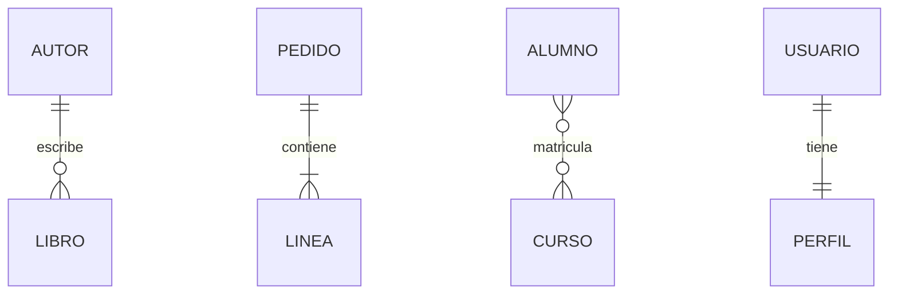
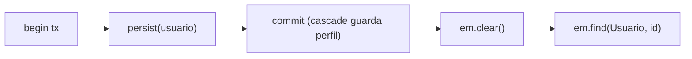
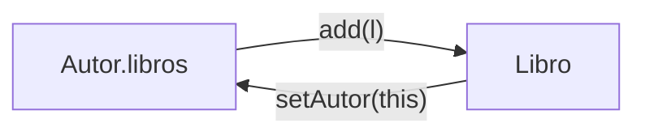
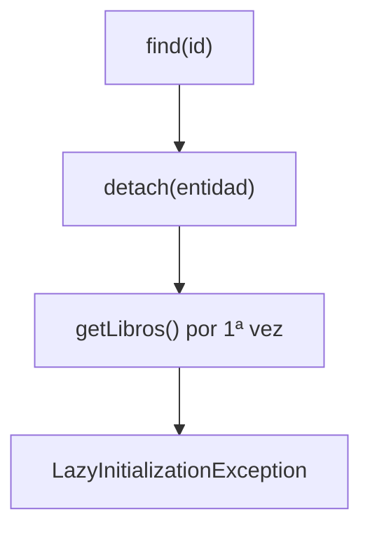
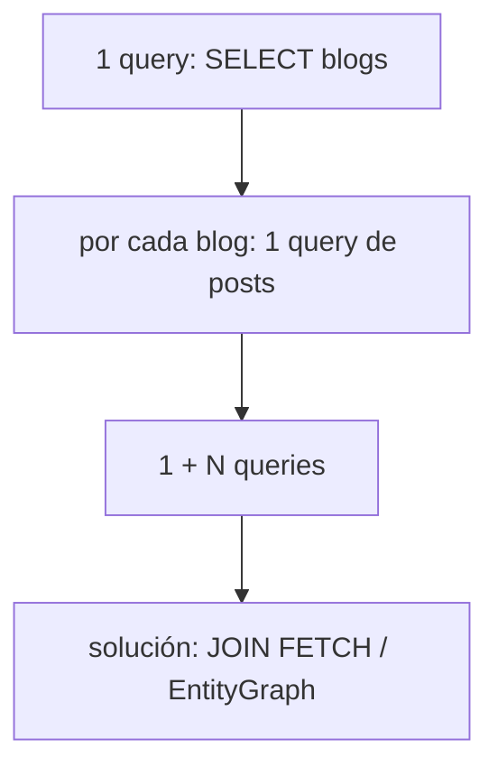

# Bloque XIII · Relaciones JPA

> Las tablas se relacionan con claves foráneas; las entidades, con referencias
> Java. JPA traduce entre esos dos mundos, y casi siempre lo hace bien… hasta
> que olvidas sincronizar un lado, pones un `EAGER` de más o te comes un N+1.
> Aquí vive el 80 % de los bugs de persistencia reales.

## Cómo usar este documento

Igual que en bloques anteriores: lee UNA sección → haz SU ejercicio → vuelve.
Cada sección cierra con el recuadro **"Lo practicas en…"**. Los tests son la
especificación: si una pista no cuadra con el test, manda el test.

| Sección | Tema | Ejercicio |
|---|---|---|
| 13.1 | `@OneToOne`: 1–1 con FK | `Ej115OneToOne` |
| 13.2 | `@OneToMany` / `@ManyToOne`: 1–N | `Ej116OneToManyManyToOne` |
| 13.3 | `@ManyToMany`: N–N con tabla intermedia | `Ej117ManyToManyJoinTable` |
| 13.4 | Sincronizar los dos lados (el bug clásico) | `Ej118BidirectionalSync` |
| 13.5 | Cascade y `orphanRemoval` | `Ej119CascadeTypes` |
| 13.6 | LAZY vs EAGER y `LazyInitializationException` | `Ej120FetchLazyEager` |
| 13.7 | El problema N+1 | `Ej121NPlusOneProblem` |
| 13.8 | JOIN FETCH y EntityGraph | `Ej122JoinFetchAndEntityGraph` |



| Cardinalidad | Anotación | Dónde vive la FK |
|---|---|---|
| 1–1 | `@OneToOne` | en el lado dueño (con `@JoinColumn`) |
| 1–N / N–1 | `@OneToMany` / `@ManyToOne` | en el lado **N** (el `@ManyToOne`) |
| N–N | `@ManyToMany` | en una **tabla intermedia** (`@JoinTable`) |

---

## 13.1 `@OneToOne`: una relación uno a uno

Un usuario tiene exactamente un perfil, y ese perfil pertenece a un único
usuario. En tablas eso es una FK con restricción `UNIQUE`. En entidades es un
campo `Perfil` dentro de `Usuario`, anotado `@OneToOne`.

```java
@Entity
class Usuario {
    @Id @GeneratedValue(strategy = GenerationType.IDENTITY)
    private Long id;
    private String nombre;

    @OneToOne(cascade = CascadeType.ALL)   // al guardar el usuario, guarda el perfil
    @JoinColumn(name = "perfil_id")        // columna FK en la tabla USUARIO
    private Perfil perfil;
}
```

Tres piezas que tienes que reconocer:

- **`@OneToOne`** declara la cardinalidad 1–1.
- **`cascade = CascadeType.ALL`** propaga las operaciones (persist, remove…) del
  usuario al perfil: persistir el usuario persiste también su perfil, sin un
  `persist(perfil)` extra.
- **`@JoinColumn(name = "perfil_id")`** nombra la columna FK. El lado que lleva
  `@JoinColumn` es el **dueño** de la relación.

El patrón "guardar y recargar" que verás en el ejercicio base es el esqueleto de
todo test JPA: abrir transacción, `persist`, `commit`, `em.clear()` para vaciar
el contexto de persistencia, y `em.find(...)` para leer FRESCO desde la BD. Sin
el `clear()` leerías el objeto en memoria y nunca probarías que de verdad viajó a
la base.



> **Lo practicas en `Ej115OneToOne`**: mapear una relación 1–1 con cascada y
> `@JoinColumn`, y el ciclo persist → commit → clear → find.

---

## 13.2 `@OneToMany` / `@ManyToOne`: la relación más común

Un pedido tiene muchas líneas; cada línea pertenece a un pedido. Es 1–N, y es la
relación que más vas a escribir en tu vida. **La FK vive SIEMPRE en el lado N**
(la tabla `LINEA` tiene una columna `pedido_id`), nunca en el lado 1.

```java
@Entity
class Pedido {
    @OneToMany(mappedBy = "pedido", cascade = CascadeType.ALL)
    private List<Linea> lineas = new ArrayList<>();

    public void addLinea(Linea l) {     // método utilitario: sincroniza los dos lados
        lineas.add(l);
        l.setPedido(this);
    }
}

@Entity
class Linea {
    @ManyToOne                          // este es el lado DUEÑO (tiene la FK)
    @JoinColumn(name = "pedido_id")
    private Pedido pedido;
}
```

| Concepto | Significado |
|---|---|
| Lado **dueño** | el `@ManyToOne` (`Linea`): lleva la FK y `@JoinColumn` |
| Lado **inverso** | el `@OneToMany` (`Pedido`): lleva `mappedBy = "pedido"` |
| `mappedBy = "pedido"` | "la FK está en el campo `pedido` de `Linea`, no creo otra" |

Sin `mappedBy`, Hibernate creería que son DOS relaciones distintas y crearía una
tabla intermedia que no quieres. El `mappedBy` apunta al **nombre del campo Java**
del otro lado, no al de la columna.

> **Lo practicas en `Ej116OneToManyManyToOne`**: el dúo `@OneToMany`/`@ManyToOne`,
> `mappedBy`, y un `addLinea` que mantiene coherentes ambos lados.

---

## 13.3 `@ManyToMany`: N–N con tabla intermedia

Un alumno cursa muchos cursos; un curso tiene muchos alumnos. En SQL eso NO se
puede representar con una FK en ninguna de las dos tablas: hace falta una tercera
tabla, la **tabla de unión** (`ALUMNO_CURSO`), que guarda los pares
`(alumno_id, curso_id)`.

```java
@Entity
class Alumno {
    @ManyToMany(cascade = CascadeType.ALL)
    @JoinTable(name = "ALUMNO_CURSO",
            joinColumns = @JoinColumn(name = "alumno_id"),          // mi lado
            inverseJoinColumns = @JoinColumn(name = "curso_id"))    // el otro lado
    private Set<Curso> cursos = new HashSet<>();

    public void matricular(Curso c) {
        cursos.add(c);     // Set: añadir el mismo curso dos veces no duplica
    }
}
```

Detalles que los tests castigan:

- Se usa **`Set`**, no `List`: una matrícula no debería duplicarse, y el `Set`
  hace el `add` idempotente.
- `@JoinTable` describe la tabla intermedia: `joinColumns` es la FK hacia MI
  entidad, `inverseJoinColumns` la FK hacia la otra.
- Para **desmatricular** basta con `cursos.remove(c)`; como es N–N, eso borra la
  fila de la tabla de unión, no el curso.

> **Lo practicas en `Ej117ManyToManyJoinTable`**: `@ManyToMany` con `@JoinTable`,
> un `Set` para evitar duplicados y operaciones de matricular/desmatricular.

---

## 13.4 Sincronizar los dos lados: EL bug clásico de JPA

En memoria, una relación bidireccional son DOS referencias independientes: la
lista del padre y el campo del hijo. **JPA solo mira el lado dueño** (el de la
FK) al persistir; pero tu código Java lee a menudo el lado inverso. Si solo
actualizas uno, tienes un objeto incoherente.

```java
@Entity
class Autor {
    @OneToMany(mappedBy = "autor", cascade = CascadeType.ALL)
    private List<Libro> libros = new ArrayList<>();

    public void addLibro(Libro l) {
        if (l == null) throw new IllegalArgumentException("libro requerido");
        libros.add(l);     // lado inverso
        l.setAutor(this);  // lado dueño (la FK) — ¡el que JPA persiste!
    }

    public void removeLibro(Libro l) {
        libros.remove(l);  // lado inverso
        l.setAutor(null);  // rompe la FK
    }
}
```



La regla de oro: **encapsula siempre la doble actualización en un método
`addX`/`removeX`** del lado inverso. Si dejas que el código de fuera haga
`autor.getLibros().add(libro)` directamente, tarde o temprano olvidará el
`setAutor` y la FK saldrá `null` al persistir. Por eso `addLibro(null)` debe
fallar rápido con `IllegalArgumentException`: un null colado corrompe ambos lados.

> **Lo practicas en `Ej118BidirectionalSync`**: `addLibro`/`removeLibro` que
> actualizan los dos lados a la vez y validan el null.

---

## 13.5 Cascade y `orphanRemoval`

**Cascade** decide qué operaciones del padre se propagan a los hijos.
**`orphanRemoval`** decide qué pasa cuando un hijo deja de estar en la colección.

```java
@OneToMany(mappedBy = "factura",
        cascade = CascadeType.ALL,   // persist/merge/remove del padre → a los hijos
        orphanRemoval = true)        // quitar de la lista = DELETE en BD
private List<Concepto> conceptos = new ArrayList<>();
```

| Mecanismo | Qué hace | Ejemplo |
|---|---|---|
| `cascade = ALL` | propaga TODO (persist, merge, remove, refresh, detach) | `persist(factura)` guarda sus conceptos |
| `cascade = {PERSIST, MERGE}` | propaga solo esas dos | el caso más conservador en producción |
| `orphanRemoval = true` | hijo fuera de la colección ⇒ `DELETE` | `factura.getConceptos().remove(0)` borra esa fila |

La diferencia sutil que tienes que entender: `cascade = REMOVE` borra los hijos
cuando borras el PADRE; `orphanRemoval` los borra cuando los **sacas de la
colección** aunque el padre siga vivo. Para colecciones "propiedad" del padre
(líneas de una factura, comentarios de un post) quieres `orphanRemoval = true`;
para asociaciones compartidas (un alumno y sus cursos) NO, porque borrarías un
curso al desmatricular.

> **Lo practicas en `Ej119CascadeTypes`**: persistir en cascada y comprobar que
> `orphanRemoval` borra de la BD el concepto que quitas de la lista.

---

## 13.6 LAZY vs EAGER y la `LazyInitializationException`

`fetch` decide CUÁNDO se carga una relación:

- **LAZY** (perezoso): la relación NO se carga hasta que la tocas
  (`pedido.getLineas()`). Es el default de `@OneToMany`/`@ManyToMany` y lo que
  quieres casi siempre.
- **EAGER** (ansioso): se carga SIEMPRE, en cada consulta de la entidad, la uses
  o no. Es el default de `@ManyToOne`/`@OneToOne`, y un anti-patrón cuando lo
  pones a mano en colecciones: dispara joins y queries que no pediste.

El precio del LAZY es la excepción más famosa de Hibernate:

```java
em.detach(biblioteca);     // o el EntityManager se cierra
biblioteca.getLibros().size();   // 💥 LazyInitializationException
```

Una colección LAZY es un **proxy** que necesita un EntityManager ABIERTO para ir
a la BD a buscar los datos. Si la entidad está *detached* (fuera del contexto) y
tocas la colección por primera vez, no hay con quién consultar → explota.



La solución NO es poner EAGER (eso solo mueve el problema y te trae datos de
más): es **cargar lo que necesitas mientras el contexto está abierto**, con JOIN
FETCH o EntityGraph (13.7 y 13.8), o mapear a un DTO antes de cerrar.

> **Lo practicas en `Ej120FetchLazyEager`**: provocar a propósito la
> `LazyInitializationException` cargando y haciendo `detach` sin inicializar la
> colección.

---

## 13.7 El problema N+1

Tienes 10 blogs. Haces `SELECT * FROM blog` → **1 query**. Luego iteras en Java
llamando a `blog.getPosts()` en cada uno → Hibernate lanza **10 queries** más
(una por blog, porque la colección es LAZY). Total: **1 + N = 11 queries** para
algo que debería ser una. Eso es el problema N+1, y mata el rendimiento de las
APIs en silencio (en tests va perfecto; en producción con 10.000 filas, no).



La solución es traer padres e hijos en **una sola** consulta con `JOIN FETCH`:

```java
// trae los blogs y sus posts ya inicializados en UNA query masiva
List<Blog> blogs = em.createQuery(
        "select distinct b from Blog b join fetch b.posts", Blog.class)
    .getResultList();
```

Dos detalles que los tests exigen:

- **`distinct`** es obligatorio: el JOIN multiplica las filas del blog por sus
  posts (un blog con 3 posts aparecería 3 veces); `distinct` deduplica los blogs.
- Tras el `join fetch`, las colecciones `posts` quedan **inicializadas**: puedes
  hacer `em.clear()` y seguir leyéndolas sin `LazyInitializationException`. Esa
  es justamente la prueba de que el fetch funcionó.

> **Lo practicas en `Ej121NPlusOneProblem`**: resolver el N+1 con un JPQL
> `join fetch` + `distinct` y comprobar que las colecciones sobreviven al `clear`.

---

## 13.8 JOIN FETCH y EntityGraph: dos formas de cargar bajo demanda

Mismo objetivo —traer una relación inicializada en una query— por dos caminos:

**1. JPQL con `JOIN FETCH`** (lo escribes en la consulta):

```java
Proyecto p = em.createQuery(
        "select p from Proyecto p join fetch p.tareas where p.id = :id", Proyecto.class)
    .setParameter("id", id)
    .getSingleResult();
```

**2. EntityGraph** (declaras QUÉ cargar, sin tocar el JPQL):

```java
EntityGraph<Proyecto> graph = em.createEntityGraph(Proyecto.class);
graph.addAttributeNodes("tareas");
Proyecto p = em.find(Proyecto.class, id,
        Map.of("jakarta.persistence.fetchgraph", graph));
```

| Camino | Cuándo lo prefieres |
|---|---|
| `JOIN FETCH` | consulta puntual, control total sobre el JPQL |
| EntityGraph | reutilizar el mismo "plan de carga" en varios `find`/queries |

Sobre los dos *hints* de EntityGraph: `jakarta.persistence.fetchgraph` carga SOLO
los atributos del grafo (lo demás, LAZY); `jakarta.persistence.loadgraph` carga
el grafo ADEMÁS de lo que ya fuera EAGER. En este ejercicio cualquiera de los dos
inicializa `tareas`, que es lo que el test comprueba tras `em.clear()`.

En Spring Data esto se vuelve una sola línea: `@EntityGraph(attributePaths =
"tareas")` sobre un método del repositorio, o un `@Query` con `join fetch`. Lo
que aquí haces a mano, allí es declarativo.

> **Lo practicas en `Ej122JoinFetchAndEntityGraph`**: cargar la misma relación
> con EntityGraph y con `join fetch`, y verificar que ambas sobreviven al `clear`.

---

## Errores comunes del bloque

| # | Error | Antídoto |
|---|---|---|
| 1 | Añadir al lado inverso y olvidar `setX(this)` en el dueño | Encapsula los dos lados en `addX`/`removeX` (13.4) |
| 2 | Poner la FK / `@JoinColumn` en el lado 1 de un 1–N | La FK va SIEMPRE en el lado `@ManyToOne` (13.2) |
| 3 | `@OneToMany` sin `mappedBy` | Crea una tabla intermedia fantasma; usa `mappedBy` (13.2) |
| 4 | `mappedBy` apuntando al nombre de la columna | Apunta al **campo Java** del otro lado (13.2) |
| 5 | `@ManyToMany` con `List` y matrículas duplicadas | Usa `Set` para que `add` sea idempotente (13.3) |
| 6 | Leer una colección LAZY con la entidad detached | Carga con JOIN FETCH/EntityGraph antes de cerrar (13.6) |
| 7 | "Arreglar" el LAZY poniendo EAGER | Trae datos de más; usa fetch puntual (13.6) |
| 8 | Iterar `getHijos()` en bucle = N+1 | `join fetch` en una sola query (13.7) |
| 9 | `join fetch` de colección sin `distinct` | El JOIN duplica el padre; añade `distinct` (13.7) |
| 10 | `orphanRemoval` en una asociación compartida (alumno-curso) | Solo en colecciones "propiedad" del padre (13.5) |
| 11 | Olvidar `em.clear()` antes de recargar en un test | Lees el objeto en memoria, no pruebas la BD (13.1) |

## Chuleta final del bloque

```
@OneToOne     1–1 · @JoinColumn en el dueño · cascade para guardar juntos
@ManyToOne    lado DUEÑO (tiene la FK + @JoinColumn) · default EAGER
@OneToMany    lado INVERSO · mappedBy = "campoJavaDelOtroLado" · default LAZY
@ManyToMany   Set + @JoinTable(joinColumns, inverseJoinColumns)
bidireccional addX/removeX actualizan AMBOS lados · valida null
cascade=ALL   persist/merge/remove del padre se propagan a los hijos
orphanRemoval sacar de la colección ⇒ DELETE (solo colecciones "propias")
LAZY          proxy: necesita EntityManager abierto · si no → LazyInitException
EAGER         carga siempre · anti-patrón en colecciones
N+1           1 query lista + N de hijos · cúralo con join fetch
JOIN FETCH    select distinct p from P p join fetch p.hijos
EntityGraph   createEntityGraph + addAttributeNodes + hint fetchgraph
```

## Autoevaluación (responde sin mirar; si fallas 2+, relee la sección)

1. En un 1–N, ¿en qué tabla vive la FK y qué lado lleva `@JoinColumn`? *(13.2)*
2. ¿Qué hace `mappedBy` y a qué nombre apunta exactamente? *(13.2)*
3. ¿Por qué `@ManyToMany` necesita una tercera tabla y por qué se usa `Set`? *(13.3)*
4. ¿Qué pasa si en `addLibro` actualizas la lista pero olvidas `setAutor`? *(13.4)*
5. ¿En qué se diferencian `cascade = REMOVE` y `orphanRemoval = true`? *(13.5)*
6. ¿Por qué salta `LazyInitializationException` y por qué EAGER no es la
   solución correcta? *(13.6)*
7. Describe el N+1 con números concretos y su cura en una frase. *(13.7)*
8. ¿Por qué un `join fetch` de una colección necesita `distinct`? *(13.7)*
