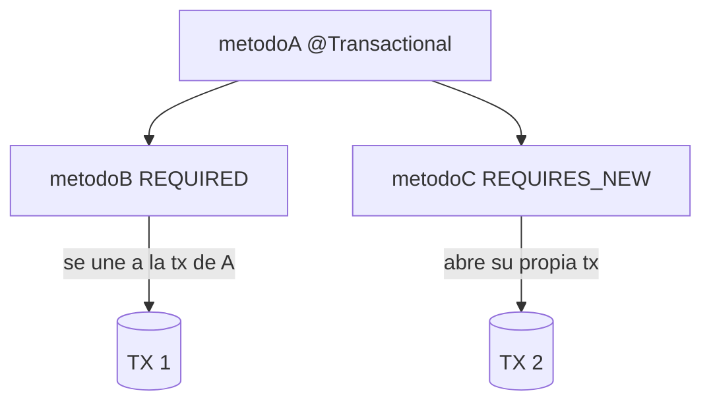
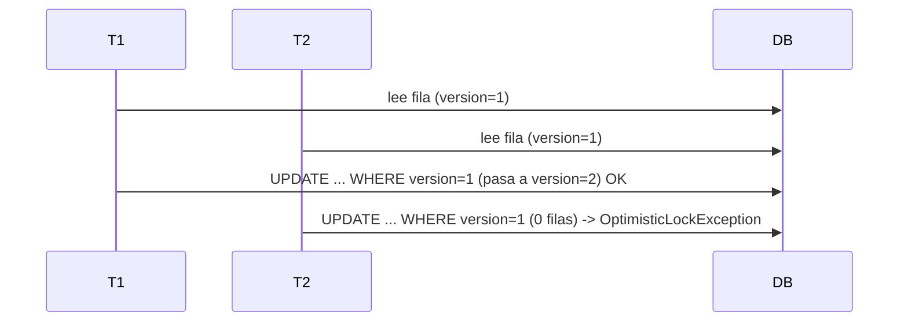
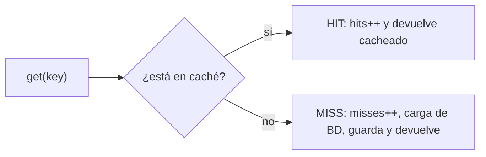
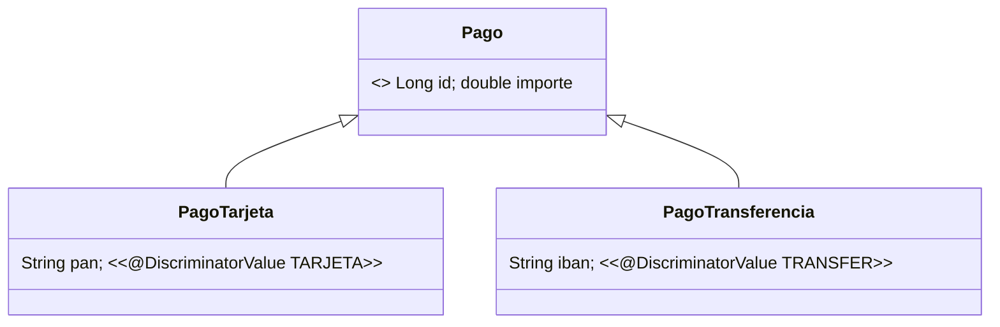
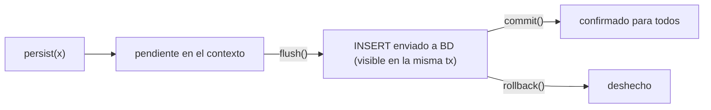

# Bloque XIV · JPA avanzado

> Sabes hacer CRUD con JPA (b12) y mapear relaciones (b13). Esto es lo que
> separa "funciona en mi máquina con un usuario" de "aguanta producción con
> mil peticiones a la vez": transacciones que se propagan, bloqueos que evitan
> que dos clientes pisen el mismo dato, caché, auditoría automática, herencia
> de entidades y migraciones de esquema versionadas.

## Cómo usar este documento

Igual que en los bloques anteriores: lee UNA sección → haz SU ejercicio →
vuelve. Cada sección termina con el recuadro **"Lo practicas en…"**. Varios
ejercicios de este bloque son **modelos conceptuales** (simulan en memoria lo
que hace JPA por dentro) precisamente para que entiendas la mecánica sin pelear
con la BD; los marcados con 🗄 sí abren un EntityManager real sobre H2.

| Sección | Tema | Ejercicio |
|---|---|---|
| 14.1 | Propagación de transacciones | `Ej123TransactionPropagation` |
| 14.2 | Niveles de aislamiento y fenómenos | `Ej124IsolationLevels` |
| 14.3 | Bloqueo optimista (`@Version`) 🗄 | `Ej125OptimisticLocking` |
| 14.4 | Bloqueo pesimista (`LockModeType`) 🗄 | `Ej126PessimisticLocking` |
| 14.5 | Caché de segundo nivel | `Ej127SecondLevelCache` |
| 14.6 | Auditoría (`@PrePersist`/`@PreUpdate`) 🗄 | `Ej128Auditing` |
| 14.7 | Borrado lógico (soft delete) 🗄 | `Ej129SoftDelete` |
| 14.8 | Herencia de entidades 🗄 | `Ej130InheritanceStrategies` |
| 14.9 | Flush explícito y batching 🗄 | `Ej131FlushModesBatching` |
| 14.10 | Migraciones versionadas (Flyway) | `Ej132FlywayMigrations` |

---

## 14.1 Propagación de transacciones

Una **transacción** es un bloque "todo o nada": o se confirman (commit) todos
sus cambios, o no se confirma ninguno (rollback). En Spring lo marcas con
`@Transactional`. La pregunta interesante aparece cuando un método transaccional
**llama a otro** método transaccional: ¿comparten la misma transacción o cada
uno tiene la suya? Eso lo decide la **propagación**.



Las cinco propagaciones que tienes que distinguir (de las siete de Spring):

| Propagación | Si HAY tx activa | Si NO hay tx activa |
|---|---|---|
| `REQUIRED` (por defecto) | se une a ella | crea una nueva |
| `REQUIRES_NEW` | suspende la activa y crea **otra** | crea una nueva |
| `MANDATORY` | se une a ella | **error** (exige que ya exista) |
| `NEVER` | **error** (prohíbe transacción) | se ejecuta sin tx |
| `SUPPORTS` | se une a ella | se ejecuta sin tx (no crea) |

La distinción que más cae en entrevista: `REQUIRED` vs `REQUIRES_NEW`. Con
`REQUIRED`, si el método llamado falla, **arrastra el rollback** de todo (es la
misma transacción). Con `REQUIRES_NEW`, el método llamado tiene su propia
transacción: puede confirmarse aunque la del llamante luego falle (clásico para
**escribir un log de auditoría** que debe persistir pase lo que pase).

En el ejercicio modelas `txEfectiva(txActiva, prop, siguienteId)` con un id de
transacción simulado: `0` significa "sin transacción". `REQUIRED` devuelve la
activa o, si vale 0, el `siguienteId`; `REQUIRES_NEW` devuelve **siempre**
`siguienteId`; `MANDATORY` con `txActiva==0` y `NEVER` con `txActiva!=0` lanzan
`IllegalStateException`.

> **Lo practicas en `Ej123TransactionPropagation`**: un `switch` exhaustivo sobre
> el enum de propagación que decide en qué transacción acaba ejecutándose un método.

---

## 14.2 Niveles de aislamiento y los fenómenos que previenen

Si la propagación decide *cuántas* transacciones hay, el **aislamiento** decide
*cuánto se ven entre sí* dos transacciones concurrentes. A más aislamiento, menos
anomalías… pero más bloqueo y menos rendimiento. Los tres **fenómenos** (de menor
a mayor gravedad) que el estándar SQL define:

| Fenómeno | Qué pasa |
|---|---|
| `DIRTY_READ` | lees datos que otra tx escribió pero **aún no confirmó** (y puede deshacer) |
| `NON_REPEATABLE_READ` | lees una fila dos veces y **cambió** entre lectura y lectura |
| `PHANTOM_READ` | repites una consulta de rango y **aparecen filas nuevas** |

Los cuatro niveles forman una escala **acumulativa**: cada uno previene todo lo
del anterior y algo más.

| Nivel | DIRTY | NON_REPEATABLE | PHANTOM |
|---|:---:|:---:|:---:|
| `READ_UNCOMMITTED` | ❌ | ❌ | ❌ |
| `READ_COMMITTED` | ✅ | ❌ | ❌ |
| `REPEATABLE_READ` | ✅ | ✅ | ❌ |
| `SERIALIZABLE` | ✅ | ✅ | ✅ |

`READ_UNCOMMITTED` no previene nada (set vacío); `SERIALIZABLE` previene los
tres (y es el más lento). El defecto de la mayoría de bases (PostgreSQL, Oracle)
es `READ_COMMITTED`. En el ejercicio devuelves el `Set<Fenomeno>` que cada nivel
**previene**: la mejor herramienta es `EnumSet` o `Set.of(...)`.

> **Lo practicas en `Ej124IsolationLevels`**: un `switch` que devuelve el conjunto
> acumulativo de fenómenos evitados por cada nivel.

---

## 14.3 Bloqueo optimista con `@Version`

El **lost update** es el bug clásico de la concurrencia: dos usuarios leen la
misma fila (versión 1), ambos la editan y ambos guardan; el segundo guardado
**pisa silenciosamente** el primero. El bloqueo optimista lo previene **sin
bloquear**: añade una columna de versión que Hibernate incrementa en cada UPDATE
y comprueba en el `WHERE`.



El UPDATE real que genera Hibernate es:
`UPDATE prod SET precio=?, version=2 WHERE id=? AND version=1`. Si otra tx ya
movió la versión a 2, ese WHERE afecta a **0 filas** y Hibernate lanza
`OptimisticLockException`. "Optimista" porque asume que el conflicto es raro: no
bloquea, solo verifica al confirmar.

```java
@Entity
class Producto {
    @Id @GeneratedValue Long id;
    double precio;

    @Version            // Hibernate gestiona esta columna; tú no la tocas
    long version;       // long, Integer, short o Timestamp son válidos
}
```

Regla de oro: **nunca incrementes `version` a mano**. Es responsabilidad de
Hibernate. Tú solo declaras el campo `@Version`. En el ejercicio anotas el campo
y dejas que el test provoque el conflicto con dos `EntityManager` distintos.

> **Lo practicas en `Ej125OptimisticLocking`**: anotar `@Version` y ver saltar la
> `OptimisticLockException` cuando dos transacciones chocan.

---

## 14.4 Bloqueo pesimista con `LockModeType`

Cuando el conflicto **no es raro** sino esperado (reservar el último asiento,
descontar stock crítico), el optimismo no compensa: reintentar constantemente es
caro. El bloqueo **pesimista** bloquea la fila **al leerla**, de modo que
cualquier otra transacción que quiera tocarla **espera** hasta que confirmes.

```java
// PESSIMISTIC_WRITE: nadie más puede leer-para-escribir ni escribir esta fila
Articulo a = em.find(Articulo.class, id, LockModeType.PESSIMISTIC_WRITE);
a.setStock(a.getStock() - cantidad);   // operación crítica, en exclusiva
em.getTransaction().commit();          // aquí se libera el lock
```

| LockModeType | Significado |
|---|---|
| `PESSIMISTIC_READ` | lock compartido: otros pueden leer, nadie escribe |
| `PESSIMISTIC_WRITE` | lock exclusivo: nadie lee-para-escribir ni escribe |
| `OPTIMISTIC` | fuerza chequeo de `@Version` aunque solo leas |

Optimista vs pesimista en una frase: **optimista** apuesta a que no habrá choque
y falla tarde (al confirmar); **pesimista** evita el choque por la fuerza y paga
el precio en espera. El lock pesimista vive **mientras dura la transacción**: por
eso `find(..., PESSIMISTIC_WRITE)` debe ir dentro de una tx abierta, y el commit
lo suelta. En el ejercicio implementas `reservar`, que descuenta stock bajo lock
y lanza `IllegalStateException` si no hay suficiente.

> **Lo practicas en `Ej126PessimisticLocking`**: leer con `PESSIMISTIC_WRITE`,
> validar stock y reservar en exclusiva.

---

## 14.5 Caché de segundo nivel

La caché de **primer nivel** es el propio `EntityManager`: dentro de una misma
transacción, pedir dos veces la misma entidad no va dos veces a la BD. La de
**segundo nivel** es **compartida entre transacciones y sesiones**: la primera
lectura de una entidad va a BD (**miss**), y las siguientes se sirven de caché
(**hit**) hasta que algo la **invalida** (un UPDATE).



El ejercicio es un **modelo en memoria** de esa caché con un `Map` y un
`Function<K,V>` como "cargador de BD". Conceptos que destila:

- **hit / miss**: contadores que miden la eficacia. `hitRatio = hits/(hits+misses)`,
  y **0.0 si no hubo accesos** (cuidado con la división por cero).
- **invalidación**: tras un UPDATE quitas la clave de la caché para que la próxima
  lectura recargue el dato fresco. Invalidar **no es** ni hit ni miss.
- El `loaderBD` solo debe ejecutarse en los misses: el test cuenta sus invocaciones.

En producción esto lo da Hibernate con `@Cacheable` + un proveedor como
Ehcache/Caffeine, pero la lógica de hit/miss/invalidación es exactamente esta.

> **Lo practicas en `Ej127SecondLevelCache`**: implementar get con hit/miss,
> invalidación y ratio de aciertos sobre un Map genérico.

---

## 14.6 Auditoría con `@PrePersist` / `@PreUpdate`

Casi toda entidad de producción guarda **cuándo se creó** y **cuándo se modificó
por última vez**. Escribir `entidad.setCreadoEn(now())` a mano en cada servicio
es repetitivo y se olvida. JPA ofrece **callbacks de ciclo de vida**: métodos de
la entidad que Hibernate invoca automáticamente en momentos clave.

```java
@Entity
class Documento {
    @Id @GeneratedValue Long id;
    Instant creadoEn;
    Instant actualizadoEn;

    @PrePersist                                  // justo antes del INSERT
    void prePersist() { creadoEn = Instant.now(); }

    @PreUpdate                                   // justo antes de cada UPDATE
    void preUpdate() { actualizadoEn = Instant.now(); }   // NO toques creadoEn
}
```

| Callback | Cuándo se dispara |
|---|---|
| `@PrePersist` | antes de insertar (entidad nueva) |
| `@PostPersist` | después de insertar |
| `@PreUpdate` | antes de un UPDATE de una entidad modificada |
| `@PreRemove` / `@PostLoad` | antes de borrar / tras cargar |

La regla clave: la fecha de creación es **inmutable**, así que `@PreUpdate`
**nunca** debe tocar `creadoEn`. Tras un insert, `actualizadoEn` sigue siendo
`null` (aún no ha habido ningún UPDATE): así sabes si un registro se editó alguna
vez. (En Spring Boot esto se automatiza aún más con `@CreatedDate`,
`@LastModifiedDate` y `@EnableJpaAuditing`; los callbacks son el mecanismo de base.)

> **Lo practicas en `Ej128Auditing`**: anotar los callbacks y comprobar que
> `creadoEn` se fija al insertar y `actualizadoEn` solo al modificar.

---

## 14.7 Borrado lógico (soft delete)

En muchos dominios **no puedes borrar de verdad**: facturas por ley, usuarios por
trazabilidad, pedidos por histórico. El **soft delete** sustituye el `DELETE`
físico por un flag `borrado = true`, y todas las consultas filtran por
`borrado = false`. La fila sigue en la tabla; simplemente deja de "verse".

```java
// Borrado lógico: NO em.remove(c), sino marcar el flag
c.setBorrado(true);                  // un UPDATE, no un DELETE

// Listar solo los activos: el filtro va en CADA consulta
"select c from Cliente c where c.borrado = false order by c.id"
```

Lo que el ejercicio te hace interiorizar:

- `borrarLogico(id)` hace `find` + `setBorrado(true)` + commit, y devuelve `false`
  si el id no existía (no hay nada que marcar).
- `listarActivos()` usa JPQL con `where c.borrado = false`: los borrados **no
  aparecen**, pero `em.find(id)` sin filtro **sí los encuentra** (siguen en BD).

En Hibernate real esto se automatiza con `@SQLDelete` (convierte el DELETE en un
UPDATE) y `@SQLRestriction`/`@Where` (añade el filtro a todas las consultas), de
modo que no tienes que recordar el `where borrado=false` en cada query:

```java
@Entity
@SQLDelete(sql = "UPDATE cliente SET borrado = true WHERE id = ?")
@SQLRestriction("borrado = false")
class Cliente { boolean borrado; }
```

> **Lo practicas en `Ej129SoftDelete`**: marcar en vez de borrar y excluir los
> marcados del listado con JPQL.

---

## 14.8 Herencia de entidades

Tienes `PagoTarjeta` y `PagoTransferencia`: comparten `id` e `importe` pero cada
uno añade lo suyo (PAN, IBAN). En Java es herencia normal; en la BD hay que
decidir **cómo se reparten en tablas**. JPA ofrece tres estrategias:

| Estrategia | Cómo mapea | Pro / Contra |
|---|---|---|
| `SINGLE_TABLE` (defecto) | **una** tabla con todas las columnas + discriminador | rápida; columnas nullables de subtipos |
| `JOINED` | tabla base + tabla por subtipo, unidas por JOIN | normalizada; JOINs en cada lectura |
| `TABLE_PER_CLASS` | una tabla completa por subtipo | sin JOINs; consultas polimórficas caras |



Con `SINGLE_TABLE`, una **columna discriminadora** (`@DiscriminatorColumn`) guarda
qué subtipo es cada fila, y cada subtipo declara su valor con
`@DiscriminatorValue("TARJETA")`. Lo potente es el **polimorfismo en JPQL**:

```java
"select count(p) from Pago p"            // cuenta TODOS los subtipos
"select p from Pago p where TYPE(p) = PagoTarjeta"   // filtra por subtipo
```

`TYPE(p)` es el operador JPQL que pregunta por la clase concreta de cada fila.
En el ejercicio anotas la jerarquía y consultas con `count(p)` polimórfico y
`TYPE(p)` para filtrar solo las tarjetas.

> **Lo practicas en `Ej130InheritanceStrategies`**: mapear `SINGLE_TABLE` con
> discriminador y consultar con `count` polimórfico y `TYPE()`.

---

## 14.9 Flush explícito y batching

`flush()` y `commit()` no son lo mismo, y confundirlos cuesta horas de depuración:

- **flush**: sincroniza el estado del `EntityManager` con la BD (manda los
  INSERT/UPDATE/DELETE pendientes) **dentro de la transacción**. Aún se puede
  hacer rollback.
- **commit**: confirma la transacción **definitivamente** (e implica un flush antes).



Por qué importa: tras `em.flush()`, un `COUNT(*)` por **SQL nativo** dentro de la
misma transacción **ya ve** las filas insertadas, aunque todavía no hayas hecho
commit. Eso es justo lo que comprueba el ejercicio: persistir N, `flush()`, contar
y obtener N antes del commit.

El **batching** es la otra cara: insertar 10.000 filas una a una son 10.000
viajes a la BD. Hibernate puede agruparlas en lotes
(`hibernate.jdbc.batch_size`), haciendo `flush()` + `clear()` cada N para no
acumular toda la memoria en el contexto de persistencia. `FlushModeType` controla
**cuándo** Hibernate hace flush automático: `AUTO` (antes de cada query, el
defecto) o `COMMIT` (solo al confirmar).

> **Lo practicas en `Ej131FlushModesBatching`**: forzar `flush()` y comprobar con
> SQL nativo que las filas son visibles antes del commit.

---

## 14.10 Migraciones versionadas (Flyway)

En desarrollo `hbm2ddl.auto=create-drop` recrea el esquema en cada arranque. En
**producción eso borraría todos los datos**: jamás. El esquema de producción
evoluciona con **migraciones** — ficheros SQL versionados que se aplican en orden
y solo una vez. Flyway es el estándar de facto.

```
src/main/resources/db/migration/
  V1__init.sql            <- crea tablas
  V2__add_email.sql       <- añade columna
  V3__index_email.sql     <- crea índice
```

Convención de nombres de Flyway:

| Prefijo | Tipo | Ejemplo |
|---|---|---|
| `V` | **versionada**: se aplica una vez, en orden | `V2__add_email.sql` |
| `R` | **repetible**: se re-aplica si cambia su hash (vistas, datos) | `R__refrescar_vista.sql` |
| `U` | **undo/rollback** (Teams) | `U2__quitar_email.sql` |

El formato es `<prefijo><versión>__<descripción>.sql`: el separador es **doble
guion bajo** `__`, y en la descripción los `_` se muestran como espacios
(`add_email` → "add email"). Flyway lleva una tabla `flyway_schema_history` y
nunca re-ejecuta una `V` ya aplicada. El ejercicio modela esa lógica de parseo:
extraer la versión entre `V` y `__`, calcular la siguiente versión a crear
(máxima + 1), detectar duplicados y distinguir los prefijos.

> **Lo practicas en `Ej132FlywayMigrations`**: parsear nombres `V<n>__desc.sql`,
> calcular la siguiente versión y validar el formato.

---

## Errores comunes del bloque

| # | Error | Antídoto |
|---|---|---|
| 1 | Creer que `REQUIRES_NEW` reusa la tx activa | SIEMPRE crea una nueva (devuelve `siguienteId`) |
| 2 | `MANDATORY` sin tx o `NEVER` con tx sin lanzar | ambos casos → `IllegalStateException` |
| 3 | `READ_UNCOMMITTED` devolviendo algo no vacío | no previene NADA: set vacío |
| 4 | Incrementar `@Version` a mano | lo gestiona Hibernate; tú solo anotas el campo |
| 5 | Esperar que el lock optimista bloquee | no bloquea: falla al confirmar (`OptimisticLockException`) |
| 6 | `find` con `PESSIMISTIC_WRITE` fuera de una tx | el lock vive durante la tx: ábrela antes |
| 7 | `hitRatio()` dividiendo por cero sin accesos | si `hits+misses==0` → `0.0` |
| 8 | `@PreUpdate` reescribiendo `creadoEn` | la fecha de creación es inmutable |
| 9 | Soft delete con `em.remove()` | marca `borrado=true` (UPDATE), no DELETE |
| 10 | `create-drop` en producción | usa migraciones Flyway versionadas |

## Chuleta final del bloque

```
Propagación  REQUIRED=reusa/crea · REQUIRES_NEW=siempre crea · MANDATORY=exige · NEVER=prohíbe · SUPPORTS=usa si hay
Aislamiento  READ_UNCOMMITTED⊂READ_COMMITTED⊂REPEATABLE_READ⊂SERIALIZABLE (acumulativo)
Fenómenos    DIRTY_READ → NON_REPEATABLE_READ → PHANTOM_READ
Optimista    @Version + UPDATE...WHERE version=? · 0 filas → OptimisticLockException
Pesimista    em.find(C,id,LockModeType.PESSIMISTIC_WRITE) dentro de tx
Caché L2     get: hit/miss · invalidate quita clave · hitRatio=hits/(hits+misses), 0 si nada
Auditoría    @PrePersist→creadoEn · @PreUpdate→actualizadoEn (nunca creadoEn)
Soft delete  setBorrado(true) + where borrado=false · @SQLDelete/@SQLRestriction
Herencia     @Inheritance(SINGLE_TABLE) + @DiscriminatorColumn/@DiscriminatorValue · JPQL TYPE(p)
Flush        flush=sincroniza (en tx) ≠ commit=confirma · batch_size + flush/clear
Flyway       V<n>__desc.sql en orden · V=versionada R=repetible U=undo · separador "__"
```

## Autoevaluación (responde sin mirar; si fallas 2+, relee la sección)

1. ¿Qué diferencia hay entre `REQUIRED` y `REQUIRES_NEW` cuando ya hay una
   transacción activa, y para qué sirve `REQUIRES_NEW` en la práctica? *(14.1)*
2. Ordena los niveles de aislamiento y di qué fenómeno añade prevenir cada salto.
   ¿Qué previene `READ_UNCOMMITTED`? *(14.2)*
3. ¿Por qué el bloqueo optimista "no bloquea"? ¿Cuándo y con qué excepción
   detecta el conflicto? *(14.3)*
4. ¿Cuándo elegirías bloqueo pesimista en vez de optimista? ¿Dónde debe ir el
   `find(..., PESSIMISTIC_WRITE)`? *(14.3, 14.4)*
5. ¿Qué debe devolver `hitRatio()` si no ha habido ningún acceso, y por qué? *(14.5)*
6. ¿Por qué `@PreUpdate` no debe tocar `creadoEn`? Tras un insert, ¿cuánto vale
   `actualizadoEn`? *(14.6)*
7. En un soft delete, ¿qué operación SQL se ejecuta realmente al "borrar" y cómo
   desaparece la fila de los listados? *(14.7)*
8. ¿Qué hace `TYPE(p)` en JPQL y qué estrategia de herencia usa una sola tabla
   con columna discriminadora? *(14.8)*
9. ¿En qué se diferencian `flush()` y `commit()`? ¿Ve un COUNT nativo las filas
   tras un flush sin commit? *(14.9)*
10. ¿Qué significan los prefijos `V`, `R` y `U` en Flyway y cuál es el separador
    entre versión y descripción? *(14.10)*
