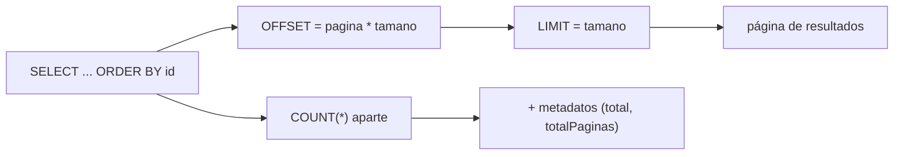
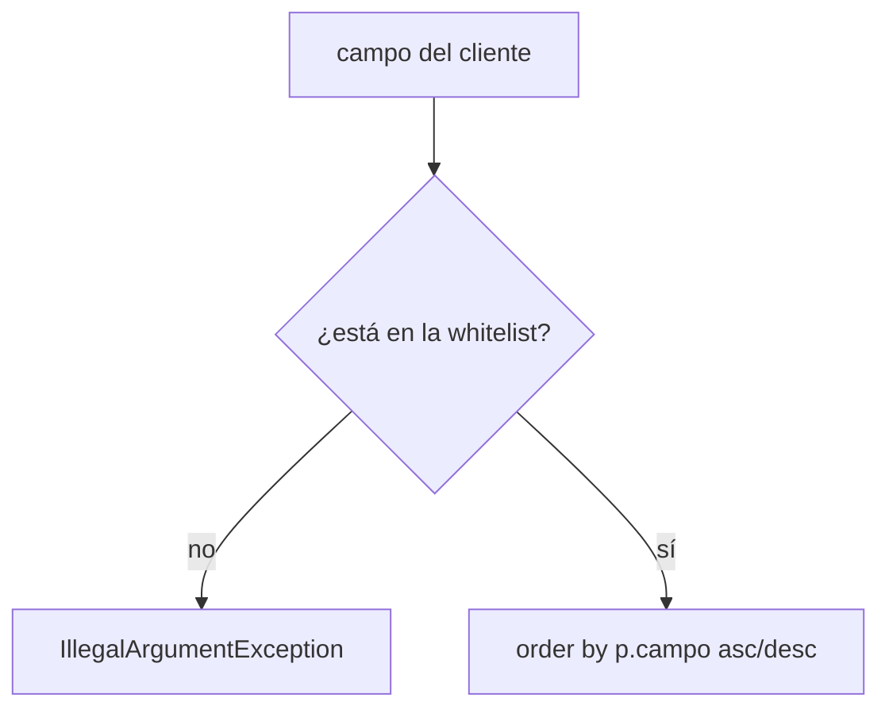
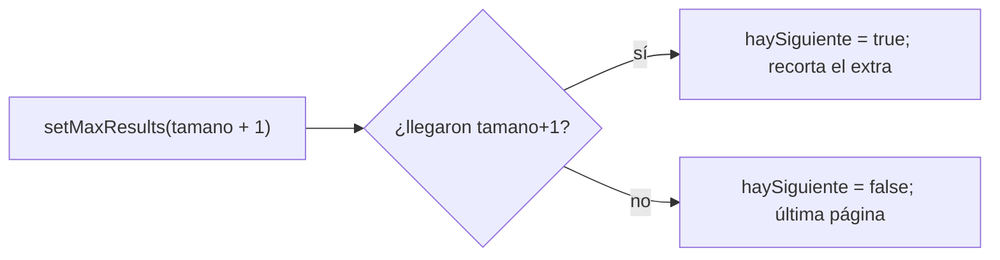
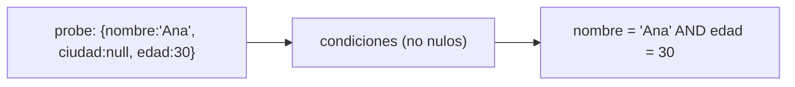
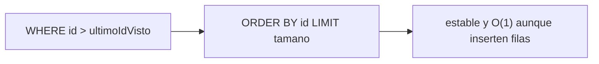

# Bloque XV · Consultas avanzadas

> Una API que devuelve un millón de filas no es una API potente: es una API rota.
> Paginar, ordenar, filtrar y proyectar no son extras de lujo —son el contrato
> mínimo entre tu backend y un cliente que no quiere (ni puede) tragarse la tabla
> entera. Este bloque convierte "dame todo" en "dame justo esto, en este orden,
> de a poco".

## Cómo usar este documento

Igual que en los bloques anteriores: lee UNA sección → haz SU ejercicio →
vuelve. Cada sección cierra con el recuadro **"Lo practicas en…"**. Los tests
son la especificación: si una pista y un test no cuadran, manda el test.

| Sección | Tema | Ejercicio |
|---|---|---|
| 15.1 | Paginación (offset/limit + total) | `Ej133Pagination` |
| 15.2 | Ordenación dinámica segura (whitelist) | `Ej134Sorting` |
| 15.3 | Slice vs Page (el COUNT que sobra) | `Ej135SliceVsPage` |
| 15.4 | Filtrado dinámico (WHERE a medida) | `Ej136DynamicFiltering` |
| 15.5 | Specifications (predicados componibles) | `Ej137Specifications` |
| 15.6 | Criteria API tipada | `Ej138CriteriaApi` |
| 15.7 | Query by Example (probe → condiciones) | `Ej139QueryByExample` |
| 15.8 | Proyecciones (solo las columnas que usas) | `Ej140InterfaceProjections` |
| 15.9 | Agregaciones y GROUP BY | `Ej141AggregationsGroupBy` |
| 15.10 | Keyset pagination (cursor por id) | `Ej142KeysetPagination` |

---

## 15.1 Paginación: offset, limit y total

El patrón clásico de paginación traduce "página N de tamaño T" a dos números
para la base de datos: **cuántas filas saltarte** (`OFFSET`) y **cuántas
devolver** (`LIMIT`).



La paginación es **0-based**: la primera página es la `0`. El `offset` se calcula
`pagina * tamano`; pedir la página 2 con tamaño 10 significa "salta las 20
primeras filas y dame las 10 siguientes".

En JPA puro (sin Spring todavía) son dos llamadas sobre la query:

```java
List<Item> contenido = em.createQuery("select i from Item i order by i.id", Item.class)
        .setFirstResult(pagina * tamano)   // OFFSET
        .setMaxResults(tamano)             // LIMIT
        .getResultList();

long total = em.createQuery("select count(i) from Item i", Long.class)
        .getSingleResult();                // el COUNT va en query aparte
```

Una `Page` empaqueta el contenido **y** los metadatos. El total te permite
calcular cuántas páginas hay:

```java
public record Pagina<T>(List<T> contenido, long total, int pagina, int tamano) {
    public int totalPaginas() {
        return tamano == 0 ? 0 : (int) Math.ceil((double) total / tamano);
    }
}
```

Fíjate en el `(double)` antes de dividir: sin él, `25 / 10` daría `2` (división
entera) en vez de `2.5`, y `Math.ceil` no podría redondear hacia arriba a `3`.

**Dos reglas que castigan los tests:**

| Validación | Por qué |
|---|---|
| `pagina >= 0` | una página negativa no existe |
| `tamano > 0` (estricto) | tamaño 0 ⇒ división por cero en `totalPaginas()` y `LIMIT 0` inútil |

> **Lo practicas en `Ej133Pagination`**: calcular offset, validar parámetros,
> ejecutar las dos queries (datos + count) y derivar metadatos de navegación
> (primera/última, siguiente/anterior).

---

## 15.2 Ordenación dinámica segura: la whitelist

El cliente quiere ordenar por el campo que elija (`?sort=nombre,desc`). El
problema: ese campo viaja como **texto** y acaba dentro del SQL. Si lo concatenas
sin validar, abres la puerta a inyección y a ordenar por columnas internas.



La defensa es una **lista blanca**: solo dejas ordenar por campos que tú
apruebas. Nada que no esté en el conjunto llega al SQL.

```java
private static final Set<String> CAMPOS_PERMITIDOS = Set.of("id", "nombre", "precio");

public List<Prod> ordenar(String campo, boolean ascendente) {
    if (campo == null || !CAMPOS_PERMITIDOS.contains(campo))
        throw new IllegalArgumentException("campo no permitido: " + campo);
    String dir = ascendente ? "asc" : "desc";
    // 'campo' es seguro: pasó la whitelist. No se concatena nada más.
    return em.createQuery("select p from Prod p order by p." + campo + " " + dir, Prod.class)
             .getResultList();
}
```

¿Por qué no usar un parámetro con nombre (`:campo`) como con los valores? Porque
**los identificadores de columna no se pueden parametrizar**: `order by :campo`
no es JPQL válido. La única protección posible es la whitelist.

Cuidado con dos "direcciones" distintas en este ejercicio:

| Uso | Formato | Dónde |
|---|---|---|
| JPQL real | `asc` / `desc` (minúsculas) | dentro de la query |
| Mostrar al usuario | `ASC` / `DESC` (mayúsculas) | `formatearOrdenacion` → `"nombre:ASC"` |

> **Lo practicas en `Ej134Sorting`**: validar el campo contra la whitelist,
> construir el `order by` seguro, normalizar entradas sucias (`  Nombre  ` →
> `nombre`) y formatear el criterio para la respuesta.

---

## 15.3 Slice vs Page: el COUNT que muchas veces sobra

Una `Page` necesita el total → ejecuta un `COUNT(*)` extra en cada petición. En
tablas enormes, ese COUNT puede costar más que traer las propias filas. Si la UI
solo muestra un botón **"cargar más"** (no "página 7 de 340"), el total es
información que pagas y no usas.

Un `Slice` resuelve eso: no sabe el total, solo si **hay siguiente**. El truco es
pedir **un elemento de más** (`tamano + 1`) y mirar si llegó:



```java
List<Reg> lista = em.createQuery("select r from Reg r order by r.id", Reg.class)
        .setFirstResult(pagina * tamano)
        .setMaxResults(tamano + 1)          // pide UNO de más
        .getResultList();

boolean haySiguiente = lista.size() > tamano;
List<Reg> contenido = haySiguiente ? lista.subList(0, tamano) : lista;
// NINGÚN count(): esa es la ventaja
```

| | `Page` | `Slice` |
|---|---|---|
| Sabe el total | sí | no |
| Ejecuta COUNT | sí (query extra) | no |
| Sabe si hay siguiente | sí (calculado) | sí (tamano+1) |
| Caso de uso | paginadores "N de M" | scroll infinito, "cargar más" |

> **Lo practicas en `Ej135SliceVsPage`**: implementar el truco del `tamano+1`,
> recortar el sobrante y exponer navegación (primera/anterior/siguiente) **sin**
> ningún COUNT.

---

## 15.4 Filtrado dinámico: el WHERE que se arma a sí mismo

El cliente filtra por marca, **o** por precio máximo, **o** por ambas, **o** por
nada. Escribir un método de repositorio por cada combinación es inviable. La
solución: construir el `WHERE` en tiempo de ejecución, añadiendo solo las
condiciones de los filtros **presentes**.

```java
List<String> condiciones = new ArrayList<>();
Map<String, Object> params = new HashMap<>();

String jpql = "select c from Coche c";
if (marca != null)     { condiciones.add("c.marca = :marca");        params.put("marca", marca); }
if (precioMax != null) { condiciones.add("c.precio <= :precioMax");  params.put("precioMax", precioMax); }

if (!condiciones.isEmpty())
    jpql += " where " + String.join(" and ", condiciones);
jpql += " order by c.id";

var query = em.createQuery(jpql, Coche.class);
params.forEach(query::setParameter);     // setParameter SOLO de lo usado
```

Dos principios irrenunciables:

1. **Los valores SIEMPRE como parámetros con nombre** (`:marca`), nunca
   concatenados. Esto es lo que detiene la inyección SQL.
2. **Solo haces `setParameter` de lo que realmente añadiste.** Declarar un
   parámetro que no aparece en el JPQL (o al revés) lanza excepción.

Las funciones auxiliares del ejercicio (`esFiltroVacio`, `formatearLike`…)
encapsulan decisiones repetidas. Ojo a un detalle de `LIKE`:

| Patrón | Significado |
|---|---|
| `%valor%` | contiene |
| `valor%` | empieza por |
| `%valor` | termina en |

> **Lo practicas en `Ej136DynamicFiltering`**: montar el `where` dinámico,
> enlazar solo los parámetros activos, y los helpers de validación/normalización
> de filtros (incluido el `LIKE` en minúsculas `%ropa%`).

---

## 15.5 Specifications: predicados que se componen

El WHERE dinámico de la sección anterior funciona, pero concatenar strings
escala mal y no es type-safe. Una **Specification** encapsula UN predicado como
objeto, y varios se combinan con `and`/`or`. Es el patrón que usa Spring Data
(`JpaSpecificationExecutor`); aquí lo construimos a mano con `CriteriaBuilder`.

```java
public List<Libro> buscar(String genero, Integer paginasMin) {
    CriteriaBuilder cb = em.getCriteriaBuilder();
    CriteriaQuery<Libro> cq = cb.createQuery(Libro.class);
    Root<Libro> root = cq.from(Libro.class);

    List<Predicate> predicados = new ArrayList<>();
    if (genero != null)     predicados.add(cb.equal(root.get("genero"), genero));
    if (paginasMin != null) predicados.add(cb.ge(root.get("paginas"), paginasMin));

    cq.where(cb.and(predicados.toArray(new Predicate[0])));   // todos con AND
    cq.orderBy(cb.asc(root.get("id")));
    return em.createQuery(cq).getResultList();
}
```

Cada filtro ausente simplemente **no añade su predicado**. Si la lista queda
vacía, `cb.and()` sin argumentos equivale a "sin condición" → trae todo. La
idea mental: *una Specification decide si aporta predicado o se calla.*

> **Lo practicas en `Ej137Specifications`**: componer predicados con
> `CriteriaBuilder`, combinarlos con AND, y los helpers de coherencia de filtros
> (`preciosCoherentes`, `tieneEspecificaciones`). Atención: aquí `normalizarCategoria`
> va a **MAYÚSCULAS** (al revés que en 15.4).

---

## 15.6 Criteria API: consultas tipadas

JPQL es un string: un typo en un nombre de campo (`"precoi"`) no se descubre
hasta que la query revienta en ejecución. La **Criteria API** construye la misma
consulta con objetos Java, de forma que muchos errores salen al compilar y el
IDE autocompleta. El precio: es más verbosa.

Un agregado tipado (sumar una columna):

```java
CriteriaBuilder cb = em.getCriteriaBuilder();
CriteriaQuery<Double> cq = cb.createQuery(Double.class);
Root<Venta> root = cq.from(Venta.class);

cq.select(cb.sum(root.get("importe")));         // SUM(importe)
cq.where(cb.equal(root.get("region"), region)); // WHERE region = ?

Double total = em.createQuery(cq).getSingleResult();
return total == null ? 0.0 : total;             // SUM sin filas → null
```

⚠ El gran tropiezo: **`SUM` sobre cero filas devuelve `null`, no `0.0`.** Si una
región no tiene ventas, `getSingleResult()` te da `null`; hay que traducirlo a
`0.0` a mano (el test lo comprueba con `"ASIA"`).

| Herramienta | Para qué |
|---|---|
| `cb.equal`, `cb.ge`, `cb.like` | predicados |
| `cb.sum`, `cb.count`, `cb.avg`, `cb.max` | agregados |
| `cb.and`, `cb.or` | combinar predicados |
| `cb.asc`, `cb.desc` | ordenación |

> **Lo practicas en `Ej138CriteriaApi`**: una consulta de agregado tipada con su
> trampa del `null`, más helpers (incluida una whitelist de ordenación en línea
> en `esOrdenacionValida`).

---

## 15.7 Query by Example: el objeto que es la consulta

En **Query by Example (QBE)** das un objeto "ejemplo" (un *probe*) parcialmente
relleno; los campos **no nulos** se convierten en condiciones de igualdad unidas
por AND, y los nulos se ignoran. Es la forma más declarativa de un filtro: el
propio objeto describe lo que buscas.



```java
public static Map<String, Object> condicionesDe(PersonaProbe probe) {
    Map<String, Object> cond = new LinkedHashMap<>();   // conserva el orden
    if (probe.nombre() != null) cond.put("nombre", probe.nombre());
    if (probe.ciudad() != null) cond.put("ciudad", probe.ciudad());
    if (probe.edad()   != null) cond.put("edad",   probe.edad());
    return cond;                                          // probe todo-null → mapa vacío
}
```

Un probe **todo a null** produce cero condiciones → "tráelo todo". El
`LinkedHashMap` importa: mantiene el orden de inserción, que el test verifica.

> **Lo practicas en `Ej139QueryByExample`**: traducir el probe a condiciones,
> filtrar una lista en memoria aplicando esas condiciones con AND, y accesores
> seguros sobre el objeto-ejemplo.

---

## 15.8 Proyecciones: pide solo lo que vas a usar

Si en una pantalla solo muestras `id` y `email`, cargar la entidad `Usuario`
entera (con su `passwordHash`, sus relaciones perezosas, etc.) es desperdicio de
I/O y memoria —y a veces una fuga de datos sensibles. Una **proyección** trae
únicamente las columnas necesarias en un tipo reducido.

Con JPQL, la proyección por constructor usa `select new` con el **nombre
completo** de la clase destino:

```java
public record UsuarioVista(Long id, String email) {}   // vista, NO entidad

List<UsuarioVista> vistas() {
    return em.createQuery(
        "select new com.masterclass.api.b15_query.Ej140InterfaceProjections$UsuarioVista(u.id, u.email) "
      + "from Usuario140 u order by u.id", UsuarioVista.class)
      .getResultList();
}
```

Detalles que cuentan:

- El `$` separa la clase externa de la anidada (`Ej140...$UsuarioVista`).
- Los tipos y el orden de `select` deben casar con el constructor del record.
- La vista resultante **no está gestionada** por el contexto de persistencia:
  modificarla no toca la BD (es justo lo que quieres para un DTO de lectura).

Spring Data ofrece además **proyecciones por interfaz** (declaras una interfaz
con getters y Spring la implementa sola) —el nombre del ejercicio viene de ahí.

> **Lo practicas en `Ej140InterfaceProjections`**: la proyección por constructor
> con `select new` y los accesores/validaciones sobre el producto auxiliar.

---

## 15.9 Agregaciones y GROUP BY

Cuando no quieres filas sino **resúmenes** (cuántas ventas por categoría, total
por región), entran `GROUP BY` y las funciones de agregación. En JPQL, agrupar y
contar produce filas de varias columnas → cada resultado es un `Object[]`.

```java
public Map<String, Long> conteoPorCategoria() {
    List<Object[]> filas = em.createQuery(
        "select v.categoria, count(v) from Venta v "
      + "group by v.categoria order by v.categoria", Object[].class)
      .getResultList();

    Map<String, Long> out = new LinkedHashMap<>();
    for (Object[] fila : filas) {
        out.put((String) fila[0], (Long) fila[1]);   // [0]=categoria, [1]=count
    }
    return out;
}
```

Claves a no olvidar:

- `count(...)` devuelve `Long`, no `int`. Castea a `Long` (los tests comparan con
  `2L`, `1L`).
- Cada `Object[]` lleva las columnas **en el orden del `select`**.
- `LinkedHashMap` para respetar el `order by` en el mapa de salida.

| Función | Resultado |
|---|---|
| `count(x)` | `Long` |
| `sum(x)` | tipo numérico (¡`null` si no hay filas!) |
| `avg(x)` | `Double` |
| `max(x)` / `min(x)` | tipo de la columna |

> **Lo practicas en `Ej141AggregationsGroupBy`**: el `group by ... count` con
> recorrido de `Object[]` a `Map`, más accesores sobre el item auxiliar.

---

## 15.10 Keyset pagination: paginar por cursor

El `OFFSET` tiene un defecto fatal en tablas enormes: para devolver la página
1000, la base de datos **lee y descarta** las 999 anteriores. Cuanto más avanzas,
más lento. Y si alguien inserta una fila mientras paginas, todo se descoloca.

La **paginación por keyset** (o *cursor*) no salta filas: recuerda el **último id
visto** y pide "los siguientes a partir de ahí".



```java
// idsOrdenados simula la columna ya ordenada ascendentemente
public static List<Long> siguientePagina(List<Long> ids, Long ultimoIdVisto, int tamano) {
    if (ids == null)   throw new IllegalArgumentException("lista null");
    if (tamano <= 0)   throw new IllegalArgumentException("tamano <= 0");
    long cursor = (ultimoIdVisto == null) ? Long.MIN_VALUE : ultimoIdVisto;

    return ids.stream()
        .filter(id -> id > cursor)   // estrictamente mayores que el cursor
        .limit(tamano)               // la lista ya viene ordenada: no reordenar
        .toList();
}
```

| | OFFSET (15.1) | Keyset (15.10) |
|---|---|---|
| Coste al avanzar | crece con la página | constante |
| Estable ante inserts | no | sí |
| Permite "ir a página N" | sí | no (solo siguiente/anterior) |
| Cursor | número de página | último valor visto |

El precio del keyset: pierdes el salto directo a una página arbitraria. Por eso
conviven —offset para paginadores clásicos, keyset para feeds y exportaciones
masivas.

> **Lo practicas en `Ej142KeysetPagination`**: filtrar por cursor con `stream`
> (`filter` + `limit`), validar los bordes (lista null, tamaño ≤ 0, fin de datos)
> y comparadores tolerantes a `null` sobre los items.

---

## Errores comunes del bloque

| # | Error | Antídoto |
|---|---|---|
| 1 | Dividir `total / tamano` con enteros → `totalPaginas` mal | castea a `(double)` antes del `Math.ceil` |
| 2 | Permitir `tamano == 0` | valida `tamano > 0` estricto (evita división por cero y `LIMIT 0`) |
| 3 | Tratar la paginación como 1-based | la primera página es la `0`; `offset = pagina * tamano` |
| 4 | Concatenar el campo de `order by` sin validar | whitelist obligatoria; los identificadores NO se parametrizan |
| 5 | Confundir `asc`/`desc` (JPQL) con `ASC`/`DESC` (formato al usuario) | mira el valor exacto que pide cada test |
| 6 | Usar `isEmpty()` donde piden tratar `" "` como vacío | usa `isBlank()` (un espacio NO es empty) |
| 7 | `SUM`/agregado sobre cero filas y asumir `0` | `getSingleResult()` puede ser `null`; tradúcelo a `0.0` |
| 8 | `count(...)` casteado a `int` | `count` devuelve `Long`; los tests comparan con `2L`/`1L` |
| 9 | `setParameter` de un parámetro que no está en el JPQL (o al revés) | enlaza SOLO los filtros realmente añadidos |
| 10 | `LIKE` sin normalizar / sin comodines | `"%" + valor.trim().toLowerCase() + "%"` (el test espera `%ropa%`) |
| 11 | Comparar ids `null` con `Long.compare` directo → NPE | defiende el caso null antes (ambos null → `0`/`false`) |
| 12 | Devolver la whitelist interna sin copiar | copia defensiva (`Set.copyOf`) para que nadie la mute |

## Chuleta final del bloque

```java
// --- Paginación offset/limit (Page) ---
q.setFirstResult(pagina * tamano).setMaxResults(tamano).getResultList();
long total = em.createQuery("select count(i) from I i", Long.class).getSingleResult();
int totalPaginas = (int) Math.ceil((double) total / tamano);

// --- Ordenación segura ---
if (!CAMPOS_PERMITIDOS.contains(campo)) throw new IllegalArgumentException();
String dir = ascendente ? "asc" : "desc";          // JPQL: minúsculas

// --- Slice (sin COUNT): pide uno de más ---
.setMaxResults(tamano + 1);
boolean haySiguiente = lista.size() > tamano;

// --- Filtrado dinámico ---
if (marca != null) { cond.add("c.marca = :marca"); params.put("marca", marca); }
jpql += cond.isEmpty() ? "" : " where " + String.join(" and ", cond);

// --- Criteria + Specification ---
CriteriaBuilder cb = em.getCriteriaBuilder();
CriteriaQuery<T> cq = cb.createQuery(T.class);
Root<T> root = cq.from(T.class);
cq.where(cb.and(predicados.toArray(new Predicate[0])));
Double total = em.createQuery(cq).getSingleResult();
return total == null ? 0.0 : total;                // SUM puede ser null

// --- Proyección por constructor ---
"select new paquete.Clase$Vista(u.id, u.email) from U u"

// --- GROUP BY ---
List<Object[]> filas = em.createQuery(
    "select v.cat, count(v) from V v group by v.cat", Object[].class).getResultList();
out.put((String) fila[0], (Long) fila[1]);

// --- Keyset ---
long cursor = (ultimoId == null) ? Long.MIN_VALUE : ultimoId;
ids.stream().filter(id -> id > cursor).limit(tamano).toList();

// --- Helpers recurrentes ---
f == null || f.isBlank();                          // filtro vacío
"%" + f.trim().toLowerCase() + "%";                // patrón LIKE
```

## Autoevaluación

1. ¿Por qué `total / tamano` puede darte mal el número de páginas y cómo se
   arregla? (15.1)
2. Si el cliente manda `?sort=password`, ¿qué impide que ordenes por esa columna
   y por qué un parámetro con nombre no sirve aquí? (15.2)
3. ¿Qué query se ahorra un `Slice` frente a una `Page`, y qué truco usa para
   saber si hay siguiente sin ella? (15.3)
4. En un filtro dinámico, ¿qué pasa si haces `setParameter("marca", …)` pero el
   JPQL final no incluye `:marca`? (15.4)
5. ¿Qué significa que `cb.and(...)` reciba una lista de predicados vacía, y por
   qué es justo el comportamiento deseado? (15.5)
6. ¿Por qué `SUM` sobre una región sin ventas no devuelve `0.0`, y qué tienes que
   hacer? (15.6)
7. En Query by Example, ¿qué pasa con un probe cuyos campos son todos `null`, y
   por qué se usa `LinkedHashMap`? (15.7)
8. ¿Qué ventajas tiene una proyección frente a cargar la entidad completa, y por
   qué la vista no queda "gestionada"? (15.8)
9. ¿De qué tipo es el resultado de `count(...)` en JPQL y cómo llegan las columnas
   de un `GROUP BY` a tu código? (15.9)
10. ¿Por qué el keyset es estable ante inserciones y O(1) al avanzar, y qué
    capacidad pierdes respecto al offset? (15.10)
