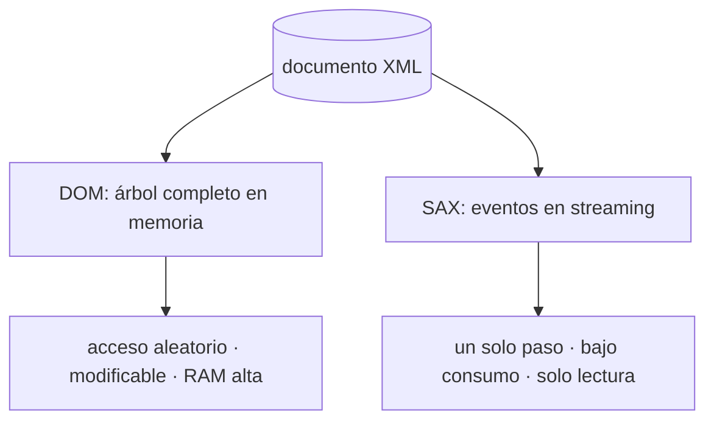
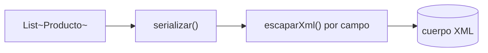
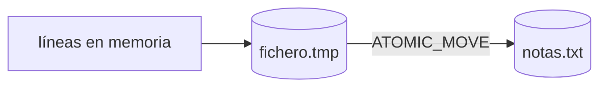
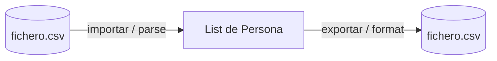

# Bloque XVI · XML y ficheros (AD RA1)

> JSON ganó la web, pero el XML sigue mandando en bancos, sanidad, facturación
> electrónica y SOAP. Y antes de tener una base de datos, el primer "almacén"
> de toda aplicación siempre es un fichero. Este bloque te enseña a hablar
> ambos idiomas usando casi solo el JDK.

## Cómo usar este documento

Igual que en los bloques anteriores: lee UNA sección → haz SU ejercicio →
vuelve. No leas las seis de un tirón. Cada sección cierra con el recuadro
**"Lo practicas en…"** que te manda al ejercicio. Los **tests son la
especificación real**: cuando dudes de un detalle, ábrelos.

| Sección | Tema | Ejercicio |
|---|---|---|
| 16.1 | JAXB: objeto ↔ XML por anotaciones | `Ej143JaxbBinding` |
| 16.2 | Jackson XML con `XmlMapper` | `Ej144JacksonXml` |
| 16.3 | DOM vs SAX: dos formas de leer XML | `Ej145DomSaxParsing` |
| 16.4 | Endpoint que produce XML (función pura) | `Ej146XmlEndpoint` |
| 16.5 | Repositorio respaldado por fichero | `Ej147FileBackedRepository` |
| 16.6 | Import / Export CSV (solo JDK) | `Ej148CsvImportExport` |

---

## 16.1 JAXB: objeto ↔ XML por anotaciones

JAXB (*Jakarta XML Binding*, paquete `jakarta.xml.bind`) hace *binding*
**declarativo**: anotas el POJO diciendo cómo se mapea a XML y la librería se
encarga del resto. Un `Marshaller` serializa el objeto a XML; un
`Unmarshaller` lo reconstruye.


El objetivo de calidad es el **round-trip**: `objeto → xml → objeto` debe
preservar el estado completo. Si pierdes un campo por el camino, el binding
está mal.

### Las cuatro anotaciones que tienes que reconocer

| Anotación | Qué controla | Ejemplo |
|---|---|---|
| `@XmlRootElement(name="libro")` | Nombre del elemento raíz | `<libro>` |
| `@XmlElement` | El campo es un elemento hijo | `<titulo>Clean Code</titulo>` |
| `@XmlAttribute` | El campo es un atributo, no un hijo | `<libro isbn="978-84">` |
| `@XmlAccessorType(FIELD)` | JAXB lee los **campos**, no los getters | — |

```java
@XmlRootElement(name = "libro")
@XmlAccessorType(XmlAccessType.FIELD)
final class Libro {
    @XmlAttribute private String isbn;   // → atributo
    @XmlElement   private String titulo; // → elemento hijo
    @XmlElement   private int anio;
    Libro() {}                           // ⚠ constructor vacío OBLIGATORIO
}
```

> El **constructor sin argumentos es obligatorio**: el `Unmarshaller` crea la
> instancia vacía y luego rellena los campos por reflexión. Sin él, el
> unmarshalling explota.

### El ciclo marshal / unmarshal

```java
// Objeto → XML
JAXBContext ctx = JAXBContext.newInstance(Libro.class);
Marshaller m = ctx.createMarshaller();
m.setProperty(Marshaller.JAXB_FORMATTED_OUTPUT, true);  // XML indentado
StringWriter sw = new StringWriter();
m.marshal(libro, sw);
String xml = sw.toString();

// XML → Objeto
Unmarshaller u = ctx.createUnmarshaller();
Libro recuperado = (Libro) u.unmarshal(new StringReader(xml));
```

`JAXBException` es *checked*: en una API la capturas y la reenvías como
`RuntimeException` (igual que harás con `SQLException` en JDBC). Un XML mal
formado debe **propagar el fallo**, nunca devolver `null` a medias.

Propiedades útiles del `Marshaller` que verás en los retos:

| Propiedad | Efecto |
|---|---|
| `JAXB_FORMATTED_OUTPUT` | Salida indentada y legible |
| `JAXB_FRAGMENT` (`true`) | **Omite** la declaración `<?xml …?>` (fragmento) |
| `JAXB_ENCODING` (`"ISO-8859-1"`) | Codificación declarada en la cabecera |

> **Lo practicas en `Ej143JaxbBinding`**: marshal/unmarshal con raíz y atributo,
> round-trip que preserva el estado, y retos de validación, fragmento,
> codificación y clonado por serialización.

---

## 16.2 Jackson XML con `XmlMapper`

Si ya conoces `ObjectMapper` de JSON (bloque 2), `XmlMapper` es **la misma API
exacta** sobre XML: `writeValueAsString(obj)` y `readValue(xml, Clase.class)`.
Spring Boot lo activa solo con añadir la dependencia `jackson-dataformat-xml`,
y entonces un cliente que mande `Accept: application/xml` recibe XML
automáticamente.

```java
XmlMapper mapper = new XmlMapper();
String xml = mapper.writeValueAsString(cliente);          // POJO → XML
Cliente c = mapper.readValue(xml, Cliente.class);         // XML → POJO
```

Reutiliza las anotaciones de Jackson más las suyas propias para XML:

```java
@JacksonXmlRootElement(localName = "cliente")
final class Cliente {
    @JacksonXmlProperty(isAttribute = true) private int id;     // <cliente id="7">
    @JacksonXmlProperty private String nombre;                  // <nombre>Ada</nombre>
    @JacksonXmlProperty private boolean vip;
    Cliente() {}                                                // necesario para Jackson
}
```

### JAXB vs Jackson XML — ¿cuál uso?

| | JAXB | Jackson XML |
|---|---|---|
| Estándar | Jakarta EE oficial | De facto en Spring |
| Anotaciones | `@Xml*` | `@JacksonXml*` (+ las de JSON) |
| Integración Spring | manual | automática con la dependencia |
| Mismo modelo JSON+XML | no | **sí** (un POJO, dos formatos) |

La gran ventaja de Jackson: **un solo POJO sirve para JSON y XML**. Por eso es
el que usarás en APIs reales con Spring.

### Detalles que castigan los tests

- `writeValueAsString` **no** escribe la declaración `<?xml …?>` por defecto.
  Para forzarla se activa `ToXmlGenerator.Feature.WRITE_XML_DECLARATION`.
- Para indentar: `mapper.enable(SerializationFeature.INDENT_OUTPUT)`.
- Para volcar el POJO a un `Map`: `mapper.convertValue(obj, Map.class)`. Los
  números vuelven como `Integer`, los booleanos como `Boolean`.
- `JsonProcessingException` es *checked*: captúrala y reenvíala como
  `RuntimeException`.

> **Lo practicas en `Ej144JacksonXml`**: serialización/round-trip con
> `XmlMapper`, y retos de conversión a `Map`, cabecera forzada, indentado y
> reglas de negocio sobre el POJO.

---

## 16.3 DOM vs SAX: dos formas de leer XML



Son dos filosofías opuestas para el mismo problema:

| | DOM | SAX |
|---|---|---|
| Modelo | Carga TODO el árbol en RAM | Lee como un río, dispara eventos |
| Acceso | Aleatorio (`getElementsByTagName`, XPath) | Secuencial, un solo paso |
| Modificar | Sí | No (solo lectura) |
| Memoria | Alta (proporcional al fichero) | Mínima y constante |
| Ideal para | Documentos pequeños/medianos | Ficheros gigantes que no caben en RAM |

### DOM: el árbol completo

```java
DocumentBuilderFactory f = DocumentBuilderFactory.newInstance();
f.setFeature("http://apache.org/xml/features/disallow-doctype-decl", true); // ⚠ anti-XXE
DocumentBuilder b = f.newDocumentBuilder();
Document doc = b.parse(new InputSource(new StringReader(xml)));
NodeList libros = doc.getElementsByTagName("libro");
int cuantos = libros.getLength();
```

> **XXE (XML External Entity)** es una vulnerabilidad clásica: un XML malicioso
> declara un `<!DOCTYPE>` que lee `/etc/passwd` o hace peticiones internas.
> **Siempre** desactiva DOCTYPE en parsers que reciban XML de fuera. Lo verás
> de nuevo en el bloque de seguridad (b18).

### SAX: eventos en streaming

SAX no construye nada: te avisa con *callbacks* a medida que recorre el
documento. Tú decides qué guardar. El patrón canónico usa un flag "estoy
dentro de la etiqueta que me interesa":

```java
SAXParser parser = SAXParserFactory.newInstance().newSAXParser();
List<String> textos = new ArrayList<>();
DefaultHandler h = new DefaultHandler() {
    boolean dentro = false;
    StringBuilder buf = new StringBuilder();
    public void startElement(String u, String l, String qName, Attributes a) {
        if (qName.equals("libro")) { dentro = true; buf.setLength(0); }
    }
    public void characters(char[] ch, int start, int len) {
        if (dentro) buf.append(ch, start, len);   // el texto puede llegar troceado
    }
    public void endElement(String u, String l, String qName) {
        if (qName.equals("libro")) { textos.add(buf.toString()); dentro = false; }
    }
};
parser.parse(new InputSource(new StringReader(xml)), h);
```

> `characters` puede invocarse **varias veces** para un mismo elemento (el
> parser trocea el texto): por eso se acumula en un `StringBuilder` y se
> consolida en `endElement`, no en `characters`.

> **Lo practicas en `Ej145DomSaxParsing`**: contar elementos con DOM, extraer
> textos en orden con SAX, y retos sobre atributos, raíz, DOCTYPE, conteo de
> nodos y manipulación con regex.

---

## 16.4 Endpoint que produce XML (función pura)

Un controlador Spring puede **negociar contenido**: declarar
`produces = MediaType.APPLICATION_XML_VALUE` y devolver XML. Pero la lógica de
serializar no necesita Spring para existir ni para testearse: la aislamos en
un **método puro** (entra una lista, sale un `String`) y la probamos sin
levantar el servidor. Esto es buen diseño: lógica testeable separada del
framework.

```java
String body = serializar(productos);   // función pura, fácil de testear
// en Spring: @GetMapping(produces = APPLICATION_XML_VALUE) String listar() { return body; }
```

### Escapar es obligatorio

Si un nombre contiene `&` o `<`, concatenarlo crudo **rompe el documento**.
Hay que escapar los cinco caracteres reservados, y el **orden importa**: `&`
va PRIMERO (si no, re-escaparías los `&` de las otras entidades).

| Carácter | Entidad |
|---|---|
| `&` | `&amp;` (primero) |
| `<` | `&lt;` |
| `>` | `&gt;` |
| `"` | `&quot;` |
| `'` | `&apos;` |

```java
String escaparXml(String t) {
    return t.replace("&", "&amp;")   // SIEMPRE el primero
            .replace("<", "&lt;")
            .replace(">", "&gt;")
            .replace("\"", "&quot;")
            .replace("'", "&apos;");
}
```

Usa `replace` (literal), no `replaceAll` (regex): aquí no hay patrones, y
`replaceAll` interpretaría caracteres especiales.



> **Lo practicas en `Ej146XmlEndpoint`**: construir el documento con
> `StringBuilder`, escapar reservados, y retos de fragmentos, atributos,
> autocierre y formateo de un producto.

---

## 16.5 Repositorio respaldado por fichero

Antes de JPA, así se persistía: a mano, sobre `java.nio.file`. Cada nota es
una línea `id;texto`. Aprendes dos cosas críticas que reaparecen en cualquier
sistema serio: el **upsert** (insertar-o-reemplazar) y la **escritura
atómica**.

```java
List<String> lineas = Files.readAllLines(ruta, StandardCharsets.UTF_8);
Files.write(ruta, lineas, StandardCharsets.UTF_8);
```

### Por qué escribir es peligroso (y la solución atómica)

Si escribes directo sobre el fichero destino y el proceso muere a mitad, te
quedas con un fichero **corrupto**: medio escrito. La técnica profesional es
*write-and-rename*: vuelcas a un temporal hermano y luego lo **mueves** sobre
el destino. El `move` con `ATOMIC_MOVE` es una operación indivisible del SO: o
está el fichero viejo entero, o el nuevo entero, nunca un híbrido.

```java
Path tmp = Files.createTempFile(ruta.getParent(), "notas", ".tmp");
Files.write(tmp, lineas, StandardCharsets.UTF_8);
Files.move(tmp, ruta, StandardCopyOption.ATOMIC_MOVE);   // indivisible
```



### El parseo defensivo de cada línea

- Divide por el **primer** `;` con `linea.split(";", 2)` para no partir un
  texto que contuviera `;` (por eso `save` lo prohíbe como precondición).
- Ignora líneas en blanco o sin `;`: una línea corrupta **no debe abortar** la
  lectura entera.
- `findById` recorre y devuelve `Optional` (patrón del bloque 1.2): vacío si no
  está, nunca `null`.

> **Lo practicas en `Ej147FileBackedRepository`**: constructor que asegura el
> fichero, `save` con upsert y escritura atómica, `findById`/`findAll`, y retos
> de utilidades (rutas, backup, checksum, XML simple por String).

---

## 16.6 Import / Export CSV (solo JDK)

CSV = cabecera + filas con un separador. Parece trivial y por eso es donde más
gente tropieza. Aquí el separador es `;` y el modelo es `id;nombre;edad`.



El objetivo de calidad es el **round-trip estable**: `importar(exportar(p))`
debe devolver exactamente `p`. Eso fuerza a que la cabecera, el orden de campos
y el separador sean consistentes en ambos sentidos.

```java
// IMPORTAR
String[] lineas = csv.split("\n");
// lineas[0] es la cabecera → se descarta
for (int i = 1; i < lineas.length; i++) {
    String fila = lineas[i].strip();
    if (fila.isEmpty()) continue;            // tolera líneas en blanco
    String[] campos = fila.split(";");
    if (campos.length != 3) throw new IllegalArgumentException("fila malformada");
    long id = Long.parseLong(campos[0]);     // NumberFormatException → IllegalArgument
    ...
}

// EXPORTAR
StringBuilder sb = new StringBuilder("id;nombre;edad\n");
for (Persona p : personas) {
    if (p.nombre().contains(";")) throw new IllegalArgumentException("rompe el CSV");
    sb.append(p.id()).append(';').append(p.nombre()).append(';').append(p.edad()).append('\n');
}
```

### Los detalles que rompen un CSV "casero"

| Trampa | Defensa |
|---|---|
| `\r\n` de Windows | `strip()` cada línea antes de parsear |
| Líneas en blanco al final | salta las que queden vacías |
| Campo con el separador dentro | escápalo con comillas `"a;b"`, o prohíbelo |
| Cabecera contada como dato | descarta siempre la primera línea |
| `id` no numérico | captura `NumberFormatException` → `IllegalArgumentException` |

> En producción se usa una librería (OpenCSV, Commons CSV) porque las comillas,
> los saltos de línea dentro de campos y los escapes son un campo minado. Aquí
> lo haces a mano para entender qué resuelve esa librería.

> **Lo practicas en `Ej148CsvImportExport`**: importar/exportar con round-trip
> estable, y retos sobre validación de filas, campos entrecomillados, detección
> de tipos (número, fecha ISO) y formateo de logs de error.

---

## Errores comunes del bloque

| # | Error | Antídoto |
|---|---|---|
| 1 | POJO JAXB/Jackson sin constructor vacío | El unmarshaller lo necesita: añade `Clase() {}` |
| 2 | Atrapar `JAXBException`/`JsonProcessingException` y devolver `null` | Reenvíala como `RuntimeException`; un fallo se propaga |
| 3 | Escapar XML en mal orden (`<` antes que `&`) | `&` SIEMPRE primero, o re-escapas las entidades |
| 4 | Usar `replaceAll` para escapar (regex) | `replace` literal: no hay patrón que interpretar |
| 5 | Parser DOM sin desactivar DOCTYPE | `setFeature(disallow-doctype-decl, true)` → anti-XXE |
| 6 | En SAX consolidar el texto en `characters` | El texto llega troceado: acumula y cierra en `endElement` |
| 7 | Escribir directo sobre el fichero destino | Temporal + `Files.move(..., ATOMIC_MOVE)` |
| 8 | `split(";")` partiendo un texto con `;` dentro | `split(";", 2)` o prohibir `;` en el campo |
| 9 | No descartar la cabecera al importar CSV | La primera línea son nombres de columna, no datos |
| 10 | Romper el round-trip (campos/orden distintos al exportar) | Misma cabecera y mismo orden que al importar |

## Chuleta final del bloque

```
JAXB        @XmlRootElement/@XmlElement/@XmlAttribute · Marshaller/Unmarshaller
            constructor vacío OBLIGATORIO · JAXBException → RuntimeException
            FORMATTED_OUTPUT (indentar) · JAXB_FRAGMENT (sin <?xml) · JAXB_ENCODING
XmlMapper   = ObjectMapper para XML · writeValueAsString / readValue
            @JacksonXmlRootElement / @JacksonXmlProperty(isAttribute=true)
            un POJO sirve para JSON y XML · WRITE_XML_DECLARATION para cabecera
DOM         árbol en RAM · getElementsByTagName · ¡desactiva DOCTYPE! (XXE)
SAX         streaming · startElement/characters/endElement · flag + StringBuilder
escaparXml  & primero → < > " ' · replace literal, NO replaceAll
fichero     write-and-rename: temporal + Files.move(ATOMIC_MOVE) · split(";",2)
CSV         cabecera + filas · descarta cabecera al leer · round-trip estable
```

## Autoevaluación (responde sin mirar; si fallas 2+, relee la sección)

1. ¿Por qué un POJO de JAXB o Jackson necesita un constructor sin argumentos? *(16.1, 16.2)*
2. ¿Qué ventaja concreta da Jackson XML frente a JAXB en una API Spring? *(16.2)*
3. ¿Cuándo elegirías SAX en lugar de DOM, y qué pierdes al hacerlo? *(16.3)*
4. ¿Por qué hay que desactivar el DOCTYPE al parsear XML externo? *(16.3)*
5. ¿Por qué `characters` no es el sitio para dar por terminado el texto de un elemento en SAX? *(16.3)*
6. ¿Por qué `&` debe escaparse antes que `<`, `>`, etc.? *(16.4)*
7. ¿Qué problema resuelve escribir a un temporal y mover con `ATOMIC_MOVE`? *(16.5)*
8. ¿Qué significa que un import/export CSV tenga "round-trip estable" y qué lo rompe? *(16.6)*
