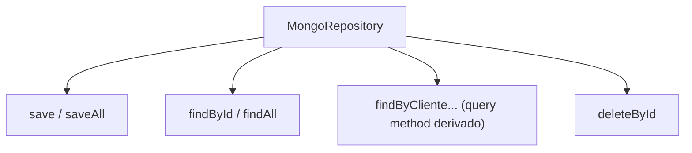
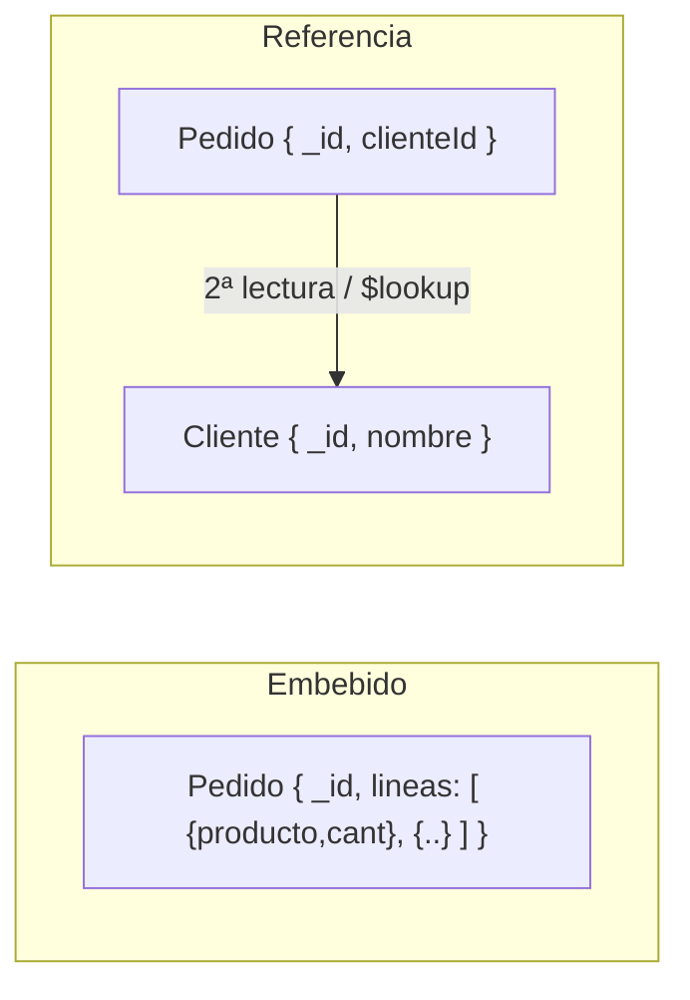
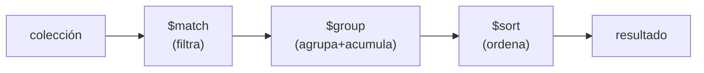
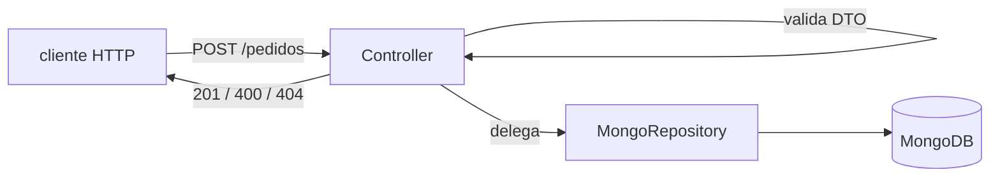

# Bloque XVII · NoSQL / MongoDB

> No todo dato es una tabla. A veces el documento ES el agregado: guárdalo
> entero, léelo de un golpe y deja que la forma de los datos siga a las
> preguntas que les harás.

## Cómo usar este documento

Igual que en los bloques anteriores: lee UNA sección → haz SU ejercicio →
vuelve. Cada sección termina con el recuadro **"Lo practicas en…"**. Aquí no
hay un Mongo real corriendo: cada ejercicio **simula** lo que Mongo haría
(serializar a `Map`, filtrar en memoria, agrupar a mano), así que tu foco está
en entender el MODELO mental, no en pelear con un driver.

| Sección | Tema | Ejercicio |
|---|---|---|
| 17.1 | Documentos y mapeo objeto↔documento | `Ej149MongoDocumentMapping` |
| 17.2 | MongoRepository (CRUD declarativo) | `Ej150MongoRepository` |
| 17.3 | MongoTemplate y Query/Criteria | `Ej151MongoTemplateQueries` |
| 17.4 | Embebido vs referencias | `Ej152EmbeddedVsReferences` |
| 17.5 | Aggregation pipeline | `Ej153AggregationPipeline` |
| 17.6 | API REST sobre Mongo | `Ej154MongoRestEndpoint` |

---

## 17.1 Documentos y mapeo objeto↔documento

En Mongo no hay filas ni columnas: hay **colecciones** de **documentos**
JSON/BSON. Una colección es el equivalente flexible de una tabla, pero sin
esquema fijo: dos documentos de la misma colección pueden tener campos
distintos. Spring Data mapea una clase Java a un documento con dos anotaciones:

- `@Document(collection = "pedidos")` — a qué colección pertenece la clase.
- `@Id` — qué campo es la clave primaria. **Spring lo serializa como `_id`**,
  el nombre reservado que Mongo usa siempre para la clave.

```java
@Document(collection = "pedidos")
record Pedido(@Id String id, String cliente, double total) {}
```

```mermaid
flowchart LR
    O["objeto Java\n(Pedido id=p1)"] -->|@Document / @Id| D["documento BSON\n{ _id: p1, cliente, total }"]
    D -->|deserialización| O
```

La pieza que más sorprende: el campo Java se llama `id`, pero en el documento
viaja como **`_id`** (con guion bajo). El mapeo es **simétrico**: si serializas
y vuelves a deserializar, debes recuperar el objeto idéntico
(`desdeDocumento(aDocumento(p)).equals(p)`).

El `_id` puede ser un `ObjectId`, un `String` o cualquier valor único. Si no lo
das, Mongo genera un `ObjectId` de 12 bytes (4 de timestamp + 5 de máquina/proceso
+ 3 de contador), que en texto son **24 caracteres hexadecimales**:
`507f1f77bcf86cd799439011`. Por eso, al serializar, si el id es null **no se
incluye la clave** (dejas que Mongo la genere).

| Concepto SQL | Equivalente Mongo |
|---|---|
| tabla | colección |
| fila | documento (BSON) |
| columna | campo (clave del documento) |
| clave primaria | `_id` |
| esquema fijo (DDL) | sin esquema (schemaless) |

> **Lo practicas en `Ej149MongoDocumentMapping`**: serializar un record a un
> `Map` con clave `_id`, reconstruirlo de forma simétrica, y validar nombres de
> colección, ObjectIds y campos reservados.

---

## 17.2 `MongoRepository`: CRUD declarativo

`MongoRepository<T, ID>` es la cara NoSQL de lo que ya viste en JPA (bloque 12):
declaras una interfaz y Spring genera la implementación. Te da gratis:



```java
public interface PedidoRepo extends MongoRepository<Pedido, String> {
    List<Pedido> findByCliente(String cliente);                 // { cliente: ?0 }
    List<Pedido> findByTotalGreaterThan(double importe);        // { total: { $gt: ?0 } }
}
```

Spring traduce el **nombre del método** a una consulta Mongo. `findByCliente`
genera el filtro `{ cliente: ? }`; `findByTotalGreaterThan` genera
`{ total: { $gt: ? } }`. Es el mismo motor de "query methods derivados" de JPA.

Detalles de contrato que el ejercicio te hace respetar (porque son los de la
interfaz real):

- **`save` es un upsert**: si el `_id` ya existe, SOBRESCRIBE; no duplica.
  Devuelve la entidad guardada, nunca null.
- **`findById` devuelve `Optional`**: vacío si no existe (jamás null crudo).
- **`findAll` devuelve lista vacía** si no hay nada (nunca null).
- **`deleteById` es idempotente**: borrar algo ya borrado no lanza, solo
  informa de que no había nada (en el ejercicio, devolviendo `false`).
- Un query method sin coincidencias devuelve **lista vacía**, no null.

> **Lo practicas en `Ej150MongoRepository`**: un repositorio en memoria que imita
> `save`/`findById`/`findAll`/`deleteById` y un query method derivado, más la
> sintaxis de filtros Mongo (operadores `$gt`, regex, paginación segura).

---

## 17.3 `MongoTemplate` y `Query`/`Criteria`

Cuando un query method derivado no basta (consultas dinámicas, combinaciones que
dependen de parámetros opcionales), bajas un nivel a `MongoTemplate`, que ejecuta
objetos `Query` construidos con `Criteria`. Es el equivalente NoSQL a la
**Criteria API de JPA** (bloque 15).

```java
Query q = new Query(Criteria.where("total").gte(100)
                            .and("cliente").is("ana"));
List<Pedido> r = mongoTemplate.find(q, Pedido.class);
```

`Criteria.where("total").gte(100)` produce el filtro BSON
`{ total: { $gte: 100 } }`. Encadenar `.and("cliente").is("ana")` añade una
condición que se combina con **AND lógico**: ambas deben cumplirse.

El patrón clave para consultas dinámicas: un criterio es un **objeto reutilizable
e independiente de los datos**. Lo construyes una vez (con los filtros que
apliquen, saltándote los que sean null) y lo aplicas contra la colección. En el
ejercicio lo modelas como un `record Criterio151(String cliente, double totalMinimo)`:
si `cliente` es null, esa condición simplemente no se aplica.

| Operador Criteria | BSON | Significado |
|---|---|---|
| `.is(x)` | `{ campo: x }` | igualdad exacta |
| `.gte(x)` / `.lte(x)` | `{ $gte }` / `{ $lte }` | mayor/menor o igual |
| `.gt(x)` / `.lt(x)` | `{ $gt }` / `{ $lt }` | estricto |
| `.in(a, b)` | `{ $in: [a,b] }` | pertenece al conjunto |
| `.regex("^Ada")` | `{ $regex }` | coincidencia de patrón |
| `.and(...)` | combina condiciones | AND lógico |

Una operación de **escritura** se construye con `Update` (`new Update().set("total", 99)`,
genera `{ $set: { total: 99 } }`). Los operadores de modificación más comunes:
`$set` (asigna), `$push` (añade a un array), `$inc` (incrementa). Un comando con
`multi: true` afecta a varios documentos a la vez.

> **Lo practicas en `Ej151MongoTemplateQueries`**: construir un criterio
> inmutable, aplicarlo en memoria con AND, y manejar la sintaxis de comandos de
> actualización (`$set`/`$push`), upserts y resúmenes de escritura.

---

## 17.4 Embebido vs referencias

La decisión de modelado MÁS importante en Mongo, y la que más se diferencia de
SQL. No hay JOINs baratos: el equivalente (`$lookup`) es costoso. Así que la
regla es **modelar según cómo se lee el dato**, no según la teoría de
normalización.



**Embebido** — los hijos viven DENTRO del documento padre, como subdocumentos:

```java
@Document(collection = "pedidos")
class Pedido {
    @Id String id;
    Direccion direccionEnvio;     // subdocumento embebido
    List<Linea> lineas;           // array de subdocumentos
}
```

- ✅ Una sola lectura trae el agregado completo (sin joins).
- ✅ Ideal si los hijos NO se consultan por su cuenta.
- ⚠️ Peligro si crecen sin límite: el documento se hincha y hay un **tope duro
  de 16 MB por documento** en Mongo.

**Referencia** — guardas solo el `id` del otro documento (manual, o con `@DBRef`):

```java
class Pedido {
    @Id String id;
    @DBRef Cliente cliente;       // o simplemente: String clienteId
}
```

- ✅ Evita duplicar el cliente en cada pedido; si el cliente cambia, cambia en
  un solo sitio.
- ⚠️ Exige una **segunda consulta** (o `$lookup`) para resolverlo. Si el id
  apuntado no existe, la referencia está **rota** (en el ejercicio:
  `NoSuchElementException`).

Un `@DBRef` se serializa con la forma estándar `{ $ref: "coleccion", $id: "valor" }`.

| Pregunta | Si la respuesta es… | Elige |
|---|---|---|
| ¿Se lee el hijo siempre con el padre? | Sí | Embebido |
| ¿El hijo crece sin límite? | Sí | Referencia |
| ¿El hijo se consulta/edita por su cuenta? | Sí | Referencia |
| ¿El hijo se comparte entre muchos padres? | Sí | Referencia |

> **Lo practicas en `Ej152EmbeddedVsReferences`**: serializar un pedido con
> líneas embebidas, resolver una referencia por id (con su caso de referencia
> rota), y validar `$ref`/`$id`, límites de 16 MB y profundidad de anidamiento.

---

## 17.5 Aggregation pipeline

El `GROUP BY` de Mongo, pero mucho más potente: una **tubería de etapas** donde
la salida de cada etapa alimenta la siguiente. Idéntico concepto al de los
streams del bloque 1 (`filter` → `map` → `collect`), pero ejecutándose en la BD.



```java
Aggregation agg = Aggregation.newAggregation(
    Aggregation.match(Criteria.where("total").gte(40)),       // filtra
    Aggregation.group("cliente").sum("total").as("sumaTotal"),// agrupa y suma
    Aggregation.sort(Sort.Direction.DESC, "sumaTotal")        // ordena desc
);
AggregationResults<ReporteDTO> r =
    mongoTemplate.aggregate(agg, "pedidos", ReporteDTO.class);
```

Las etapas que tienes que conocer:

| Etapa | Hace | Equivalente stream/SQL |
|---|---|---|
| `$match` | filtra documentos | `filter` / `WHERE` |
| `$group` | agrupa por clave y acumula | `groupingBy` / `GROUP BY` |
| `$sort` | ordena | `sorted` / `ORDER BY` |
| `$project` | elige/renombra campos | `map` / `SELECT` |
| `$limit` / `$skip` | recorta filas | `limit`/`skip` / `LIMIT` |

Operadores de acumulación dentro de `$group`: `$sum`, `$avg`, `$min`, `$max`,
`$count`. El `_id` del `$group` es la **clave de agrupación** (`"$cliente"` agrupa
por el campo cliente).

Regla de oro de rendimiento: **`$match` lo más pronto posible**. Filtrar primero
reduce el volumen que las etapas siguientes tienen que procesar (y permite usar
índices). En el ejercicio el orden es exactamente `$match → $group → $sort`, y
en empate de suma se desempata por cliente para que el orden sea estable.

> **Lo practicas en `Ej153AggregationPipeline`**: ejecutar `$match`/`$group`/`$sort`
> en memoria (filtrar, sumar por cliente, ordenar desc), y construir el JSON de
> cada etapa (`$match`, `$group`, `$project`).

---

## 17.6 API REST sobre Mongo

El mensaje liberador del bloque: **el controller no cambia por usar Mongo**.
Recibe un DTO, valida, delega en un servicio/repositorio y devuelve un
`ResponseEntity` con su código HTTP. Mongo es solo el almacén que hay detrás; la
arquitectura por capas del bloque 10 sigue intacta.



El contrato REST que el ejercicio te hace respetar (los mismos códigos de
siempre, bloques 5 y 9):

- **POST con éxito → `201 Created`**, cuerpo = recurso persistido.
- **Body inválido → `400 Bad Request`** (cliente vacío, total negativo), SIN
  tocar el repositorio.
- **GET de algo que no existe → `404 Not Found`**, nunca un `500`. Que el id no
  esté NO es una excepción: es un resultado legítimo modelado con `Optional`.
- El id se genera al crear (típicamente `UUID.randomUUID().toString()`), no lo
  manda el cliente.

El patrón limpio para el GET: `repo.findById(id).map(p -> ok(p)).orElse(notFound())`
— el mismo `Optional` → 200/404 que viste en la teoría 1.2.

> **Lo practicas en `Ej154MongoRestEndpoint`**: un `crear` que devuelve 201/400 y
> un `obtener` que devuelve 200/404 sobre el repo en memoria, más validaciones de
> ruta, content-type, cabecera de autorización y formato de respuesta.

---

## Errores comunes del bloque

| # | Error | Antídoto |
|---|---|---|
| 1 | Serializar el id como `"id"` | `@Id` viaja SIEMPRE como `"_id"` |
| 2 | Incluir `_id: null` al serializar sin id | Si el id es null, omite la clave (Mongo la genera) |
| 3 | Romper la simetría del mapeo | `desdeDocumento(aDocumento(p))` debe ser `equals(p)` |
| 4 | `findById` devolviendo null | Devuelve `Optional.empty()`, nunca null crudo |
| 5 | `save` que duplica en vez de sobrescribir | `save` es upsert: misma clave → reemplaza |
| 6 | `deleteById` que lanza si no existe | Es idempotente: devuelve false, no excepción |
| 7 | Query method sin match devolviendo null | Lista vacía, nunca null |
| 8 | Embeber datos que crecen sin límite | Tope de 16 MB; si crece, usa referencia |
| 9 | Olvidar resolver una referencia rota | Id inexistente → `NoSuchElementException` |
| 10 | `$sort` antes de `$match` | Filtra primero (`$match`) para no procesar de más |
| 11 | Devolver 500 cuando un GET no encuentra | "No existe" es 404, no un error de servidor |
| 12 | Confiar en el orden sin desempate | Empates de suma → desempata por cliente (estable) |

## Chuleta final del bloque

```
@Document(collection="x")  = a qué colección mapea la clase
@Id  → "_id"               = la clave Java 'id' viaja como '_id' en el documento
ObjectId                   = 24 hex (timestamp+máquina+contador); Mongo lo genera si falta
MongoRepository<T,ID>      = save(upsert) · findById(Optional) · findAll · deleteById(idempotente)
query methods              = findByCliente → {cliente:?} · findByTotalGreaterThan → {total:{$gt:?}}
MongoTemplate + Criteria   = where("total").gte(100).and("cliente").is("ana")  → AND
Update                     = $set asigna · $push añade a array · $inc incrementa · multi:true varios
Embebido                   = hijos dentro · 1 lectura · ⚠ 16 MB
Referencia                 = guarda id · 2ª lectura/$lookup · $ref/$id · evita duplicar
Pipeline                   = $match → $group → $sort → $project (filtra ANTES)
$group                     = _id = clave · acumula con $sum/$avg/$min/$max
REST                       = 201 crear · 400 body inválido · 404 no existe (NUNCA 500)
```

## Autoevaluación (responde sin mirar; si fallas 2+, relee la sección)

1. ¿Bajo qué clave viaja en el documento el campo anotado con `@Id`? ¿Qué pasa
   si no das id al guardar? *(17.1)*
2. ¿En qué se diferencian `save` de un INSERT clásico, y qué devuelve `findById`
   cuando no encuentra nada? *(17.2)*
3. ¿Cuándo bajarías de un query method derivado a `MongoTemplate` + `Criteria`?
   ¿Cómo combinas dos condiciones? *(17.3)*
4. Da dos casos en los que elegirías embebido y dos en los que elegirías
   referencia. ¿Qué límite duro tiene un documento? *(17.4)*
5. ¿Por qué conviene poner `$match` al principio del pipeline? *(17.5)*
6. ¿Qué etapa es el equivalente de `GROUP BY`, y qué operadores de acumulación
   conoces? *(17.5)*
7. Si un GET pide un id que no existe, ¿qué código HTTP devuelves y por qué NO
   es un 500? *(17.6)*
8. ¿Por qué se dice que "el controller no cambia" al pasar de JPA a Mongo? *(17.6)*
</content>
</invoke>
