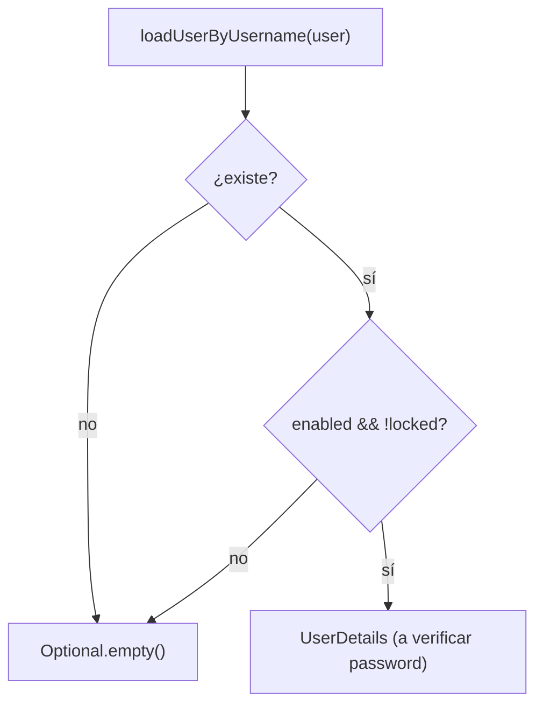
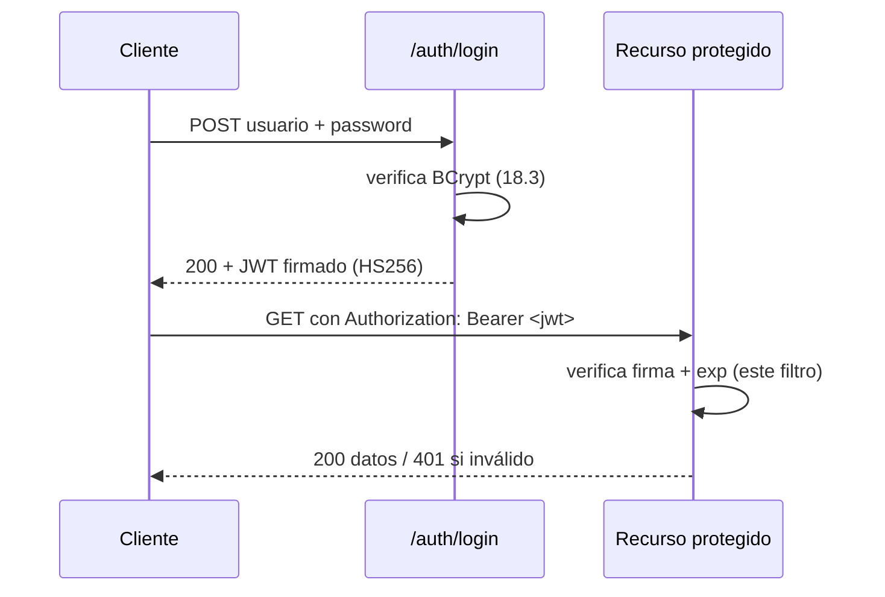
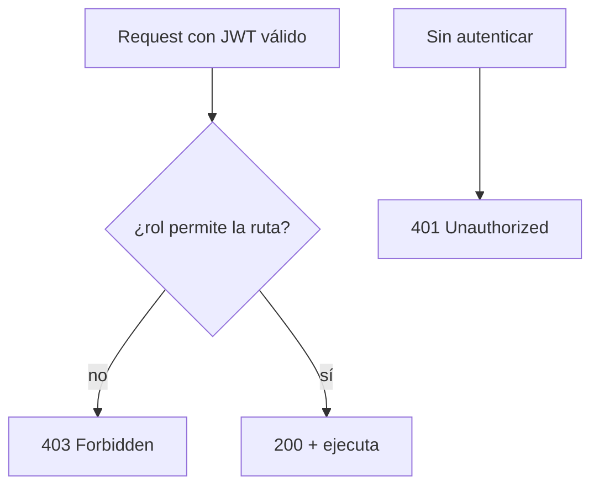
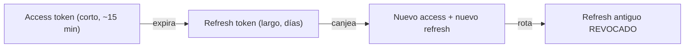

# Bloque XVIII · Seguridad: Spring Security + JWT

> Una API sin seguridad no es una API, es una brecha esperando a ocurrir.
> Autenticar es saber QUIÉN eres; autorizar es saber QUÉ puedes hacer. Son dos
> preguntas distintas, con dos respuestas HTTP distintas: 401 y 403.

## Cómo usar este documento

Igual que en bloques anteriores: lee UNA sección → haz SU ejercicio → vuelve.
Cada sección cierra con el recuadro **"Lo practicas en…"**. Aquí NO levantamos
un Spring real: modelamos cada decisión de seguridad como una **función pura**
(método estático, entrada → salida) que se puede testear sin servidor. Eso te
deja ver la LÓGICA sin el ruido de la configuración; cuando montes Spring de
verdad, reconocerás cada pieza.

| Sección | Tema | Ejercicio |
|---|---|---|
| 18.1 | SecurityFilterChain: la política de acceso | `Ej155SecurityFilterChain` |
| 18.2 | Usuarios en memoria | `Ej156InMemoryUsers` |
| 18.3 | PasswordEncoder (BCrypt) | `Ej157PasswordEncoder` |
| 18.4 | UserDetailsService (cargar de BD) | `Ej158UserDetailsService` |
| 18.5 | Emisión de JWT (jjwt) | `Ej159JwtIssue` |
| 18.6 | Filtro de validación JWT | `Ej160JwtValidationFilter` |
| 18.7 | Autorización por rol | `Ej161RoleBasedAccess` |
| 18.8 | Method security (`@PreAuthorize`) | `Ej162MethodSecurity` |
| 18.9 | Refresh tokens y rotación | `Ej163RefreshTokens` |
| 18.10 | Endurecimiento CSRF y CORS | `Ej164CsrfAndCorsHardening` |

---

## 18.1 SecurityFilterChain: la política de acceso

Antes de que una petición llegue a tu `@RestController`, atraviesa una **cadena
de filtros** de Spring Security. El primer filtro que importa decide lo más
básico: ¿esta ruta es **pública** o requiere autenticación? Esa decisión es,
en el fondo, una función pura: `esPublica(metodo, ruta) → boolean`.

La **regla de oro** es **deny by default**: todo lo que no esté explícitamente
abierto, es privado. Es justo lo contrario de "abro todo y voy cerrando agujeros"
(que siempre deja agujeros).

En Spring 6+ esto se configura con un `@Bean` que devuelve un `SecurityFilterChain`
(adiós al antiguo `WebSecurityConfigurerAdapter`):

```java
@Bean
public SecurityFilterChain filterChain(HttpSecurity http) throws Exception {
    return http
        .csrf(csrf -> csrf.disable())                  // stateless con JWT (ver 18.10)
        .sessionManagement(s -> s.sessionCreationPolicy(SessionCreationPolicy.STATELESS))
        .authorizeHttpRequests(auth -> auth
            .requestMatchers(HttpMethod.GET, "/public/**").permitAll()
            .requestMatchers(HttpMethod.POST, "/auth/login", "/auth/refresh").permitAll()
            .requestMatchers("/admin/**").hasRole("ADMIN")
            .anyRequest().authenticated())             // <- deny by default
        .addFilterBefore(jwtFilter, UsernamePasswordAuthenticationFilter.class)
        .build();
}
```

Fíjate en el orden: las reglas se evalúan de arriba abajo y `anyRequest()` es la
red de seguridad final. La política que modelas en el ejercicio es exactamente
ese bloque `authorizeHttpRequests`, pero como `if`/`switch` decidibles.

Dos sutilezas que los tests vigilan:

- **El método importa**: `GET /public/health` es público, pero `POST /public/health`
  NO (solo abriste el GET). La política es por *par* (método, ruta), no por ruta.
- **Compara solo el path**: si llega `/public/x?token=abc`, la query string no
  forma parte de la decisión de ruta. Recórtala antes de comparar.

> **Lo practicas en `Ej155SecurityFilterChain`**: `esPublica` y `requiere401`
> como funciones puras con deny by default, distinguiendo 401 de 403.

---

## 18.2 Usuarios en memoria

Para demos y tests no necesitas una base de datos: Spring ofrece
`InMemoryUserDetailsManager`, que es conceptualmente un `Map<String, Usuario>`.
Lo modelamos como un mapa puro `username -> Usuario156`.

Tres reglas de negocio que parecen triviales y no lo son:

1. **Búsqueda case-insensitive**: `ANA`, `Ana` y `ana` son el mismo usuario.
   Normaliza la clave (a minúsculas) antes de buscar.
2. **Cuenta deshabilitada = no existe**: si `enabled == false`, devuelve
   `Optional.empty()` como si el usuario no estuviera. No reveles que existe pero
   está apagado.
3. **Nunca lances excepción por "no encontrado"** que filtre información: un
   atacante que prueba usuarios no debe distinguir "no existe" de "existe pero
   bloqueado" (esto es *user enumeration*, ver 18.4).

```java
public record Usuario156(String username, String passwordHash,
                         Set<String> roles, boolean enabled) {}
```

Sobre los **roles**: en Spring conviven dos formatos, `ROLE_ADMIN` (la
*autoridad* completa) y `ADMIN` (el rol "pelado"). `hasRole("ADMIN")` añade el
prefijo por ti; `hasAuthority("ROLE_ADMIN")` no. Cuando compares roles, normaliza
a UN formato consistente para no comparar peras con manzanas.

> **Lo practicas en `Ej156InMemoryUsers`**: `buscar` (case-insensitive, oculta
> deshabilitados) y `tieneAlgunRol` (intersección sin mutar las entradas).

---

## 18.3 PasswordEncoder (BCrypt)

**Jamás** se guarda una contraseña en claro. Tampoco con MD5 o SHA-1 "a secas"
(son rápidos → fáciles de romper por fuerza bruta). El estándar es **BCrypt**:

- Genera un **salt aleatorio** por hash y lo embebe en el propio resultado.
  Por eso hashear `"1234"` dos veces da dos cadenas DISTINTAS, y por eso no se
  necesita guardar el salt aparte.
- Es **lento a propósito** (factor de coste configurable, por defecto 10 = 2¹⁰
  rondas). Lo que para ti son milisegundos, para un atacante que prueba millones
  de claves es una eternidad.
- El hash tiene formato fijo: `$2a$10$....` (`$2a`/`$2b` = versión, `10` = coste,
  resto = salt + hash en base64). Unos 60 caracteres.

```java
BCryptPasswordEncoder enc = new BCryptPasswordEncoder();
String hash = enc.encode("supersecreta1");   // -> "$2a$10$..."
boolean ok  = enc.matches("supersecreta1", hash);   // true
```

La clave conceptual: **nunca compares hashes con `equals`**. Como el salt es
aleatorio, dos hashes de la misma contraseña no son iguales como cadenas.
`matches(raw, hash)` extrae el salt DEL PROPIO hash, vuelve a hashear `raw` con
ese salt y compara — además de forma resistente a *timing attacks*. No
reimplementes esa comparación a mano.

> **Lo practicas en `Ej157PasswordEncoder`**: `hash` (con política de longitud
> mínima) y `verifica` (delegando en `matches`, nunca en `equals`).

---

## 18.4 UserDetailsService: cargar el usuario de la BD

En producción los usuarios viven en una tabla. `UserDetailsService` es la
interfaz de un solo método, `loadUserByUsername(String)`, que Spring llama
durante el login para obtener los datos del usuario. Lo modelamos como una
búsqueda en una `List<CuentaBd158>`.

Dos comprobaciones de estado **antes** de validar la contraseña:

- `enabled` — cuenta activa (no dada de baja ni pendiente de verificar email).
- `locked` — cuenta bloqueada (p.ej. tras N intentos fallidos).

Una cuenta solo autentica si `enabled && !locked`. Y ojo: estas comprobaciones
NO miran la contraseña — eso es trabajo del `PasswordEncoder` (18.3); aquí solo
decides si la cuenta está en condiciones de intentarlo.

**User enumeration** — el error de seguridad estrella de esta sección. Si tu
login responde "ese usuario no existe" cuando falla el username pero "contraseña
incorrecta" cuando falla la clave, le estás regalando al atacante una lista de
usuarios válidos. La defensa: el mismo resultado genérico para ambos casos, y
`loadUserByUsername` devuelve vacío (no excepción que filtre el motivo).



> **Lo practicas en `Ej158UserDetailsService`**: `loadUserByUsername`
> (normaliza, oculta bloqueados, sin filtrar info) y `puedeAutenticar`
> (`enabled && !locked`).

---

## 18.5 Emisión de JWT

Un **JWT** (JSON Web Token) es una credencial **autocontenida y firmada**. Tiene
tres partes separadas por puntos: `header.payload.signature`, cada una en
base64url:

- **Header**: el algoritmo de firma, p.ej. `{"alg":"HS256","typ":"JWT"}`.
- **Payload (claims)**: los datos. Claims estándar: `sub` (subject = usuario),
  `iat` (issued at), `exp` (expiration), `iss` (issuer), `aud` (audience). Más
  los tuyos (`rol`, etc.). **No es secreto**: cualquiera puede leerlo en base64.
  Nunca metas contraseñas ni datos sensibles ahí.
- **Signature**: el HMAC del `header.payload` con tu clave secreta. Esto es lo
  que impide la manipulación: cambiar un solo carácter del payload invalida la
  firma.

Lo profundo del JWT: es **stateless**. El servidor NO guarda sesión; confía en
que la firma es válida. Eso escala muchísimo, pero implica que no puedes
"cerrar sesión" en el servidor sin un mecanismo extra (de ahí los refresh tokens
y las blacklists, 18.9).

Con **jjwt 0.12.x** (`io.jsonwebtoken`):

```java
// HS256 exige una clave de >= 256 bits (32 bytes):
SecretKey clave = Keys.hmacShaKeyFor(secreto.getBytes(StandardCharsets.UTF_8));

String token = Jwts.builder()
        .subject("ana")                        // claim sub
        .claim("rol", "ROLE_ADMIN")            // claim custom
        .issuedAt(new Date(ahoraMillis))
        .expiration(new Date(ahoraMillis + duracionMillis))
        .signWith(clave)                       // HMAC-SHA256
        .compact();                            // serializa a header.payload.signature
```

HS256 es **simétrico**: la MISMA clave firma y verifica. El secreto NUNCA va en
el código (usa config/secret manager). Rotar la clave invalida todos los tokens
emitidos con la anterior.

> **Lo practicas en `Ej159JwtIssue`**: `clave` (valida ≥32 bytes) y `emitir`
> (subject + rol + iat/exp + firma → token de 3 partes).

---

## 18.6 Filtro de validación JWT

En la otra punta, cada petición a un recurso protegido trae
`Authorization: Bearer <jwt>`. Un filtro (`OncePerRequestFilter`) lo intercepta,
valida el token y, si es correcto, coloca al usuario en el `SecurityContext`.



Dos pasos, dos métodos:

1. **Extraer el Bearer**. El prefijo es exactamente `"Bearer "` (con espacio).
   Si no empieza así (o es `Basic`, o falta), no hay token → `Optional.empty()`.
   No aceptes otros esquemas.

2. **Validar firma + caducidad** y devolver los claims:

```java
try {
    Claims claims = Jwts.parser()
            .verifyWith(clave)              // comprueba la firma con tu clave
            .build()
            .parseSignedClaims(token)
            .getPayload();
    // comprobar exp contra ahoraMillis...
    return Optional.of(claims);
} catch (JwtException e) {
    return Optional.empty();                // firma inválida / malformado
}
```

La regla inviolable: **nunca confíes en los claims de un token cuya firma no has
verificado**. Leer el payload en base64 es trivial; un atacante puede inventarse
`"rol":"ROLE_ADMIN"`. Solo la firma válida convierte esos claims en confiables.
Y un token caducado (`exp` ya pasó) se rechaza aunque la firma sea correcta.

> **Lo practicas en `Ej160JwtValidationFilter`**: `extraerBearer` (prefijo
> exacto) y `validar` (firma + exp, devolviendo `Optional<Claims>` sin relanzar).

---

## 18.7 Autorización por rol

Autenticado ≠ autorizado. Una vez sé QUIÉN eres (18.6), toca decidir QUÉ puedes
hacer. La política por ruta+rol:



La distinción **401 vs 403** es de examen y de producción:

| Código | Significado | Cuándo |
|---|---|---|
| 401 Unauthorized | "No sé quién eres" | falta token, token inválido/caducado |
| 403 Forbidden | "Sé quién eres, pero no puedes" | autenticado, rol insuficiente |

(El nombre "Unauthorized" del 401 es un error histórico del estándar: en realidad
significa *no autenticado*.)

Reglas del ejercicio: `/admin/**` exige `ROLE_ADMIN`; `/api/**` admite
`ROLE_USER` **o** `ROLE_ADMIN`; el resto, deny by default (false). Cuidado: tener
`ROLE_ADMIN` no abre automáticamente CUALQUIER ruta — respeta la regla por ruta;
un admin sí entra en `/api` porque la regla lo lista, no por ser admin "mágico".

> **Lo practicas en `Ej161RoleBasedAccess`**: `permitido` (política ruta+rol,
> deny by default) y `statusHttp` (mapea autenticado/autorizado a 200/401/403).

---

## 18.8 Method security (`@PreAuthorize`)

Además de proteger por ruta, Spring permite proteger **métodos** concretos con
anotaciones que evalúan expresiones SpEL:

- `@PreAuthorize("hasRole('ADMIN')")` — se evalúa **ANTES** de ejecutar el
  método. Si falla, el método ni se llama.
- `@PostAuthorize("returnObject.owner == authentication.name")` — se evalúa
  **DESPUÉS**, sobre el valor devuelto. Útil para "solo el propietario o un admin
  ve este recurso".

```java
@PreAuthorize("hasAnyRole('USER','ADMIN')")
public Pedido verPedido(Long id) { ... }

@PostAuthorize("returnObject.owner == authentication.name or hasRole('ADMIN')")
public Documento verDoc(Long id) { ... }
```

El patrón **propietario o admin** ataca una vulnerabilidad concreta: **IDOR**
(*Insecure Direct Object Reference*). Si tu endpoint es `GET /pedidos/{id}` y solo
compruebas que estás autenticado, cualquier usuario puede pedir el `{id}` de otro
y ver sus datos. La regla `usuarioActual == propietario || esAdmin` lo cierra.

```java
boolean propietarioOAdmin(String yo, String dueño, Set<String> misRoles) {
    return yo.equals(dueño) || misRoles.contains("ROLE_ADMIN");
}
```

`hasRole` (uno) vs `hasAnyRole` (varios) es la otra confusión típica: el segundo
devuelve true si hay intersección con CUALQUIERA de los roles permitidos.

> **Lo practicas en `Ej162MethodSecurity`**: `hasAnyRole` (intersección) y
> `propietarioOAdmin` (anti-IDOR con OR de propietario y admin).

---

## 18.9 Refresh tokens y rotación

El dilema del access token: si dura mucho y te lo roban, el atacante tiene acceso
mucho tiempo (y no puedes revocarlo, es stateless). Si dura poco, el usuario
tiene que re-loguearse constantemente. Solución: **dos tokens**.



- El **access token** es JWT corto, se manda en cada petición.
- El **refresh token** es largo, se guarda con cuidado y solo se usa para pedir
  un access nuevo cuando el viejo caduca.

La **rotación single-use** es el corazón de la seguridad aquí: cada vez que
canjeas un refresh, recibes uno NUEVO y el anterior se **revoca**. Si alguien
intenta reusar un refresh ya rotado, es señal de robo (el legítimo y el ladrón
no pueden tener ambos el token "vivo") y se debe invalidar toda la familia.

Por eso el almacén de refresh tokens SÍ guarda estado (a diferencia del JWT):
necesitas saber cuáles están revocados. Modelamos `verificar` (existe + no
revocado + no caducado) y `rotar` (revoca el viejo, registra el nuevo).

> **Lo practicas en `Ej163RefreshTokens`**: `verificar` (3 condiciones) y
> `rotar` (single-use: revoca el antiguo, alta el nuevo).

---

## 18.10 Endurecimiento CSRF y CORS

Dos mecanismos que la gente confunde constantemente. **No son lo mismo.**

**CSRF** (*Cross-Site Request Forgery*): un sitio malicioso hace que TU navegador
envíe una petición a tu banco usando tu **cookie de sesión** (que el navegador
adjunta sola). El ataque depende de credenciales que viajan automáticamente.

- Clave: si autenticas con **JWT en el header `Authorization`**, eres **inmune al
  CSRF clásico**, porque el navegador NO adjunta ese header solo — tu JS lo pone
  explícitamente. Por eso en APIs stateless con JWT se hace `csrf.disable()`.
- Si usas **cookie de sesión**, los métodos que mutan (POST/PUT/PATCH/DELETE) SÍ
  necesitan token CSRF. Los métodos "seguros" (GET/HEAD/OPTIONS/TRACE) nunca.

**CORS** (*Cross-Origin Resource Sharing*): es el navegador el que, ante una
petición a otro origen, pregunta al servidor "¿permites a `https://app.com`
leerte?". Reglas de oro:

- **Allowlist exacta**, nunca `*` junto con credenciales (sería abrir a cualquiera).
- Una *origin* es `esquema://host:puerto`: `http://app.com` ≠ `https://app.com`,
  y `app.com:8080` ≠ `app.com:443`. Comparación EXACTA, sin normalizar.
- **Nunca reflejes el `Origin` entrante** sin validarlo contra la allowlist
  (vulnerabilidad clásica: devolver `Access-Control-Allow-Origin: <lo que pidan>`).
- CORS lo aplica el **navegador**, no protege el servidor de un cliente que no
  sea navegador (curl ignora CORS). Es una protección PARA el usuario, no DEL
  backend.

> **Lo practicas en `Ej164CsrfAndCorsHardening`**: `requiereCsrf` (safe methods +
> JWT inmune) y `corsPermitido` (allowlist exacta, deny por defecto).

---

## Errores comunes del bloque

| # | Error | Antídoto |
|---|---|---|
| 1 | Abrir todo y cerrar agujeros | Deny by default: `anyRequest().authenticated()` |
| 2 | Ignorar el método HTTP en la política | La regla es por (método, ruta): `POST /public` ≠ `GET /public` |
| 3 | Comparar hashes BCrypt con `equals` | Usa `matches(raw, hash)`: el salt es aleatorio |
| 4 | Guardar/loguear contraseñas en claro | Solo el hash BCrypt; nunca la clave ni en logs |
| 5 | "Usuario no existe" vs "clave mal" | Respuesta genérica: evita user enumeration |
| 6 | Confiar en claims sin verificar firma | Parsea con `verifyWith(clave)`; nunca leas el payload "a pelo" |
| 7 | Confundir 401 con 403 | 401 = no sé quién eres; 403 = sé quién eres y no puedes |
| 8 | Clave HS256 de <32 bytes | HS256 exige ≥256 bits o jjwt lanza excepción |
| 9 | No rotar el refresh token | Single-use: revoca el viejo al canjear; reuso = robo |
| 10 | `Access-Control-Allow-Origin: *` con credenciales | Allowlist exacta; nunca reflejar el Origin entrante |

## Chuleta final del bloque

```
FilterChain  = deny by default · regla por (método, ruta) · compara solo el path
InMemory     = Map<user,Usuario> · case-insensitive · disabled = no existe
BCrypt       = salt aleatorio embebido · lento a propósito · matches(), nunca equals
UserDetails  = loadUserByUsername · enabled && !locked · sin user enumeration
JWT          = header.payload.signature (base64url) · stateless · firma = no manipulable
Emitir       = Keys.hmacShaKeyFor(>=32 bytes) · Jwts.builder().subject().exp().signWith()
Validar      = "Bearer " exacto · verifyWith(clave) · exp · Optional vacío si falla
Roles        = 401 (no autenticado) ≠ 403 (sin permiso) · admin no abre todo solo
Method sec   = @PreAuthorize antes · @PostAuthorize después · propietario||admin = anti-IDOR
Refresh      = access corto + refresh largo · rotación single-use · reuso = robo
CSRF         = cookie+mutador = sí · JWT en header = inmune · GET/HEAD nunca
CORS         = allowlist exacta · esquema+host+puerto · nunca '*' con credenciales
```

## Autoevaluación (responde sin mirar; si fallas 2+, relee la sección)

1. ¿Qué significa "deny by default" y por qué `POST /public/health` puede ser
   privado aunque `GET /public/health` sea público? *(18.1)*
2. ¿Por qué hashear la misma contraseña dos veces con BCrypt da resultados
   distintos, y por qué no debes comparar hashes con `equals`? *(18.3)*
3. ¿Qué es *user enumeration* y cómo lo evita `loadUserByUsername`? *(18.4)*
4. ¿Qué tres partes tiene un JWT y cuál de ellas impide su manipulación? ¿Es
   secreto el payload? *(18.5)*
5. ¿Por qué nunca debes confiar en los claims de un token sin verificar su firma?
   *(18.6)*
6. ¿Cuál es la diferencia entre 401 y 403? Da un ejemplo de cada uno. *(18.7)*
7. ¿Qué vulnerabilidad cierra el patrón "propietario o admin" y por qué? *(18.8)*
8. ¿Por qué una API con JWT en el header `Authorization` es inmune al CSRF
   clásico, y qué condición SÍ requeriría protección CSRF? *(18.10)*
