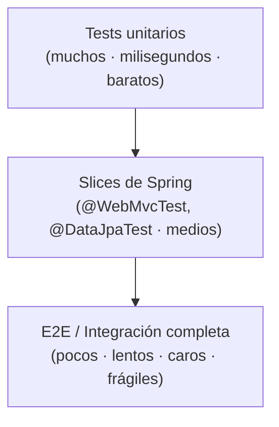
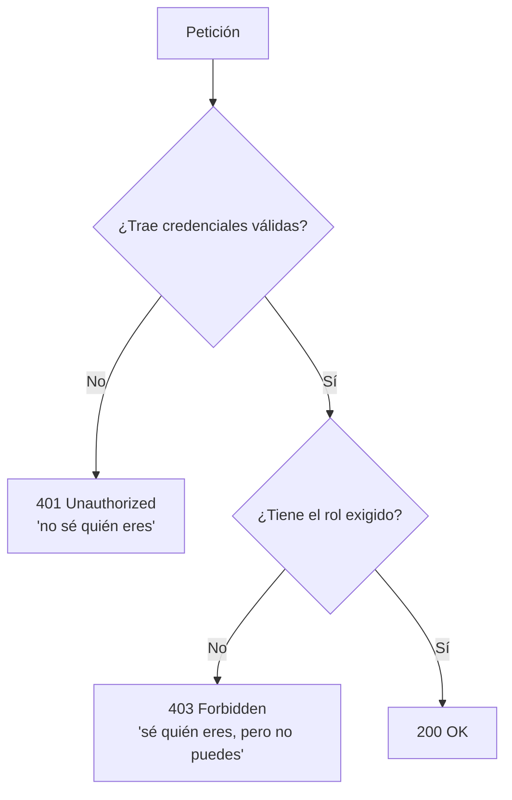
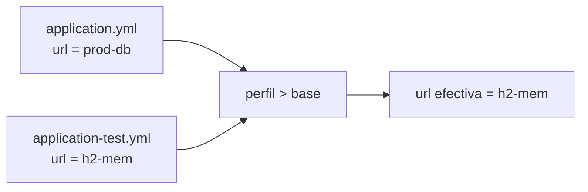

# Bloque XIX · Testing de APIs

> El código sin tests no es código que funciona: es código que aún no ha
> fallado. Un test no demuestra la ausencia de bugs, pero un test rojo
> demuestra su presencia. Aquí dejas de "probar a mano" y empiezas a hacer
> ingeniería: verificar tu API en capas, cada una con su coste y su alcance.

## Cómo usar este documento

Igual que en los bloques anteriores: lee UNA sección → haz SU ejercicio →
vuelve. Cada sección cierra con el recuadro **"Lo practicas en…"**.

Los ejercicios de este bloque tienen una particularidad: como no podemos
arrancar Spring ni Docker dentro de un test unitario rápido, **modelamos cada
técnica como una función pura** que captura su decisión esencial (el status
HTTP que daría seguridad, la URL que montaría Testcontainers, la fusión de
propiedades que haría un perfil…). Aprendes el CONCEPTO sin pagar el coste de
la infraestructura. En la columna "En Spring real" verás a qué se traduce.

| Sección | Tema | Ejercicio | En Spring real |
|---|---|---|---|
| 19.1 | La pirámide de tests | *(transversal)* | estrategia de suite |
| 19.2 | Test unitario con JUnit 5 | `Ej165UnitTestJUnit5` | `@Test`, `assertThrows` |
| 19.3 | Dobles de prueba: mocks y stubs | `Ej166MockitoMocks` | Mockito `when/verify` |
| 19.4 | Test de servicio | `Ej167ServiceUnitTest` | `@InjectMocks` |
| 19.5 | `@WebMvcTest` + MockMvc | `Ej168WebMvcTest` | slice web |
| 19.6 | Aserciones sobre JSON | `Ej169JsonAssertions` | JsonPath / Jackson |
| 19.7 | `@DataJpaTest` | `Ej170DataJpaTest` | slice JPA + H2 |
| 19.8 | `@SpringBootTest` e2e | `Ej171SpringBootIntegration` | contexto completo |
| 19.9 | Testcontainers / Postgres | `Ej172TestcontainersPostgres` | BD real efímera |
| 19.10 | Testing de seguridad | `Ej173SecurityTesting` | 401/403/200 |
| 19.11 | Tests parametrizados | `Ej174ParameterizedTests` | `@ParameterizedTest` |
| 19.12 | Slices y perfil test | `Ej175TestSlicesAndProfiles` | `@ActiveProfiles` |
| 19.13 | Cobertura y quality gate | `Ej176CoverageAndQualityGate` | JaCoCo |

---

## 19.1 La pirámide de tests

La pregunta no es "¿testeo?", sino "¿con qué granularidad testeo CADA cosa?".
La respuesta es la **pirámide**: muchos tests pequeños, rápidos y baratos en
la base; pocos tests grandes, lentos y caros en la cima.



¿Por qué pirámide y no rectángulo (todo e2e)? Tres razones:

1. **Velocidad**: un unitario corre en milisegundos; un `@SpringBootTest`
   arranca todo el contexto (segundos). Mil unitarios < diez e2e en tiempo.
2. **Localización del fallo**: si un unitario de `aplicarDescuento` se pone
   rojo, sabes EXACTAMENTE qué método mirar. Si un e2e falla, el bug puede
   estar en cualquiera de las 8 capas que atravesó.
3. **Estabilidad**: cada pieza de infraestructura (red, BD, reloj) es una
   fuente de fallos intermitentes (*flaky*). Menos infraestructura = test más
   determinista.

La regla práctica: **empuja la lógica hacia abajo**. Si una regla de negocio
se puede probar con una función pura, no la pruebes con un e2e. Los e2e se
reservan para "¿están bien cableadas las capas entre sí?".

| Nivel | Qué prueba | Coste | Cuántos |
|---|---|---|---|
| Unitario | una clase/método aislado | µs | cientos |
| Slice | una capa con su mini-contexto | ms | docenas |
| Integración / e2e | el sistema cableado entero | s | un puñado |

> **Es la brújula de todo el bloque**: cada ejercicio siguiente vive en un
> nivel de esta pirámide. Tenla presente al decidir cómo probar algo.

---

## 19.2 Test unitario con JUnit 5

El nivel base de la pirámide. JUnit 5 (JUnit Jupiter) es el motor: descubre
los métodos `@Test`, los ejecuta aislados y reporta verde/rojo. Sin Spring,
sin BD, sin red.

El vocabulario mínimo de aserciones (`org.junit.jupiter.api.Assertions`):

```java
import static org.junit.jupiter.api.Assertions.*;

@Test
void descuentoNormal() {
    assertEquals(80.0, aplicarDescuento(100.0, 20.0));   // esperado, real
}

@Test
void precioInvalido() {
    assertThrows(IllegalArgumentException.class,         // tipo esperado
            () -> aplicarDescuento(0.0, 10.0));          // código que debe lanzar
}
```

| Aserción | Verifica |
|---|---|
| `assertEquals(esp, real)` | igualdad (`equals`) |
| `assertTrue / assertFalse` | un booleano |
| `assertNull / assertNotNull` | nulidad |
| `assertThrows(Tipo.class, ejec)` | que el lambda lance esa excepción |
| `assertAll(...)` | agrupa varias aserciones y las reporta todas |

Dos sutilezas que el bloque castiga:

- **`assertThrows` recibe un lambda** (`Executable`), no el resultado de la
  llamada. `assertThrows(X.class, metodo())` ejecutaría `metodo()` ANTES de
  pasarlo y la excepción escaparía sin ser capturada.
- **`double` y la división por cero NO lanzan**: `1.0 / 0.0` en Java es
  `Infinity`, no una excepción. Si tu contrato dice "dividir por cero es un
  error", tienes que comprobarlo y lanzar TÚ `ArithmeticException`.

La pieza bajo prueba del ejercicio es `aplicarDescuento(precioBase,
porcentaje)`: valida rangos, aplica el factor `1 - porcentaje/100` y redondea
a 2 decimales con `Math.round(x*100)/100.0`.

> **Lo practicas en `Ej165UnitTestJUnit5`**: una calculadora de descuento con
> validación y redondeo, más diez utilidades aritméticas que afinan tu manejo
> de `assertEquals`/`assertThrows` (incluida la trampa de la división por 0).

---

## 19.3 Dobles de prueba: mocks y stubs

Para testear una clase que depende de un repositorio, una API externa o un
reloj, no quieres la dependencia REAL (lenta, no determinista). La sustituyes
por un **doble de prueba**:

- **Stub**: devuelve respuestas fijas preconfiguradas ("para el id 1 devuelve
  'Ada'"). Controla el *entorno* del test.
- **Mock**: un stub que ADEMÁS verifica interacciones ("comprueba que se llamó
  a `buscar(1)` exactamente una vez"). Controla el *comportamiento*.

En Spring usarás **Mockito**, que los genera al vuelo:

```java
@Mock UsuarioRepository repo;                       // doble automático

when(repo.buscarNombre(1)).thenReturn("Ada");       // stubbing
String saludo = service.saludar(repo, 1);
verify(repo).buscarNombre(1);                        // verificación (mock)
```

En el ejercicio modelamos el concepto SIN Mockito: `RepositorioStub166` es una
interfaz funcional, y en cada test le pasas una lambda que actúa de stub:

```java
RepositorioStub166 stub = id -> id == 1 ? "Ada" : null;   // tu stub a mano
assertEquals("Hola, Ada", saludar(stub, 1));
```

Esto enseña la idea esencial: **el código bajo prueba no sabe ni le importa si
la dependencia es real o un doble**; mientras cumpla el contrato de la
interfaz, funciona. Ese desacoplamiento es lo que hace testeable un servicio.

La pieza bajo prueba `saludar` distingue tres estados del nombre devuelto:
encontrado (`"Hola, " + nombre`), `null` o blank (ambos → `"Hola,
desconocido"`).

> **Lo practicas en `Ej166MockitoMocks`**: consumir un stub funcional y derivar
> lógica de saludo de él, con retos que transforman el nombre devuelto sin
> tocar la "dependencia".

---

## 19.4 Test de servicio

Un servicio orquesta colaboradores (repositorios, otros servicios) para
ejecutar una regla de negocio. Se prueba **con los colaboradores mockeados**:
así verificas la ORQUESTACIÓN (validaciones, cálculos, decisiones) sin tocar
infraestructura.

```java
@ExtendWith(MockitoExtension.class)
class TransferenciaServiceTest {
    @Mock SaldoRepo saldos;            // colaborador doblado
    @InjectMocks TransferenciaService service;   // se le inyecta el mock

    @Test
    void fondosInsuficientes() {
        when(saldos.saldoDe("A")).thenReturn(100.0);
        assertThrows(IllegalStateException.class,
                () -> service.transferir("A", "B", 500.0));
    }
}
```

La clave de diseño: separa con cuidado **qué excepción** señala cada problema,
porque luego un `@ExceptionHandler` (bloque 9) las mapea a HTTP distinto:

| Situación | Excepción | HTTP futuro |
|---|---|---|
| Argumento inválido (null, importe ≤ 0, misma cuenta) | `IllegalArgumentException` | 400 |
| Estado del sistema impide la operación (saldo insuficiente) | `IllegalStateException` | 409 |

La pieza bajo prueba `transferir(saldos, origen, destino, importe)` valida
entradas, lee `saldos.saldoDe(origen)`, comprueba fondos y devuelve el nuevo
saldo de origen — **sin escribir en el repo** (es un doble, y el test verifica
lógica pura).

> **Lo practicas en `Ej167ServiceUnitTest`**: orquestar un repositorio de
> saldos (stub) aplicando reglas de negocio y eligiendo la excepción correcta
> para cada fallo.

---

## 19.5 `@WebMvcTest` + MockMvc

El primer *slice*. `@WebMvcTest` arranca SOLO la capa web (controllers,
filtros, serialización JSON, validación) y mockea los servicios. `MockMvc`
simula peticiones HTTP sin levantar un servidor real:

```java
@WebMvcTest(SaludoController.class)
class SaludoControllerTest {
    @Autowired MockMvc mockMvc;
    @MockBean SaludoService service;     // dependencia doblada

    @Test
    void faltaNombre_da400() throws Exception {
        mockMvc.perform(get("/saludo"))
               .andExpect(status().isBadRequest());
    }
}
```

La idea profunda: **un controller es, en esencia, una función pura
`request → response`**. Recibe método + ruta + parámetros y decide un status y
un cuerpo. El ejercicio modela exactamente eso con `handle(metodo, ruta,
nombre)` devolviendo una `Respuesta168(status, body)`.

El mapa de decisiones que un controller toma (y que el test exige):

| Condición | Status |
|---|---|
| ruta desconocida | 404 Not Found |
| ruta correcta, método incorrecto | 405 Method Not Allowed |
| parámetro requerido ausente/blank | 400 Bad Request |
| todo correcto | 200 OK |

Esa familia de códigos se agrupa: **2xx** éxito, **4xx** error del CLIENTE
(culpa de quien llama), **5xx** error del SERVIDOR (culpa tuya). Saber a qué
familia pertenece un código es media defensa de una API.

> **Lo practicas en `Ej168WebMvcTest`**: un controller-como-función que mapea
> request→status/JSON, con retos que clasifican respuestas por familia (2xx,
> 4xx, 5xx) y construyen cuerpos JSON.

---

## 19.6 Aserciones sobre JSON

Comparar dos respuestas JSON **por String** es frágil: `{"a":1,"b":2}` y
`{"b":2,"a":1}` son el MISMO objeto, pero `equals` de String dice que no. La
solución: parsear ambos a árbol y comparar **por nodos**.

Con Jackson (ya en el `pom`):

```java
ObjectMapper mapper = new ObjectMapper();
JsonNode a = mapper.readTree(jsonEsperado);   // árbol
JsonNode b = mapper.readTree(jsonReal);
boolean iguales = a.equals(b);                // semántico, no textual
```

Reglas de la comparación semántica que el ejercicio exige distinguir:

- **El orden de las claves de un objeto NO importa** (un objeto es un mapa).
- **El orden de los elementos de un array SÍ importa** (un array es una lista).
- **Los tipos importan**: el número `1` no es igual a la cadena `"1"`.

`readTree` lanza `JsonProcessingException` (checked) si el texto no es JSON
válido; tu contrato la traduce a `IllegalArgumentException`. Y para leer
campos sueltos, el navegador de árbol:

| Llamada | Devuelve |
|---|---|
| `node.get("campo")` | el `JsonNode` hijo, o `null` si no existe |
| `node.asText()` | el valor como String |
| `node.asInt()` / `asBoolean()` | valor tipado |
| `node.isObject()` / `isArray()` | tipo del nodo |
| `node.size()` | nº de elementos (array) o campos (objeto) |
| `node.fieldNames()` | iterador de nombres de campo |

> **Lo practicas en `Ej169JsonAssertions`**: un mini-matcher que compara JSON
> por árbol (no por texto) y extrae campos tipados, con la trampa del orden de
> claves vs orden de array.

---

## 19.7 `@DataJpaTest`

El *slice* de persistencia. `@DataJpaTest` arranca solo la capa JPA + una BD
H2 en memoria, hace **rollback automático** tras cada test (cada test parte de
cero) y te deja inyectar el repositorio para probar tus *query methods*:

```java
@DataJpaTest
class PersonaRepoTest {
    @Autowired PersonaRepository repo;

    @Test
    void buscaMayoresDeEdad() {
        repo.save(new Persona("Ada", 30));
        repo.save(new Persona("Bob", 18));
        assertEquals(1, repo.findByEdadGreaterThan(20).size());
    }
}
```

Lo que prueba de verdad es que **el nombre del método derivado genera la SQL
correcta**: `findByEdadGreaterThan` → `WHERE edad > ?`. En el ejercicio
modelamos esa query como un filtro puro sobre un `Map<String,Integer>`
(nombre→edad), reproduciendo la semántica de `findByEdadGreaterThanOrderByNombreAsc`:

```java
repo.findAll().entrySet().stream()
    .filter(e -> e.getValue() > edad)   // GreaterThan (estricto)
    .map(Map.Entry::getKey)             // proyecta el nombre
    .sorted()                           // OrderBy ... Asc
    .toList();
```

Detalle clave del rollback: como cada test arranca con BD limpia, **nunca
debes mutar el estado compartido** — aquí, el mapa de entrada. Devuelve
colecciones nuevas, no la interna.

> **Lo practicas en `Ej170DataJpaTest`**: reproducir una query derivada como
> stream sobre un repo en memoria, más agregaciones (max/min/promedio) que
> JPA haría con `@Query`.

---

## 19.8 `@SpringBootTest` e integración e2e

La cima de la pirámide. `@SpringBootTest` levanta el contexto COMPLETO (todas
las capas reales cableadas) y, con `webEnvironment = RANDOM_PORT`, un servidor
HTTP de verdad. Pruebas el flujo de extremo a extremo:

```java
@SpringBootTest(webEnvironment = RANDOM_PORT)
class ApiE2ETest {
    @Autowired TestRestTemplate rest;

    @Test
    void crearYListar() {
        rest.postForEntity("/recursos", new Recurso("b"), Void.class);
        var lista = rest.getForObject("/recursos", String[].class);
        assertThat(lista).contains("b");   // el POST es observable en el GET
    }
}
```

La esencia de un e2e es **verificar que el efecto de un paso es observable en
el siguiente**: creo un recurso (POST) y luego lo veo al listar (GET). El
ejercicio modela ese flujo como un pipeline puro: una secuencia de comandos
`"ADD:x"` / `"DEL:x"` aplicada sobre un estado inicial, devolviendo el estado
final ordenado (como un GET tras varios POST/DELETE).

Dos reglas que el test impone:

- **No mutes la entrada**: copia la lista inicial a una estructura mutable
  propia (simula que cada petición opera sobre el estado del servidor, no
  sobre tus argumentos).
- **Comando malformado → error**: un comando sin `":"` es una petición
  inválida → `IllegalArgumentException`. Separa siempre con `split(":", 2)`
  para que el argumento pueda contener más `":"`.

> **Lo practicas en `Ej171SpringBootIntegration`**: un pipeline ADD/DEL que
> emula crear→listar, con retos que construyen y parsean comandos
> (`extraerAccion`, `extraerArgumento`).

---

## 19.9 Testcontainers / Postgres

H2 es rápido pero MIENTE: no es el mismo dialecto SQL que tu Postgres de
producción. Cuando necesitas fidelidad real, **Testcontainers** arranca un
Postgres auténtico dentro de un contenedor Docker efímero, solo durante el
test:

```java
@Container
static PostgreSQLContainer<?> pg =
        new PostgreSQLContainer<>("postgres:16-alpine");

@DynamicPropertySource
static void props(DynamicPropertyRegistry r) {
    r.add("spring.datasource.url", pg::getJdbcUrl);   // URL del contenedor
}
```

Antes de arrancar nada, hay decisiones PURAS: ¿qué imagen uso? ¿qué JDBC URL
expone el contenedor? El ejercicio modela esas decisiones sin Docker:

```java
"jdbc:postgresql://" + host + ":" + puerto + "/" + baseDatos
```

Y la validación de imagen, que enseña por qué **fijar el tag es obligatorio**:

| Imagen | ¿Válida? | Por qué |
|---|---|---|
| `postgres:16-alpine` | ✅ | familia correcta + tag explícito |
| `postgres:16` | ✅ | tag explícito |
| `postgres` | ❌ | sin tag → `latest` implícito (no reproducible) |
| `mysql:8` | ❌ | otra familia |

Un tag implícito (`latest`) hace que el test pase hoy y falle mañana cuando
publiquen una versión nueva. **Reproducibilidad = tag fijo, siempre.**

> **Lo practicas en `Ej172TestcontainersPostgres`**: construir y parsear la
> JDBC URL y validar imágenes Docker (familia + tag), la decisión que precede
> a levantar el contenedor.

---

## 19.10 Testing de seguridad

Un endpoint protegido tiene tres respuestas posibles, y confundirlas es un
agujero de seguridad clásico. La distinción **401 vs 403** es la pregunta de
entrevista:



- **401 Unauthorized** = no autenticado. "No sé quién eres" (falta o es
  inválido el token). Ironía histórica: se llama *Unauthorized* pero significa
  *no autenticado*.
- **403 Forbidden** = autenticado pero sin permiso. "Sé quién eres, pero ese
  recurso no es para ti".

En Spring lo testeas con `@WithMockUser` y MockMvc:

```java
@Test @WithMockUser(roles = "USER")
void usuarioSinRolAdmin_da403() throws Exception {
    mockMvc.perform(get("/admin")).andExpect(status().isForbidden());
}
```

El ejercicio modela la decisión pura `statusEndpointProtegido(tokenPresente,
rolesUsuario, rolRequerido)`: sin token → 401 (da igual el rol); con token sin
el rol → 403; con el rol → 200. Las decisiones de autorización **nunca son
5xx** (un 5xx significaría que TU servidor se rompió, no que el usuario no
tiene permiso).

> **Lo practicas en `Ej173SecurityTesting`**: la máquina de estados
> 401/403/200 como función pura, con retos sobre roles, tokens y la
> intersección "¿tiene alguno de los roles exigidos?".

---

## 19.11 Tests parametrizados

Copiar y pegar el mismo test cambiando solo los datos es un anti-patrón.
`@ParameterizedTest` ejecuta UN test con N juegos de datos: una tabla
`entrada → esperado` en vez de diez métodos casi idénticos:

```java
@ParameterizedTest
@CsvSource({ "2, 4", "3, 9", "4, 16" })
void cuadrado(int entrada, int esperado) {
    assertEquals(esperado, entrada * entrada);
}
```

Fuentes de datos habituales:

| Anotación | Aporta |
|---|---|
| `@ValueSource(ints = {...})` | un argumento por ejecución |
| `@CsvSource({"a,1", ...})` | varias columnas inline |
| `@MethodSource("metodo")` | argumentos generados por código |
| `@EnumSource(Tipo.class)` | todos los valores de un enum |

La gran ventaja: cada fila es un caso **independiente**. Si la fila 2 falla,
las filas 1 y 3 siguen ejecutándose y reportándose. El ejercicio modela el
*motor* de un runner parametrizado: dada una lista de `Caso174(entrada,
esperado)` y una `IntUnaryOperator` bajo prueba, devuelve los ÍNDICES de los
casos que fallan — sin que un fallo aborte los demás (justo lo que hace
JUnit).

> **Lo practicas en `Ej174ParameterizedTests`**: construir el runner que
> aplica una función a cada caso y recoge los fallidos por índice, más
> predicados `esCasoFalla` / `esCasoExito`.

---

## 19.12 Slices y perfil test

`@ActiveProfiles("test")` le dice a Spring que cargue la configuración del
perfil `test`: BD en memoria, secretos falsos, endpoints simulados — para no
tocar jamás recursos reales desde un test. El mecanismo es una **fusión por
precedencia**: Spring combina `application.yml` (base) con
`application-test.yml`, y lo del perfil **gana** sobre la base.



El ejercicio modela esa resolución como función pura. En un único mapa conviven
la clave base (`url`) y la del perfil (`test.url`); resolver con precedencia:

```java
String claveDelPerfil = perfil + "." + clave;     // "test.url"
if (props.containsKey(claveDelPerfil)) return props.get(claveDelPerfil);  // gana
return props.get(clave);                            // fallback a base (o null)
```

| `props` | `perfil` | `clave` | Resultado |
|---|---|---|---|
| `url=prod-db, test.url=h2-mem` | `test` | `url` | `h2-mem` (perfil gana) |
| `url=prod-db, test.url=h2-mem` | `prod` | `url` | `prod-db` (fallback base) |
| `url=prod-db` | `test` | `ausente` | `null` (no existe) |

> **Lo practicas en `Ej175TestSlicesAndProfiles`**: la resolución
> perfil>base>null que modela la fusión de `application-{perfil}.yml`, con
> retos de fusión y copia defensiva de mapas.

---

## 19.13 Cobertura y quality gate

La **cobertura** mide qué porción de tu código ejecutaron los tests (líneas
ejecutadas / líneas totales). JaCoCo la calcula:

```
cobertura % = (lineasCubiertas / lineasTotales) · 100
```

Un **quality gate** automatiza la decisión: falla el build si la cobertura
baja de un umbral (`cobertura >= umbral`). En el `pom` sería una `rule` de
JaCoCo; aquí lo modelas como dos funciones puras.

Dos advertencias de criterio que el ejercicio refuerza:

1. **La cobertura es una señal, no un objetivo.** 100 % de líneas ejecutadas
   no significa 0 bugs: puedes ejecutar una línea sin afirmar nada sobre su
   resultado. Es la diferencia entre "pasé por ahí" y "comprobé que estaba
   bien". Cobertura alta con aserciones pobres es teatro.
2. **El gate compara con `>=`**, no con `>`: una cobertura EXACTAMENTE igual
   al umbral PASA. Umbral 0 → pasa siempre (gate desactivado); umbral 100 →
   solo pasa con cobertura total.

Cuidado con la validación de rangos: `porcentajeCobertura` rechaza
`cubiertas > totales` (incoherente) y `totales <= 0` (división por cero); el
redondeo es a 2 decimales con `Math.round(x*100)/100.0`.

> **Lo practicas en `Ej176CoverageAndQualityGate`**: calcular el porcentaje
> con sus validaciones de rango y decidir el gate con `>=`, más utilidades de
> umbral y formateo (`"85.5%"`).

---

## Errores comunes del bloque

| # | Error | Antídoto |
|---|---|---|
| 1 | Pasar la llamada (no un lambda) a `assertThrows` | `assertThrows(X.class, () -> metodo())` |
| 2 | Esperar que `1.0/0.0` lance excepción | `double` da `Infinity`; comprueba y lanza tú `ArithmeticException` |
| 3 | Confundir 401 con 403 | 401 = no autenticado; 403 = autenticado sin permiso |
| 4 | Comparar JSON por `String.equals` | parsea a `JsonNode` y compara con `.equals` (orden de claves irrelevante) |
| 5 | Asumir que el orden de un array JSON da igual | en arrays el orden SÍ importa; en objetos no |
| 6 | `split(":")` y perder parte del argumento | usa `split(":", 2)` para partir solo en el primero |
| 7 | Mutar la colección/mapa de entrada | devuelve copias nuevas; los tests verifican aislamiento |
| 8 | Imagen Docker sin tag (`postgres`) | fija el tag (`postgres:16`) para reproducibilidad |
| 9 | Quality gate con `>` estricto | el gate pasa con `>=`: igual al umbral aprueba |
| 10 | "Hola, " con coma donde el test pide sin coma | copia el formato EXACTO que afirma el test (p.ej. `"Hola Ada!"`) |

## Chuleta final del bloque

```
Pirámide      = muchos unitarios (µs) · pocos slices (ms) · un puñado e2e (s)
JUnit 5       = @Test · assertEquals(esp,real) · assertThrows(X.class, ()->...)
Stub vs Mock  = stub responde fijo · mock además verifica interacciones (verify)
Servicio      = colaboradores mockeados · IllegalArgument=400 · IllegalState=409
@WebMvcTest   = slice web · controller ≈ función request→(status,body)
JSON assert   = readTree → JsonNode.equals (objeto: orden libre · array: ordenado)
@DataJpaTest  = slice JPA+H2 · rollback por test · prueba query methods
@SpringBootTest = contexto completo · e2e · efecto de un paso visible en el siguiente
Testcontainers = Postgres real efímero · tag SIEMPRE fijo (no 'latest')
Seguridad     = 401 sin token · 403 con token sin rol · 200 con rol · nunca 5xx
@ParameterizedTest = tabla entrada→esperado · cada caso independiente
@ActiveProfiles  = perfil>base>null · fusiona application-{perfil}.yml
Cobertura     = cubiertas/totales·100 · gate: cobertura>=umbral · señal, no objetivo
```

## Autoevaluación (responde sin mirar; si fallas 2+, relee la sección)

1. ¿Por qué se prefiere una pirámide (muchos unitarios, pocos e2e) y no lo
   contrario? Da dos razones. *(19.1)*
2. ¿Qué le pasa a `assertThrows` si le pasas `metodo()` en vez de
   `() -> metodo()`? ¿Y por qué `1.0/0.0` no lanza? *(19.2)*
3. ¿Cuál es la diferencia entre un stub y un mock? *(19.3)*
4. En un test de servicio, ¿qué excepción usarías para "importe ≤ 0" y cuál
   para "saldo insuficiente"? ¿A qué HTTP se mapearían? *(19.4)*
5. ¿Por qué dos JSON con las claves en distinto orden deben considerarse
   iguales, pero dos arrays en distinto orden no? *(19.6)*
6. ¿Qué arranca exactamente `@DataJpaTest` y por qué no debes mutar el estado
   compartido entre tests? *(19.7)*
7. ¿Por qué `postgres` (sin tag) es una imagen rechazada en un test? *(19.9)*
8. ¿Cuándo devuelve 401 y cuándo 403 un endpoint protegido? *(19.10)*
9. ¿Con qué operador compara el quality gate, y qué pasa si la cobertura es
   exactamente igual al umbral? *(19.13)*
