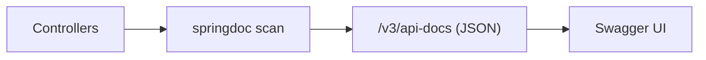
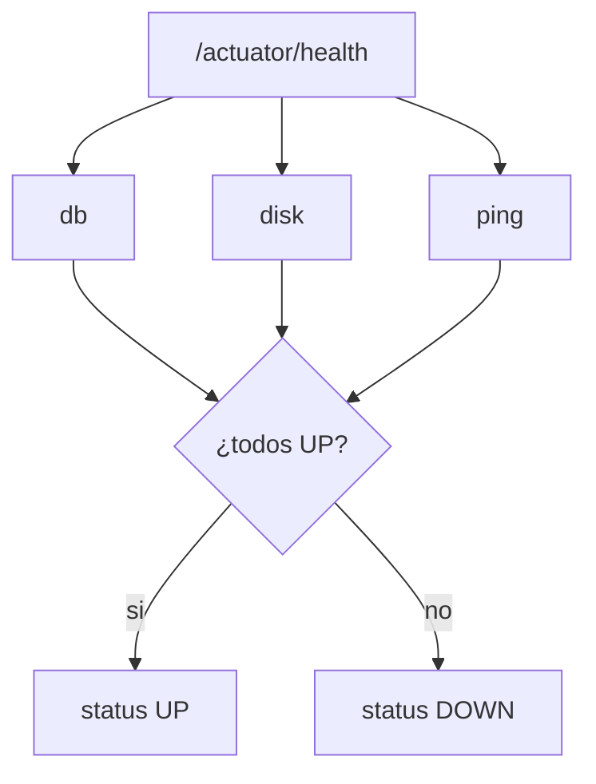
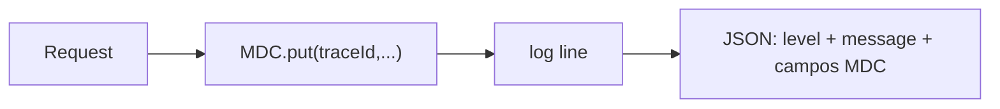
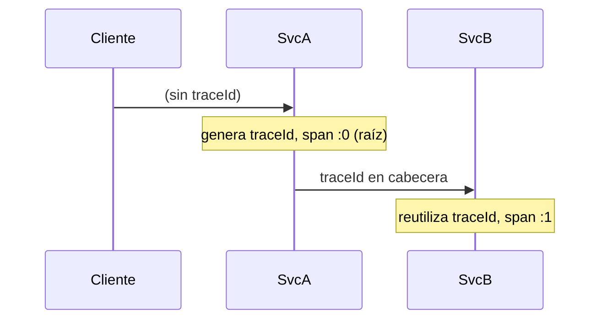

# Bloque XX · Observabilidad y documentación

> Una API sin documentación es un enigma; una API sin observabilidad es una caja
> negra. Documenta lo que ofreces y observa lo que ocurre — porque en producción
> nadie te avisa de que algo se rompió: lo descubres tú, o no lo descubres.

## Cómo usar este documento

Igual que en los bloques anteriores: lee UNA sección → haz SU ejercicio →
vuelve. En este bloque NO levantamos un servidor: modelamos cada pieza de
observabilidad (documento OpenAPI, health agregado, métricas, log JSON, traza)
como **funciones puras** sobre mapas y records. Así entiendes la *lógica* que
Spring/Actuator/Micrometer automatizan, sin el ruido de arrancar la app. Cada
sección cierra con el recuadro **"Lo practicas en…"**.

| Sección | Tema | Ejercicio |
|---|---|---|
| 20.1 | OpenAPI / Swagger: el documento | `Ej177OpenApiSwagger` |
| 20.2 | Anotaciones de documentación (@Operation/@Schema) | `Ej178ApiDocAnnotations` |
| 20.3 | Actuator: health agregado | `Ej179ActuatorEndpoints` |
| 20.4 | Health y métricas propias | `Ej180CustomHealthMetrics` |
| 20.5 | Logging estructurado con MDC | `Ej181StructuredLoggingMdc` |
| 20.6 | Trazas y correlación | `Ej182RequestTracing` |

---

## 20.1 OpenAPI / Swagger con springdoc

Una API REST necesita un **contrato legible**: qué rutas existen, qué métodos
aceptan, qué devuelven. OpenAPI 3 es el estándar de ese contrato (un documento
JSON/YAML), y **springdoc-openapi** lo genera solo escaneando tus controladores:
lo sirve en `/v3/api-docs` (el JSON) y monta una UI navegable en
`/swagger-ui.html`. Dejas de mantener PDFs que envejecen: la documentación vive
en el código y se regenera en cada build.



La estructura del documento es un **árbol**. La raíz tiene tres claves que nos
importan aquí:

```jsonc
{
  "openapi": "3.0.1",              // versión del estándar
  "info":  { "title": "...", "version": "..." },  // metadatos de la API
  "paths": {                       // un nodo por ruta
    "/users": {                    // dentro, un nodo por método HTTP
      "get":  { "summary": "Lista usuarios" },
      "post": { "summary": "Crea usuario" }
    }
  }
}
```

El anidamiento es exactamente `paths → ruta → método (minúsculas) → operación`,
y la operación lleva al menos un `summary`. En el ejercicio lo construimos a mano
con `Map`s anidados a partir de una lista de metadatos de endpoint. Dos detalles
que los tests vigilan:

- El método HTTP se indexa **en minúsculas** (`get`, no `GET`) — es como lo
  escribe OpenAPI.
- Usa un `Map` que **preserve el orden de inserción** (`LinkedHashMap`) para que
  el documento salga determinista; nunca un `Map.of()` inmutable que no puedas
  rellenar.

> **Lo practicas en `Ej177OpenApiSwagger`**: ensamblar un mini documento OpenAPI
> 3 (`openapi`/`info`/`paths`) con mapas anidados a partir de metadatos.

---

## 20.2 Anotaciones de documentación: `@Operation` y `@Schema`

El escaneo automático te da rutas y tipos, pero no *intención*. Para eso anotas:

```java
@Operation(summary = "Crea un usuario", description = "Genera un usuario y lanza evento")
@ApiResponses({
    @ApiResponse(responseCode = "201", description = "Creado exitosamente"),
    @ApiResponse(responseCode = "400", description = "Datos inválidos", content = @Content)
})
@PostMapping
public ResponseEntity<UsuarioDto> crear(@RequestBody UsuarioDto in) { ... }
```

`@Operation(summary=…, description=…)` documenta el endpoint; `@Schema` los
campos del modelo. Lo que practicamos es la **regla de precedencia** del texto
mostrado y la **traducción de tipos Java → tipos OpenAPI**:

| Java | Tipo OpenAPI |
|---|---|
| `String` | `string` |
| `Integer`, `Long`, `int`, `long` | `integer` |
| `Boolean`, `boolean` | `boolean` |
| cualquier otro (`User`, `LocalDate`…) | `object` |

Precedencia de la descripción efectiva: **summary > description > literal por
defecto**. Es decir: si hay `summary` no en blanco, gana; si no, cae a
`description`; si ambas están en blanco, se usa un literal (`"sin descripcion"`).

> **OJO**: "en blanco" no es lo mismo que null. `" "` (solo espacios) cuenta como
> blanco — usa `String.isBlank()`, no `== null` ni `isEmpty()`.

Y un detalle de formato: si el campo es obligatorio, el esquema se anota
anexando `" (required)"` → `"integer (required)"`.

> **Lo practicas en `Ej178ApiDocAnnotations`**: resolver descripción efectiva por
> precedencia y mapear el tipo Java al tipo de esquema OpenAPI.

---

## 20.3 Actuator: el health agregado

Spring Boot Actuator expone endpoints operativos (`/actuator/health`,
`/metrics`, `/info`, `/prometheus`) sin que escribas código:

```yaml
management:
  endpoints:
    web:
      exposure:
        include: health, metrics, prometheus, info
  endpoint:
    health:
      show-details: always   # muestra si la DB está caída o el disco lleno
```

`/actuator/health` no devuelve un sí/no plano: **agrega** el estado de varios
componentes (db, disk, ping, …). La regla de agregación es un **AND estricto**:
el global es `UP` solo si TODOS están `UP`; un solo componente `DOWN` tumba el
conjunto. Es así a propósito — un balanceador que ve `UP` asume que la instancia
sirve TODO; mentir aquí enruta tráfico a una app coja.



En el ejercicio recibimos un `Map<componente, estado>` y devolvemos el agregado.
Tres reglas que los tests exigen:

- Mapa **vacío → `"UNKNOWN"`** (no hay datos: ni UP ni DOWN).
- Comparación **normalizada**: `"up "` (con espacio y minúscula) cuenta como UP →
  hay que `trim()` + `toUpperCase()` antes de comparar con `"UP"`.
- Cualquier valor `null` dentro del mapa → `IllegalArgumentException` (un health
  con un hueco es un bug, no un DOWN silencioso).

> **Lo practicas en `Ej179ActuatorEndpoints`**: agregar estados de componentes
> con AND estricto, normalización y el caso vacío `UNKNOWN`.

---

## 20.4 Health y métricas propias

El health de serie (db, disk) no conoce TU negocio. Para eso implementas un
`HealthIndicator` propio y registras métricas con **Micrometer** (la fachada que
exporta a Prometheus/Grafana). Un patrón clásico: marcar la app `DOWN` cuando la
**tasa de error** supera un umbral.

```java
@Component
class ErrorRateHealthIndicator implements HealthIndicator {
    @Override public Health health() {
        double rate = errores / (double) total;     // contadores acumulados
        return rate > UMBRAL ? Health.down().build() : Health.up().build();
    }
}
```

El ejercicio calcula, como función pura, `errorRate` y `status` a partir de
`total`, `errores` y `umbral`. Lo fino está en los detalles numéricos:

| Caso | Regla |
|---|---|
| `total == 0` | tasa `0.0` (¡evita dividir por cero!) |
| tasa | `errores / total` en **double** (ojo: `errores / total` con longs daría 0) |
| formato | exactamente **4 decimales**, punto decimal → `String.format(Locale.ROOT, "%.4f", x)` |
| status | `DOWN` si `errorRate > umbral`; `UP` si `<=` (el límite exacto es UP) |

> **CUIDADO**: el `Locale.ROOT` no es decorativo. En España el `%.4f` por defecto
> escribe `0,0500` con coma, y el test espera `"0.0500"` con punto. Sin
> `Locale.ROOT` el test falla en tu máquina y pasa en la del profesor.

Validaciones de entrada: `total>=0`, `errores>=0`, `errores<=total`,
`umbral∈[0,1]`; cualquier violación → `IllegalArgumentException`.

> **Lo practicas en `Ej180CustomHealthMetrics`**: tasa de error con división
> segura, formateo `Locale.ROOT` a 4 decimales y umbral de salud.

---

## 20.5 Logging estructurado con MDC

Con 100 peticiones simultáneas, un log de texto plano es inútil: ¿qué línea
pertenece a qué petición? La solución son dos ideas combinadas:

1. **MDC** (Mapped Diagnostic Context, de SLF4J): un mapa por hilo donde metes
   contexto (`traceId`, `userId`) al entrar la petición. Todo log de ese hilo lo
   arrastra automáticamente.
2. **Logging estructurado** (JSON): en vez de una frase, cada log es un objeto
   con campos. Lo parsean ELK/Loki/Datadog y puedes filtrar por `traceId`.



```java
// Salida estructurada (una línea por log):
// {"level":"INFO","message":"Iniciando compra","traceId":"ab3d-19f8"}
// {"level":"INFO","message":"Llamando a pasarela","traceId":"ab3d-19f8"}
// {"level":"INFO","message":"Iniciando compra","traceId":"99fc-bbaa"}  <- otra petición
```

El ejercicio construye esa línea JSON con Jackson a partir de `nivel`, `mensaje`
y el `Map` del MDC. Claves del enunciado:

- Usa un **`LinkedHashMap`** para que `level` y `message` salgan primero y en
  orden estable; luego vuelca el MDC encima.
- El nivel se **normaliza a mayúsculas** (`"info"` entra, `"INFO"` sale).
- Serializa con `new ObjectMapper().writeValueAsString(mapa)`. Esa llamada lanza
  `JsonProcessingException` (checked) → envuélvela en `IllegalStateException`
  (no la tragues, no la declares: es un error interno, no de negocio).

> **CULTURA**: esto es exactamente lo que hacen `logstash-logback-encoder` o el
> structured logging nativo de Spring Boot 3.4+. Aquí lo haces a mano una vez
> para no verlo como magia el resto de tu carrera.

> **Lo practicas en `Ej181StructuredLoggingMdc`**: serializar a JSON con Jackson
> un log con campos MDC, preservando orden y normalizando el nivel.

---

## 20.6 Trazas y correlación de peticiones

Una petición real cruza varios servicios (gateway → pedidos → pagos). Para
seguir su rastro de punta a punta se usa **tracing distribuido**:

- **`traceId`**: identifica la petición COMPLETA. Se genera en el primer servicio
  (la *raíz*) y se **propaga intacto** en una cabecera a cada salto. Todos los
  logs de toda la cadena comparten el mismo traceId → los correlacionas.
- **`spanId`**: identifica UN salto concreto. Es único por servicio/salto.



El ejercicio modela un salto con `propagar(traceIdEntrante, salto)`:

| Situación | Comportamiento |
|---|---|
| `traceIdEntrante` null/blanco | este nodo es el **origen**: genera traceId nuevo (UUID sin guiones) |
| viene un traceId | **reutilízalo** intacto (trim) para correlacionar |
| `spanId` | siempre `traceId + ":" + salto` |
| `raiz` | `true` solo en el origen (sin entrante) |
| `salto < 0` | `IllegalArgumentException` |

> **PISTA**: UUID sin guiones = `UUID.randomUUID().toString().replace("-", "")` →
> 32 caracteres hex, justo lo que mide el test del reto 7.

> **OJO**: la invariante de oro es **nunca devolver un traceId null o vacío**. Una
> traza sin id no correlaciona nada — es peor que no trazar.

> **Lo practicas en `Ej182RequestTracing`**: generar/propagar traceId, derivar
> spanId por salto y marcar la raíz de la traza.

---

## Errores comunes del bloque

| # | Error | Antídoto |
|---|---|---|
| 1 | Indexar el método HTTP en mayúsculas en `paths` | OpenAPI lo quiere en minúsculas: `metodo.toLowerCase()` |
| 2 | Devolver `Map.of()` (inmutable) y luego intentar `put` | Usa `LinkedHashMap` cuando vas a rellenar |
| 3 | Confundir "en blanco" con null o vacío | `isBlank()` cubre `" "`; precedencia summary>description>literal |
| 4 | `errores / total` con dos `long` → siempre 0 | Castea a `double` antes de dividir |
| 5 | `String.format("%.4f", x)` sin `Locale.ROOT` | Locale español mete coma; el test espera punto |
| 6 | Tratar el mapa de health vacío como DOWN | Vacío = `"UNKNOWN"` (no hay datos) |
| 7 | No normalizar el estado antes de comparar (`"up "`) | `trim()` + `toUpperCase()` antes de comparar con `"UP"` |
| 8 | Tragar `JsonProcessingException` o declararla | Envuélvela en `IllegalStateException` |
| 9 | Reordenar las claves del log (HashMap) | `LinkedHashMap`: level y message primero |
| 10 | Generar un traceId distinto aunque venga uno entrante | Si llega traceId, reutilízalo; solo el origen lo crea |

## Chuleta final del bloque

```
OpenAPI    = openapi + info{title,version} + paths{ruta{metodo↓{summary}}}
springdoc  = escanea controllers → /v3/api-docs (JSON) + /swagger-ui.html
@Operation = summary > description > "sin descripcion"  (isBlank, no null)
tipo→schema= String→string · Integer/Long/int/long→integer · boolean→boolean · resto→object
health     = AND estricto: todos UP→UP · alguno no-UP→DOWN · vacío→UNKNOWN
            normaliza: trim()+toUpperCase() ; valor null → IllegalArgumentException
métricas   = errorRate = errores/(double)total ; total==0 → 0.0
            String.format(Locale.ROOT,"%.4f",r) ; DOWN si r>umbral
MDC+JSON   = LinkedHashMap{level↑, message, ...mdc} → ObjectMapper.writeValueAsString
            JsonProcessingException → IllegalStateException
tracing    = traceId propagado intacto · spanId = traceId+":"+salto
            origen (sin entrante) genera UUID sin guiones (32 chars) y raiz=true
```

## Autoevaluación (responde sin mirar; si fallas 2+, relee la sección)

1. ¿Cuál es el anidamiento exacto de un documento OpenAPI bajo `paths`, y en qué
   caja (mayúsculas/minúsculas) va el método HTTP? *(20.1)*
2. Si `@Operation` tiene `summary` en blanco pero `description` con texto, ¿qué
   se muestra? ¿Y si ambas están en blanco? *(20.2)*
3. ¿A qué tipo OpenAPI mapean `long` y `User` respectivamente? *(20.2)*
4. ¿Por qué un mapa de health vacío devuelve `UNKNOWN` y no `DOWN`? ¿Qué pasa con
   un componente cuyo valor es null? *(20.3)*
5. ¿Por qué `errores / total` puede dar 0 aunque haya errores, y cómo se evita?
   ¿Qué papel juega `Locale.ROOT`? *(20.4)*
6. ¿Para qué sirve un `LinkedHashMap` al construir el log JSON, y qué excepción
   lanza `writeValueAsString`? *(20.5)*
7. ¿Cuándo un nodo es la raíz de la traza y qué hace con el traceId? ¿Cómo se
   construye el spanId? *(20.6)*
8. ¿Cuántos caracteres tiene un UUID sin guiones y cómo lo generas en una línea?
   *(20.6)*
