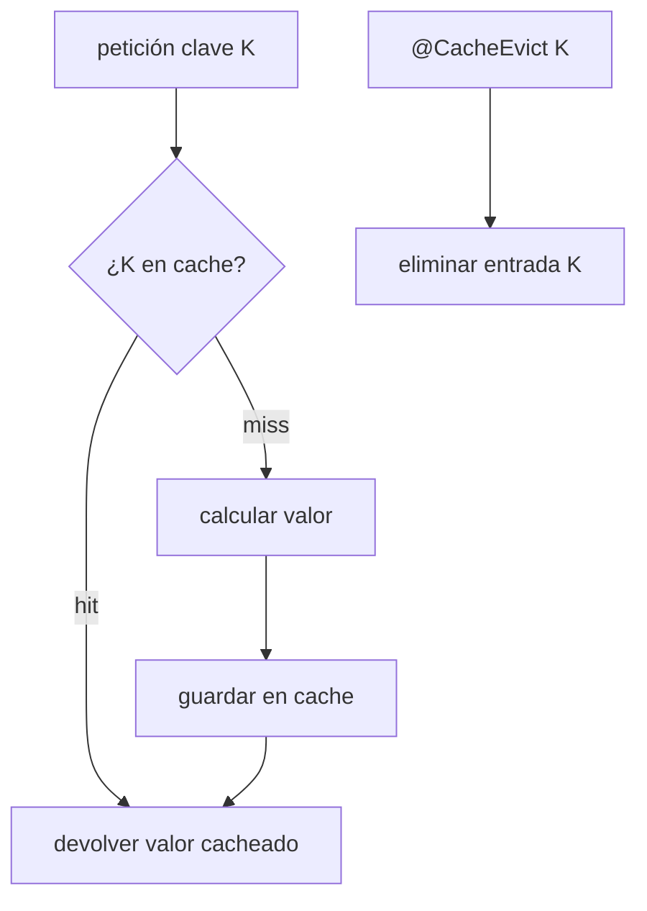
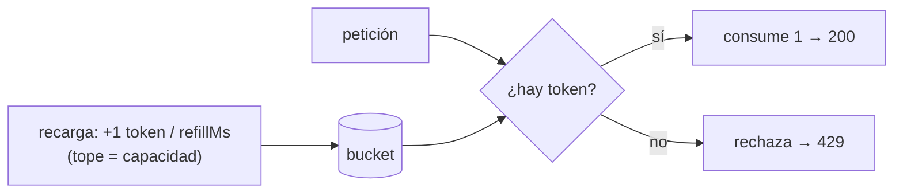
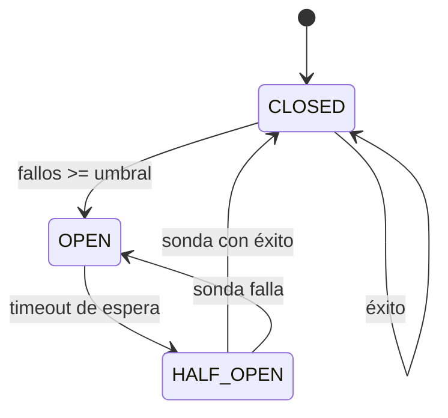
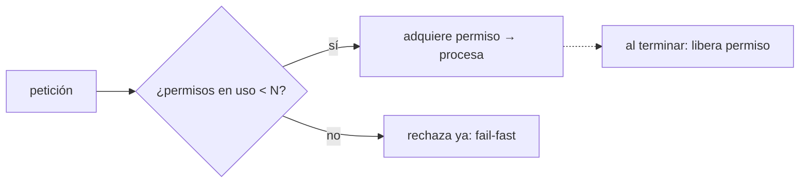
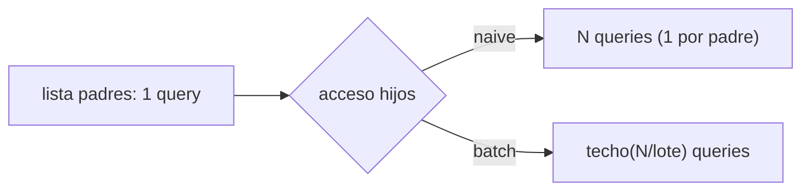

# Bloque XXI · Rendimiento y resiliencia

> Una API rápida que se cae no sirve; una API resiliente que es lenta tampoco.
> El objetivo es ser veloz bajo carga y seguir en pie cuando algo falla.

## Cómo usar este documento

Igual que en los bloques anteriores: lee UNA sección → haz SU ejercicio →
vuelve. Cada sección cierra con el recuadro **"Lo practicas en…"**. Aviso de
honestidad sobre este bloque: en producción casi nada de esto se escribe a mano
(Spring Cache, Resilience4j y Bucket4j lo resuelven con anotaciones). Aquí lo
modelamos como **lógica pura y determinista** —arrays de estado, contadores,
comparaciones de instantes— para que entiendas QUÉ hace la anotación por dentro
antes de delegar en ella. Cada ejercicio es el "motor" que esas librerías
esconden.

| Sección | Tema | Ejercicio |
|---|---|---|
| 21.1 | Caché: get-or-compute y evict | `Ej183SpringCacheAbstraction` |
| 21.2 | Endpoints asíncronos con CompletableFuture | `Ej184AsyncEndpoints` |
| 21.3 | Rate limiting (token bucket) | `Ej185RateLimiting` |
| 21.4 | Reintentos y circuit breaker | `Ej186RetryAndCircuitBreaker` |
| 21.5 | Timeouts y bulkhead | `Ej187TimeoutsAndBulkhead` |
| 21.6 | Problema N+1 y tuning de consultas | `Ej188NPlusOneAndQueryTuning` |

---

## 21.1 Caché: get-or-compute y evict

Una caché cambia tiempo de cómputo por memoria: la primera vez calculas y
**guardas**; las siguientes **lees**. El patrón central es **get-or-compute**:
si la clave ya está (un *hit*), devuelves lo guardado y NO ejecutas el cálculo
costoso; si no está (un *miss*), calculas UNA vez, guardas y devuelves.



En Spring esto son dos anotaciones sobre un método:

```java
@Cacheable(value = "tarifas", key = "#codigoPais")
public TarifaDto calcularTarifa(String codigoPais) {
    return calculoPesado(codigoPais);   // solo se ejecuta en el MISS
}

@CacheEvict(value = "tarifas", key = "#codigoPais")
public void invalidar(String codigoPais) { /* vacía esa entrada */ }
```

La demostración de que la caché funciona es **contar las invocaciones reales**
al cálculo: con dos llamadas a la misma clave, el cálculo debe ejecutarse una
sola vez. Por eso el ejercicio recibe un `int[] contador` de un elemento que se
incrementa SOLO en el miss: si tras dos lecturas vale 1, la caché ahorró trabajo.

Sobre el `evict`: invalidar una clave hace que el siguiente acceso vuelva a ser
un miss. Es **selectivo** (borra una clave, no toda la caché) e **idempotente**
(invalidar dos veces deja el mismo estado; la segunda devuelve `false` porque ya
no había nada). En `Map` esto es `containsKey`, `get`, `put`, `remove`, `clear`,
`size`, `isEmpty`, `keySet`, `putAll` — el ejercicio te hace recorrer todo ese
API porque una caché en memoria NO es más que un `Map` bien gestionado.

> **Lo practicas en `Ej183SpringCacheAbstraction`**: get-or-compute contando
> cálculos reales, evict selectivo e idempotente, y el API completo de `Map`.

---

## 21.2 Endpoints asíncronos con `CompletableFuture`

Si un endpoint tiene que llamar a tres servicios que tardan 100 ms cada uno,
hacerlo en serie son 300 ms; lanzarlos en paralelo y esperar al último son
~100 ms. `CompletableFuture` es la herramienta del JDK para ese trabajo
asíncrono **componible**, sin bloquear el hilo de petición. En Spring se
combina con `@Async`, pero el motor es el mismo `CompletableFuture` que ya viste
en el bloque 1.

El kit que usa este ejercicio:

| Método | Qué hace | Se lee como |
|---|---|---|
| `supplyAsync(sup)` | Lanza el `Supplier` en otro hilo | "empieza a calcular" |
| `completedFuture(v)` | Future YA terminado con valor `v` | "ya está listo" |
| `failedFuture(ex)` | Future YA fallido con la excepción | "ya falló" |
| `thenApply(f)` | Transforma el resultado (como `map`) | "y luego transforma" |
| `thenCombine(o, f)` | Junta DOS futures cuando ambos acaban | "cuando los dos estén" |
| `allOf(...)` | Espera a que TODOS terminen | "barrera: todos" |
| `anyOf(...)` | Completa con el PRIMERO que termine | "el más rápido gana" |
| `join()` | Espera y devuelve el resultado | "dame ya el valor" |
| `getNow(default)` | Valor si ya está, o el default | "sin esperar" |
| `exceptionally(f)` | Fallback si el future falló | "plan B ante error" |

El patrón de "lanzar N y sumar" usa `allOf` como barrera y luego recoge cada
resultado con `join` (que ya no bloquea de verdad porque todos terminaron):

```java
List<CompletableFuture<Integer>> fs = entradas.stream()
        .map(e -> CompletableFuture.supplyAsync(() -> tarea.apply(e)))
        .toList();
CompletableFuture.allOf(fs.toArray(new CompletableFuture[0])).join();
int suma = fs.stream().mapToInt(CompletableFuture::join).sum();
```

Y el de "encadenar pasos" es `thenApply` tras `thenApply`: el orden importa,
`paso2` siempre recibe la salida de `paso1`. Un solo `join()` al final.

> **Lo practicas en `Ej184AsyncEndpoints`**: paralelizar con `allOf`+`join`,
> encadenar con `thenApply`, combinar con `thenCombine`/`anyOf`, y dar fallback
> con `exceptionally`/`getNow`.

---

## 21.3 Rate limiting (token bucket)

Limitar peticiones protege la API de abusos (scraping, DDoS) y reparte la
capacidad. El algoritmo estándar es el **token bucket**: un cubo con capacidad
máxima `C` que se **recarga** 1 token cada `refillMs`. Cada petición consume 1
token; si el cubo está vacío, se rechaza con **HTTP 429 Too Many Requests**.



Lo modelamos como función **pura**: el estado es un `long[2]` con
`[tokensDisponibles, ultimaRecargaMs]` que se actualiza in-place, y le pasas el
instante `ahora`. La lógica de recarga **perezosa** (no hay hilo de fondo; se
recalcula al consultar):

```java
long transcurrido     = ahora - estado[1];          // ms desde la última recarga
long tokensARecargar  = transcurrido / refillMs;     // división ENTERA
if (tokensARecargar > 0) {
    estado[0] = Math.min(estado[0] + tokensARecargar, capacidad);  // cap al tope
    estado[1] += tokensARecargar * refillMs;          // avanza SOLO lo consumido
}
```

Dos trampas que castigan los tests:

- **División entera**: con `refillMs = 1000` y `transcurrido = 1000` recargas 1
  token (no 1.0); el test `recargaConElTiempo` espera que en `ahora = 1000`
  haya exactamente 1 token nuevo.
- **Avanzar `estado[1]` solo por los ms consumidos** (`tokensARecargar*refillMs`),
  no a `ahora` a secas: si avanzaras a `ahora`, perderías el resto de tiempo y
  acumularías error. Y `ahora < estado[1]` (reloj hacia atrás) es inválido →
  `IllegalArgumentException`.

> **Lo practicas en `Ej185RateLimiting`**: recarga perezosa con división
> entera, cap a capacidad, consumo de un token y rechazo cuando el cubo está
> vacío.

---

## 21.4 Reintentos y circuit breaker

Dos patrones complementarios contra fallos de servicios externos.

**Reintentos**: un fallo puede ser transitorio (un *timeout* de red puntual).
Reintentar hasta `maxIntentos` veces absorbe esos baches; si todos fallan, se
propaga el último error. Cuenta cada intento REALMENTE ejecutado:

```java
RuntimeException ultimoFallo = null;
for (int intento = 1; intento <= maxIntentos; intento++) {
    contador[0]++;                       // intento real
    try { return accion.get(); }         // éxito → sale ya
    catch (RuntimeException e) { ultimoFallo = e; }   // guarda y sigue
}
throw ultimoFallo;                        // agotados → relanza el último
```

(En producción entre intentos iría un *backoff* exponencial; aquí lo omitimos
para que el test sea determinista.)

**Circuit breaker**: si un servicio está caído, seguir llamándolo es tirar
tiempo y empeorar la avalancha. El breaker es una máquina de 3 estados:



| Estado | Significa | Transición |
|---|---|---|
| `CLOSED` | Todo normal, pasan las llamadas | éxito → CLOSED · fallo y `fallos>=umbral` → OPEN |
| `OPEN` | Cortado, no se llama | (tras timeout) → HALF_OPEN |
| `HALF_OPEN` | Sonda de prueba | éxito → CLOSED · fallo → OPEN |

La función `transicion` es un `switch`/`if` sobre `(estadoActual, exito, fallos,
umbral)` que devuelve el nuevo estado. Estado no reconocido o `umbral<=0` →
`IllegalArgumentException`. Fíjate en el test: `("CLOSED", false, 3, 3)` → OPEN
(fallos alcanzan el umbral), y desde `OPEN` con cualquier entrada → HALF_OPEN
(se asume que tocó el timeout de sonda).

> **Lo practicas en `Ej186RetryAndCircuitBreaker`**: bucle de reintentos que
> cuenta intentos y propaga el último fallo, y la máquina de estados completa
> del circuit breaker.

---

## 21.5 Timeouts y bulkhead

**Timeout**: ninguna operación puede tardar para siempre; se le da un
presupuesto y, si lo excede, se cancela. Lo modelamos comparando instantes (sin
`sleep` reales): la operación cumple si `inicio + duracion <= inicio + timeout`.
El límite es `<=` (si tarda EXACTAMENTE el timeout, cumple). El test:
`dentroDeTimeout(0, 100, 100)` → true; `(0, 150, 100)` → false.

**Bulkhead** (mamparo): como los compartimentos estancos de un barco, aísla
recursos para que un fallo no hunda todo. Se implementa con un **semáforo** de
`N` permisos: cada operación toma uno; si no quedan, se **rechaza al instante**
(*fail-fast*, no se encola). Así una dependencia lenta consume como mucho `N`
hilos y deja libres los demás para el resto de la API.



El estado es un `long[1]` con los permisos en uso. `adquirir` incrementa si hay
hueco y devuelve `true`; si `estado[0] == maxPermisos` no toca nada y devuelve
`false`. Nunca dejes `estado[0]` por encima de `maxPermisos`.

> **Lo practicas en `Ej187TimeoutsAndBulkhead`**: decisión de timeout por
> comparación de instantes y semáforo de bulkhead con adquisición fail-fast.

---

## 21.6 Problema N+1 y tuning de consultas

El bug de rendimiento nº 1 con ORMs. Cargas una lista de N padres (1 consulta) y
luego, al acceder a los hijos de cada uno en modo *lazy*, se dispara **1
consulta por padre**: total `1 + N`. Con 1000 pedidos son 1001 viajes a la BD.



La solución es **batch fetch**: cargar los hijos por lotes con un `IN (...)`, de
modo que el coste cae a `1 + techo(N / tamañoLote)`. En JPA esto se consigue con
`JOIN FETCH`, `@EntityGraph` o `@BatchSize` (lo viste en el bloque 14).

La aritmética clave es el **techo de una división entera** sin usar `Math.ceil`
(que es de coma flotante):

```java
int lotes = (n + tamanoLote - 1) / tamanoLote;   // techo(n/tamanoLote)
int total = 1 + lotes;                            // 1 (padres) + lotes (hijos)
```

Comprueba con el test: N=5, lote=2 → `(5+1)/2 = 3` lotes → total `4`. Con
lote=10 (>= N) → 1 lote → total `2`. Y lista vacía → solo la consulta de padres
= 1 (en ambos métodos: `1 + techo(0/lote) = 1`).

> **Lo practicas en `Ej188NPlusOneAndQueryTuning`**: contar el coste `1+N` del
> acceso ingenuo y el `1+techo(N/lote)` del batch, con el techo entero correcto.

---

## Errores comunes del bloque

| # | Error | Antídoto |
|---|---|---|
| 1 | Incrementar el contador de caché también en el *hit* | Solo en el MISS: el test exige `1` tras dos lecturas |
| 2 | Mutar un `Map.of(...)` (inmutable) | Los tests pasan `new HashMap<>()` cuando vas a escribir; respeta cuál recibes |
| 3 | `join()` antes de `allOf` (bloquea en serie) | Lanza todos, `allOf().join()` como barrera, luego recoge cada `join()` |
| 4 | `orElse(s.get())` donde piden lazy | `exceptionally`/`getNow`: el fallback solo cuando hace falta |
| 5 | Recarga del bucket con división de coma flotante | División ENTERA `transcurrido / refillMs` |
| 6 | Avanzar `estado[1]` a `ahora` en el token bucket | Avanza solo `tokensARecargar*refillMs` (no pierdas el resto) |
| 7 | No contar el intento que tuvo éxito en los reintentos | Incrementa `contador[0]` ANTES del `accion.get()` |
| 8 | Perder la causa al agotar reintentos | Guarda `ultimoFallo` y relánzalo |
| 9 | `<` en lugar de `<=` en el timeout | Tardar EXACTO el presupuesto cumple (`<=`) |
| 10 | Techo con `Math.ceil` y casts | `(n + lote - 1) / lote` con enteros |

## Chuleta final del bloque

```
Cache       = get-or-compute · contar SOLO el miss · evict selectivo e idempotente
CompletableF = supplyAsync lanza · thenApply transforma · thenCombine junta dos
               allOf barrera (todos) · anyOf el primero · exceptionally/getNow fallback
TokenBucket = recarga perezosa: (ahora-ult)/refillMs · cap a capacidad · sin token → 429
Retry       = bucle 1..max · cuenta cada intento · agotado relanza el último fallo
Breaker     = CLOSED -(fallos>=umbral)-> OPEN -(timeout)-> HALF_OPEN -(éxito)-> CLOSED
Timeout     = inicio+duracion <= inicio+timeout (<=, no <)
Bulkhead    = semáforo de N permisos · saturado → fail-fast (rechaza ya)
N+1         = naive 1+N · batch 1+techo(N/lote) · techo = (n+lote-1)/lote
```

## Autoevaluación (responde sin mirar; si fallas 2+, relee la sección)

1. ¿Por qué el contador de cálculos de la caché solo se incrementa en el miss, y
   qué demuestra que tras dos lecturas valga 1? *(21.1)*
2. ¿Qué diferencia hay entre `thenApply` y `thenCombine`? ¿Y entre `allOf` y
   `anyOf`? *(21.2)*
3. En el token bucket, ¿por qué la recarga usa división entera y por qué
   `estado[1]` avanza solo `tokensARecargar*refillMs` y no hasta `ahora`? *(21.3)*
4. ¿En qué momento incrementas el contador de reintentos y qué relanzas si se
   agotan? *(21.4)*
5. Dibuja las transiciones del circuit breaker desde cada estado. ¿Qué pasa en
   `OPEN`? *(21.4)*
6. ¿Por qué el límite del timeout es `<=` y no `<`? *(21.5)*
7. ¿Qué significa "fail-fast" en el bulkhead y por qué protege al resto del
   sistema? *(21.5)*
8. ¿Cuál es la fórmula del coste naive y del optimizado en el N+1, y cómo se
   calcula el techo entero sin coma flotante? *(21.6)*
