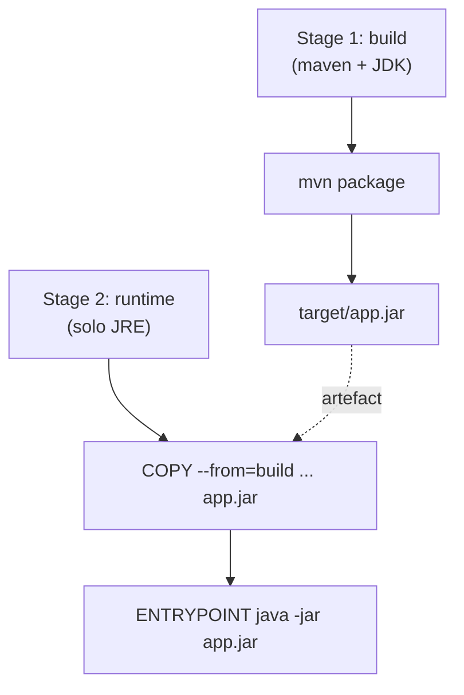
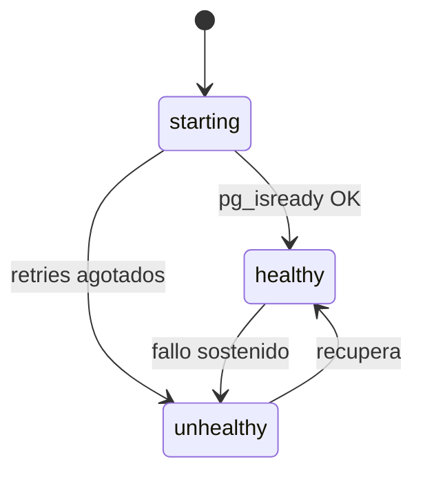
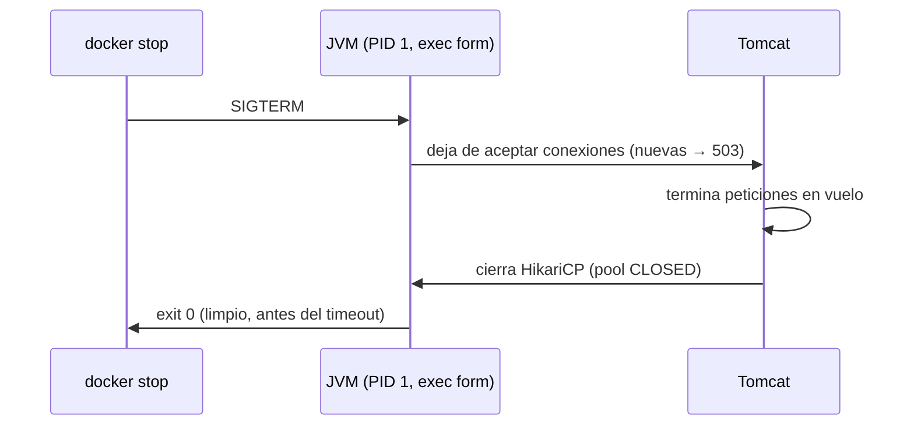
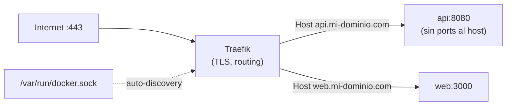

# Bloque XXII · Docker y despliegue

> Tu API no vive en el IDE: vive en un contenedor, junto a su base de datos,
> detrás de un proxy, arrancada por un orquestador que la mata y la resucita
> sin avisar. Empaquetarla ligera, segura y obediente a las señales del SO es
> la diferencia entre "funciona en mi máquina" y "funciona en producción".

## Cómo usar este documento

Igual que en los bloques anteriores: lee UNA sección → haz SU ejercicio →
vuelve. En este bloque los ejercicios NO levantan Docker de verdad: modelan
las reglas del despliegue como **lógica pura** (parsear, validar, generar
texto). Aprendes el contrato de Docker/Compose/Spring sin necesitar el demonio
instalado, y cada pista de los retos cuadra con lo que comprueba su test.

| Sección | Tema | Ejercicio |
|---|---|---|
| 22.1 | Dockerfile multi-stage y seguridad de imagen | `Ej189Dockerfile` |
| 22.2 | Docker Compose: servicios, redes y volúmenes | `Ej190DockerComposeStack` |
| 22.3 | Healthchecks y `depends_on` con condición | `Ej191HealthcheckAndDepends` |
| 22.4 | Configuración por entorno (12-Factor) | `Ej192ConfigByEnvironment` |
| 22.5 | Apagado ordenado (graceful shutdown) | `Ej193GracefulShutdown` |
| 22.6 | Reverse proxy con Traefik | `Ej194ReverseProxyTraefik` |

---

## 22.1 Dockerfile multi-stage: compilar en una imagen, ejecutar en otra

Un `Dockerfile` describe, instrucción a instrucción, cómo construir una imagen.
El antipatrón del principiante es usar UNA sola imagen `maven:...` para compilar
Y ejecutar: el resultado pesa 800 MB, arrastra el JDK completo, Maven, tu código
fuente y un historial de capas que un atacante puede inspeccionar.

El patrón **multi-stage** parte el build en dos *stages*. El primero (con
Maven/JDK) compila el JAR; el segundo (solo JRE) lo copia y nada más. La imagen
final pesa una fracción y no contiene ni el compilador ni el código fuente.

```dockerfile
# Stage 1: BUILD — tiene Maven y el JDK completo
FROM maven:3.9-eclipse-temurin-21 AS build
WORKDIR /app
COPY pom.xml .
RUN mvn dependency:go-offline          # capa cacheada: solo cambia si cambia pom.xml
COPY src ./src
RUN mvn -q -DskipTests package

# Stage 2: RUNTIME — solo el JRE, mínimo
FROM eclipse-temurin:21-jre-alpine
WORKDIR /app
RUN addgroup -S spring && adduser -S spring -G spring   # usuario sin privilegios
USER spring:spring                                       # dejamos de ser root
COPY --from=build /app/target/*.jar app.jar             # SOLO el artefacto
EXPOSE 8080
ENTRYPOINT ["java","-jar","app.jar"]                     # exec form (ver 22.5)
```



Las cuatro invariantes de seguridad/tamaño que este bloque te hace verificar:

| Invariante | Por qué importa | Cómo se detecta |
|---|---|---|
| **2+ directivas `FROM`** | Multi-stage real (build separado del runtime) | Contar líneas `FROM` |
| **`USER` no-root** | Si te comprometen, no eres root del contenedor | `USER` cuyo valor no sea `root` ni `0` |
| **`COPY --from=`** | Se reaprovecha el artefacto del builder, no se recompila | Buscar `--from=` |
| **`ENTRYPOINT` en exec form** | Propaga SIGTERM a la JVM (conecta con 22.5) | La línea empieza por `[` (array JSON) |

Y dos cosas que NO debe haber en el stage final: ninguna línea que ejecute `mvn`
(no se compila en runtime) y el `FROM` final no puede ser la imagen del builder.

**Formato de una imagen** — `nombre:tag`. Sin tag (`maven` a secas) Docker
asume `:latest`, que es no-determinista: la build de hoy y la de mañana pueden
diferir. En producción se fija siempre el tag.

> **Lo practicas en `Ej189Dockerfile`**: generar las líneas de un Dockerfile
> multi-stage como función pura y verificar sus invariantes de seguridad
> (multi-stage, usuario no-root, exec form, sin `mvn` en runtime).

---

## 22.2 Docker Compose: orquestar la API con su base de datos

Una API sola no sirve: necesita su PostgreSQL, quizá un Redis, quizá el proxy.
`docker-compose.yml` declara todos esos **servicios** y cómo se relacionan, para
levantarlos con un solo `docker compose up -d`.

```yaml
services:
  db:
    image: postgres:15-alpine
    environment:
      POSTGRES_USER: admin
      POSTGRES_PASSWORD: ${DB_PASS}      # inyectada, NO escrita en claro (ver 22.4)
      POSTGRES_DB: app
    volumes:
      - pgdata:/var/lib/postgresql/data  # persistencia: la BD sobrevive al contenedor

  api:
    build: .                             # construye desde el Dockerfile local
    ports:
      - "8080:8080"                      # "HOST:CONTENEDOR"
    environment:
      SPRING_DATASOURCE_URL: jdbc:postgresql://db:5432/app   # 'db' = nombre del servicio
    depends_on:
      db:
        condition: service_healthy       # arranca la API solo cuando db esté sana (22.3)

volumes:
  pgdata:
```

Tres conceptos que el ejercicio valida pieza a pieza:

- **Redes.** Compose crea una red `bridge` por defecto y conecta a ella todos
  los servicios. Dentro de esa red, el nombre del servicio (`db`) es un nombre
  DNS: la API conecta a `jdbc:postgresql://db:5432/...`, no a una IP. El driver
  `bridge` es una red privada; `overlay` es para clusters multi-host (Swarm).
- **Volúmenes.** `./data:/ruta/contenedor` mapea una carpeta del host a una del
  contenedor (formato `HOST:CONTENEDOR`, parte izquierda = local). Sin volumen,
  los datos de Postgres mueren con el contenedor.
- **Puertos.** `"8080:8080"` mapea `HOST:CONTENEDOR`. Solo los servicios con
  `ports` quedan expuestos al host; los demás solo se ven dentro de la red.

**Nombres de servicio**: alfanuméricos, guion `-` y guion bajo `_`. Nada de
espacios ni puntos (el punto se confunde con jerarquía YAML/DNS).

**Versiones de Compose**: la rama moderna es la **v3** (`3`, `3.8`…). La v2 es
legacy. (El campo `version:` está hoy obsoleto en Compose v2 CLI, pero el
ejercicio te hace validar el número porque sigues encontrándolo en ficheros
reales.)

> **Lo practicas en `Ej190DockerComposeStack`**: validar versión, nombres de
> servicio, mapeos de puerto/volumen, generar variables de entorno YAML y
> detectar servicios dentro de un YAML.

---

## 22.3 Healthchecks y `depends_on`: arrancar en el orden correcto

`depends_on` a secas solo garantiza que el contenedor `db` **arranque** antes
que `api`. Pero "el contenedor arrancó" ≠ "Postgres acepta conexiones": el
puerto 5432 se abre microsegundos antes de que el motor termine de inicializar.
Si la API conecta en esa ventana, explota con *connection refused*.

La solución es un **healthcheck**: un comando que Compose ejecuta
periódicamente para decidir si el servicio está `healthy`.

```yaml
db:
  image: postgres:15-alpine
  healthcheck:
    test: ["CMD-SHELL", "pg_isready -U admin"]   # pregunta al MOTOR, no al puerto
    interval: 5s        # cada cuánto se ejecuta
    timeout: 3s         # cuánto espera la respuesta
    retries: 5          # fallos seguidos antes de marcar 'unhealthy'

api:
  depends_on:
    db:
      condition: service_healthy   # espera el estado 'healthy', no solo el arranque
```

`pg_isready` es la herramienta nativa de Postgres que confirma que el motor
acepta conexiones — un ping TCP a `host:5432` solo confirma que el puerto está
abierto, que no es lo mismo.

**Estados de salud de un contenedor**: `starting` (aún en el periodo de
gracia), `healthy`, `unhealthy`, `none` (sin healthcheck). El formato de los
tiempos Docker usa sufijo de unidad: `s` (segundos), `m` (minutos), `h` (horas)
— `5s`, `10m`. `500ms` y números pelados no son válidos en este contexto.

La propia API también puede tener healthcheck, apuntando al endpoint de Spring
Boot Actuator `http://localhost:8080/actuator/health` (visto en el bloque 20).



> **Lo practicas en `Ej191HealthcheckAndDepends`**: validar comandos
> `pg_isready`, formatos de tiempo, generar el bloque `depends_on` con
> condición, validar estados/puertos y la lógica de reintentos.

---

## 22.4 Configuración por entorno: la regla de oro 12-Factor

**Nunca subas credenciales a Git.** La metodología *12-Factor App* dicta que la
configuración (URLs, contraseñas, secretos) se inyecta desde el **entorno**, no
se escribe en el código ni en `application.yml`.

Spring Boot tiene dos mecanismos clave:

**1. Placeholders con fallback** — `${VAR:valorPorDefecto}`:

```yaml
spring:
  datasource:
    url: ${DB_URL:jdbc:postgresql://localhost:5432/app}   # usa DB_URL, o el local
    password: ${DB_PASSWORD:}                              # sin default → vacío
```

En local funciona con el valor por defecto; en Docker/producción inyectas
`DB_URL` y sobreescribe. Si el placeholder no se resuelve y no hay default,
Spring falla al arrancar (mejor un fallo claro que una contraseña en blanco).

**2. Relaxed binding** — Spring mapea una variable de entorno en `MAYÚSCULAS`
con guiones bajos a una propiedad en `camelCase`/`kebab`:

```
SPRING_DATASOURCE_PASSWORD   →   spring.datasource.password
APP_JWT_SECRET               →   app.jwtSecret   (con @ConfigurationProperties(prefix="app"))
```

Por eso una variable de entorno POSIX válida es **todo mayúsculas, dígitos y
guion bajo** (`SPRING_DATASOURCE_URL`); ni minúsculas ni guiones medios.

Buenas prácticas que el ejercicio convierte en validaciones:

- Detectar propiedades **sensibles** (las que contienen `password`, `secret`,
  `token`, `key`…) para enmascararlas en logs.
- Un **secreto JWT** debe medir al menos 32 caracteres (256 bits) para HMAC-256.
- `SPRING_PROFILES_ACTIVE=prod,security` activa perfiles separados por coma;
  comprobar si un perfil está activo = partir por `,` y buscar.

> **Lo practicas en `Ej192ConfigByEnvironment`**: detectar secretos, parsear
> fallbacks `${VAR:def}`, convertir `ENV_VAR` a camelCase, validar nombres
> POSIX, perfiles activos y sobreescritura inmutable de propiedades.

---

## 22.5 Apagado ordenado: no cuelgues a quien ya está dentro

Cuando haces `docker stop` (o Kubernetes recicla un Pod), el contenedor recibe
**SIGTERM**. Una API bien hecha debe, ante esa señal: (1) dejar de aceptar
peticiones nuevas — devolviendo `503` a los balanceadores — y (2) terminar de
procesar las que ya están en vuelo, antes de cerrar.

```yaml
server:
  shutdown: graceful                       # Tomcat espera a las peticiones en curso
spring:
  lifecycle:
    timeout-per-shutdown-phase: 20s         # plazo máximo antes del corte forzado
```

**El detalle que mata silenciosamente**: para que la JVM RECIBA el SIGTERM, el
`ENTRYPOINT` debe estar en **exec form** (array JSON):

```dockerfile
ENTRYPOINT ["java","-jar","app.jar"]    # ✔ exec form: java ES el PID 1, recibe SIGTERM
ENTRYPOINT java -jar app.jar            # �’ shell form: PID 1 es /bin/sh; se traga la señal
```

En *shell form*, el PID 1 es un shell que NO reenvía SIGTERM a la JVM. Tras el
plazo de gracia del demonio Docker, llega un `SIGKILL` (kill -9): muerte súbita,
peticiones cortadas a media respuesta, pool de conexiones sin cerrar.



Encaja con un **preStop hook** de Kubernetes (`sleep 15`) que da margen al proxy
para dejar de enrutar tráfico antes de que la app empiece a cerrar.

> **Lo practicas en `Ej193GracefulShutdown`**: detectar `graceful`, parsear el
> timeout a segundos, verificar exec form, simular el `503` durante el cierre,
> el estado `CLOSED` de HikariCP y generar logs de apagado.

---

## 22.6 Reverse proxy con Traefik: la única puerta al exterior

En producción tu contenedor Spring Boot **no** se expone directo a internet: no
gestiona certificados SSL ni balanceo. Delante se sitúa un **reverse proxy**
como Traefik, que es la única puerta de entrada (puertos `80` y `443`), termina
el TLS, renueva certificados con Let's Encrypt y enruta a los contenedores
internos por nombre de dominio.

Traefik se autoconfigura leyendo **labels** de los contenedores (auto-discovery
vía el socket de Docker `/var/run/docker.sock`, o el named pipe
`\\.\pipe\docker_engine` en Windows):

```yaml
api:
  # OJO: sin 'ports' — la API NO se expone al host; solo Traefik la alcanza
  labels:
    - "traefik.enable=true"
    - "traefik.http.routers.api.rule=Host(`api.mi-dominio.com`)"
    - "traefik.http.routers.api.tls=true"
    - "traefik.http.routers.api.tls.certresolver=letsencrypt"
    - "traefik.http.services.api.loadbalancer.server.port=8080"
```

Piezas que el ejercicio te hace validar/generar:

- **Regla de host**: `Host(\`api.mi-dominio.com\`)` — el dominio va entre
  **backticks**, no comillas (es sintaxis de Traefik); sin ellos no matchea.
- **Label de puerto de servicio**:
  `traefik.http.services.<n>.loadbalancer.server.port` con un valor numérico —
  le dice a Traefik a qué puerto INTERNO hablar.
- **Redirección HTTP→HTTPS** vía middleware:
  `traefik.http.routers.api-http.middlewares=redirect-to-https`.
- **certresolver**: nombre alfanumérico (`letsencrypt`) — sin espacios.



> **Lo practicas en `Ej194ReverseProxyTraefik`**: validar puertos del proxy,
> rutas de socket, labels (`enable`, `tls`, puerto de servicio), generar y
> extraer reglas `Host(...)`, redirecciones y labels CORS.

---

## Errores comunes del bloque

| # | Error | Antídoto |
|---|---|---|
| 1 | Imagen única `maven` para build+run (800 MB) | Multi-stage: `FROM ... AS build` + `FROM ...jre` |
| 2 | Correr el contenedor como root | `RUN adduser` + `USER appuser`; `0`/`root` = inseguro |
| 3 | `ENTRYPOINT java -jar app.jar` (shell form) | Exec form `["java","-jar","app.jar"]` o no llega SIGTERM |
| 4 | `depends_on: [db]` sin condición | `condition: service_healthy` + healthcheck con `pg_isready` |
| 5 | Healthcheck con ping TCP al 5432 | `pg_isready` pregunta al motor, no al puerto |
| 6 | Tiempo `500ms` o número pelado en healthcheck | Sufijo `s`/`m`/`h`: `5s`, `3m` |
| 7 | Contraseña en `application.yml` subida a Git | `${DB_PASSWORD:}` inyectada por entorno (12-Factor) |
| 8 | Variable de entorno con minúsculas o `-` | POSIX: MAYÚSCULAS, dígitos y `_` |
| 9 | `Host(api.com)` sin backticks | Traefik exige `Host(\`api.com\`)` |
| 10 | API con `ports` expuesta junto a Traefik | Quita `ports`; solo el proxy mira al exterior |

## Chuleta final del bloque

```
Multi-stage  = FROM build AS build → mvn package · FROM jre → COPY --from=build
Imagen segura= 2x FROM · USER no-root (no 0/root) · COPY --from= · ENTRYPOINT [exec]
Compose      = services + image/build + ports "HOST:CONT" + volumes + red bridge
Healthcheck  = test pg_isready · interval/timeout (Ns/Nm) · retries · service_healthy
12-Factor    = ${VAR:default} · relaxed binding ENV_VAR→camelCase · secretos por entorno
Graceful     = server.shutdown=graceful + exec form → SIGTERM → 503 + drena en vuelo
Traefik      = labels · enable=true · rule=Host(`dom`) · tls · loadbalancer.server.port
```

## Autoevaluación (responde sin mirar; si fallas 2+, relee la sección)

1. ¿Por qué un Dockerfile multi-stage produce imágenes más pequeñas y seguras
   que uno de un solo stage? ¿Qué dos cosas NO debe haber en el stage final? *(22.1)*
2. Dentro de una red de Compose, ¿cómo conecta la API a la base de datos: por
   IP o por nombre? ¿Qué driver de red da el aislamiento por defecto? *(22.2)*
3. ¿Por qué `depends_on` a secas no basta y qué añade `condition:
   service_healthy`? ¿Por qué `pg_isready` y no un ping al puerto 5432? *(22.3)*
4. ¿A qué propiedad mapea Spring la variable `SPRING_DATASOURCE_PASSWORD`? ¿Qué
   caracteres admite un nombre de variable de entorno POSIX? *(22.4)*
5. ¿Qué le pasa al SIGTERM si el `ENTRYPOINT` está en shell form? ¿Qué código
   HTTP devuelve la API a peticiones nuevas mientras se apaga? *(22.5)*
6. ¿Por qué la API detrás de Traefik no debe declarar `ports`? *(22.6)*
7. ¿Qué diferencia hay entre `${DB_URL:jdbc:...}` y `${DB_URL}` cuando la
   variable no está definida? *(22.4)*
8. ¿Cómo se escribe una regla de enrutamiento por dominio en Traefik y cuál es
   el error de sintaxis más común? *(22.6)*
