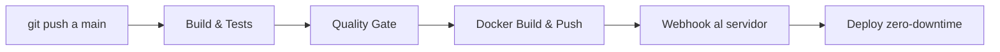
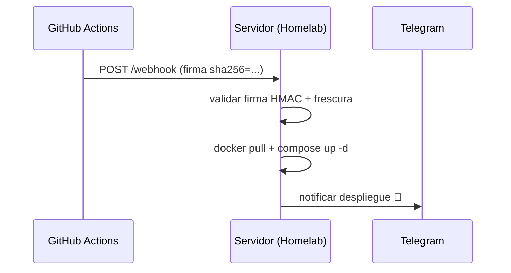

# Bloque XXIII · CI/CD y calidad

> Si no hay integración continua, hay sufrimiento continuo. Tu API debe
> compilarse, probarse, analizarse y desplegarse sola: el ser humano escribe
> código, la máquina lo certifica y lo pone en producción.

## Cómo usar este documento

Igual que el resto del bootcamp: lee UNA sección → haz SU ejercicio → vuelve.
Cada sección cierra con el recuadro **"Lo practicas en…"**.

Aviso importante de este bloque: aquí **no** programas infraestructura de
verdad (no hay un GitHub Actions corriendo dentro del test). Lo que practicas es
escribir funciones Java que **validan, parsean y generan** las cadenas, rutas y
reglas que un pipeline real usa: ¿es válido este runner?, ¿supera la cobertura
el umbral?, ¿esta firma de webhook es de GitHub? Es validación de configuración
como código — exactamente lo que hacen las herramientas que automatizan CI/CD.

| Sección | Tema | Ejercicio |
|---|---|---|
| 23.1 | GitHub Actions: el pipeline de CI | `Ej195GithubActionsPipeline` |
| 23.2 | Docker Build & Push (Continuous Delivery) | `Ej196DockerBuildPush` |
| 23.3 | Análisis estático y Quality Gate | `Ej197StaticAnalysisGate` |
| 23.4 | Deploy por Webhook al Homelab (CD) | `Ej198DeployWebhookHomelab` |



Esa cadena es el tema entero: 23.1 es la primera caja, 23.2 la tercera, 23.3 la
segunda (el guardián), y 23.4 las dos últimas. Léelo de izquierda a derecha.

---

## 23.1 GitHub Actions: el pipeline de Integración Continua

La **Integración Continua (CI)** garantiza que la rama `main` esté SIEMPRE
compilable y con los tests en verde, validando automáticamente cada cambio que
sube cualquier desarrollador. La herramienta nativa de GitHub para esto es
**GitHub Actions**: defines un *workflow* en un YAML dentro de
`.github/workflows/` y GitHub lo ejecuta en sus servidores.

### Anatomía de un workflow

```yaml
name: Java CI with Maven

on:                                    # ¿CUÁNDO se dispara?
  push:
    branches: [ "main" ]
  pull_request:
    branches: [ "main" ]

jobs:                                  # ¿QUÉ trabajos corre?
  build-and-test:
    runs-on: ubuntu-latest             # ¿en QUÉ máquina?
    steps:                             # ¿QUÉ pasos, en orden?
    - uses: actions/checkout@v4        # 1. traer el código
    - name: Configurar Java JDK 21
      uses: actions/setup-java@v4      # 2. instalar el JDK
      with:
        java-version: '21'
        distribution: 'temurin'
        cache: maven                   # acelera descargas de dependencias
    - name: Compilar y testear
      run: mvn -B clean verify         # 3. construir y verificar
```

Vocabulario que los retos validan literalmente:

| Concepto | Qué es | Ejemplo del test |
|---|---|---|
| **Evento (`on`)** | qué dispara el workflow | `push` sobre `main` |
| **Runner (`runs-on`)** | la máquina virtual efímera | `ubuntu-latest`, `ubuntu-22.04` |
| **Action (`uses`)** | paso reutilizable versionado con `@vN` | `actions/checkout@v4` |
| **Cache key** | clave dinámica de caché de dependencias | incluye `runner.os` y `hashFiles(...)` |
| **Artifact** | fichero que el workflow guarda | reportes en `**/target/surefire-reports/*.xml` |

### Por qué cada detalle importa

- **`-B` (batch mode)**: desactiva el output interactivo de Maven para que los
  logs del CI sean limpios. El comando canónico del bootcamp es
  `mvn -B clean verify` (no `package`: `verify` ejecuta también los tests de
  integración de failsafe).
- **Versionar las actions (`@v4`)**: usar `@main` sería un riesgo de seguridad y
  reproducibilidad (la action podría cambiar bajo tus pies). Por eso los retos
  rechazan `@v2` como "antigua" y aceptan `v3`/`v4`.
- **Cache key dinámica**: si la clave fuera fija (`maven-cache`), nunca
  refrescaría la caché al cambiar dependencias. La clave correcta mezcla el SO
  (`runner.os`) y un hash de los `pom.xml` (`hashFiles('**/pom.xml')`): cambia el
  pom → cambia el hash → caché nueva.
- **Surefire vs Failsafe**: Surefire corre los tests unitarios
  (`target/surefire-reports`), Failsafe los de integración. El reto 7 construye
  esa ruta: módulo `null` → `target/surefire-reports`; módulo `my-module` →
  `my-module/target/surefire-reports`.

> **Lo practicas en `Ej195GithubActionsPipeline`**: validar eventos, runners,
> versiones de actions, claves de caché y generar el comando Maven y las rutas
> de reportes que el pipeline necesita.

---

## 23.2 Docker Build & Push: Continuous Delivery

Una vez que el código está certificado (tests verdes), el siguiente *job*
**empaqueta** la aplicación en una imagen Docker (*build*) y la **sube** a un
registro remoto (*push*). Eso es **Continuous Delivery**: dejar siempre lista
una imagen desplegable.

### El job de Docker, paso a paso

```yaml
  docker:
    needs: build-and-test              # NO arranca si los tests fallaron
    runs-on: ubuntu-latest
    steps:
    - uses: docker/setup-buildx-action@v3      # builder avanzado
    - uses: docker/login-action@v3             # autenticar en el registro
      with:
        registry: ghcr.io
        username: ${{ github.actor }}
        password: ${{ secrets.GITHUB_TOKEN }}
    - uses: docker/metadata-action@v5          # calcular tags
    - uses: docker/build-push-action@v5        # construir y subir
      with:
        push: true
        tags: |
          myorg/myrepo:${{ github.sha }}
          myorg/myrepo:latest
```

Conceptos clave que validan los retos:

| Concepto | Regla que aplica |
|---|---|
| **`needs`** | encadena jobs: `docker` depende de `build-and-test` |
| **Secrets** | nunca texto plano: `${{ secrets.NOMBRE }}` |
| **Tags** | siempre dos: el SHA del commit (trazable) **y** `latest` |
| **Registro** | `ghcr.io` = GitHub Container Registry |
| **SemVer** | una release oficial es `vX.Y.Z` exacto (`v1.2.3`) |
| **OIDC** | autenticación federada sin tokens fijos (rol ARN) |

### Por qué taggear con el SHA del commit

`docker build -t miorg/api:${{ github.sha }} .` da **trazabilidad total**: cada
imagen apunta exactamente al commit que la generó. Si la versión `latest` rompe
producción, sabes a qué SHA volver. La buena práctica es subir **ambos** tags:
el SHA (inmutable, para rollback) y `latest` (móvil, "lo último estable").

### Secrets y OIDC

Las credenciales **nunca** van en el YAML en claro. GitHub Secrets las inyecta
con la sintaxis `${{ secrets.DOCKER_TOKEN }}`. El siguiente nivel es **OIDC**
(OpenID Connect): en lugar de un token de larga vida, GitHub negocia
credenciales **temporales** asumiendo un rol IAM identificado por un ARN
(`arn:aws:iam::123456789012:role/...`). Cero secretos que robar.

> **Lo practicas en `Ej196DockerBuildPush`**: validar dependencias entre jobs,
> versiones de actions de Docker, secretos, generación de tags, SemVer y la
> detección del registro GHCR y de OIDC.

---

## 23.3 Análisis estático y Quality Gate: el guardián

Que los tests "pasen" no basta. El código debe además **cubrir** suficiente
lógica y **no introducir** vulnerabilidades ni *code smells*. Eso lo vigila el
**Quality Gate**: una puerta que, si no se cumplen los umbrales, **rompe el
build** y bloquea el merge.

### JaCoCo: cobertura que frena el build

JaCoCo mide qué porcentaje de tu código ejecutan los tests. Como plugin de
Maven, puede **fallar la compilación** si no llegas a un umbral:

```xml
<plugin>
    <groupId>org.jacoco</groupId>
    <artifactId>jacoco-maven-plugin</artifactId>
    <version>0.8.11</version>
    <executions>
        <execution>                       <!-- engancha el agente antes de los tests -->
            <id>prepare-agent</id>
            <goals><goal>prepare-agent</goal></goals>
        </execution>
        <execution>                       <!-- la puerta de cobertura -->
            <id>check</id>
            <goals><goal>check</goal></goals>
            <configuration>
                <rules><rule>
                    <element>BUNDLE</element>
                    <limits><limit>
                        <counter>LINE</counter>
                        <value>COVEREDRATIO</value>
                        <minimum>0.80</minimum>   <!-- mínimo 80% -->
                    </limit></limits>
                </rule></rules>
            </configuration>
        </execution>
    </executions>
</plugin>
```

JaCoCo genera dos ficheros: `jacoco.exec` (binario, datos crudos) y `jacoco.xml`
(el reporte procesable). El reto 9 distingue uno de otro por la extensión.

### SonarCloud: análisis estático en la nube

**SonarCloud** (la versión SaaS de SonarQube) analiza complejidad, duplicidad,
bugs y vulnerabilidades. Define su propio *Quality Gate* y, si falla, envía una
señal a GitHub que **bloquea el botón de Merge** del Pull Request. Se autentica
con un token inyectado como secreto (`SONAR_TOKEN`) y publica un dashboard en
`https://sonarcloud.io/dashboard?id=<org>_<projectKey>`.

La clasificación típica de Sonar va por letras (A = excelente … F = crítico) en
función de bugs y code smells. Lógica que practicas en el reto 4:

| Condición | Nota |
|---|---|
| 0 bugs y pocos code smells | `A` |
| algún bug pero controlado | `B` |
| bugs críticos | `F` |

### Las otras piezas del gate

- **Dependabot**: PRs automáticos que actualizan dependencias vulnerables.
- **Checkstyle**: linter que impone estilo (p. ej. la regla `AvoidStarImport`).
- **CVE**: identificador estándar de vulnerabilidad pública
  (`CVE-2021-44228` es el famoso Log4Shell). Marcar una dependencia como
  vulnerable = tiene un CVE asociado distinto de "none".
- **Branch protection**: `main` solo acepta merges con historial lineal Y el
  Quality Gate en verde. Ambas condiciones, no una.

> **Lo practicas en `Ej197StaticAnalysisGate`**: identificar el plugin JaCoCo,
> comparar cobertura contra umbral (validando rangos 0-100), clasificar el
> Quality Gate, detectar CVEs, decidir si el build se rompe y construir la URL
> de SonarCloud.

---

## 23.4 Deploy por Webhook al Homelab: Continuous Deployment

El último eslabón automático: actualizar el servidor (nube o *Homelab* casero)
sin tocar nada a mano. El pipeline hace un `POST` a una **URL secreta de
webhook** (Watchtower, el webhook de Portainer…); el servidor recibe la señal,
hace `docker pull` de la nueva imagen y reinicia el contenedor. Con apagado
ordenado y un proxy delante (Traefik), el usuario ni se entera:
**Zero-Downtime Deployment**.



### Seguridad del webhook: la parte seria

Un webhook es una URL pública: cualquiera podría llamarla. Por eso GitHub firma
cada payload y el servidor debe verificarlo antes de actuar:

1. **Cabecera de firma**: GitHub manda `X-Hub-Signature-256: sha256=<hash>`. El
   valor SIEMPRE empieza por `sha256=` (el reto lo valida ignorando
   mayúsculas/espacios; `sha1=` es el algoritmo viejo, se rechaza).
2. **HMAC SHA-256**: el hash se calcula sobre el payload usando un **secreto
   compartido**. Si no coincide, el payload es falso. (En el reto lo *simulas*:
   basta con que payload, firma y secreto no estén vacíos/null.)
3. **Frescura (anti-replay)**: aunque la firma sea válida, un atacante podría
   reenviar un payload capturado. Se rechaza todo lo que tenga **más de 300
   segundos** (5 minutos) — y una antigüedad negativa es inválida por
   definición.

### Operaciones del despliegue

| Acción | Forma canónica |
|---|---|
| Descargar imagen | `docker pull <imagen>` (case-insensitive) |
| Extraer versión | de `ghcr.io/u/app:v1.2.3` → `v1.2.3`; sin tag → `latest` |
| Rollback | `docker compose up -d --force-recreate <imagen>:<version>` |
| Graceful shutdown | log con "Graceful shutdown" o "stopped" |
| Notificar Telegram | `https://api.telegram.org/bot<TOKEN>/sendMessage?chat_id=<ID>` |

Regla transversal de todo el ejercicio: **si un parámetro obligatorio es null,
devuelve el "vacío" del tipo** (cadena `""`, `"{}"` para JSON, `false` para
booleanos). Los tests lo comprueban una y otra vez.

> **Lo practicas en `Ej198DeployWebhookHomelab`**: validar cabeceras y firmas de
> webhook, frescura anti-replay, generar payloads JSON, parsear imágenes Docker,
> construir comandos de rollback y URLs de Telegram, y formatear notificaciones.

---

## Errores comunes del bloque

| # | Error | Antídoto |
|---|---|---|
| 1 | Aceptar `actions/checkout@v2` como válida | Solo `v3`/`v4`; las viejas se rechazan |
| 2 | Cache key fija (`maven-cache`) | Debe llevar `runner.os` **y** `hashFiles('**/pom.xml')` |
| 3 | `generarComandoMavenVerify(true)` sin el flag | Es `mvn -B clean verify -DskipTests=true` (con `=true`) |
| 4 | Ruta de surefire con módulo null → "null/target/..." | null → `target/surefire-reports` sin prefijo |
| 5 | Validar SemVer con `v1.0` o `1.2.3` | Solo `vX.Y.Z` exacto: `v` + tres números |
| 6 | `esCoberturaSuficiente(120, 80)` devolviendo true | Fuera de 0-100 → `IllegalArgumentException` |
| 7 | Olvidar el caso límite de frescura del webhook | `>300s` y antigüedad negativa → false |
| 8 | Comparar runner/header con `equals` exacto | Normaliza: `trim()` y `equalsIgnoreCase`/`toLowerCase` |
| 9 | Devolver null cuando falta un parámetro | Devuelve `""`/`"{}"`/`false`, nunca null |
| 10 | Subir solo el tag `latest` | Sube también el SHA del commit (trazabilidad/rollback) |

## Chuleta final del bloque

```
CI          = on:push main → job build-and-test → mvn -B clean verify
Actions     = uses: actions/checkout@v4 · setup-java@v4 (temurin, 21)
Cache key   = maven-${{ runner.os }}-${{ hashFiles('**/pom.xml') }}
Delivery    = job docker needs build-and-test → build-push-action
Tags        = SHA del commit (rollback) + latest · release = vX.Y.Z
Secrets     = ${{ secrets.NOMBRE }} · OIDC = rol ARN, sin token fijo
Quality Gate= JaCoCo umbral 0.80 rompe build · SonarCloud bloquea merge
Cobertura   = real >= umbral, ambos en [0,100] o IllegalArgumentException
Webhook     = firma sha256=... · HMAC con secreto · frescura <= 300s
Deploy      = docker pull → compose up -d --force-recreate → notificar
null-safe   = falta parámetro → "" / "{}" / false (jamás null)
```

## Autoevaluación (responde sin mirar; si fallas 2+, relee la sección)

1. ¿Qué tres bloques mínimos definen un workflow de GitHub Actions y qué
   responde cada uno? *(23.1)*
2. ¿Por qué la clave de caché debe incluir `hashFiles('**/pom.xml')` en vez de
   ser fija? *(23.1)*
3. ¿Para qué sirve `needs` entre jobs y qué pasa si el job previo falla? *(23.2)*
4. ¿Por qué se taggea una imagen con el SHA del commit además de `latest`? *(23.2)*
5. ¿Cómo consigue JaCoCo romper el build por baja cobertura? ¿Qué diferencia hay
   entre `jacoco.exec` y `jacoco.xml`? *(23.3)*
6. ¿Qué ventaja tiene OIDC frente a un token de Docker guardado como secreto? *(23.2, 23.3)*
7. ¿Qué dos comprobaciones hace el servidor sobre un webhook antes de desplegar,
   y por qué la frescura evita ataques de replay? *(23.4)*
8. ¿Qué debe devolver una función de este bloque cuando un parámetro obligatorio
   llega a null? *(23.4)*
